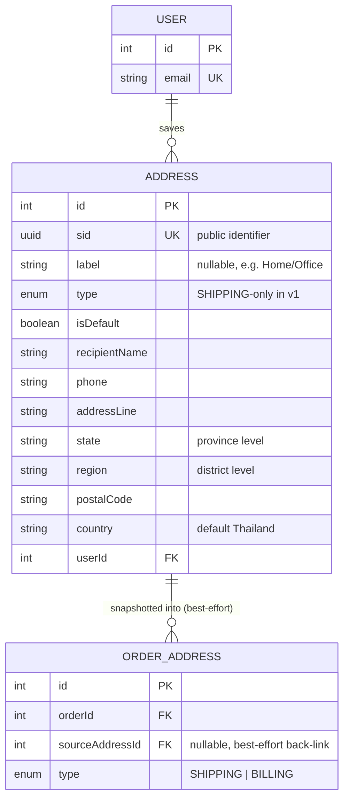

# Address Module

The customer's saved delivery address book — managed from the profile page, independent of checkout. A logged-in customer can add, list, update, delete, and (re)designate a default address here. `Order`/`OrderAddress` (`order.prisma`) consume this module by taking a frozen snapshot of one of these rows at checkout time rather than joining it live, so a later address-book edit never rewrites the delivery details on a past order.

Schema source: `prisma/schema/address.prisma` (model `Address`; enum `AddressType`).
Module source: `src/modules/address/` (`address.controller.ts`, `address.service.ts`, `address.repository.ts`, `dto/`).

> **Scope note:** `User`/`Profile` and `OrderAddress` are documented in their own references — they appear here only as the FK target and the downstream consumer needed to understand `Address`'s relationships. `OrderModule` importing `AddressModule` for checkout (auto-fill + snapshot-at-placement) is planned but not yet built — see [Known Gaps](#known-gaps--recommended-hardening).

---

### DB Schema

#### Entity-Relationship Diagram (ERD)

**Cardinality legend:** `||--o{` = one-to-many. One user has many saved addresses; one saved address may be copied into many `OrderAddress` snapshots over time (once per order it's chosen for).

---

#### Enum Definitions

##### `AddressType`

| Value      | Meaning                                                    |
| :--------- | :---------------------------------------------------------- |
| `SHIPPING` | A delivery address. **The only value reachable through this module's API in v1** — see [Conventions](#conventions). |
| `BILLING`  | Reserved for `OrderAddress`'s snapshot side only. No address-book row is ever created with this type today. |

`Address.type` defaults to `SHIPPING` at the schema level; `AddressService.createAddress` never writes anything else, regardless of what the schema default would otherwise allow.

---

#### Data Dictionary — Address

**Table purpose:** one row per saved delivery address in a customer's address book. Maps to table `addresses`.

| Field           | Type              | Constraints                                                              | Description                                                                                                                                    |
| :-------------- | :---------------- | :------------------------------------------------------------------------ | :---------------------------------------------------------------------------------------------------------------------------------------------- |
| `id`            | `INT`             | PK, AUTOINCREMENT                                                        | Internal numeric key; FK joins only, never exposed as the primary handle.                                                                       |
| `sid`           | `UUID`            | UNIQUE, NOT NULL, DEFAULT `uuid()`                                       | Public-facing identifier. Prevents ID enumeration/scraping.                                                                                     |
| `label`         | `VARCHAR(100)`    | NULLABLE                                                                 | User-facing nickname, e.g. `"Home"`, `"Office"`. Purely organizational — no logic reads it.                                                     |
| `type`          | `ENUM(AddressType)` | NOT NULL, DEFAULT `SHIPPING`                                           | Always `SHIPPING` in practice today — see [Conventions](#conventions).                                                                          |
| `isDefault`     | `BOOLEAN`         | NOT NULL, DEFAULT `false`, `@map("is_default")`                         | At most one `true` row per user, enforced in the service layer (no partial unique index — see [Known Gaps](#known-gaps--recommended-hardening)). |
| `recipientName` | `VARCHAR(200)`    | NOT NULL, `@map("recipient_name")`                                       | Name of the person receiving the delivery **at this address** — not necessarily the account holder. See [Create an Address](#create-an-address) for the profile-name fallback. |
| `phone`         | `VARCHAR(20)`     | NOT NULL                                                                 | Contact number for the courier at this address. Same fallback treatment as `recipientName`.                                                     |
| `addressLine`   | `VARCHAR(255)`    | NOT NULL, `@map("address_line")`                                         | Street name and house/unit number.                                                                                                              |
| `state`         | `VARCHAR(100)`    | NOT NULL                                                                 | Province level — checkout's "select state" field.                                                                                               |
| `region`        | `VARCHAR(100)`    | NOT NULL                                                                 | District level — checkout's "select region" field.                                                                                              |
| `postalCode`    | `VARCHAR(20)`     | NOT NULL, `@map("postal_code")`                                          | Postal/ZIP code.                                                                                                                                 |
| `country`       | `VARCHAR(100)`    | NOT NULL, DEFAULT `"Thailand"`                                           | Free-text country name.                                                                                                                         |
| `userId`        | `INT`             | FK → `users.id`, NOT NULL, **ON DELETE CASCADE**, `@map("user_id")`      | Owning user.                                                                                                                                     |
| `createdAt`     | `TIMESTAMPTZ(3)`  | NOT NULL, DEFAULT `now()`, `@map("created_at")`                         | Row creation time.                                                                                                                               |
| `updatedAt`     | `TIMESTAMPTZ(3)`  | NOT NULL, auto-updated, `@map("updated_at")`                            | Last modification time.                                                                                                                         |

> `Address` has no soft-delete column — [`DELETE /:id`](#delete-an-address) is a hard delete, by deliberate choice (see [Conventions](#conventions)).

---

#### Relationships and Cascading Rules

| Parent → Child            | FK Column                     | On Delete    | Effect                                                                                                                                        |
| :------------------------- | :----------------------------- | :----------- | :---------------------------------------------------------------------------------------------------------------------------------------------- |
| `User` → `Address`          | `Address.userId`              | **CASCADE**  | Deleting a user account deletes their entire saved address book.                                                                                |
| `Address` → `OrderAddress`  | `OrderAddress.sourceAddressId` | **SET NULL** | Deleting (or the address simply no longer existing) never touches a past order — `OrderAddress` already holds its own frozen copy of every field. Only the best-effort "reorder" back-link goes `null`. Declared in `order.prisma`, not this file. |

---

#### Indexes & Constraints

| Index                    | Table       | Type             | Purpose                                                                                                    |
| :------------------------ | :---------- | :--------------- | :------------------------------------------------------------------------------------------------------------ |
| `id`, `sid`               | `addresses` | B-Tree (unique)  | Identity lookups; created automatically by `@id`/`@unique`.                                                    |
| `addresses_user_id_is_default_idx` | `addresses` | B-Tree (composite) | `(user_id, is_default)` — serves both "list this user's addresses" and "find this user's default address" (`AddressRepository.findAllByUserId` / `findDefaultByUserId`). |

**No check constraints are declared at the DB level** on this table — `postalCode`'s 5-digit format, and the minimum lengths on `recipientName`/`addressLine`/`state`/`region`, are enforced only by `CreateAddressDto`/`UpdateAddressDto`'s `class-validator` rules, not by a Postgres `CHECK`. A direct DB write (or a future second API) bypasses them entirely — the same class of gap as `isDefault` uniqueness below. Compare `combo-product.prisma`'s price/quantity `CHECK`s, which are enforced at the DB layer as the authoritative backstop, DTO validation being only the first line of defense.

---

#### Conventions

- **All `DateTime` columns are `@db.Timestamptz(3)`** — repo-wide convention (migration `20260802160000_timestamptz_repo_wide`); any new `DateTime` field must carry it.
- **All columns are `snake_case`** via `@map()`. Prisma field names stay camelCase; only the database identifiers are mapped.
- **Shipping-only in v1.** `CreateAddressDto`/`UpdateAddressDto` expose no `type` field — the server always writes `AddressType.SHIPPING`, and `GET /address` / `GET /address/default` implicitly return only shipping addresses (which today is all of them). `AddressType.BILLING` exists solely for `OrderAddress`'s snapshot side; there is no billing address book. See [Known Gaps](#known-gaps--recommended-hardening).
- **`recipientName`/`phone` are per-address, not derived live from `User`/`Profile`.** A user can have multiple addresses for different recipients (their own home, a parent's address, an office where someone else signs), and guest checkout (`Order.userId` nullable) has no `User` row to join at all — so these columns must be self-contained per address, not a join. See [Create an Address](#create-an-address) for how they're *populated* by default without becoming a live join.
- **Hard delete, no soft-delete column.** Unlike `Product`/`ComboProduct`, `Address` carries no `deletedAt`. This is a deliberate v1 decision, not an oversight — a deleted address-book row cannot corrupt a past order because `OrderAddress` never joins it live (see [Relationships](#relationships-and-cascading-rules)), so there is nothing a soft delete would protect.
- **No automatic default promotion.** Deleting the current default address does not designate another one automatically — the user (or the checkout flow) must explicitly pick/set a new default. See [Delete an Address](#delete-an-address).
- **Input hardening reuses the repo's shared transform utilities** (`common/utils/json-transform.util.ts`) rather than hand-rolled `@Transform` blocks: `trimString` on every free-text field, `emptyStringToUndefined` wherever `""` should mean "not provided" (`label`, `country`, and — deliberately — `recipientName`/`phone` on create, so an explicit blank falls through to the profile/account fallback instead of failing validation), and `parseBooleanInput` for `isDefault`'s multipart/JSON boolean coercion (same helper `combo-product`'s DTOs use for `isFeatured`).
- **Create vs. update treat a blank `recipientName`/`phone`/`addressLine`/`state`/`region`/`postalCode` differently, on purpose.** On `CreateAddressDto`, `recipientName`/`phone` collapse `""` to "use the fallback" (see [Create an Address](#create-an-address)). On `UpdateAddressDto`, every one of these NOT-NULL-backed fields uses the `@IsOptional()` + `@IsNotEmpty()` idiom instead: omitted → "leave unchanged" (skipped entirely), explicitly sent blank → `400`, since a NOT NULL column can never legitimately be blanked out via `PATCH` and silently ignoring that input would mask a client bug.

---

#### Example Data

| label     | isDefault | recipientName    | phone           | addressLine                | state       | region     | postalCode | country    |
| :-------- | :-------- | :--------------- | :-------------- | :-------------------------- | :---------- | :--------- | :--------- | :--------- |
| **Home**  | `true`    | Somchai Jaidee   | `+66812345678`  | 123/45 Sukhumvit Road       | Bangkok     | Watthana   | `10110`    | Thailand   |
| **Office**| `false`   | Somchai Jaidee   | `+66812345678`  | 99 Silom Road, 12th Floor   | Bangkok     | Bang Rak   | `10500`    | Thailand   |
| **Mom's House** | `false` | Aunt Malee  | `+66898765432`  | 45 Moo 3, Chiang Mai-Lampang Rd | Chiang Mai | Mueang     | `50000`    | Thailand   |

> The third row shows why `recipientName`/`phone` cannot be a live join off the account holder's own `Profile`/`User.phone` — this address delivers to someone else entirely.

---

#### Known Gaps / Recommended Hardening

- **`isDefault` uniqueness is service-enforced only.** There is no partial unique index (e.g. `WHERE is_default = true`) backing "at most one default per user" — a bug in `AddressService` or a direct DB write could produce two defaults. `ComboImage`'s `combo_images_one_primary_per_combo` is the equivalent pattern this table could adopt.
- **No billing address book.** `AddressType.BILLING` is declared but unreachable through this module's DTOs — see [Conventions](#conventions). If a separate billing address book is ever needed, `CreateAddressDto`/`UpdateAddressDto` would need a `type` field and the uniqueness/default logic would need to become per-type.
- **`OrderModule` does not exist yet.** Checkout auto-fill (`GET /address/default`) and snapshot-at-placement (copying a chosen `Address` into `OrderAddress`) are designed for but not implemented — `AddressModule` currently exports `AddressService` for exactly this future consumer, but nothing imports it yet.
- **No automatic default re-assignment on delete** (see [Conventions](#conventions)) — a user who deletes their only/default address has zero defaults until they explicitly set a new one.
- **`postalCode` format and the field minimum lengths are DTO-only, not DB-enforced** (see [Indexes & Constraints](#indexes--constraints)) — a direct DB write, or a future second write path, could still insert `postalCode: "1"` or a single-character `state`.

---

### API End Point & Business Logic

Every endpoint below is served by `AddressController` → `AddressService` → `AddressRepository`. All routes are prefixed `/api/v1/address`. For the DTO/Swagger contract see `src/modules/address/dto/`.

#### Endpoint Overview

| Method   | Path            | Access     | Purpose                                                              |
| :------- | :-------------- | :--------- | :--------------------------------------------------------------------- |
| `POST`   | `/create-address` | `CUSTOMER` | [Add an address to my address book](#create-an-address)             |
| `GET`    | `/`             | `CUSTOMER` | [List my addresses, default first](#list-my-addresses)                |
| `GET`    | `/default`      | `CUSTOMER` | [Get my default address, for checkout auto-fill](#get-my-default-address) |
| `GET`    | `/:id`          | `CUSTOMER` | [Get one of my addresses by id](#get-an-address-by-id)                |
| `PATCH`  | `/:id`          | `CUSTOMER` | [Partially update one of my addresses](#update-an-address)            |
| `PATCH`  | `/:id/default`  | `CUSTOMER` | [Mark one of my addresses as the default](#mark-an-address-as-default) |
| `DELETE` | `/:id`          | `CUSTOMER` | [Permanently remove one of my addresses](#delete-an-address)          |

Every route uses `JwtAuthGuard` + `RolesGuard` + `@Roles(UserRole.CUSTOMER)` (declared once at the controller level, not per-method) — this is account-profile data, not an admin surface. There are no public/unauthenticated routes in this module.

---

#### Response Shapes

A single shape, `AddressResponseDto`, serves every endpoint — there is no admin/public split (every caller is the address's own owner) and no separate minified shape (the address book is never large enough to need one). It excludes nothing sensitive; `id`, `sid`, `label`, `type`, `isDefault`, `recipientName`, `phone`, `addressLine`, `state`, `region`, `postalCode`, `country`, `createdAt`, `updatedAt` are all returned as-is from the row.

---

#### Create an Address

**`POST /api/v1/address/create-address`**

**Purpose**: Add a new address to the logged-in customer's address book.

**Access**: `JwtAuthGuard` + `RolesGuard` + `@Roles(UserRole.CUSTOMER)`, `multipart/form-data` (`NoFilesInterceptor` — parses form fields with no file upload support; there is nothing to upload on an address).

| Layer      | What happens                                                                                                     |
| :--------- | :------------------------------------------------------------------------------------------------------------------ |
| Controller | `createAddress(dto, req)` — reads the caller's id off `req.user.id` (`UnauthorizedException` if missing); no other logic. |
| Service    | `createAddress(userId, dto)` — resolves `recipientName`/`phone` fallbacks, decides `isDefault`, clears any existing default, creates the row — all inside one transaction. |
| Repository | `findUserContactInfo` (fallback lookup, only if needed) → `countByUserId` → `clearDefaultForUser` (conditional) → `createAddress(data)`. |

**Business logic — in order:**

1. **`recipientName`/`phone` fallback resolution** (`resolveContactDefaults`) — both fields are optional on `CreateAddressDto`. If either is omitted:
   - `recipientName` defaults to the caller's own `Profile.name`, or `"${firstName} ${lastName}"` if `name` isn't set.
   - `phone` defaults to the caller's own `User.phone`.
   - If a value is still missing after the fallback (no `Profile` row at all, or `User.phone` is `null`), the request fails with `400` naming exactly which field has nothing to fall back to — it never silently creates an address with a blank contact field.
   - Supplying both explicitly skips the profile lookup entirely.
2. **DTO-level input hardening runs first**, before any of the above: every free-text field is trimmed (`trimString`); `addressLine` requires 5+ characters, `state`/`region`/`recipientName` require 2+; `postalCode` must match `^\d{5}$` exactly. `recipientName`/`phone` specifically collapse an explicit `""` (or, for `phone`, whitespace that `TransformThaiPhone` reduces to `""`) to `undefined` rather than a validation error, so a blank submission is treated the same as an omitted field and reaches the fallback in step 1 — see [Conventions](#conventions).
3. **The first address a user ever saves always becomes the default** (`existingCount === 0`), regardless of whether `dto.isDefault` was sent — a user should never end up with zero default addresses once they have at least one.
4. **`isDefault: true` (explicit or forced by rule 3) clears every other default row for this user first** (`clearDefaultForUser`), inside the same transaction as the insert — so a concurrent read can never observe two defaults.
5. **`type` is never taken from the client.** The repository hard-codes `AddressType.SHIPPING` on every insert — see [Conventions](#conventions).

**Response shape**: `AddressResponseDto`.

| Status | Cause                                                                                                          |
| :----- | :----------------------------------------------------------------------------------------------------------------- |
| `201`  | Address created successfully.                                                                                  |
| `400`  | DTO validation failed (e.g. invalid Thai phone format via `@IsThaiPhone`, `postalCode` not a 5-digit format, a field below its minimum length); **or** `recipientName`/`phone` was omitted (or sent blank) and the account has nothing to fall back to. |
| `401`  | Missing/invalid JWT.                                                                                            |

---

#### List My Addresses

**`GET /api/v1/address`**

**Purpose**: The profile page's address-book listing.

**Access**: `JwtAuthGuard` + `RolesGuard` + `@Roles(UserRole.CUSTOMER)`.

| Layer      | What happens                                                                          |
| :--------- | :---------------------------------------------------------------------------------------- |
| Controller | `getAddresses(req)` — no other logic.                                                    |
| Service    | `findAddressesByUserId(userId)` — maps every row to `AddressResponseDto`.                |
| Repository | `findAllByUserId(userId)` — `orderBy: [{ isDefault: 'desc' }, { createdAt: 'desc' }]`.    |

**Business logic:**

1. **Default first, then newest.** `isDefault: 'desc'` puts the (at most one) default row on top; `createdAt: 'desc'` orders the rest newest-first underneath it. No pagination — an individual customer's address book is never large enough to need it.

**Response shape**: `AddressResponseDto[]`.

| Status | Cause                                                          |
| :----- | :----------------------------------------------------------------- |
| `200`  | Always — an empty array is a valid response for a new customer.  |
| `401`  | Missing/invalid JWT.                                                |

---

#### Get My Default Address

**`GET /api/v1/address/default`**

**Purpose**: Checkout auto-fill — the delivery address a checkout page should pre-select before the customer changes it.

**Access**: `JwtAuthGuard` + `RolesGuard` + `@Roles(UserRole.CUSTOMER)`.

| Layer      | What happens                                                             |
| :--------- | :---------------------------------------------------------------------------- |
| Controller | `getDefaultAddress(req)` — no other logic.                                   |
| Service    | `getDefaultAddress(userId)` — `404` if none, otherwise wraps in `AddressResponseDto`. |
| Repository | `findDefaultByUserId(userId)` — `findFirst({ where: { userId, isDefault: true } })`. |

**Business logic:**

1. **No default resolves to `404`, not a `200` with `null` body.** A future `OrderModule`'s checkout flow is expected to treat this `404` as "fall through to the address picker / inline address form" — see [Known Gaps](#known-gaps--recommended-hardening).

**Response shape**: `AddressResponseDto`.

| Status | Cause                                             |
| :----- | :---------------------------------------------------- |
| `200`  | Default address found.                                |
| `401`  | Missing/invalid JWT.                                  |
| `404`  | Customer has no address marked as default (or no addresses at all). |

---

#### Get an Address by ID

**`GET /api/v1/address/:id`**

**Purpose**: Look up one saved address, e.g. to pre-fill an edit form.

**Access**: `JwtAuthGuard` + `RolesGuard` + `@Roles(UserRole.CUSTOMER)`.

| Layer      | What happens                                                                          |
| :--------- | :----------------------------------------------------------------------------------------- |
| Controller | `getAddressById(id, req)` — no other logic.                                               |
| Service    | `getAddressById(userId, addressId)` — `404` if missing, ownership check, wraps in DTO.     |
| Repository | `findById(id)`.                                                                            |

**Business logic:**

1. **Ownership check on every lookup.** `address.userId !== req.user.id` throws `403 ForbiddenException` — a customer can never read another customer's saved address by guessing/incrementing an id, even though `id` (unlike `sid`) is a small sequential integer.

**Response shape**: `AddressResponseDto`.

| Status | Cause                                       |
| :----- | :------------------------------------------- |
| `200`  | Address found and owned by the caller.       |
| `401`  | Missing/invalid JWT.                          |
| `403`  | The address exists but belongs to another user. |
| `404`  | No address with this id.                      |

---

#### Update an Address

**`PATCH /api/v1/address/:id`**

**Purpose**: Partial update — only the fields present in the payload are written.

**Access**: `JwtAuthGuard` + `RolesGuard` + `@Roles(UserRole.CUSTOMER)`.

| Layer      | What happens                                                                                                        |
| :--------- | :----------------------------------------------------------------------------------------------------------------------- |
| Controller | `updateAddress(id, dto, req)` — no other logic.                                                                          |
| Service    | `updateAddress(userId, addressId, dto)` — existence + ownership check, conditional default-clearing, applies the patch — inside one transaction. |
| Repository | `findById` → `clearDefaultForUser` (conditional) → `updateAddress(id, data)`.                                            |

**Business logic — in order:**

1. **Existence + ownership check**, same contract as [Get an Address by ID](#get-an-address-by-id) — `404` then `403`.
2. **`recipientName`/`phone` have no profile fallback here**, unlike create. An omitted field on a `PATCH` means "leave unchanged", not "clear it" — falling back to the profile would incorrectly overwrite a deliberately-kept value whenever the client only meant to patch, say, `addressLine`.
3. **Every NOT-NULL-backed field (`recipientName`, `phone`, `addressLine`, `state`, `region`, `postalCode`) rejects an explicit blank instead of silently ignoring it.** Omitted → skipped (rule 2). Present but empty/whitespace-only after trimming → `400` — a client cannot blank out a required column by sending `""`. This is the opposite trade-off from create's fallback-on-blank behavior, deliberately: update has nothing sensible to fall back to. See [Conventions](#conventions).
4. **`isDefault: true` clears every other default row for this user first** (`clearDefaultForUser`), same rule as create. `isDefault` omitted, or sent `false`, touches no other row.

**Response shape**: `AddressResponseDto`.

| Status | Cause                                                     |
| :----- | :------------------------------------------------------------ |
| `200`  | Address updated successfully.                                 |
| `400`  | DTO validation failed (e.g. invalid Thai phone format, `postalCode` not a 5-digit format); **or** a NOT-NULL-backed field was sent blank (see business logic above). |
| `401`  | Missing/invalid JWT.                                           |
| `403`  | The address exists but belongs to another user.                |
| `404`  | No address with this id.                                       |

---

#### Mark an Address as Default

**`PATCH /api/v1/address/:id/default`**

**Purpose**: Explicitly (re)designate which saved address is the default, without editing any of its other fields.

**Access**: `JwtAuthGuard` + `RolesGuard` + `@Roles(UserRole.CUSTOMER)`.

| Layer      | What happens                                                                          |
| :--------- | :----------------------------------------------------------------------------------------- |
| Controller | `setDefaultAddress(id, req)` — no other logic.                                            |
| Service    | `setDefaultAddress(userId, addressId)` — existence + ownership check, clears then sets — inside one transaction. |
| Repository | `findById` → `clearDefaultForUser` → `setDefault(id)`.                                    |

**Business logic — in order:**

1. **Existence + ownership check**, same contract as [Get an Address by ID](#get-an-address-by-id).
2. **Always clears every other default first**, unconditionally (unlike the create/update paths, there is no "only if requested" branch here — that's the entire point of this endpoint).

**Response shape**: `AddressResponseDto`.

| Status | Cause                                          |
| :----- | :------------------------------------------------- |
| `200`  | Default address updated successfully.              |
| `401`  | Missing/invalid JWT.                                |
| `403`  | The address exists but belongs to another user.     |
| `404`  | No address with this id.                            |

---

#### Delete an Address

**`DELETE /api/v1/address/:id`**

**Purpose**: Permanently remove a saved address. This module's only delete route — there is no soft delete (see [Conventions](#conventions)).

**Access**: `JwtAuthGuard` + `RolesGuard` + `@Roles(UserRole.CUSTOMER)`.

| Layer      | What happens                                                     |
| :--------- | :--------------------------------------------------------------------- |
| Controller | `deleteAddress(id, req)` — no other logic.                            |
| Service    | `deleteAddress(userId, addressId)` — existence + ownership check, delete. |
| Repository | `findById` → `deleteAddress(id)`.                                      |

**Business logic — in order:**

1. **Existence + ownership check**, same contract as [Get an Address by ID](#get-an-address-by-id).
2. **Allowed unconditionally, even if it's the user's only or default address.** No automatic promotion of another address to default — see [Conventions](#conventions). `OrderAddress.sourceAddressId` on any past order pointing at this row goes `null` (`ON DELETE SET NULL`); nothing about a placed order changes.

**Response shape**: no body (`204 No Content`).

| Status | Cause                                          |
| :----- | :------------------------------------------------- |
| `204`  | Address permanently deleted.                        |
| `401`  | Missing/invalid JWT.                                |
| `403`  | The address exists but belongs to another user.     |
| `404`  | No address with this id.                            |
