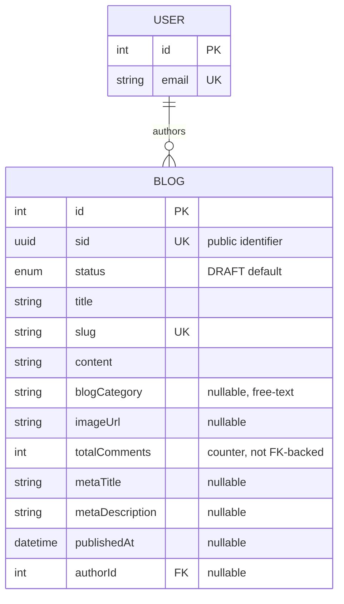

# Blog Module

Editorial/marketing content for the storefront — articles such as "Wellness Guides" and "Patient Stories". `Blog` is a standalone content entity: it owns its identity (`slug`), body, SEO metadata, and an optional author link back to `User`. It has **no child tables** — comments exist only as a denormalized counter column.

Schema source: `prisma/schema/blog.prisma` (model `Blog`, enum `BlogStatus`).
Module source: `src/modules/blog/` (`blog.controller.ts`, `blog.service.ts`, `blog.repository.ts`, `blog.select.ts`, `dto/`).

> **Scope note:** `User` is documented in its own reference — it appears here only as the `author` foreign-key target needed to understand Blog's relationship.

---

### DB Schema

#### Entity-Relationship Diagram (ERD)



**Cardinality legend:** `||--o{` = one-to-many (parent must exist, child count is 0..N). A `User` may author zero or many `Blog` rows; a `Blog`'s `author` is optional (nullable FK), so a post can exist with no author at all.

---

#### Enum Definitions

##### `BlogStatus` (defined in `blog.prisma`, used only by `Blog`)

| Value       | Meaning                                                                                                                               |
| :---------- | :------------------------------------------------------------------------------------------------------------------------------------ |
| `DRAFT`     | Being authored, never listed publicly. **Default value on creation.**                                                                  |
| `PUBLISHED` | Live and visible on the storefront blog listing (paired with a real `publishedAt`).                                                    |
| `ARCHIVED`  | Retired/unpublished but retained in the database — there is no soft-delete field, see [Known Gaps](#known-gaps--recommended-hardening). |

> `Blog` deliberately does **not** use the shared `CategoryProductStatus` enum that `Category`/`Product`/`ComboProduct` use — an article has no `INACTIVE`/`HIDDEN` distinction, so it carries its own three-value lifecycle.

---

#### Data Dictionary — Blog

**Table purpose:** a single editorial article. Maps to table `blogs`.

| Field             | Type               | Constraints                                                            | Description                                                                                                                     |
| :---------------- | :----------------- | :--------------------------------------------------------------------- | :------------------------------------------------------------------------------------------------------------------------------ |
| `id`              | `INT`              | PK, AUTOINCREMENT                                                       | Internal numeric key; FK joins and admin routes only. Note the admin `update`/`delete` routes expose it in the URL.               |
| `sid`             | `UUID`             | UNIQUE, NOT NULL, DEFAULT `uuid()`, `@db.Uuid`                          | Public-facing identifier. Prevents ID enumeration/scraping.                                                                      |
| `status`          | `ENUM(BlogStatus)` | NOT NULL, DEFAULT `DRAFT`                                               | Lifecycle/visibility state.                                                                                                      |
| `title`           | `VARCHAR(255)`     | NOT NULL                                                                | Display title. **Not uniquely constrained in the DB** — uniqueness is enforced indirectly, via the `slug` derived from it.        |
| `slug`            | `VARCHAR(255)`     | UNIQUE, NOT NULL                                                        | URL-safe identifier — the primary lookup key for the blog detail page. Derived from `title` by `generateSlug()`, never client-set. |
| `content`         | `TEXT`             | NOT NULL                                                                | Full article body (HTML/Markdown — the format is a DTO/editor convention, not a DB constraint).                                   |
| `blogCategory`    | `VARCHAR(100)`     | NULLABLE                                                                | Free-text category label, e.g. `"Wellness Guides"`, `"Patient Stories"`. No FK to a category table — see Known Gaps.              |
| `imageUrl`        | `VARCHAR(512)`     | NULLABLE                                                                | Cover/hero image. Stored as a **relative** path (`/uploads/blogs/images/…`); absolutized in the response DTO.                     |
| `totalComments`   | `INT`              | NOT NULL, DEFAULT `0`                                                   | **Denormalized counter.** There is no `Comment` model in this schema today and no trigger — nothing increments/decrements it.     |
| `metaTitle`       | `VARCHAR(255)`     | NULLABLE                                                                | SEO `<title>` override. Falls back to `title` at render time.                                                                    |
| `metaDescription` | `TEXT`             | NULLABLE                                                                | SEO `<meta description>` override.                                                                                               |
| `createdAt`       | `TIMESTAMPTZ(3)`   | NOT NULL, DEFAULT `now()`, `@map("created_at")`                          | Row creation time. Default sort field for the **admin** listing.                                                                 |
| `updatedAt`       | `TIMESTAMPTZ(3)`   | NOT NULL, `@updatedAt`, `@map("updated_at")`                             | Last modification time.                                                                                                          |
| `publishedAt`     | `TIMESTAMPTZ(3)`   | NULLABLE, `@map("published_at")`                                         | Publish timestamp — **stamped by the service on a status transition**, never accepted from the client. Default sort field for the **public** listing. |
| `authorId`        | `INT`              | FK → `users.id`, NULLABLE, **ON DELETE SET NULL**, `@map("author_id")`   | Writing user. Nullable so an author account can be deleted without losing the article.                                           |

> **Two columns, one meaning of "published".** `status` is the switch; `publishedAt` is the record of when it was flipped. The service keeps them consistent (see [Update a Blog Post](#update-a-blog-post)), but the public list query filters on `status` **alone** — `publishedAt` is not an independent gate here, unlike `Product`.

---

#### Relationships and Cascading Rules

| Parent → Child             | FK Column       | On Delete    | Effect                                                                         |
| :------------------------- | :-------------- | :----------- | :----------------------------------------------------------------------------- |
| `User` → `Blog` (`author`) | `Blog.authorId` | **SET NULL** | Deleting a user preserves their posts; `authorId`/`author` simply goes `null`.  |

**Practical implications:**

- `Blog` has **no child tables at all** — deleting a post cascades to nothing. `totalComments` is a plain column, not a relation, so no other table references a blog's `id`.
- The `SET NULL` direction is `User → Blog`. Deleting a *post* has no effect on its author's row; deleting the *author* nulls the FK on every post they wrote.
- Because the author FK can be `null`, every consumer must handle `author: null` gracefully — render a fallback byline ("THP Team") rather than assuming an author is always present.
- There is **no soft-delete field**. Removing a post is a hard delete today. The intended "hide, don't destroy" path is `status = ARCHIVED`, not `DELETE`.

---

#### Performance Optimizations (Indexes)

##### Current indexes (`blog.prisma`)

| Index                            | Type                 | Purpose                                                                                                              |
| :------------------------------- | :------------------- | :------------------------------------------------------------------------------------------------------------------- |
| `sid`, `slug` (each `@unique`)   | B-Tree (unique)      | Identity lookups; Postgres backs each unique constraint with its own index automatically.                             |
| `@@index([slug])`                | B-Tree               | Explicit index for the detail-page lookup path — **redundant** with the unique index above, see Known Gaps.            |
| `@@index([status, publishedAt])` | B-Tree (composite)   | The storefront listing query: equality on `status` leads, `publishedAt` trails for the `ORDER BY publishedAt DESC`.   |
| `authorId`                       | B-Tree (implicit)    | Prisma auto-creates an index on the relation scalar field.                                                            |

##### Recommended future indexes (not yet implemented)

- **`@@index([blogCategory, status])`** — once category-filtered listings (`/blog/category/wellness-guides`) become a real query path, this composite avoids a sequential scan plus a separate `status` filter.
- **Full-text search (`tsvector` + GIN)** on `title`/`content` — the current `search` param does `contains` matching through `PaginationService`, which cannot use a B-Tree index.

---

#### Conventions

- **All `DateTime` columns are `@db.Timestamptz(3)`.** Prisma's default mapping is timezone-naive; comparing a naive column against SQL `now()` casts through the *server's* `TimeZone` setting. Any new `DateTime` field must carry `@db.Timestamptz(3)`.
- **Derived values are never client input.** `slug` is derived from `title`; `publishedAt` is derived from the `status` transition. Neither `CreateBlogDto` nor `UpdateBlogDto` exposes a field for them.
- **`sid` is the public identifier, `id` is internal** — the same convention as `Product`/`ComboProduct`.
- **Column mapping is only partial.** Only `created_at`, `updated_at`, `published_at`, and `author_id` carry `@map()`; `blogCategory`, `imageUrl`, `totalComments`, `metaTitle`, and `metaDescription` land in Postgres as camelCase identifiers, unlike every other module in this schema. See Known Gaps.

---

#### Example Data

| title                      | status      | slug                     | blogCategory      | totalComments | authorId | publishedAt            |
| :------------------------- | :---------- | :----------------------- | :---------------- | :------------ | :------- | :--------------------- |
| **5 Tips for Better Sleep** | `PUBLISHED` | `5-tips-for-better-sleep` | `Wellness Guides`  | `12`           | `3`       | `2026-05-20T09:00:00Z`  |
| **My Recovery Journey**     | `PUBLISHED` | `my-recovery-journey`     | `Patient Stories`  | `4`            | `null`    | `2026-06-01T09:00:00Z`  |
| **Upcoming Clinic Hours**   | `DRAFT`     | `upcoming-clinic-hours`   | `null`             | `0`            | `7`       | `null`                  |
| **Old Promo Announcement**  | `ARCHIVED`  | `old-promo-announcement`  | `News`             | `2`            | `7`       | `null`                  |

> `My Recovery Journey` has `authorId: null` because its author's user account was deleted — the post survived the `SET NULL`.
> `Old Promo Announcement` has `publishedAt: null` despite once being live: moving a post to `ARCHIVED` through `update-blog` **clears** the timestamp. See [Update a Blog Post](#update-a-blog-post).

---

#### Example Usage (JSON Response)

**Published post — public storefront view** (`BlogResponsePublicDto`):

```json
{
  "sid": "c1d2e3f4-5678-4abc-9def-0123456789ab",
  "title": "5 Tips for Better Sleep",
  "slug": "5-tips-for-better-sleep",
  "content": "<p>Getting quality sleep starts with...</p>",
  "blogCategory": "Wellness Guides",
  "imageUrl": "https://api.example.com/uploads/blogs/images/sleep-tips.webp",
  "totalComments": 12,
  "metaTitle": "5 Tips for Better Sleep | THP Blog",
  "metaDescription": "Simple, evidence-based habits for deeper sleep.",
  "publishedAt": "2026-05-20T09:00:00Z",
  "authorName": "Dr. Aran S."
}
```

**Draft post — back-office view** (`BlogResponseDto`):

```json
{
  "sid": "d4e5f6a7-8901-4bcd-a234-56789abcdef0",
  "title": "Upcoming Clinic Hours",
  "slug": "upcoming-clinic-hours",
  "status": "DRAFT",
  "blogCategory": null,
  "imageUrl": null,
  "totalComments": 0,
  "publishedAt": null,
  "authorId": 7,
  "author": {
    "id": 7,
    "email": "editor@thaihealth.example",
    "status": "ACTIVE",
    "role": "MARKETING",
    "profile": { "name": "Editor" }
  },
  "createdAt": "2026-06-28T10:00:00Z"
}
```

---

#### Implementation & Best Practices

##### Publishing Workflow

- **The intended convention** (shared with `Product`, see `product-db-schema.md`) is that a post is publicly "live" only when **both** `status == PUBLISHED` **and** `publishedAt <= NOW()` — `publishedAt` acting as a scheduling gate.
- **The blog module does not implement that gate today.** `findAllPublishedBlogs` filters on `status` alone, and `findBySlugPublic` filters on nothing at all. Any new public read path should apply both conditions rather than copying the existing queries — see [List Published Blogs (Public)](#list-published-blogs-public) and [Get Blog by Slug (Public)](#get-blog-by-slug-public).
- `DRAFT` posts must never be returned by a public list **or** detail endpoint, regardless of `publishedAt`. The slug lookup currently violates this.

##### Comment Counter

- `totalComments` is a **denormalized counter with no backing `Comment` model and no DB trigger**. If/when a `Comment` table is introduced, the counter must be recalculated (increment/decrement) inside the **same transaction** as the comment write — do not let it drift silently. A DB trigger, as used for `ComboProduct.quantity`, is the more robust option.

##### Search & Discovery

- `slug` should be generated once from `title` and treated as **immutable in practice** — it is the primary SEO lookup key. `updateBlog` will happily re-derive it when the title changes, which silently breaks every existing inbound link; support redirects at the routing layer before relying on that path.
- Storefront listing queries should shape their `WHERE` clause to match the compound index `[status, publishedAt]` **in that column order** to keep the scan on the index.
- Free-text search through `search` is a `contains` match on `title`/`slug` via `PaginationService` — it cannot use a B-Tree index. Anything heavier needs the `tsvector` + GIN index noted above.

---

#### Known Gaps / Recommended Hardening

Schema-level issues worth fixing before the `blog` module goes to production — not blockers for understanding the current design, but real bugs waiting to happen:

- **No soft delete.** There is no `deletedAt`/`deletedBy`, so `DELETE /delete-blog/:id` destroys the row and frees its slug immediately — no audit trail, no recovery, no SEO redirect history. Every other content model in this schema soft-deletes.
- **`blogCategory` is free text, not a FK.** No referential integrity, no category listing endpoint, and a rename requires a bulk string update across every row. A `BlogCategory` table (or reusing `Category`) is the fix.
- **`@@index([slug])` is redundant** — `slug @unique` already creates a B-Tree. It is pure write amplification; safe to drop. (`ComboProduct` dropped exactly this index for the same reason.)
- **`totalComments` has no backing relation and no trigger.** If a `Comment` feature ships, this counter needs an explicit sync strategy — increment/decrement inside the same transaction as the comment write, or a DB trigger, mirroring how `ComboProduct.quantity` is kept authoritative in SQL.
- **`title` is not unique in the DB.** Two posts whose titles differ only by punctuation can collide on the *derived* slug — the service returns `409`, but the DB would only reject the duplicate `slug`, and only if the derivation happens to match.
- **Inconsistent `@map()` coverage** (see [Conventions](#conventions)) — mixed camelCase and snake_case column names in one table make hand-written SQL and migrations error-prone.
- **No audit columns.** `Blog` records the original `authorId` but never who last edited or deleted a post — `updateBlog` doesn't even read the acting user.

---

### API End Point & Business Logic

Every endpoint below is served by `BlogController` → `BlogService` → `BlogRepository`. All routes are prefixed `/api/v1/blog`. For the DTO/Swagger contract see `src/modules/blog/dto/`; for the Prisma `select` shapes behind each read see `src/modules/blog/blog.select.ts`.

#### Endpoint Overview

| Method   | Path                     | Access                    | Purpose                                     |
| :------- | :----------------------- | :------------------------ | :------------------------------------------ |
| `POST`   | `/create-blog`           | `ADMIN`, `MARKETING`       | [Create a blog post](#create-a-blog-post)     |
| `GET`    | `/all-blogs`             | `ADMIN`, `MARKETING`       | [Admin listing — every status](#list-all-blogs-admin) |
| `GET`    | `/published-blogs`       | **Public**                 | [Storefront listing](#list-published-blogs-public) |
| `GET`    | `/blog-by-slug/:slug`    | **Public**                 | [Detail-page lookup](#get-blog-by-slug-public) |
| `PATCH`  | `/update-blog/:id`       | `ADMIN`, `MARKETING`       | [Partial update](#update-a-blog-post)         |
| `DELETE` | `/delete-blog/:id`       | `ADMIN` only               | [Hard delete](#delete-a-blog-post)            |

Guarded routes use `JwtAuthGuard` + `RolesGuard` + `@Roles(...)`. Note `DELETE` is **stricter** than create/update: `MARKETING` can write and publish, but only `ADMIN` can destroy.

---

#### Response Shapes & Select Projections

Three projections live in `blog.select.ts`; each feeds exactly one consumer and must be kept in sync with the DTO constructor it feeds.

| Select                      | Fed to                    | Contains                                                                                       |
| :-------------------------- | :------------------------ | :--------------------------------------------------------------------------------------------- |
| `BLOG_SELECT_ADMIN`         | `BlogResponseDto`          | Everything, plus raw `authorId` **and** the resolved `author` (`id`, `email`, `status`, `role`, `profile.name`). Never reuse on an unauthenticated route. |
| `BLOG_SELECT_PUBLIC`        | `BlogResponsePublicDto`    | No `status`, no `authorId`, no `createdAt`/`updatedAt`; the author relation is trimmed to `profile.name`, surfaced as `authorName`. |
| `BLOG_SELECT_SLUG_CONFLICT` | the slug-uniqueness guard  | `{ id, slug, title }` only — no joins, no `content`/SEO columns.                                |

**Image URLs:** `imageUrl` is stored as a relative path (e.g. `/uploads/blogs/images/abc.webp`). Unlike the `product` module (which prefixes via a shared `toAbsoluteUrl()` helper), both blog response DTOs do it inline in their own constructors:

```ts
this.imageUrl = blog.imageUrl.startsWith('http')
  ? blog.imageUrl
  : `${baseUrl}${blog.imageUrl}`;
```

A value already starting with `http` is therefore left untouched.

---

#### Create a Blog Post

**`POST /api/v1/blog/create-blog`**

**Purpose**: Create a new blog post, optionally with a cover image, authored by the requesting user.

**Access**: `JwtAuthGuard` + `RolesGuard` + `@Roles(UserRole.ADMIN, UserRole.MARKETING)`, `multipart/form-data` (cover image via the `image` field, max 1, handled by `FileFieldsInterceptor`).

| Layer      | What happens                                                                                                                                       |
| :--------- | :------------------------------------------------------------------------------------------------------------------------------------------------- |
| Controller | `createBlog(dto, files, req)` — reads the acting user off `req.user.id` (`UnauthorizedException` if missing); no other logic.                        |
| Service    | `createBlog(authorId, dto, image)` — derives/checks the slug, uploads the image, computes `publishedAt`, creates the row, rolls the file back on failure. |
| Repository | `findSlugConflict(slug)` → `createBlog(data)` — a single `blog.create()`.                                                                            |

**Business logic — in order:**

1. **Slug derivation + uniqueness check.** `generateSlug(title)`, then `findSlugConflict(slug)` (the cheap `{ id, slug, title }` projection, no joins) → `409 Conflict` if a row already resolves to that slug.
2. **Image uploaded to disk _before_ the DB write** (folder `blogs/images`) — the create call needs the final path as a plain column; there is no "create empty, then attach" step.
3. **`publishedAt` is computed, never taken from the client** — `status === BlogStatus.PUBLISHED ? new Date() : null`. `CreateBlogDto` has no field for an explicit publish timestamp, so creating a post as `PUBLISHED` always stamps "now"; back-dating or scheduling is impossible through this route.
4. **One `blog.create()` call** with the derived `slug`, the authenticated user as `authorId`, the optional `imageUrl`, and the computed `publishedAt`.
5. **Rollback on failure.** If step 4 throws — e.g. a slug race lost between step 1's check and the insert (the global exception filter maps the resulting Prisma `P2002` to a `409` anyway) — the file uploaded in step 2 is deleted before the error propagates, so a failed create never orphans a file on disk.

**Response shape**: `BlogResponseDto` (admin/full detail).

| Status | Cause                                                                                                                     |
| :----- | :------------------------------------------------------------------------------------------------------------------------ |
| `201`  | Blog post created successfully.                                                                                            |
| `400`  | DTO validation failed — `title` under 3 or over 255 chars, `content` under 20 chars, `blogCategory` over 100, invalid `status`. |
| `401`  | Missing/invalid JWT.                                                                                                       |
| `403`  | Authenticated but not `ADMIN`/`MARKETING`.                                                                                 |
| `409`  | A blog post with this title (i.e. its derived slug) already exists.                                                        |

---

#### List All Blogs (Admin)

**`GET /api/v1/blog/all-blogs`**

**Purpose**: Management-dashboard listing — paginated, searchable, with **no visibility filter at all**.

**Access**: `JwtAuthGuard` + `RolesGuard` + `@Roles(UserRole.ADMIN, UserRole.MARKETING)`.

| Layer      | What happens                                                                                             |
| :--------- | :------------------------------------------------------------------------------------------------------- |
| Controller | `getAllBlogs(query)` — binds the shared `PaginationQueryDto`; no other logic.                              |
| Service    | `getAllBlogs(params)` — passes params straight through, wraps each row in `BlogResponseDto`.               |
| Repository | `findAllBlogsAdmin(params)` — **no `where` clause**; `PaginationService.paginate()` runs against every row. |

**Business logic:**

1. **No visibility filtering, by design.** `DRAFT`, `ARCHIVED`, and `PUBLISHED` posts are all returned — a management dashboard needs to see and act on everything, not just what the storefront shows.
2. **Search** — `search` matches `title`/`slug` (`searchableFields`), handled inside `PaginationService.paginate()`.
3. **Sorting/pagination** — standard `page`/`limit` or `cursor`-based; default sort field `createdAt`, direction from `sortOrder` (default `desc`).
4. **Response mapping** — every row wrapped in `new BlogResponseDto(blog, baseUrl)`, the full admin shape including the resolved `author`.

**Response shape**: `{ data: BlogResponseDto[], meta: IPaginationMeta }`.

| Status | Cause                                                              |
| :----- | :------------------------------------------------------------------ |
| `200`  | Always — an empty `data` array is a valid response, not a `404`.     |
| `401`  | Missing/invalid JWT.                                                |
| `403`  | Authenticated but not `ADMIN`/`MARKETING`.                          |

---

#### List Published Blogs (Public)

**`GET /api/v1/blog/published-blogs`**

**Purpose**: Paginated public storefront blog listing (the public "Blog" grid).

**Access**: Public — no auth guard, no role restriction.

| Layer      | What happens                                                                                 |
| :--------- | :-------------------------------------------------------------------------------------------- |
| Controller | `getAllPublishedBlogs(query)` — binds the shared `PaginationQueryDto`; no other logic.          |
| Service    | `getAllPublishedBlogs(params)` — passes params through, wraps each row in `BlogResponsePublicDto`. |
| Repository | `findAllPublishedBlogs(params)` — `where: { status: PUBLISHED }`, `PaginationService.paginate()`. |

**Business logic:**

1. **The visibility gate is a single condition** — `status = PUBLISHED`. Unlike `product`'s public listing (which additionally requires `publishedAt <= now()` and `deletedAt IS NULL`), there is no separate `publishedAt` check here, and blogs have no soft-delete column at all. In practice this rarely matters — create/update always stamp `publishedAt` to "now" the moment `status` flips to `PUBLISHED` — but because the query doesn't gate on the timestamp, **a future-dated post cannot be scheduled through this endpoint's filtering alone**.
2. **Search** — `search` matches `title`/`slug`.
3. **Sorting/pagination** — default sort field is **`publishedAt`**, not `createdAt` (most-recently-published leads); direction from `sortOrder` (default `desc`).
4. **Response mapping** — every row wrapped in `new BlogResponsePublicDto(blog, baseUrl)`: no `status`, no raw `authorId`, no full `author` — just `authorName`.

**Response shape**: `{ data: BlogResponsePublicDto[], meta: IPaginationMeta }`.

| Status | Cause                                                                             |
| :----- | :--------------------------------------------------------------------------------- |
| `200`  | Always — an empty `data` array (with accurate `meta.totalItems: 0`) is valid.       |
| `400`  | Query validation failed (e.g. `limit` over the max).                                |

---

#### Get Blog by Slug (Public)

**`GET /api/v1/blog/blog-by-slug/:slug`**

**Purpose**: Public blog-detail page lookup.

**Access**: Public — no auth guard, no role restriction.

| Layer      | What happens                                                                                                                   |
| :--------- | :------------------------------------------------------------------------------------------------------------------------------ |
| Controller | `getBlogBySlug(slug)` — takes the raw `:slug` path param; no validation pipe beyond the implicit string type.                     |
| Service    | `getBlogBySlug(slug)` — calls the repository, throws `NotFoundException('Blog post not found')` on a miss, otherwise wraps the row. |
| Repository | `findBySlugPublic(slug)` — `blog.findUnique()` on `slug` using `BLOG_SELECT_PUBLIC`.                                              |

**Business logic — the visibility gate that isn't there:**

Unlike `product-by-slug`, this lookup applies **no filter on `status`**. A `DRAFT` or `ARCHIVED` post is returned exactly like a `PUBLISHED` one as long as the slug matches. The only thing keeping an unpublished post out of casual discovery is that its slug never appears in `published-blogs` — a leaked or guessed slug for a draft is still fully fetchable through this route. `404` is reserved solely for a slug matching **no row at all**, never for a row that exists but isn't published.

**Response shape**: `BlogResponsePublicDto`.

| Status | Cause                                                      |
| :----- | :----------------------------------------------------------- |
| `200`  | A row with this slug exists, **regardless of its `status`**.  |
| `404`  | Slug matches no row.                                        |

---

#### Update a Blog Post

**`PATCH /api/v1/blog/update-blog/:id`**

**Purpose**: Partially update an existing blog post — only the fields present in the request body are touched.

**Access**: `JwtAuthGuard` + `RolesGuard` + `@Roles(UserRole.ADMIN, UserRole.MARKETING)`, `multipart/form-data` (a new `image` replaces the old one).

| Layer      | What happens                                                                                                                                                        |
| :--------- | :------------------------------------------------------------------------------------------------------------------------------------------------------------------- |
| Controller | `updateBlog(id, dto, files)` — `ParseIntPipe` on `:id`. Unlike `create`, there is **no** `req.user.id` read — the editor performing the update is never recorded (`Blog` has no audit column). |
| Service    | `updateBlog(id, dto, image)` — existence check, conditional slug re-check, `publishedAt` transition, image swap, single scalar update.                                |
| Repository | `findByIdAdmin(id)` → `findSlugConflict(newSlug)` (conditional) → `updateBlog(id, data)`.                                                                             |

**Business logic — in order:**

1. **Existence check.** `findByIdAdmin(id)` → `404` if missing. Its result supplies the *current* `title`, `status`, and `imageUrl` the steps below compare against.
2. **Conditional slug re-check** — runs only if `dto.title` is present **and** differs from the current title. The new slug is checked via `findSlugConflict`, but only counts as a conflict when it belongs to a *different* row (`existingSlug.id !== id`) — otherwise a post would conflict with itself every time it resent its own unchanged title.
3. **`publishedAt` transition** — stamped to `new Date()` only on an actual `DRAFT`/`ARCHIVED` → `PUBLISHED` transition (`status === PUBLISHED && blog.status !== PUBLISHED`), and cleared to `null` if `status` moves to anything other than `PUBLISHED`. Re-saving an already-`PUBLISHED` post — same status, or no status field at all — leaves `publishedAt` untouched; its original publish time is never reset.
4. **Image replacement ordering — a known rollback gap.** If a new image is uploaded, it is written to disk, `updateData.imageUrl` is set, and the **old** file is deleted immediately — **before** the DB update in step 5 runs. If that write then fails, the old file is already gone while the new file has no row referencing it. This endpoint does not guard the window (contrast `createBlog`, which deletes an uploaded file only *after* a confirmed failure, never before a successful write).
5. **A single `blog.update()`** applies everything computed above at once. Any field absent from `dto` and untouched by steps 2–4 stays exactly as it was — Prisma ignores `undefined` keys in the update payload.

**Response shape**: `BlogResponseDto` (full admin detail), reflecting the row after the write.

| Status | Cause                                                            |
| :----- | :----------------------------------------------------------------- |
| `200`  | Blog post updated successfully.                                    |
| `400`  | DTO validation failed (see `UpdateBlogDto`).                       |
| `401`  | Missing/invalid JWT.                                               |
| `403`  | Authenticated but not `ADMIN`/`MARKETING`.                         |
| `404`  | Blog post doesn't exist.                                           |
| `409`  | The new title's derived slug collides with a *different* post.     |

---

#### Delete a Blog Post

**`DELETE /api/v1/blog/delete-blog/:id`**

**Purpose**: Permanently remove a blog post and its stored cover image — a hard delete, not a status flip.

**Access**: `JwtAuthGuard` + `RolesGuard` + `@Roles(UserRole.ADMIN)` **only** — stricter than create/update, which also allow `MARKETING`.

| Layer      | What happens                                                                                                             |
| :--------- | :------------------------------------------------------------------------------------------------------------------------ |
| Controller | `deleteBlog(id)` — `ParseIntPipe` on `:id`, no user-identity requirement (a hard delete isn't attributed to an actor).      |
| Service    | `deleteBlog(id)` — existence check (capturing `imageUrl` before it's gone), deletes the row, then best-effort deletes the file. |
| Repository | `findByIdAdmin(id)` → `deleteBlog(id)` (`blog.delete()`).                                                                  |

**Business logic — in order:**

1. **Existence check.** `findByIdAdmin(id)` → `404` if missing — also the only chance to read `imageUrl` before the row disappears.
2. **`blog.delete()`** — a genuine hard delete. `Blog.author`'s `onDelete: SetNull` is declared on the *User* side of the relation, so deleting a post has no cascading effect on its author's row; the reverse behavior (deleting the author nulls `authorId` on their posts) is separate and not triggered here.
3. **File cleanup** — if the deleted row had an `imageUrl`, the file is removed from disk. Best-effort: a failed unlink is caught and logged (`logger.warn`), never thrown — the row is already gone by that point, so failing the HTTP response over a stray file would be misleading.

**Why there's no cascade to worry about**: unlike `product` (which cascades into `ProductVariant`/`ProductImage`) or `combo-product` (into `ComboItem`/`ComboImage`), `Blog` has no child tables. `totalComments` is a counter column, not a relation, so nothing in the schema references a blog's `id`.

| Status | Cause                                                                                          |
| :----- | :----------------------------------------------------------------------------------------------- |
| `204`  | Delete succeeded (no response body). File-cleanup failures don't change this — logged, not surfaced. |
| `401`  | Missing/invalid JWT.                                                                             |
| `403`  | Authenticated but not `ADMIN`.                                                                   |
| `404`  | Blog post doesn't exist.                                                                         |

---

#### Built but Not Yet Exposed

None. Every `BlogRepository` method (`findByIdAdmin`, `findBySlugPublic`, `findSlugConflict`, `findAllBlogsAdmin`, `findAllPublishedBlogs`, `createBlog`, `updateBlog`, `deleteBlog`) is called by exactly one `BlogService` method, and every service method is reachable through exactly one route above.
