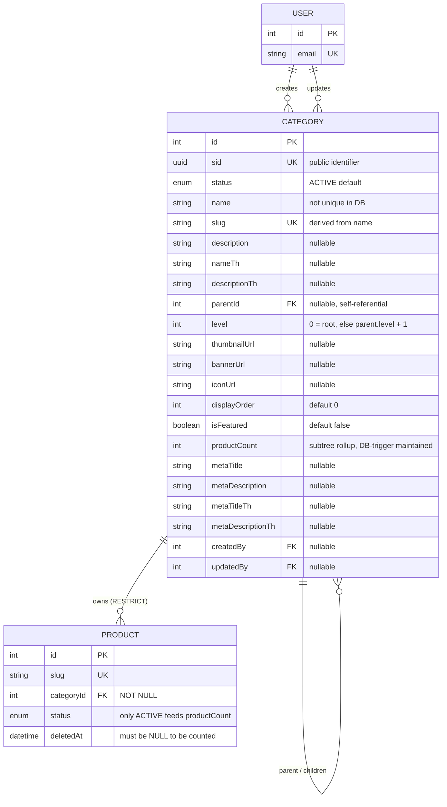

# Category Module

The storefront's catalog taxonomy — a **self-referential tree** of categories that products are filed under. One `Category` row is one node: it owns its identity (`slug`), an English primary body with an optional Thai mirror, three independent image slots (icon / thumbnail / banner), UI-ordering and SEO metadata, a trigger-maintained `productCount` rollup, and a full audit trail. There are **no child tables** — the hierarchy is the model's own `parentId` → `children` self-relation.

Schema source: `prisma/schema/category.prisma` (model `Category`; the `CategoryProductStatus` enum lives in `prisma/schema/shared.prisma`).
Module source: `src/modules/category/` (`category.controller.ts`, `category.service.ts`, `category.repository.ts`, `category.module.ts`, `dto/`, `test/`).

> **Scope note:** `User` and `Product` are documented in their own references ([user.md](./user.md), [product.md](./product.md)) — they appear here only as the foreign-key targets/sources needed to understand Category's relationships.

> **Two tiers, two jobs.** A **root** category (`parentId IS NULL`, `level = 0`) is an organizational container the storefront renders as a top-level nav entry or homepage card — **products may never be filed directly on one**. Its children are where products actually live. Nearly every rule below follows from that split; see [The Hierarchy Model](#the-hierarchy-model).

---

### DB Schema

#### Entity-Relationship Diagram (ERD)



---

#### Enum Definitions

##### `CategoryProductStatus` (defined in `shared.prisma`, shared with `Product`)

| Value      | Meaning                                                                                                                                   |
| :--------- | :---------------------------------------------------------------------------------------------------------------------------------------- |
| `ACTIVE`   | Live on the storefront. **Default on creation** — the only status any public route returns, and the only one a product may be filed under. |
| `INACTIVE` | Retired but retained. Hidden from every public route.                                                                                      |
| `DRAFT`    | Being authored, never public.                                                                                                             |
| `ARCHIVED` | Long-term retired.                                                                                                                        |
| `HIDDEN`   | Deliberately suppressed from browsing.                                                                                                    |

> **Only `ACTIVE` is load-bearing.** Every query in this module tests `status = 'ACTIVE'` or nothing at all — `INACTIVE`, `DRAFT`, `ARCHIVED` and `HIDDEN` are **operationally identical** (all four simply mean "not `ACTIVE`"). The distinction is editorial intent, not behaviour.
>
> The enum is **shared with `Product`**, so it cannot be changed for categories alone — adding or reordering a value affects both domains. Contrast `Support`, which deliberately declares its own three-value `SupportStatus` ([support.md](./support.md#enum-definitions)).

---

#### Data Dictionary — Category

**Table purpose:** one node of the catalog taxonomy tree, in English with an optional Thai mirror. Maps to table `categories`.

| Field               | Type                          | Constraints                                             | Description                                                                                                                                                                                                                                                    |
| :------------------ | :---------------------------- | :------------------------------------------------------ | :-------------------------------------------------------------------------------------------------------------------------------------------------------------------------------------------------------------------------------------------------------------- |
| `id`                | `INT`                         | PK, AUTOINCREMENT                                        | Internal numeric key. Exposed in the admin `update` route URL, in `parentId`, and in `Product.categoryId`.                                                                                                                                                       |
| `sid`               | `UUID`                        | UNIQUE, NOT NULL, DEFAULT `uuid()`, `@db.Uuid`           | Public-facing identifier. Returned by the admin DTO, but **no route looks a category up by it** — see [Conventions](#conventions).                                                                                                                               |
| `status`            | `ENUM(CategoryProductStatus)` | NOT NULL, DEFAULT `ACTIVE`                               | Lifecycle/visibility state. Default is `ACTIVE`, not `DRAFT` — an omitted status publishes immediately.                                                                                                                                                          |
| `name`              | `VARCHAR(255)`                | NOT NULL                                                 | English display name. **Not uniquely constrained in the DB** — uniqueness is enforced indirectly, via the `slug` derived from it.                                                                                                                                |
| `slug`              | `VARCHAR(255)`                | UNIQUE, NOT NULL                                         | Global URL/search identifier and the public lookup key. Derived from `name` by `generateSlug()`, never client-set.                                                                                                                                               |
| `description`       | `TEXT`                        | NULLABLE                                                 | English long-form description.                                                                                                                                                                                                                                  |
| `nameTh`            | `VARCHAR(255)`                | NULLABLE                                                 | Thai display name, mirrors `name`. Display-only — **never** used to derive the slug.                                                                                                                                                                            |
| `descriptionTh`     | `TEXT`                        | NULLABLE                                                 | Thai description, mirrors `description`.                                                                                                                                                                                                                        |
| `parentId`          | `INT`                         | FK → `categories.id`, NULLABLE, **ON DELETE NO ACTION**  | Self-referential parent link. `NULL` ⇒ this is a root category. See [Relationships and Cascading Rules](#relationships-and-cascading-rules).                                                                                                                     |
| `level`             | `INT`                         | NOT NULL, DEFAULT `0`                                    | Denormalized tree depth. `0` = root; otherwise set by the service to `parent.level + 1`. **Not recomputed for descendants when a parent moves** — see [Known Gaps](#known-gaps--recommended-hardening).                                                          |
| `thumbnailUrl`      | `VARCHAR(512)`                | NULLABLE                                                 | Relative storage path of the thumbnail (`/uploads/categories/thumbnail-images/…`), converted to an absolute URL by the response DTO.                                                                                                                             |
| `bannerUrl`         | `VARCHAR(512)`                | NULLABLE                                                 | Relative storage path of the hero banner (`/uploads/categories/banner-images/…`).                                                                                                                                                                               |
| `iconUrl`           | `VARCHAR(512)`                | NULLABLE                                                 | Relative storage path of the nav/menu icon (`/uploads/categories/icon-images/…`).                                                                                                                                                                               |
| `displayOrder`      | `INT`                         | NOT NULL, DEFAULT `0`                                    | Manual sort position for menus and lists. The DTO documents it as "lower values appear first" — which only one of the two sorting queries honours, see [Known Gaps](#known-gaps--recommended-hardening).                                                          |
| `isFeatured`        | `BOOLEAN`                     | NOT NULL, DEFAULT `false`                                | Promote in featured homepage sections. Writable and indexed — but **no query in this module filters on it** today.                                                                                                                                               |
| `productCount`      | `INT`                         | NOT NULL, DEFAULT `0`                                    | **Live, trigger-maintained subtree rollup**: how many *sellable* products (`status = ACTIVE` **and** `deletedAt IS NULL`) sit under this category **or any descendant of it**. A root therefore reports its whole branch. Never written by application code. See [The `productCount` Rollup](#the-productcount-rollup).                                     |
| `metaTitle`         | `VARCHAR(255)`                | NULLABLE                                                 | SEO `<title>` in English.                                                                                                                                                                                                                                       |
| `metaDescription`   | `TEXT`                        | NULLABLE                                                 | SEO `<meta description>` in English.                                                                                                                                                                                                                            |
| `metaTitleTh`       | `VARCHAR(255)`                | NULLABLE                                                 | SEO `<title>` in Thai.                                                                                                                                                                                                                                          |
| `metaDescriptionTh` | `TEXT`                        | NULLABLE                                                 | SEO `<meta description>` in Thai.                                                                                                                                                                                                                               |
| `createdAt`         | `TIMESTAMPTZ(3)`              | NOT NULL, DEFAULT `now()`                                | Row creation time. Default sort field for the admin listing.                                                                                                                                                                                                    |
| `updatedAt`         | `TIMESTAMPTZ(3)`              | NOT NULL, `@updatedAt`                                   | Last modification time, maintained by Prisma.                                                                                                                                                                                                                   |
| `createdBy`         | `INT`                         | FK → `users.id`, NULLABLE, **ON DELETE SET NULL**        | Staff user who created the category — stamped by the service from the JWT, never accepted from the client.                                                                                                                                                       |
| `updatedBy`         | `INT`                         | FK → `users.id`, NULLABLE, **ON DELETE SET NULL**        | Staff user who last updated it. Note it is stamped at creation time too whenever images are uploaded — see [Image Upload & Rollback](#image-upload--rollback).                                                                                                    |

> **No `@map()` anywhere.** Only the table itself is mapped (`@@map("categories")`); every column lands in Postgres as a camelCase identifier (`"parentId"`, `"thumbnailUrl"`, …), which hand-written SQL must double-quote. `Product` — which references this table — maps its FK to snake_case (`@map("category_id")`), so the two sides of the same relationship read differently in raw SQL. See [Conventions](#conventions).

---

#### Relationships and Cascading Rules

| Parent → Child                                | FK Column            | On Delete     | Effect                                                                                                                                |
| :-------------------------------------------- | :------------------- | :------------ | :-------------------------------------------------------------------------------------------------------------------------------------- |
| `Category` → `Category` (`CategoryHierarchy`) | `Category.parentId`  | **NO ACTION** | Deleting a category that still has children is **rejected by Postgres** (FK violation). Children must be re-parented or removed first.  |
| `Category` → `Product`                        | `Product.categoryId` | **RESTRICT**  | A category with any product filed under it cannot be deleted. `Product.categoryId` is `NOT NULL`, so there is no "orphan the products" path. |
| `User` → `Category` (`createdByUser`)         | `Category.createdBy` | **SET NULL**  | Deleting a staff user preserves the categories they created; `createdBy`/`createdByUser` goes `null`.                                   |
| `User` → `Category` (`updatedByUser`)         | `Category.updatedBy` | **SET NULL**  | Same, for the last editor.                                                                                                             |

**Practical implications:**

- **`NO ACTION` + `RESTRICT` mean a node can only be dropped once it is childless *and* productless** — which is exactly the rule [`DELETE /delete-category/:id`](#remove-a-category) enforces in the application layer, before the database has to. Anything that fails the product half is archived (`status = ARCHIVED`) instead of destroyed, so the two FK rules never surface to a client as a raw error.
- **`NO ACTION` is not `RESTRICT`.** Postgres defers a `NO ACTION` check to the end of the statement, so a single statement that deletes a parent *and* re-parents its children can succeed where `RESTRICT` would abort immediately. Nothing in this module does that today; the practical behaviour is identical.
- **The `SET NULL` direction is `User → Category` only.** Deleting a category has no effect on the staff users referenced by it, and both FKs are nullable — every consumer must handle `createdByUser: null` / `updatedByUser: null`.
- **There is no soft-delete field** (contrast `Product`, which carries `deletedAt`/`deletedBy` — see [product.md](./product.md#relationships-and-cascading-rules)).
- **Acyclicity is enforced, but not by the FK.** The self-relation is a plain nullable FK — Postgres itself would happily store `A → B → A`. What stops it is a `BEFORE UPDATE OF "parentId"` trigger (`trg_assert_category_hierarchy_acyclic`), backing an ancestry check in the service. See [Cycle Prevention](#cycle-prevention).

---

#### Performance Optimizations (Indexes)

##### Current indexes (`category.prisma`)

| Index                                | Type               | Purpose                                                                                                                                                                                                                                                                    |
| :----------------------------------- | :----------------- | :------------------------------------------------------------------------------------------------------------------------------------------------------------------------------------------------------------------------------------------------------------------------- |
| `sid`, `slug` (each `@unique`)       | B-Tree (unique)    | Identity lookups. `slug @unique` is what serves every URL lookup — the schema carries an explicit comment refusing to add a second `@@index([slug])` on top of it, because that would be pure write amplification. (`Support` and `Blog` both still carry that redundant index; `Category` and `ComboProduct` do not.) |
| `@@index([parentId, status])`        | B-Tree (composite) | The hot query: fetching a node's active sub-categories, and — with `parentId IS NULL` — the [active root categories](#list-active-root-categories-public) behind the nav and homepage.                                                                                        |
| `@@index([status, isFeatured])`      | B-Tree (composite) | Intended for "featured" homepage sections. **No query in this module filters on `isFeatured`**, so today it serves nothing beyond its leading `status` column.                                                                                                               |
| `@@index([displayOrder])`            | B-Tree             | Menu/list sorting. Both queries that sort on `displayOrder` *also* filter `status = 'ACTIVE'`, which this single-column index cannot satisfy — Postgres must still filter, then sort.                                                                                        |
| `parentId`, `createdBy`, `updatedBy` | B-Tree (implicit)  | Prisma auto-creates an index on each relation scalar field. `parentId` is therefore indexed twice: once alone, once as the lead of `[parentId, status]`. The standalone `parentId` index is also what makes the [`productCount` rollup](#the-productcount-rollup) cheap — both of its recursive walks (up to the ancestors, down through the subtree) are `parentId` lookups. |

##### Not covered by an index

- **`WHERE level = 1`** — [the product-assignable listing](#list-product-assignable-categories-admin) filters on `status`, `parentId IS NOT NULL` **and** `level = 1`. `level` is indexed nowhere, and `parentId: { not: null }` is a range predicate that stops `[parentId, status]` being usable past its first column. In practice a category table is small enough that this is a cheap scan.
- **Free-text `search`** on `name`/`slug`/`nameTh` is a `contains` match with `mode: 'insensitive'` through `PaginationService` — a B-Tree cannot serve it. Same limitation as every other module; a `tsvector` + GIN index is the fix if it ever matters.
- **Recursive descent.** There is no closure table, materialized path, or `ltree` column. Fetching a whole subtree beyond one level means N queries or a hand-written recursive CTE; `level` is a depth *label*, not a traversal index. The [`productCount` rollup](#the-productcount-rollup) is the one place a recursive CTE is actually used — and it keys off `parentId`, never `level`, so a [drifted `level`](#known-gaps--recommended-hardening) cannot corrupt the tally.

> **On the `products` side**, the rollup's per-node tally (`WHERE category_id = ? AND status = 'ACTIVE' AND deleted_at IS NULL`) is served by `products @@index([categoryId, status])` — the same index the storefront's category browsing uses. `deleted_at` is not in it, so Postgres filters the (already tiny) matched set afterwards.

---

#### Conventions

- **All `DateTime` columns are `@db.Timestamptz(3)`.** Prisma's default mapping is timezone-naive; comparing a naive column against SQL `now()` casts through the *server's* `TimeZone` setting. Any new `DateTime` field must carry `@db.Timestamptz(3)`.
- **English is the source of truth; Thai is display-only.** `slug` is always derived from `name`, never from `nameTh`, so the URL stays ASCII and stable regardless of the Thai copy. The Thai fields are independently optional — nothing validates that `nameTh`/`descriptionTh`/`metaTitleTh`/`metaDescriptionTh` move together.
- **Derived values are never client input.** `slug` comes from `generateSlug(name)`; `level` is computed from the parent; `createdBy`/`updatedBy` come from the JWT; the three image URLs come from the storage service. No DTO exposes a field for any of them.
- **`sid` is the public identifier, `id` is internal** — the same convention as `Product`/`Blog`. `Category` follows it only in what it *returns*: the public route addresses a category by `slug` and the admin route by `id`, so `sid` is currently informational only.
- **Images are three independent slots, not a gallery.** Unlike `Product` (which has a `ProductImage` child table with ordering and a primary flag), a category has exactly one icon, one thumbnail and one banner, each a nullable string column. Uploading a replacement overwrites the column and deletes the old file.
- **Root categories are containers, not shelves.** Products are filed on children only — enforced at the service layer, not by the database. See [The Hierarchy Model](#the-hierarchy-model).
- **No column mapping.** Only the table name is mapped. Internally consistent, but inconsistent with `product.prisma`/`address.prisma`, which snake_case their columns — see [Known Gaps](#known-gaps--recommended-hardening).
- **Changes are audited automatically.** `Category` is one of the eight models in `TRACKED_AUDIT_MODELS`, so every create/update/delete writes an `AuditLog` row with a field-level diff, without this module containing any audit code. See [audit-log.md](./audit-log.md#tracked-models).
- **Derived counters live in the database, not in services.** `productCount` is maintained by Postgres triggers, the same convention `Product.totalStock`/`stockStatus` and `ComboProduct.quantity` follow. Application code reads it and never writes it — there is no field for it on either DTO, and `whitelist: true` would reject one anyway. See [The `productCount` Rollup](#the-productcount-rollup).

---

#### Example Data

| id  | name                | slug                 | parentId | level | status     | displayOrder | isFeatured | own active products | productCount | createdBy | updatedBy |
| :-- | :------------------ | :------------------- | :------- | :---- | :--------- | :----------- | :--------- | :------------------ | :----------- | :-------- | :-------- |
| 1   | Beauty & Anti-Aging | `beauty-anti-aging`  | `null`   | 0     | `ACTIVE`   | 1            | `true`     | — (root)            | **7**        | `3`       | `3`       |
| 2   | Skincare            | `skincare`           | `1`      | 1     | `ACTIVE`   | 1            | `false`    | 4                   | **7**        | `3`       | `null`    |
| 3   | Serums              | `serums`             | `2`      | 2     | `ACTIVE`   | 0            | `false`    | 3                   | **3**        | `3`       | `null`    |
| 4   | Supplements         | `supplements`        | `null`   | 0     | `ACTIVE`   | 2            | `false`    | — (root)            | **7**        | `7`       | `7`       |
| 5   | Vitamins            | `vitamins`           | `4`      | 1     | `DRAFT`    | 0            | `false`    | 5                   | **5**        | `7`       | `null`    |
| 6   | Herbal Remedies     | `herbal-remedies`    | `4`      | 1     | `INACTIVE` | 0            | `false`    | 2                   | **2**        | `7`       | `3`       |

> "Own active products" is not a column — it is shown only to make the rollup arithmetic visible. Serums also holds one `DRAFT` and one soft-deleted product; neither appears in any number above.
> Row 1's slug is `beauty-anti-aging`, not `beauty-and-anti-aging` — `generateSlug()` strips `&` as a non-word character and collapses the resulting double hyphen. See [Slug Handling](#slug-handling).
> Rows 2 and 5 are both `level = 1`, but only row 2 appears in [product-assignable categories](#list-product-assignable-categories-admin) — row 5 is `DRAFT`.
> Row 3 is `level = 2`. It is **not** offered by the assignable-categories dropdown (which is `level = 1` only), yet `assertCategoryAssignableToProduct` would accept it, because that check only rejects roots. See [Known Gaps](#known-gaps--recommended-hardening).
> **Row 2's `productCount` is 7, not 4** — its own 4 plus Serums' 3. **Row 1's is 7 with nothing filed on it at all**: a root holds no products directly, so its number is entirely the rollup of its branch. See [The `productCount` Rollup](#the-productcount-rollup).
> **Rows 5 and 6 still count**, even though one is `DRAFT` and the other `INACTIVE` — the rollup weighs each *product's* status, never the category's, which is why Supplements reads 7 (`5 + 2`) rather than 0.
> Row 1 has `isFeatured: true`, which is stored and returned faithfully but read by no query in this module today.
> Rows 2, 3 and 5 have `updatedBy: null` because they have never been edited *and* were created without images; a category created **with** images gets `updatedBy` stamped immediately ([Image Upload & Rollback](#image-upload--rollback)). Note that the counter triggers do **not** stamp `updatedBy`/`updatedAt` — see [The `productCount` Rollup](#the-productcount-rollup).

---

#### Example Usage (JSON Response)

Every response below is wrapped by the global `ResponseInterceptor` envelope (`{ statusCode, success, message, data, meta? }`); only the `data` payload is shown.

**Full detail** (`CategoryResponseDto`) — the shape returned by *both* admin and public routes today:

```json
{
  "id": 2,
  "sid": "550e8400-e29b-41d4-a716-446655440000",
  "status": "ACTIVE",
  "name": "Skincare",
  "slug": "skincare",
  "description": "Cleansers, toners, moisturisers and treatments.",
  "nameTh": "ผลิตภัณฑ์ดูแลผิว",
  "level": 1,
  "thumbnailUrl": "http://localhost:8000/uploads/categories/thumbnail-images/skincare-1754820000000-123456789.webp",
  "bannerUrl": "http://localhost:8000/uploads/categories/banner-images/skincare-1754820000000-987654321.webp",
  "displayOrder": 1,
  "isFeatured": false,
  "productCount": 7,
  "childrenCount": 1,
  "parentId": 1,
  "metaTitle": "Skincare — Beauty & Anti-Aging",
  "createdAt": "2026-07-02T08:15:00.000Z",
  "updatedAt": "2026-07-02T08:15:00.000Z",
  "createdByUser": {
    "id": 3,
    "name": "Admin Somchai",
    "email": "",
    "role": "ADMIN",
    "status": "ACTIVE"
  },
  "updatedByUser": null,
  "parent": {
    "id": 1,
    "name": "Beauty & Anti-Aging",
    "slug": "beauty-anti-aging",
    "childrenCount": 0,
    "parent": null,
    "children": []
  },
  "children": [
    {
      "id": 3,
      "name": "Serums",
      "slug": "serums",
      "status": "ACTIVE",
      "childrenCount": 0,
      "parent": null,
      "children": []
    }
  ]
}
```

> **`createdByUser.email` is always `""` and `createdByUser.status` is always `"ACTIVE"`.** `CATEGORY_SELECT` fetches only `id`, `role` and `profile.firstName`/`lastName` for the two user relations, but feeds them to the shared `UserMinifiedResponseDto`, whose constructor falls back to `user.email ?? ''` and `user.status ?? UserStatus.ACTIVE`. Those two values are **fabricated defaults, not data** — do not render them. (`Support` selects both fields and does not have this problem; see [support.md](./support.md#response-shapes--select-projections).)
> **`name` is composed** from `profile.firstName` + `profile.lastName` by `formatDisplayName()` — the repository never selects a `name` column.
> **Nested `parent`/`children` are the same DTO class recursed one level.** Their own `parent` is `null` and `children` is `[]` because the repository's select descends exactly one level in each direction — not because the tree ends there.
> **Optional fields are absent, not `null`** (`descriptionTh`, `iconUrl`, `metaTitleTh` above): the DTO constructor coerces Prisma's `null` to `undefined`, which `JSON.stringify` drops. `parent`, `children`, `createdByUser` and `updatedByUser` are the exceptions — they are explicitly set, so they always appear.

**Nav/dropdown shape** (`RootActiveCategoryResponseDto`) — id and name only:

```json
[
  { "id": 1, "name": "Beauty & Anti-Aging" },
  { "id": 4, "name": "Supplements" }
]
```

**Homepage card shape** (`CategoryHomeResponseDto`) — consumed by the `home` module, not by any route on this controller:

```json
[
  {
    "id": 1,
    "name": "Beauty & Anti-Aging",
    "slug": "beauty-anti-aging",
    "bannerUrl": "http://localhost:8000/uploads/categories/banner-images/beauty-1754820000000-111.webp",
    "productCount": 7
  }
]
```

---

#### Implementation & Best Practices

##### The Hierarchy Model

- **`parentId` is the truth; `level` is a cache.** The tree is a plain nullable self-FK. `level` is written by `CategoryService` at create time (`parent.level + 1`, or `0` with no parent) and re-written when `parentId` changes on update.
- **Depth is unbounded.** Nothing caps `level` — a chain of ten categories is legal. The *product-assignment* rules are what give the tree its practical shape:

  | Rule                                                | Enforced by                                 | Level(s) affected  |
  | :-------------------------------------------------- | :------------------------------------------ | :----------------- |
  | A product may not be filed on a **root** category   | `assertCategoryAssignableToProduct` (`400`) | rejects `level 0`  |
  | A product's category must be **`ACTIVE`**           | `assertCategoryAssignableToProduct` (`400`) | any level          |
  | The admin **dropdown** offers only `level = 1`      | `findProductCategories` (`WHERE level = 1`) | lists `level 1`    |

  The first and third rows disagree: the dropdown lists level 1, but the validator accepts *any* non-root level. A `level = 2` category is invisible in the UI yet perfectly valid if a client sends its id directly. See [Known Gaps](#known-gaps--recommended-hardening).
- **Re-parenting does not cascade.** Moving category *B* under a new parent recomputes `B.level` only — every descendant of *B* keeps its stale `level`. There is no recursive fix-up and no trigger.
- **A category can never become its own ancestor.** Two independent guards enforce it — an ancestry walk in the service and a trigger on the table. See [Cycle Prevention](#cycle-prevention).
- **Promoting to root uses `parentId: null`**, which the service maps to `level = 0` and the repository maps to `parent: { disconnect: true }`. Sending `parentId` as the *multipart string* `"null"` does **not** work — see [Admin-Form UX](#admin-form-ux-multipartform-data).

##### Cycle Prevention

`parentId` is a plain nullable self-FK, so the database was always willing to store `A → B → A`. Nothing detected it beyond the one-node case, and a loop is not a cosmetic problem: the storefront walks `parentId` upward for breadcrumbs, `CategoryResponseDto` recurses `parent`/`children`, and the [`productCount` rollup](#the-productcount-rollup) walks the tree in both directions. On a cyclic tree those are non-terminating walks.

**The rule, stated correctly:** a move is a cycle exactly when the category being moved **is already an ancestor of (or is) its prospective parent** — the new edge would then point from inside a branch back to its own root. That single test covers `A → A`, `A → B → A`, and any depth beyond.

Two layers enforce it.

**1. `CategoryService.assertNoCycle` — the one an admin should ever hit.** Before writing, it walks **up** from the proposed parent via `CategoryRepository.findAncestorChain` and rejects with `400 Bad Request` if the moved category appears in that chain. The message spells out the existing path, so the admin can see *why*:

> Cannot move "Beauty & Anti-Aging" here — that would create a loop in the category tree, because the chosen parent already sits inside its own branch (Beauty & Anti-Aging → Skincare → Serums). Move the sub-branch out first, or pick a parent outside it.

- **Walking up, not down**, is deliberate: an ancestry chain is at most the tree's depth, while a subtree can be the whole table. Both answer the same question.
- **`parentId === id` keeps its own earlier check** (`"A category cannot be its own parent"`) purely for the clearer message; `assertNoCycle` would catch it anyway.
- **Promoting to root skips the walk entirely** — `parentId: null` cannot close a loop.
- `findAncestorChain` is a recursive CTE, so any depth is one round trip. It **carries a `path` array and refuses to revisit an id already in it**, because it must be safe on a tree that is *already* cyclic. Note that plain `UNION` dedup would not save it here: the `depth` column increments every hop, so no row ever repeats exactly and the recursion would never end. This is the opposite trade-off from the `productCount` walks, which have no per-hop column and can rely on dedup.

**2. `trg_assert_category_hierarchy_acyclic` — the backstop** (`20260819120000_prevent_category_hierarchy_cycles`). A `BEFORE UPDATE OF "parentId"` trigger running the same ancestry test, raising a `check_violation`. It exists for what application code cannot cover:

- **The race.** The service checks and writes in two statements. Two admins re-parenting concurrently — X under Y while Y is moved under X — each pass their own check against a snapshot lacking the other's edge, and the loop closes on commit. **This was measured, not assumed:** with the trigger present but its advisory lock removed, that race reliably produces a cycle, because the two statements write *different* rows and take no conflicting row locks. `pg_advisory_xact_lock(hashtext('category_hierarchy_reparent'))` at the top of the trigger serializes re-parenting against itself; the loser resumes after the winner commits, re-reads (a `VOLATILE` function takes a fresh snapshot per query under `READ COMMITTED`), and is rejected. The lock is taken only when `parentId` is actually written — never on an ordinary category edit, never on a product write.
- **Everything that is not the service** — seeds, data fixes, a future bulk-move endpoint, a `psql` session.

`INSERT` is deliberately not covered: a new row's id cannot already appear in any existing ancestry, so a new category can only attach to a chain, never close one. **Cycles are created by moves.**

> If the trigger ever fires, the request fails as a database error rather than the tidy `400` — by design. Reaching it means the service check was bypassed or lost a race, and a failed write is strictly better than a tree no reader can walk.

##### The `productCount` Rollup

`productCount` answers one question: **how many products can a shopper standing on this category actually reach?** Because a category's products live as much in its sub-tree as on the node itself, the answer is a rollup, not a direct tally.

```
productCount(C) = COUNT(products P)
                  WHERE P.categoryId ∈ { C } ∪ descendants(C)
                    AND P.status    = 'ACTIVE'
                    AND P.deletedAt IS NULL
```

| Node                      | What its number is                                                                                    |
| :------------------------ | :------------------------------------------------------------------------------------------------------ |
| Leaf (no children)        | Its own directly-filed active products.                                                                 |
| Intermediate (`level ≥ 1`) | Its own **plus** every descendant's, to any depth.                                                      |
| **Root (`level = 0`)**    | Purely the rollup of its whole branch — a root can never hold products directly, so a per-node count would be permanently `0` and the homepage card would be useless. |

Worked from the [Example Data](#example-data) above: Serums holds 3, Skincare holds 4 of its own → Skincare reports `7`, and Beauty & Anti-Aging — with nothing filed on it at all — also reports `7`.

**What counts.** The predicate `status = 'ACTIVE' AND deletedAt IS NULL` is character-for-character `ProductRepository.activeVisibilityWhere()`, the gate every public product read already applies. The count therefore can never promise more rows than the listing behind it returns. Two deliberate exclusions:

- **`publishedAt` is not consulted**, because it is not part of storefront visibility either — the storefront shows active products regardless of launch schedule ([product.md](./product.md)).
- **The category's own `status` is not consulted.** A `DRAFT` or `INACTIVE` sub-category still contributes its active products to its ancestors' totals (Supplements reads `7` in the example data, from a `DRAFT` child and an `INACTIVE` one). Two reasons: the same column is read by the **admin** projection, where *"this branch holds 7 live products"* is precisely what an admin needs before archiving or re-parenting a node — gating on the branch's status would blank the number on the one screen that needs it; and it would make every category status flip re-tally an arbitrary subtree.

**How it stays correct.** Two triggers, installed by `20260818110000_maintain_category_product_count`, both calling one recompute function:

| Trigger                                            | Fires on                                                                | Why                                                                                                                                                              |
| :------------------------------------------------- | :----------------------------------------------------------------------- | :----------------------------------------------------------------------------------------------------------------------------------------------------------------- |
| `trg_sync_category_product_count_from_products`     | `products`: `INSERT`, `DELETE`, `UPDATE OF category_id, status, deleted_at` | Every way a product enters or leaves a tally: created, hard-deleted, moved to another category, published/unpublished, or soft-deleted.                             |
| `trg_sync_category_product_count_from_move`         | `categories`: `UPDATE OF "parentId"`, `DELETE`                            | Re-parenting moves a whole subtree of products between ancestor chains without touching a single `products` row. Both the chain it left and the one it joined re-tally. |

`recompute_category_product_count(int[])` takes the categories whose own tally may have moved, walks **up** to collect every ancestor, then walks **down** from each of those to re-count its whole subtree from scratch.

- **It recomputes, it does not increment.** A `+1`/`-1` counter is only correct if applied exactly once per event — impossible to guarantee across re-parenting, cascades and one-off SQL. A full re-count is idempotent, so running it twice, or after arbitrary drift, still lands on the right answer. That also makes repair trivial (below).
- **Both walks use `UNION`, not `UNION ALL`.** The dedup is what makes them terminate if a parent cycle is ever stored. [Cycle Prevention](#cycle-prevention) now stops new ones from being written, but this query predates that guard and still has to survive a loop that slipped in before it — a cycle makes the numbers meaningless, and this is what keeps it from hanging a product write as well.
- **It keys off `parentId`, never `level`** — so the [`level` drift on re-parenting](#known-gaps--recommended-hardening) cannot corrupt the tally.
- **Row locks are taken up front in ascending `id` order.** Two product writes in different branches of the same tree recompute overlapping ancestor sets; a fixed acquisition order is what stops them deadlocking on a shared ancestor. They still serialize on it — brief, and this is an admin-only write path.
- **No `INSERT` trigger on `categories` is needed**: a brand-new category has no products and no children, so it contributes `0` to every ancestor, which is what they already hold. Children only ever arrive by a later re-parent, i.e. through the move trigger.
- **The `DELETE` branch is a defensive no-op today.** `NO ACTION` from children plus `RESTRICT` from products means a deletable category is provably empty ([Relationships](#relationships-and-cascading-rules)); it is wired anyway so relaxing either rule cannot silently strand an ancestor's total.

**What the triggers deliberately do *not* touch:**

- **`updatedAt` / `updatedBy` never move.** `@updatedAt` is applied by the Prisma client, not the database, so a raw counter write leaves both alone. A product being published must not make its category look edited.
- **No `AuditLog` row is written.** Auditing is a Prisma client extension ([audit-log.md](./audit-log.md#how-rows-get-written)); a trigger writing beneath it is invisible to that extension. Without this, a bulk product import would bury the category audit trail under thousands of counter diffs.

**Repairing drift.** The counter is self-healing by construction, but if a restore, a manual `UPDATE`, or a migration ever leaves it suspect, one statement re-derives the entire tree — the same call the migration's own backfill makes:

```sql
SELECT public.recompute_category_product_count(
  ARRAY(SELECT "id" FROM "public"."categories")
);
```

##### Slug Handling

- `generateSlug()` (`src/common/utils/slug.util.ts`) lowercases, strips diacritics, turns whitespace into `-`, and **deletes every character outside `[A-Za-z0-9_-]`**. Thai script is not `\w` in JavaScript, so a name written entirely in Thai derives to an **empty slug** — the first such row saves with `slug: ""` and every subsequent one collides on the unique constraint. Keep `name` English (that is what `nameTh` exists for); see [Known Gaps](#known-gaps--recommended-hardening).
- The uniqueness check is **table-wide and status-agnostic** — `findBySlug(slug)` looks at every row regardless of `status`, `level` or branch. Two different parents cannot each have a child named "Serums"; the slug is a *global* identifier, exactly as the schema comment states.
- **On create**, the slug is checked before insert → `409 Conflict` (`"Category with this name already exists"`).
- **On update**, the slug is re-derived only when `name` actually changes, and the conflict check excludes the row itself (`existingSlug.id !== id`) so renaming a category to its current name is a safe no-op. Renaming to a genuinely new name **silently breaks every inbound link** to `/category-by-slug/:slug` — treat the slug as immutable in practice, or add redirects at the routing layer.

##### Image Upload & Rollback

Create and update handle images differently, and the difference matters.

**On create** — the row is written **first**, files second:

1. `category.create()` → the row exists with all three URL columns `null`.
2. Each supplied file is uploaded via `IStorageService.saveFile(file, folder)` (`LocalStorageService` → `/uploads/categories/{banner,icon,thumbnail}-images/`), returning a relative path.
3. If at least one upload succeeded, a **second write** (`updateCategory`) stamps the URLs — and because that repository method always connects `updatedByUser`, this is why a freshly created category with images already has a non-null `updatedBy`.
4. **On any upload failure the whole thing unwinds**: the category row is deleted and every file already written is removed. Both cleanups are `.catch()`-logged, never rethrown.
5. The rollback then re-throws the original upload error, so the request fails with whatever the storage layer raised (typically `500`).
6. Finally the service **re-reads the row** (`findById`) so the response carries the image URLs written in step 3.

> The rollback infers each orphan file's folder from substring checks on its own path (`path.includes('banner')` → banner folder, else `includes('icon')` → icon folder, else thumbnail). A file whose *original filename* contains "banner" but which was uploaded as an icon is looked for in the wrong folder and silently left on disk. See [Known Gaps](#known-gaps--recommended-hardening).
> Each create-with-images therefore produces **two** `audit_logs` rows (`CREATE` then `UPDATE`), and a rolled-back create produces `CREATE` + `DELETE` — the audit trail records the attempt, not just the outcome. See [audit-log.md](./audit-log.md#how-rows-get-written).

**On update** — files are written and the old ones deleted **before** the DB write:

1. For each supplied file: upload the replacement, put its path in `updateData`, then delete the previously-stored file (`.catch()`-logged).
2. Only afterwards does `category.update()` run.
3. There is **no rollback path here.** If the DB update fails, the old files are already gone and the new paths were never persisted — the row is left pointing at deleted files. See [Known Gaps](#known-gaps--recommended-hardening).
4. `bannerImage` and a legacy `image` field are aliases for the same slot; `bannerImage` wins when both are sent.

**URL construction** is a response-time concern, not a storage one: the DB holds a *relative* path (`/uploads/...`) and every DTO constructor prefixes `app.baseUrl` unless the stored value already starts with `http`. Changing `BASE_URL` between environments therefore rewrites every image URL with no migration.

##### Admin-Form UX (multipart/form-data)

Both write routes use `FileFieldsInterceptor` + `@ApiConsumes('multipart/form-data')` because they genuinely accept files — unlike `support`/`home`, which declare multipart purely for Swagger's one-input-per-field rendering ([support.md](./support.md#admin-form-ux-multipartform-data)).

The consequence is that **every non-file value arrives as a string**, and the DTOs handle the two affected types explicitly:

- **Numbers** (`parentId`, `displayOrder`) — `@Type(() => Number)` coerces before `@IsInt` runs.
- **Booleans** (`isFeatured`) — a `@Transform` maps the literal strings `"true"`/`"false"` to real booleans before `@IsBoolean`.
- **`parentId: null` cannot be expressed over multipart.** `@Type(() => Number)` turns the string `"null"` into `NaN`, which `@IsOptional()` does not skip, so `@IsInt` fails with `400`. Promoting a category to root works over a JSON body (where `null` stays `null` and `@IsOptional()` skips validation) but not over the multipart form Swagger advertises. See [Known Gaps](#known-gaps--recommended-hardening).

##### Validation

The global `ValidationPipe` runs with `whitelist: true` **and** `forbidNonWhitelisted: true`, so an unknown field is a `400`, not a silent strip. Note what that means for the fields the service derives: there is no `slug`, `level`, `createdBy`, `updatedBy`, `thumbnailUrl`, `bannerUrl` or `iconUrl` on either DTO, so sending any of them is a validation error rather than a silently-ignored value.

`status` is accepted on **both** create and update — a category can be published, hidden or archived at any time. Unlike `Support.type` there is no immutable field in this module.

---

#### Known Gaps / Recommended Hardening

Issues worth fixing before this module is considered production-hardened — none of them block understanding the current design:

- **`level` drifts on re-parenting.** Moving a subtree updates only the moved node's `level`; its descendants keep stale depths. Since `findProductCategories` filters on `level = 1`, a stale value silently adds or removes categories from the admin dropdown. Fix with a recursive `UPDATE` (CTE) on move, or derive depth on read and drop the column.
- **Cycles are prevented for new writes, but a pre-existing loop is not repaired.** The migration that installs the guard reports any loop already in the table as a `WARNING` and stops there — which node's parent is the wrong one is an editorial decision, not something a migration can pick. If that warning ever appears, fix one edge per loop by hand and re-run the [`productCount` recompute](#the-productcount-rollup). See [Cycle Prevention](#cycle-prevention).
- **`productCount` can over-promise across a hidden sub-category.** By design it weighs each product's status, not the category's, so a root's total includes products filed under a `DRAFT`/`INACTIVE` child that the storefront will not render a link to. The number is right for the admin screens that share the column, and slightly generous for a public "7 products" badge. If the storefront ever needs the strictly-reachable figure, that is a second, separately-maintained column — not a change to this one, which the admin listing depends on.
- **The assignable-category rule is defined twice, inconsistently.** `assertCategoryAssignableToProduct` accepts any `ACTIVE` non-root category; `findProductCategories` lists only `ACTIVE`, `level = 1` ones. A `level = 2` category is therefore unreachable through the UI but accepted by the API. Pick one definition and share it.
- **Public routes return the admin projection.** `GET /all-active-categories` and `GET /category-by-slug/:slug` are unauthenticated but respond with `CategoryResponseDto`, which embeds `createdByUser`/`updatedByUser` — leaking staff **names, internal user ids and roles** to anonymous visitors, alongside internal `id`s, `displayOrder` and `status`. `CategoryResponseCustomerDto` — a purpose-built public shape that excludes exactly those fields — **already exists in `dto/category-response.dto.ts` and is imported by nothing.** Wiring it up is the single highest-value fix in this module.
- **`GET /all-active-categories` is unpaginated and returns the full tree shape.** Every active category, each with its parent snapshot, its children array, both user relations and all four SEO fields, in one response. Fine for a few dozen categories; it degrades linearly and has no `limit` escape hatch.
- **Update has no file rollback** (see [Image Upload & Rollback](#image-upload--rollback)). The old image is deleted before the DB write is known to have succeeded. Reordering — write the row first, delete old files only after it commits — costs nothing and removes the failure window entirely.
- **Create's rollback infers folders by substring.** `path.includes('banner')` can match a user-supplied filename, sending the cleanup to the wrong directory and orphaning the file. The upload step already knows the folder it used; carrying it alongside the path removes the guess.
- **`parentId: null` is unreachable over multipart** (see [Admin-Form UX](#admin-form-ux-multipartform-data)). Accepting the string `"null"`/`""` in a `@Transform` — or adding a dedicated `promoteToRoot` boolean — would make "promote to root" work from the admin form it is documented for.
- **A fully-Thai `name` derives to an empty slug** (see [Slug Handling](#slug-handling)). Rejecting it in the DTO, or adding a transliteration/fallback in `generateSlug()`, would turn a confusing `409` into a clear error.
- **`@@index([status, isFeatured])` serves no query.** `isFeatured` is writable and returned but never filtered on. Either add the featured-categories endpoint the index was built for, or drop the index.
- **`@@index([displayOrder])` is only half-usable.** Both queries that sort on it also filter `status = 'ACTIVE'`; `@@index([status, displayOrder])` would let Postgres filter and sort in one index scan.
- **The two `displayOrder` sorts disagree.** `findAllActiveCategories` orders `displayOrder: 'desc'` while `findActiveRootCategoriesForHome` orders `'asc'` — and the DTO documents "lower values appear first". The public category list is therefore in the reverse of its own documented order.
- **Removal does not cascade to children.** [`DELETE /delete-category/:id`](#remove-a-category) deliberately refuses a category that still has sub-categories rather than archiving or deleting the branch under it, so retiring a whole subtree is still N calls, bottom-up. A `cascade=true` option — or a dedicated "archive this branch" operation — is the natural follow-up; it needs a recursive `UPDATE` and a decision about what to do with the products underneath, which is why it is not in the first cut.
- **No `@map()` on any column** (see [Conventions](#conventions)) — camelCase identifiers in Postgres must be double-quoted in hand-written SQL, and this schema reads differently from `product.prisma` on the very relation the two share.
- **`sid` is dead weight today.** Generated, indexed and returned, but no route accepts it; the admin route takes `id` and the public route takes `slug`.
- **No transaction usage.** Every repository method accepts an optional `tx` and none is ever called with one. Create is a two-write sequence (row, then image URLs) that a transaction would make atomic — today a crash between them leaves a category with no images and no error. Note the audit extension's own write is not transactional either; see [audit-log.md](./audit-log.md#known-gaps--recommended-hardening).

---

### API End Point & Business Logic

Every endpoint below is served by `CategoryController` → `CategoryService` → `CategoryRepository`. All routes are prefixed `/api/v1/category` (`app.apiPrefix`, default `api/v1`). For the DTO/Swagger contract see `src/modules/category/dto/`; the Prisma `select` shapes live as private constants on the repository rather than in a separate `.select.ts` file — see [Response Shapes & Select Projections](#response-shapes--select-projections).

Successful responses are wrapped by the global `ResponseInterceptor` into `{ statusCode, success, message, data, meta? }`, where `message` comes from each route's `@ResponseMessage(...)`. Errors never reach that interceptor — `GlobalExceptionFilter` formats them, and maps Prisma's `P2002` → `409`, `P2025` → `404`, `P2003` → `400`.

#### Endpoint Overview

| Method  | Path                       | Access       | Purpose                                                                                     |
| :------ | :------------------------- | :----------- | :------------------------------------------------------------------------------------------ |
| `POST`  | `/create-category`         | `ADMIN` only | [Create a root or child category, with up to three images](#create-a-category)               |
| `GET`   | `/all-categories`          | `ADMIN` only | [Admin listing — every status, paginated and searchable](#list-all-categories-admin)         |
| `GET`   | `/all-active-categories`   | **Public**   | [Every `ACTIVE` category, unpaginated](#list-all-active-categories-public)                   |
| `GET`   | `/active-root-categories`  | **Public**   | [Active top-level categories, id + name only](#list-active-root-categories-public)           |
| `GET`   | `/product-categories`      | `ADMIN` only | [Active `level = 1` categories — the product-assignment dropdown](#list-product-assignable-categories-admin) |
| `GET`   | `/category-by-slug/:slug`  | **Public**   | [One category by slug](#get-a-category-by-slug-public)                                       |
| `PATCH` | `/update-category/:id`     | `ADMIN` only | [Partial update, including re-parenting and image replacement](#update-a-category)           |
| `DELETE`| `/delete-category/:id`     | `ADMIN` only | [Remove a category — archives it when it holds products](#remove-a-category)                  |

Guarded routes use `JwtAuthGuard` + `RolesGuard` + `@Roles(UserRole.ADMIN)`. `RolesGuard` matches the caller's role **exactly** — there is no hierarchy, so `SUPER_ADMIN`, `MANAGER` and `MARKETING` are *not* implicitly allowed anywhere in this module. Note this is stricter than `support`, which lets `MARKETING`/`SUPPORT` write content ([support.md](./support.md#endpoint-overview)): the catalog taxonomy is admin-only end to end.

**The `DELETE` route does not always delete.** It is the module's single "remove this" action, and it picks between destroying the row and archiving it based on the category's product history — see [Remove a Category](#remove-a-category).

---

#### Response Shapes & Select Projections

Three projections live as private readonly constants on `CategoryRepository`, feeding four DTOs.

| Select                        | Fed to                                                       | Contains                                                                                                                                                                                                        |
| :---------------------------- | :----------------------------------------------------------- | :--------------------------------------------------------------------------------------------------------------------------------------------------------------------------------------------------------------- |
| `CATEGORY_SELECT`             | `CategoryResponseDto`                                         | Every column, plus a one-level `parent` snapshot (`id`/`name`/`slug`), a one-level `children` array (`id`/`name`/`slug`/`status`/`description`), a `_count.children` used for `childrenCount`, and both user relations (`id`, `role`, `profile.firstName`/`lastName` — **not** `email`/`status`). |
| `ROOT_ACTIVE_CATEGORY_SELECT` | `RootActiveCategoryResponseDto`                               | `id` + `name` only — a nav dropdown and an admin `<select>` need nothing else.                                                                                                                                    |
| `HOME_ROOT_CATEGORY_SELECT`   | `CategoryHomeResponseDto`                                     | `id`, `name`, `slug`, `bannerUrl`, `productCount` — a homepage "shop by category" card needs a link target, an image and a count, but not the full node. This select feeds **roots only**, which is exactly why `productCount` is a [subtree rollup](#the-productcount-rollup): a per-node count would render every card as "0 products". |
| *(none — unused)*             | `CategoryResponseCustomerDto`                                 | A public shape excluding `id`, `status`, `displayOrder`, SEO fields and both audit users. **Defined but wired to nothing** — see [Known Gaps](#known-gaps--recommended-hardening).                                  |

**Why `CATEGORY_SELECT` descends exactly one level in each direction:** a category page needs a breadcrumb (the parent) and a sub-nav (the children), and both are answerable with a single joined query. Going deeper would need either recursion or a closure table, neither of which exists here — so the nested `parent.parent` and `children[].children` come back `null`/`[]` by construction, not because the tree ended.

**Why `childrenCount` uses `_count` but `productCount` is a column:** both are always correct, by different means. `_count.children` is a one-level `COUNT` Postgres can compute on every read for free. `productCount` cannot be — it is a *recursive* count over the whole subtree, which as a read-time sub-select would mean a recursive CTE on every category listing, homepage render and nav build. So it is computed once at write time by [DB triggers](#the-productcount-rollup) and read as a plain column. Note the scope difference the names understate: `childrenCount` is **direct children only**, `productCount` is **the entire subtree**.

**Why the user relations omit `email`/`status`:** deliberately narrow, since a category listing only needs a byline — but `UserMinifiedResponseDto` fills the missing fields with `''` and `ACTIVE` rather than omitting them, so the response advertises data it does not have. See [Example Usage](#example-usage-json-response).

---

#### Create a Category

**`POST /api/v1/category/create-category`**

**Purpose**: Create a root or child category, optionally with an icon, thumbnail and banner image in the same request.

**Access**: `JwtAuthGuard` + `RolesGuard` + `@Roles(UserRole.ADMIN)`. `multipart/form-data`, via `FileFieldsInterceptor([iconImage, thumbnailImage, bannerImage], maxCount: 1 each)`.

| Layer      | What happens                                                                                                                                                            |
| :--------- | :----------------------------------------------------------------------------------------------------------------------------------------------------------------------- |
| Controller | `createCategory(dto, files, req)` — reads the acting user off `req.user.id`, throws `UnauthorizedException('User identity missing from request')` if absent, and unwraps each `files.x[0]` into a flat object. No other logic. |
| Service    | `createCategory(userId, dto, images)` — resolves the parent, derives and checks the slug, creates the row, uploads files, stamps URLs, rolls everything back on failure.   |
| Repository | `findById(parentId)` → `findBySlug(slug)` → `createCategory(data)` → (conditionally) `updateCategory(id, urls)` → `findById(id)`.                                          |

**Business logic — in order:**

1. **Parent resolution.** If `parentId` is supplied, `findById(parentId)` → `404 Not Found` (`"Parent category not found"`) if it does not exist. Otherwise `level = parent.level + 1`. With no `parentId`, `level = 0` and the row is a root. **The parent's `status` is not checked** — a child may legally be created under a `DRAFT` or `ARCHIVED` parent.
2. **Slug derivation.** `generateSlug(name)` — from the English `name` only. `nameTh` never influences the slug.
3. **Uniqueness check.** `findBySlug(slug)` → `409 Conflict` (`"Category with this name already exists"`) if any row already owns that slug. **Table-wide and status-agnostic** — see [Slug Handling](#slug-handling).
4. **One `category.create()`** with the DTO's remaining fields, the derived `slug` and `level`, `parent: { connect }` when applicable, and `createdByUser: { connect: { id: userId } }`. All three image columns are `null` at this point.
5. **Image uploads, then a second write.** Each supplied file goes to its own folder; if any URL was produced, `updateCategory` stamps them — which also sets `updatedBy` to the creator. See [Image Upload & Rollback](#image-upload--rollback).
6. **Rollback on upload failure** — the new row is deleted and every already-written file removed, then the original error is re-thrown.
7. **Re-read before responding** (`findById`) so the payload includes the freshly-stamped image URLs; if that read somehow returns nothing, the service falls back to the pre-upload row.

**Response shape**: `CategoryResponseDto` (full detail, with `createdByUser` resolved and `children` empty).

| Status | Cause                                                                                                                                                             |
| :----- | :------------------------------------------------------------------------------------------------------------------------------------------------------------------ |
| `201`  | Category created successfully.                                                                                                                                     |
| `400`  | DTO validation failed — missing `name`, `name`/`nameTh`/`metaTitle*` over 255 chars, non-integer or `< 1` `parentId`, negative `displayOrder`, `isFeatured` not `"true"`/`"false"`, invalid `status`, or an unknown field (`forbidNonWhitelisted`). |
| `401`  | Missing/invalid JWT, or a token carrying no user id.                                                                                                               |
| `403`  | Authenticated but not `ADMIN`.                                                                                                                                     |
| `404`  | `parentId` points at a category that does not exist.                                                                                                               |
| `409`  | A category with this name (i.e. its derived slug) already exists. Also the mapped result of a lost slug race — Prisma `P2002` is normalized to `409` by `GlobalExceptionFilter`. |
| `500`  | A file upload failed. The category row and any partial files have already been rolled back.                                                                        |

---

#### List All Categories (Admin)

**`GET /api/v1/category/all-categories`**

**Purpose**: Back-office listing — paginated, searchable, with **no visibility filter at all**.

**Access**: `JwtAuthGuard` + `RolesGuard` + `@Roles(UserRole.ADMIN)`.

| Layer      | What happens                                                                                                          |
| :--------- | :----------------------------------------------------------------------------------------------------------------------- |
| Controller | `getAllCategories(query)` — binds the shared `PaginationQueryDto`; no other logic.                                        |
| Service    | `getAllCategories(params)` — passes the params straight through, wraps each row in `CategoryResponseDto`.                  |
| Repository | `findAllCategories(params)` — `PaginationService.paginate()` over `CATEGORY_SELECT`.                                       |

**Query parameters** (the shared `PaginationQueryDto` — this module defines no query DTO of its own):

| Param          | Meaning                                                                                                          |
| :------------- | :----------------------------------------------------------------------------------------------------------------- |
| `search`       | Case-insensitive `contains` match on **`name`, `slug` and `nameTh`** — note `description` and the SEO fields are *not* searchable. |
| `page`/`limit` | Standard offset pagination (`limit` capped by `MAX_PAGE_SIZE`).                                                     |
| `cursor`       | Cursor pagination; takes precedence over `page` when supplied.                                                      |
| `sortOrder`    | `asc`/`desc`, default `desc`, applied to the default sort field `createdAt`.                                        |

**Business logic:**

1. **No status filter and no `parentId` filter, by design** — a management dashboard has to see every node at every depth and in every state, not just what the storefront shows. There is consequently **no "children of X" endpoint**: the admin UI reconstructs the tree client-side from `parentId`/`level`, or reads the one-level `children` array each row already carries.
2. **No `displayOrder` sort.** The listing sorts by `createdAt` only, so the admin table's order has nothing to do with the menu order the same rows produce on the storefront.
3. **Response mapping** — every row wrapped in `new CategoryResponseDto(row, baseUrl)`, the full shape including one level of parent/children and both resolved actors.

**Response shape**: `{ data: CategoryResponseDto[], meta: IPaginationMeta }` (documented via `@ApiPaginatedResponse`), flattened into the standard envelope by `ResponseInterceptor`.

| Status | Cause                                                                                   |
| :----- | :---------------------------------------------------------------------------------------- |
| `200`  | Always — an empty `data` array with accurate `meta.totalItems: 0` is valid, not a `404`.  |
| `400`  | Query validation failed (`limit` over the max, non-numeric `page`/`cursor`, …).            |
| `401`  | Missing/invalid JWT.                                                                      |
| `403`  | Authenticated but not `ADMIN`.                                                            |

---

#### List All Active Categories (Public)

**`GET /api/v1/category/all-active-categories`**

**Purpose**: Every live category in one call — the storefront builds its full browsing tree from this response without walking the hierarchy request by request.

**Access**: Public — no auth guard, no role restriction.

| Layer      | What happens                                                                                                     |
| :--------- | :------------------------------------------------------------------------------------------------------------------ |
| Controller | `getAllActiveCategories()` — no params at all.                                                                       |
| Service    | `getAllActiveCategories()` — maps each row into `CategoryResponseDto`.                                                |
| Repository | `findAllActiveCategories()` — `findMany({ where: { status: ACTIVE }, orderBy: { displayOrder: 'desc' } })`.            |

**Business logic:**

1. **The visibility gate is a single condition** — `status = ACTIVE`. There is no timestamp gate to reason about (contrast `blog`/`product`, which additionally weigh `publishedAt`).
2. **Every depth is returned flat.** Roots, level-1 and level-*n* categories all come back in the same array; the tree is reconstructed client-side from `parentId`, helped by the one-level `parent`/`children` snapshots on each row.
3. **`orderBy: displayOrder DESC`** — note the direction. `CreateCategoryDto` documents `displayOrder` as "lower values appear first", and the homepage query sorts `asc`; this one is the odd path out. See [Known Gaps](#known-gaps--recommended-hardening).
4. **Not paginated, and it returns the admin projection.** The full `CATEGORY_SELECT` — SEO fields, `status`, `displayOrder`, and both staff user relations — is served to anonymous callers. That is the main hardening item for this route; see [Known Gaps](#known-gaps--recommended-hardening).

**Response shape**: `CategoryResponseDto[]` — a bare array under `data`, with **no `meta`** (this is not a paginated route).

| Status | Cause                                                    |
| :----- | :--------------------------------------------------------- |
| `200`  | Always — an empty array is a valid response, not a `404`.  |

---

#### List Active Root Categories (Public)

**`GET /api/v1/category/active-root-categories`**

**Purpose**: The top-level nav strip — active categories with no parent, as the smallest possible payload.

**Access**: Public — no auth guard, no role restriction.

| Layer      | What happens                                                                                                |
| :--------- | :------------------------------------------------------------------------------------------------------------- |
| Controller | `getRootCategories()` — no params.                                                                              |
| Service    | `getActiveRootCategories()` — maps each row into `RootActiveCategoryResponseDto`.                                |
| Repository | `findActiveRootCategories()` — `findMany({ where: { status: ACTIVE, parentId: null }, select: id + name })`.      |

**Business logic:**

1. **`parentId: null` is the root test**, and together with `status` it is served directly by `@@index([parentId, status])` — this is the query that index exists for.
2. **`id` and `name` only.** No slug, so a client cannot build a link from this response alone — it is shaped for a `<select>`/dropdown, not for navigation. The homepage's richer card list is a [separate service method](#built-but-not-yet-exposed) that adds `slug`, `bannerUrl` and `productCount`.
3. **No `orderBy` at all** — not even `displayOrder`. Root ordering is therefore decided by the query planner and can change between deploys or after a `VACUUM`.

**Response shape**: `RootActiveCategoryResponseDto[]` — a bare array under `data`.

| Status | Cause                                                    |
| :----- | :--------------------------------------------------------- |
| `200`  | Always — an empty array is a valid response, not a `404`.  |

---

#### List Product-Assignable Categories (Admin)

**`GET /api/v1/category/product-categories`**

**Purpose**: Populate the "category" dropdown on the product create/edit form with exactly the categories a product may legally be filed under.

**Access**: `JwtAuthGuard` + `RolesGuard` + `@Roles(UserRole.ADMIN)`.

| Layer      | What happens                                                                                                                  |
| :--------- | :-------------------------------------------------------------------------------------------------------------------------------- |
| Controller | `getProductCategories()` — no params.                                                                                              |
| Service    | `getProductCategories()` — maps each row into `RootActiveCategoryResponseDto`.                                                      |
| Repository | `findProductCategories()` — `findMany({ where: { status: ACTIVE, parentId: { not: null }, level: 1 }, select: id + name })`.         |

**Business logic:**

1. **Three conditions, one intent**: `ACTIVE`, has a parent, and sits at `level = 1`. Level 1 *specifically*, not "any non-root" — a root (level 0) is never assignable, and this listing is scoped to the first tier below it.
2. **`parentId: { not: null }` is redundant with `level: 1`** given how `level` is written, but it is a cheap defence against a drifted `level` (see [Known Gaps](#known-gaps--recommended-hardening)) — a mislabelled root would still be excluded.
3. **It is the UI half of a two-part rule.** The server-side half is `assertCategoryAssignableToProduct`, called by `ProductService` on create and on update-with-`categoryId` ([product.md](./product.md#create-a-product)), and the two do not agree on deeper levels.
4. **No `orderBy`** — same planner-dependent ordering caveat as the root listing above.

**Response shape**: `RootActiveCategoryResponseDto[]` (`id` + `name`) — a bare array under `data`.

| Status | Cause                                                    |
| :----- | :--------------------------------------------------------- |
| `200`  | Always — an empty array is a valid response, not a `404`.  |
| `401`  | Missing/invalid JWT.                                       |
| `403`  | Authenticated but not `ADMIN`.                             |

---

#### Get a Category by Slug (Public)

**`GET /api/v1/category/category-by-slug/:slug`**

**Purpose**: Render a category landing page — its own content, its breadcrumb parent, and its immediate sub-categories, in one request.

**Access**: Public — no auth guard, no role restriction.

| Layer      | What happens                                                            |
| :--------- | :------------------------------------------------------------------------- |
| Controller | `getCategoryBySlug(slug)` — binds the path param; no validation pipe.       |
| Service    | `getCategoryBySlug(slug)` — `404` if missing, otherwise wraps in the DTO.    |
| Repository | `findBySlug(slug)` — `findUnique({ where: { slug }, select: CATEGORY_SELECT })`. |

**Business logic:**

1. **`findUnique` on the unique `slug`** — a single index probe, which is exactly why the schema refuses a second `@@index([slug])`.
2. **No status filter.** This is a *public* route that will happily return a `DRAFT`, `INACTIVE`, `ARCHIVED` or `HIDDEN` category to anyone who knows or guesses its slug. Every other public route in this module gates on `ACTIVE`; this one does not.
3. **Slug is the only accepted key** — there is no by-`id` or by-`sid` public lookup.
4. **The response is the full admin projection**, including both staff user relations. See [Known Gaps](#known-gaps--recommended-hardening).

**Response shape**: `CategoryResponseDto`.

| Status | Cause                                                     |
| :----- | :----------------------------------------------------------- |
| `200`  | Category found.                                              |
| `404`  | No category owns that slug (`"Category not found"`).          |

---

#### Update a Category

**`PATCH /api/v1/category/update-category/:id`**

**Purpose**: Partially update a category — rename it, restatus it, move it in the tree, reorder it, rewrite its SEO metadata, or replace any of its three images.

**Access**: `JwtAuthGuard` + `RolesGuard` + `@Roles(UserRole.ADMIN)`. `multipart/form-data`, via `FileFieldsInterceptor([image, iconImage, thumbnailImage, bannerImage], maxCount: 1 each)`. `:id` is parsed by `ParseIntPipe`.

| Layer      | What happens                                                                                                                                   |
| :--------- | :------------------------------------------------------------------------------------------------------------------------------------------------ |
| Controller | `updateCategory(id, dto, files, req)` — reads `req.user.id` (`401` if absent) and flattens the four file fields. No other logic.                    |
| Service    | `updateCategory(id, userId, dto, images)` — existence check, conditional slug re-derivation, conditional re-parenting, image swap, then one write.   |
| Repository | `findById(id)` → (conditionally) `findBySlug(newSlug)` / `findById(parentId)` → `updateCategory(id, data)`.                                          |

**Business logic — in order:**

1. **Existence check.** `findById(id)` → `404 Not Found` (`"Category with ID {id} not found"`). Note this pulls the **full** `CATEGORY_SELECT` — both user relations and both tree sides — just to answer "does this row exist"; the current `name` and the three old image URLs are the only fields actually used afterwards.
2. **Conditional slug re-derivation.** Only when `name` is present **and** differs from the stored one. The new slug is checked with `findBySlug`, ignoring a hit on the row itself → `409 Conflict` (`"New category name results in a duplicate name"`) otherwise. Renaming to the identical name skips the check entirely.
3. **Conditional re-parenting**, triggered by `parentId !== undefined`:
   - `parentId === id` → `400 Bad Request` (`"A category cannot be its own parent"`).
   - `parentId === null` → `level = 0`, and the repository issues `parent: { disconnect: true }`. (Unreachable over multipart — see [Admin-Form UX](#admin-form-ux-multipartform-data).) No ancestry walk — promoting to root cannot close a loop.
   - Otherwise `findById(parentId)` → `404` if missing; then **`assertNoCycle`** walks up from the new parent and returns `400` if this category is already in that chain, naming the path ([Cycle Prevention](#cycle-prevention)); then `level = parent.level + 1`.
   - **Descendants are not touched.** Their `level` values go stale — see [The Hierarchy Model](#the-hierarchy-model). Their `productCount` contribution, by contrast, *is* handled: the move re-tallies the ancestor chain the node left and the one it joined, in the database, inside the same statement. See [The `productCount` Rollup](#the-productcount-rollup).
4. **Image replacement**, one slot at a time: upload the new file, record its path, then delete the old file (best-effort, `.catch()`-logged; skipped when the column was `null`). `bannerImage` and the legacy `image` alias share the banner slot, `bannerImage` winning. **All of this happens before the DB write, with no rollback** — see [Image Upload & Rollback](#image-upload--rollback).
5. **One `category.update()`** with the merged data plus `updatedByUser: { connect: { id: userId } }`. Fields absent from the DTO are left untouched — this is a true PATCH, not a replace.
6. **The response is built from the update's own return value**, not a re-read (unlike create).

**Response shape**: `CategoryResponseDto`.

| Status | Cause                                                                                                                                      |
| :----- | :-------------------------------------------------------------------------------------------------------------------------------------------- |
| `200`  | Category updated successfully.                                                                                                              |
| `400`  | DTO validation failed; **or** `parentId` equals the category's own id; **or** the new parent sits inside this category's own branch ([a cycle](#cycle-prevention)); **or** `parentId` was sent as the multipart string `"null"`. |
| `401`  | Missing/invalid JWT, or a token carrying no user id.                                                                                          |
| `403`  | Authenticated but not `ADMIN`.                                                                                                                |
| `404`  | The category does not exist, **or** the new `parentId` does not exist.                                                                        |
| `409`  | The new name derives to a slug another category already owns.                                                                                 |

---

#### Remove a Category

**`DELETE /api/v1/category/delete-category/:id`**

**Purpose**: The module's one "get rid of this" action. It has **two** success outcomes and the caller does not choose between them — the category's own data does.

**Access**: `JwtAuthGuard` + `RolesGuard` + `@Roles(UserRole.ADMIN)`. `:id` is parsed by `ParseIntPipe`. No body.

| Layer      | What happens                                                                                                                            |
| :--------- | :-------------------------------------------------------------------------------------------------------------------------------------- |
| Controller | `deleteCategory(id, req)` — reads `req.user.id` (`401` if absent). No other logic.                                                       |
| Service    | `deleteCategory(id, userId)` — existence check, children check, then archive-or-delete.                                                  |
| Repository | `findForDeletion(id)` → either `updateCategory(id, { status: ARCHIVED })` or `deleteCategory(id)`.                                        |

**Why it is not a plain `DELETE`.** The database already refuses the unsafe cases — `Category.parentId` is `NO ACTION`, `Product.categoryId` is `RESTRICT` ([Relationships](#relationships-and-cascading-rules)) — but only as raw FK violations, which reach the client as opaque `500`s. Every branch below exists to turn one of those into an explainable answer.

**Business logic — in order:**

1. **Existence check.** `findForDeletion(id)` → `404 Not Found` (`"Category with ID {id} not found"`). It returns identity, the three image paths, and the counts that decide everything else, in one round trip.
2. **Has sub-categories → `409 Conflict`** (`errorCode: CATEGORY_HAS_CHILDREN`), with the count in the message: *"Cannot remove "Skincare" — it still has 3 sub-categories. Move them under another parent, or remove them first."* This is refused rather than resolved because both automatic resolutions are wrong: deleting the branch is destructive beyond what was asked, and archiving just this node leaves its children `ACTIVE` and still listed by [`all-active-categories`](#list-all-active-categories-public) — which returns every depth flat — so the storefront would render an intact tree whose parent had vanished.
3. **Has (or ever had) products → archive, `200`.** `status` is set to `ARCHIVED` and `updatedBy` stamped. The gate is `_count.products` **unfiltered**: a soft-deleted product still holds the `RESTRICT` FK, so a hard delete is impossible whether or not the product is live. Archiving is the module's documented retirement path — the row survives, the slug keeps resolving, the images stay on disk, and an admin can undo it from the ordinary edit form.
   - **Already `ARCHIVED` → `409 Conflict`** (`errorCode: CATEGORY_ALREADY_ARCHIVED`) rather than a silent no-op, mirroring `ProductService.softDeleteProduct`.
4. **Neither → hard delete, `200`.** An empty, never-used category is a mistake to erase, not history to keep. Its three image files are removed **after** the row is gone (the reverse of [update's ordering](#image-upload--rollback), so a failed delete can never leave a surviving row pointing at deleted files), best-effort and `.catch()`-logged — a storage failure does not fail a request whose database work already committed. Paths are split with `parseStoragePath`, not guessed from substrings the way the create-rollback still does.

**Both write paths are audited automatically** — `Category` is a tracked audit model, so the archive lands as an `UPDATE` diff and the hard delete as a `DELETE` row, with no audit code in the service ([audit-log.md](./audit-log.md#tracked-models)).

**Response shape**: `CategoryDeletionResponseDto` — `action` (`DELETED` | `ARCHIVED`) is what tells the two success paths apart; `status` is `ARCHIVED` or `null`; `childrenCount`, `productCount` (soft-deleted included) and `activeProductCount` report what the decision was made on.

```json
{
  "id": 3,
  "name": "Serums",
  "slug": "serums",
  "action": "ARCHIVED",
  "status": "ARCHIVED",
  "childrenCount": 0,
  "productCount": 14,
  "activeProductCount": 11
}
```

| Status | Cause                                                                                                                             |
| :----- | :---------------------------------------------------------------------------------------------------------------------------------- |
| `200`  | Category deleted (`action: "DELETED"`) or archived (`action: "ARCHIVED"`).                                                          |
| `401`  | Missing/invalid JWT, or a token carrying no user id.                                                                               |
| `403`  | Authenticated but not `ADMIN`.                                                                                                     |
| `404`  | No category with that id.                                                                                                          |
| `409`  | It still has sub-categories, **or** it is already `ARCHIVED` and cannot be destroyed because products remain filed under it.        |

> **`productCount` in this response is not the [`productCount` column](#the-productcount-rollup).** The column is a *subtree rollup* of live products; this field is a *direct* count that includes soft-deleted rows, because that is what the FK actually cares about. They coincide only for a childless category with no retired products.

---

#### Built but Not Yet Exposed

Three pieces of this module exist in code but are unreachable from `CategoryController`:

| Piece                                   | Where                                      | Status                                                                                                                                                                                                                                                        |
| :-------------------------------------- | :----------------------------------------- | :--------------------------------------------------------------------------------------------------------------------------------------------------------------------------------------------------------------------------------------------------------------- |
| `getActiveRootCategoriesForHome()`      | `CategoryService` (exported)                | **In use, just not as a route.** `CategoryModule` exports `CategoryService`, and `HomeService` injects it to fill the `categories` block of the single homepage payload (the route itself lives in `src/modules/home/`, not here). Returns `CategoryHomeResponseDto[]`, sorted `displayOrder: 'asc'`. |
| `assertCategoryAssignableToProduct(id)` | `CategoryService` (exported)                | **In use, just not as a route.** Called by `ProductService` on create and on any update that supplies `categoryId` — the server-side half of the level rule. Throws `404` (missing), `400` (not `ACTIVE`), `400` (is a root).                                     |
| `CategoryResponseCustomerDto`           | `dto/category-response.dto.ts`              | **Dead code.** A complete public-safe projection (no `id`, no `status`, no `displayOrder`, no SEO, no audit users, with a `CategoryMinifiedDto` for parent/children) that nothing imports. The two public routes return the admin DTO instead — see [Known Gaps](#known-gaps--recommended-hardening). |

The module also has **no `status`-cascade operation**: setting a parent to `INACTIVE` leaves every child `ACTIVE` and still individually reachable by slug. That is the same gap [`DELETE /delete-category/:id`](#remove-a-category) refuses to paper over — it rejects a category with children rather than archiving a node whose branch would stay live underneath it.
