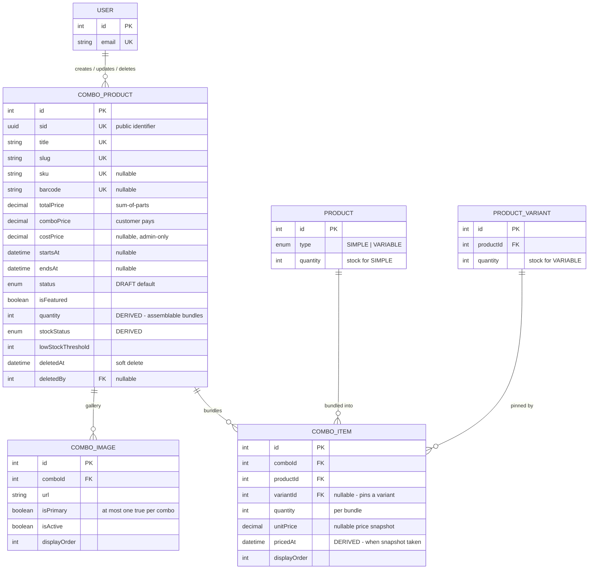

# Combo Product Module

A combo bundles existing products/variants together at a special price for a limited time window.
Kept separate from the `Product` model because the lifecycle, pricing, and content fields differ.

Schema source: `prisma/schema/combo-product.prisma` (models `ComboProduct`, `ComboItem`, `ComboImage`).

> **Scope note:** `Product`, `ProductVariant`, and `User` are documented in their own references — they appear here only as foreign-key targets needed to understand the combo relationships.

---

### DB Schema

#### Entity-Relationship Diagram (ERD)



**Cardinality legend:** `||--o{` = one-to-many. `ComboItem` is the join entity between a combo and the catalog — a combo has many items, and one product/variant can appear in many combos.

---

#### Enum Definitions

##### `CategoryProductStatus` (shared with `Category`/`Product`, defined in `shared.prisma`)

| Value      | Meaning                                                                    |
| :--------- | :------------------------------------------------------------------------- |
| `ACTIVE`   | Live and visible on the storefront (subject to the `publishedAt` gate).    |
| `INACTIVE` | Temporarily hidden, but not archived — can be reactivated freely.          |
| `DRAFT`    | Being authored, never shown publicly. **Default for a new combo.**         |
| `ARCHIVED` | Retired promotion. Convention: pair with `deletedAt` on soft delete.       |
| `HIDDEN`   | Exists and purchasable via direct link, but excluded from listings/search. |

> Unlike `Product` (defaults to `ACTIVE`), a combo defaults to `DRAFT` and must be **explicitly published**. `ComboProductService` only stamps `publishedAt` when the admin explicitly chose `ACTIVE` at create time.

##### `StockStatus` (shared with `Product`/`ProductVariant`, defined in `product.prisma`)

| Value          | Meaning                                                |
| :------------- | :----------------------------------------------------- |
| `IN_STOCK`     | Assemblable bundle count is above `lowStockThreshold`. |
| `LOW_STOCK`    | Between 1 and `lowStockThreshold` inclusive.           |
| `OUT_OF_STOCK` | Zero assemblable bundles. Default on creation.         |

> For a combo these describe **bundles**, not units of any one product. See [Availability Model](#availability-model-the-bottleneck-rule).

---

#### Data Dictionary — ComboProduct

**Table purpose:** the top-level bundle entity — a curated set of existing products/variants sold together at a special price for a limited time window. Kept as its own model rather than reusing `Product` because the lifecycle, the pricing shape (two prices, not one + discount), and the promotional window don't fit the single-product model. Maps to table `combo_products`.

| Field               | Type                          | Constraints                                                                       | Description                                                                                                                                                                                     |
| :------------------ | :---------------------------- | :-------------------------------------------------------------------------------- | :---------------------------------------------------------------------------------------------------------------------------------------------------------------------------------------------- |
| `id`                | `INT`                         | PK, AUTOINCREMENT                                                                 | Internal numeric key; FK joins only, never exposed externally.                                                                                                                                  |
| `sid`               | `UUID`                        | UNIQUE, NOT NULL, DEFAULT `uuid()`                                                | Public-facing identifier. Prevents ID enumeration/scraping.                                                                                                                                     |
| `title`             | `VARCHAR(255)`                | UNIQUE, NOT NULL                                                                  | English display title.                                                                                                                                                                          |
| `slug`              | `VARCHAR(255)`                | UNIQUE, NOT NULL                                                                  | URL-safe identifier — primary lookup key for the combo detail page.                                                                                                                             |
| `sku`               | `VARCHAR(100)`                | UNIQUE, NULLABLE                                                                  | SKU of the **bundle itself**, not derived from its items' SKUs. Ops/accounting/ERP identify a combo by this.                                                                                    |
| `barcode`           | `VARCHAR(100)`                | UNIQUE, NULLABLE                                                                  | EAN/UPC barcode for POS/warehouse scanning.                                                                                                                                                     |
| `description`       | `TEXT`                        | NULLABLE                                                                          | Long-form English description.                                                                                                                                                                  |
| `shortDescription`  | `VARCHAR(500)`                | NULLABLE, `@map("short_description")`                                             | Truncated summary for cards/listings.                                                                                                                                                           |
| `titleTh`           | `VARCHAR(255)`                | NULLABLE, `@map("title_th")`                                                      | Thai display title.                                                                                                                                                                             |
| `shortDescTh`       | `VARCHAR(500)`                | NULLABLE, `@map("short_desc_th")`                                                 | Thai summary.                                                                                                                                                                                   |
| `descriptionTh`     | `TEXT`                        | NULLABLE, `@map("description_th")`                                                | Thai long-form description.                                                                                                                                                                     |
| `totalPrice`        | `DECIMAL(12,2)`               | NOT NULL, DEFAULT `0`, `@map("total_price")`, `CHECK >= 0`                        | Sum-of-parts display price, computed by the service from the bundled items. Show struck-through against `comboPrice`.                                                                           |
| `comboPrice`        | `DECIMAL(12,2)`               | NOT NULL, DEFAULT `0`, `@map("combo_price")`, `CHECK >= 0`, `CHECK <= totalPrice` | The actual bundle price the customer pays.                                                                                                                                                      |
| `costPrice`         | `DECIMAL(12,2)`               | NULLABLE, `@map("cost_price")`, `CHECK NULL OR >= 0`                              | Landed cost of the bundle for margin reporting. **Entered, not summed** from items — a bundle carries its own packaging/assembly cost. Admin-only; never expose publicly.                       |
| `startsAt`          | `TIMESTAMPTZ(3)`              | NULLABLE, `@map("starts_at")`                                                     | Promotion window start. `null` = no start restriction.                                                                                                                                          |
| `endsAt`            | `TIMESTAMPTZ(3)`              | NULLABLE, `@map("ends_at")`, `CHECK` window valid                                 | Promotion window end. `null` = no end restriction.                                                                                                                                              |
| `status`            | `ENUM(CategoryProductStatus)` | NOT NULL, DEFAULT `DRAFT`                                                         | Lifecycle/visibility state.                                                                                                                                                                     |
| `isFeatured`        | `BOOLEAN`                     | NOT NULL, DEFAULT `false`, `@map("is_featured")`                                  | Drives homepage/featured combo sections.                                                                                                                                                        |
| `quantity`          | `INT`                         | NOT NULL, DEFAULT `0`, `CHECK >= 0`                                               | **Fully derived, never client input.** How many complete bundles current stock can assemble — a `MIN` over items, not a sum. See [Availability Model](#availability-model-the-bottleneck-rule). |
| `stockStatus`       | `ENUM(StockStatus)`           | NOT NULL, DEFAULT `OUT_OF_STOCK`, `@map("stock_status")`                          | **Fully derived** from `quantity` vs `lowStockThreshold`.                                                                                                                                       |
| `lowStockThreshold` | `INT`                         | NOT NULL, DEFAULT `10`, `@map("low_stock_threshold")`                             | Bundle count at or below which `stockStatus` reports `LOW_STOCK`, down to 1.                                                                                                                    |
| `seoMetadata`       | `JSONB`                       | DEFAULT `{}`, `@map("seo_metadata")`                                              | `metaTitle`/`metaDescription` (EN + TH) — same convention as `Product.seoMetadata`.                                                                                                             |
| `createdAt`         | `TIMESTAMPTZ(3)`              | NOT NULL, DEFAULT `now()`, `@map("created_at")`                                   | Row creation time.                                                                                                                                                                              |
| `updatedAt`         | `TIMESTAMPTZ(3)`              | NOT NULL, auto-updated, `@map("updated_at")`                                      | Last modification time.                                                                                                                                                                         |
| `deletedAt`         | `TIMESTAMPTZ(3)`              | NULLABLE, `@map("deleted_at")`                                                    | **Soft-delete marker.** Row is never physically deleted in normal operation.                                                                                                                    |
| `publishedAt`       | `TIMESTAMPTZ(3)`              | NULLABLE, `@map("published_at")`                                                  | Scheduled-publish gate, same convention as `Product.publishedAt`.                                                                                                                               |
| `createdBy`         | `INT`                         | FK → `users.id`, NULLABLE, **ON DELETE SET NULL**, `@map("created_by")`           | Actor who created the row.                                                                                                                                                                      |
| `updatedBy`         | `INT`                         | FK → `users.id`, NULLABLE, **ON DELETE SET NULL**, `@map("updated_by")`           | Actor who last modified the row.                                                                                                                                                                |
| `deletedBy`         | `INT`                         | FK → `users.id`, NULLABLE, **ON DELETE SET NULL**, `@map("deleted_by")`           | Actor who soft-deleted the row — the audit field you most want during an incident.                                                                                                              |

---

#### Data Dictionary — ComboItem

**Table purpose:** the join entity between a `ComboProduct` and the `Product` (optionally pinned to one `ProductVariant`) it bundles, carrying a per-bundle quantity and a price snapshot. Maps to table `combo_items`.

| Field          | Type             | Constraints                                                                        | Description                                                                                                                                                                                            |
| :------------- | :--------------- | :--------------------------------------------------------------------------------- | :----------------------------------------------------------------------------------------------------------------------------------------------------------------------------------------------------- |
| `id`           | `INT`            | PK, AUTOINCREMENT                                                                  | Internal key.                                                                                                                                                                                          |
| `comboId`      | `INT`            | FK → `combo_products.id`, NOT NULL, **ON DELETE CASCADE**, `@map("combo_id")`      | Owning combo. Deleting a combo removes its item rows.                                                                                                                                                  |
| `productId`    | `INT`            | FK → `products.id`, NOT NULL, **ON DELETE RESTRICT**, `@map("product_id")`         | Bundled product. `RESTRICT` prevents deleting a product that is still bundled.                                                                                                                         |
| `variantId`    | `INT`            | FK → `product_variants.id`, NULLABLE, **ON DELETE RESTRICT**, `@map("variant_id")` | Pins the item to a specific size/variant. `RESTRICT`, not `SET NULL`: nulling it would silently rewrite "Product A / 500ml" into "Product A / generic".                                                |
| `quantity`     | `INT`            | NOT NULL, DEFAULT `1`, `CHECK > 0`                                                 | How many units of this product/variant are included **per combo purchase**. Strictly positive — a 0-quantity item is a row that should not exist, and would make the availability divisor meaningless. |
| `unitPrice`    | `DECIMAL(12,2)`  | NULLABLE, `@map("unit_price")`, `CHECK NULL OR >= 0`                               | Snapshot of the unit price at bundling time — protects historical combo pricing from later product price changes.                                                                                      |
| `pricedAt`     | `TIMESTAMPTZ(3)` | NULLABLE, `@map("priced_at")`                                                      | **Fully derived, never client input.** When `unitPrice` was captured. `NULL` exactly when `unitPrice` is. See [Price Snapshot Dating](#price-snapshot-dating).                                         |
| `displayOrder` | `INT`            | NOT NULL, DEFAULT `0`, `@map("display_order")`                                     | Manual sort position within the combo's item list.                                                                                                                                                     |

**Uniqueness:** `@@unique([comboId, productId, variantId])` covers **pinned rows only**. Postgres treats every `NULL` as distinct in a unique index, so unpinned rows (`variantId IS NULL`) are guarded by the partial unique index `combo_items_unique_without_variant`. See [Bundling Rules](#bundling-rules).

---

#### Data Dictionary — ComboImage

**Table purpose:** combo-specific gallery imagery, mirroring `ProductImage`'s structure but scoped to a combo instead of a product/variant. Maps to table `combo_images`.

| Field          | Type           | Constraints                                                                   | Description                                                                                                                          |
| :------------- | :------------- | :---------------------------------------------------------------------------- | :----------------------------------------------------------------------------------------------------------------------------------- |
| `id`           | `INT`          | PK, AUTOINCREMENT                                                             | Internal key.                                                                                                                        |
| `url`          | `VARCHAR(512)` | NOT NULL                                                                      | Full-size image URL.                                                                                                                 |
| `thumbnailUrl` | `VARCHAR(512)` | NULLABLE, `@map("thumbnail_url")`                                             | Pre-resized thumbnail variant.                                                                                                       |
| `bannerUrl`    | `VARCHAR(512)` | NULLABLE, `@map("banner_url")`                                                | Pre-resized banner/hero variant.                                                                                                     |
| `iconUrl`      | `VARCHAR(512)` | NULLABLE, `@map("icon_url")`                                                  | Pre-resized icon variant.                                                                                                            |
| `altText`      | `TEXT`         | NULLABLE, `@map("alt_text")`                                                  | Accessibility / SEO alt text.                                                                                                        |
| `displayOrder` | `INT`          | NOT NULL, DEFAULT `0`, `@map("display_order")`                                | Sort order within the combo's gallery.                                                                                               |
| `isPrimary`    | `BOOLEAN`      | NOT NULL, DEFAULT `false`, `@map("is_primary")`                               | Marks the hero/cover image. At most one `true` per combo, enforced by the partial unique index `combo_images_one_primary_per_combo`. |
| `isActive`     | `BOOLEAN`      | NOT NULL, DEFAULT `true`, `@map("is_active")`                                 | Soft-hide an image without deleting it.                                                                                              |
| `comboId`      | `INT`          | FK → `combo_products.id`, NOT NULL, **ON DELETE CASCADE**, `@map("combo_id")` | Owning combo.                                                                                                                        |

> **Swapping the primary image takes two statements.** A unique index is not deferrable, so a single `UPDATE` that demotes one row and promotes another can transiently collide mid-statement. Demote all (`UPDATE ... SET is_primary = false WHERE combo_id = $1`), then promote one — the same pattern `ProductRepository.reorderImages` already uses.

---

#### Availability Model (The Bottleneck Rule)

A combo is sellable only if **every** item has enough stock, so the bundle is capped by its scarcest part:

```
combo.quantity = MIN over items of  floor(item stock / item per-bundle quantity)
```

This is a **`MIN`, not a `SUM`** — the opposite of `Product.totalStock`. Pattern-matching on the product roll-up will get this backwards.

| Scenario                                               | Result                                           |
| :----------------------------------------------------- | :----------------------------------------------- |
| 50 Face Washes + 7 Moisturizers, combo needs 1 of each | `MIN(50, 7)` = **7** bundles                     |
| 10 units in stock, combo needs 3 per bundle            | `floor(10/3)` = **3** bundles (leftover ignored) |
| Any single item at 0 stock                             | **0** bundles → `OUT_OF_STOCK`                   |
| Combo with no items                                    | **0** bundles → `OUT_OF_STOCK`                   |

**Item stock source:** a pinned row reads `product_variants.quantity`; an unpinned row reads `products.quantity`. That is only correct because the [Bundling Rules](#bundling-rules) guarantee unpinned ⇒ `SIMPLE`. **If that type rule is ever relaxed, this formula breaks** — an unpinned `VARIABLE` product would read `products.quantity`, which is `0` for variable products.

The rule is written down in two places that must stay in sync:

| Where                                            | Role                                                                                                                                            |
| :----------------------------------------------- | :---------------------------------------------------------------------------------------------------------------------------------------------- |
| `recompute_combo_quantity(int[])` (SQL function) | **Authoritative** once rows exist. Every trigger funnels into it, so the formula lives once.                                                    |
| `ComboProductService.resolveComboAvailability`   | Mirror, used only at create time — the trigger fires after the `combo_items` rows land, which is after the `combo_products` row Prisma returns. |

##### Trigger fan-in

| Trigger                                | Table              | Fires on                                                                             |
| :------------------------------------- | :----------------- | :----------------------------------------------------------------------------------- |
| `trg_sync_combo_stock_status`          | `combo_products`   | `BEFORE INSERT OR UPDATE OF quantity, low_stock_threshold` — derives `stock_status`. |
| `trg_sync_combo_quantity_from_items`   | `combo_items`      | `AFTER INSERT OR DELETE OR UPDATE OF quantity, product_id, variant_id, combo_id`     |
| `trg_sync_combo_quantity_from_product` | `products`         | `AFTER UPDATE OF quantity` — recomputes every combo holding it unpinned.             |
| `trg_sync_combo_quantity_from_variant` | `product_variants` | `AFTER UPDATE OF quantity` — recomputes every combo that pinned it.                  |

The `OF <columns>` lists keep these off the hot path: a price edit or a rename never fires them. Because `trg_sync_combo_stock_status` is `BEFORE`-row, the `UPDATE` issued by `recompute_combo_quantity` derives `stock_status` in the same pass — no second statement anywhere.

> **Event-driven, not lazy.** Nothing recomputes at read time; the value is written the moment stock or items change. A stock change made outside those `OF` column lists would not propagate.

---

#### Bundling Rules

Three rules govern what may be bundled:

1. **`VARIABLE` product ⇒ a variant must be pinned.**
2. **`SIMPLE` product ⇒ no variant may be pinned.**
3. **A combo with exactly one `items` row must bundle more than 1 unit of it** (`quantity > 1`, an omitted `quantity` counting as 1) — a single product at `quantity: 1` is just that product repackaged as a "combo" for no reason, not an actual bundle. Two or more rows already make a genuine bundle regardless of each row's own `quantity`.

Rules 1–2 need the product/variant rows loaded from the DB, so they're enforced in `ComboProductService.resolveComboItems`. Rule 3 is computable from the payload alone, so it's a DTO-level validator instead — `IsSingleItemQuantitySufficient` on both `CreateComboProductDto.items` and `UpdateComboProductDto.items` (`dto/single-item-quantity.validator.ts`).

A variant-level and a product-level row for the same product are each valid alone but ambiguous together, and no unique index can express a cross-row rule — so the constraint is pinned to the product's `type` instead. That also guarantees every row of one product sits on the same side of the `variant_id IS NULL` split the two unique indexes are built around.

A combo may legitimately contain:

- multiple `SIMPLE` products,
- a mix of `SIMPLE` and `VARIABLE` products,
- **the same `VARIABLE` product more than once, pinned to different variants** — which is why `@@unique([comboId, productId])` would be wrong.

---

#### Price Snapshot Dating

`unitPrice` is the price captured at bundling time. `pricedAt` records **when** — without it, a price dispute cannot tell a two-day-old snapshot from a two-year-old one.

`pricedAt` is deliberately **not** `updatedAt`: `updatedAt` moves on any column change, so a `displayOrder` reshuffle or a quantity edit would reset it and destroy the fact being recorded. The trigger `trg_sync_combo_item_priced_at` (`BEFORE INSERT OR UPDATE OF unit_price`) stamps it if and only if `unit_price` actually changes value:

| Action                             | `pricedAt`                           |
| :--------------------------------- | :----------------------------------- |
| INSERT with a price                | stamped `now()`                      |
| INSERT with `unitPrice = NULL`     | `NULL`                               |
| `displayOrder` / `quantity` edit   | unchanged                            |
| Same price written back            | unchanged (`IS DISTINCT FROM` guard) |
| Price actually changes             | re-stamped `now()`                   |
| Price cleared to `NULL`            | set to `NULL`                        |
| Client supplies its own `pricedAt` | overwritten                          |

> `now()` is **transaction** time, so several re-prices inside one transaction share a timestamp — consistent with `createdAt`/`updatedAt` semantics everywhere else in this schema.

---

#### Relationships and Cascading Rules

| Parent → Child                                                | FK Column             | On Delete    | Effect                                                                                                 |
| :------------------------------------------------------------ | :-------------------- | :----------- | :----------------------------------------------------------------------------------------------------- |
| `ComboProduct` → `ComboItem`                                  | `ComboItem.comboId`   | **CASCADE**  | Deleting a combo removes its item rows.                                                                |
| `ComboProduct` → `ComboImage`                                 | `ComboImage.comboId`  | **CASCADE**  | Deleting a combo removes its gallery rows (physical files are cleaned up by the service, best-effort). |
| `Product` → `ComboItem`                                       | `ComboItem.productId` | **RESTRICT** | A product bundled into any combo cannot be deleted.                                                    |
| `ProductVariant` → `ComboItem`                                | `ComboItem.variantId` | **RESTRICT** | A pinned variant cannot be deleted while a combo references it.                                        |
| `User` → `ComboProduct` (`createdBy`/`updatedBy`/`deletedBy`) | `ComboProduct.*By`    | **SET NULL** | Deleting a staff account preserves the combo; the audit pointer goes null.                             |

**Practical implications:**

- `ProductVariant → ComboItem` being `RESTRICT` means a normal product edit that removes a bundled variant will fail. `ProductService.assertVariantsNotBundled` runs before the update transaction and returns a `409` naming the blocking combo, instead of surfacing a raw `P2003`.
- `deletedAt`/`deletedBy` are declared and read by the admin list's soft-delete filter, but no route writes them yet — see [Known Gaps](#known-gaps--recommended-hardening). The only delete path live today is the [hard delete](#delete-a-combo-product) (`DELETE /delete/:id`), which the repository's `deleteComboProduct` also serves as the rollback path for a create that failed after the row was written.

---

#### Indexes & Constraints

##### Indexes

| Index                                            | Table            | Type                        | Purpose                                                                                                                                       |
| :----------------------------------------------- | :--------------- | :-------------------------- | :-------------------------------------------------------------------------------------------------------------------------------------------- |
| `sid`, `title`, `slug`, `sku`, `barcode`         | `combo_products` | B-Tree (unique)             | Identity lookups; one unique index per column, created automatically.                                                                         |
| `combo_products_live_idx`                        | `combo_products` | B-Tree (**partial**)        | `(status, is_featured, starts_at, ends_at) WHERE deleted_at IS NULL` — the storefront listing predicate. Equality columns lead, ranges trail. |
| `combo_items_combo_id_product_id_variant_id_key` | `combo_items`    | B-Tree (unique)             | Prevents duplicate **pinned** rows per `(combo, product, variant)`.                                                                           |
| `combo_items_unique_without_variant`             | `combo_items`    | B-Tree (**partial** unique) | `(combo_id, product_id) WHERE variant_id IS NULL` — closes the NULL half the constraint above cannot cover.                                   |
| `combo_items_product_id_idx`                     | `combo_items`    | B-Tree                      | FK lookup; also serves the product→combo trigger fan-in.                                                                                      |
| `combo_items_variant_id_idx`                     | `combo_items`    | B-Tree                      | FK lookup; also serves the variant→combo trigger fan-in.                                                                                      |
| `combo_images_one_primary_per_combo`             | `combo_images`   | B-Tree (**partial** unique) | `(combo_id) WHERE is_primary = true` — at most one cover image per combo.                                                                     |
| `combo_images_combo_id_is_primary_idx`           | `combo_images`   | B-Tree (composite)          | Fetching a combo's cover image without scanning the whole gallery.                                                                            |

> **`ComboProduct` declares no `@@index` in the Prisma schema on purpose.** Prisma's DSL cannot express a filtered (`WHERE`) index, so `combo_products_live_idx` is hand-written in a migration. A former `@@index([slug])` was dropped as pure write amplification — `slug @unique` already creates a B-Tree.

##### Check constraints

| Constraint                                | Rule                                                          |
| :---------------------------------------- | :------------------------------------------------------------ |
| `combo_items_quantity_positive`           | `quantity > 0`                                                |
| `combo_items_unit_price_non_negative`     | `unit_price IS NULL OR unit_price >= 0`                       |
| `combo_products_total_price_non_negative` | `total_price >= 0`                                            |
| `combo_products_combo_price_non_negative` | `combo_price >= 0`                                            |
| `combo_products_price_valid`              | `combo_price <= total_price`                                  |
| `combo_products_cost_price_non_negative`  | `cost_price IS NULL OR cost_price >= 0`                       |
| `combo_products_quantity_non_negative`    | `quantity >= 0`                                               |
| `combo_products_window_valid`             | `starts_at IS NULL OR ends_at IS NULL OR ends_at > starts_at` |

`combo_products_price_valid` is the DB backstop for the service rule _"Combo price cannot be greater than the sum of its bundled items."_ Note the consequence for any future update endpoint: `comboPrice` and `totalPrice` must be written in the **same statement**, since lowering `totalPrice` first would trip the constraint.

---

#### Conventions

- **All `DateTime` columns are `@db.Timestamptz(3)`.** Prisma's default mapping is timezone-naive, and comparing a naive column against SQL `now()` casts through the _server's_ `TimeZone` setting — so a promotion set to end at "midnight" would end at a different real instant depending on where the query runs. Any new `DateTime` field must carry `@db.Timestamptz(3)`.
- **All columns are `snake_case`** via `@map()`. Prisma field names stay camelCase; only the database identifiers are mapped.
- **Derived columns are never client input.** `quantity`, `stockStatus` (combo) and `pricedAt` (item) are written by triggers; DTOs deliberately expose no field for them.
- **`costPrice` and `barcode` are admin-only**; `sku` is public (customers quote it in support tickets), matching the `Product` visibility tiers.

---

#### Example Data

**ComboProduct**

| title                       | status     | sku           | totalPrice | comboPrice | quantity | stockStatus    | startsAt               | endsAt                 | isFeatured |
| :-------------------------- | :--------- | :------------ | :--------- | :--------- | :------- | :------------- | :--------------------- | :--------------------- | :--------- |
| **Wellness Starter Bundle** | `ACTIVE`   | `CMB-WELL-01` | `1850.00`  | `1499.00`  | `7`      | `LOW_STOCK`    | `2026-07-01T00:00:00Z` | `2026-07-31T23:59:59Z` | `true`     |
| **Immune Boost Duo**        | `DRAFT`    | `null`        | `620.00`   | `499.00`   | `0`      | `OUT_OF_STOCK` | `null`                 | `null`                 | `false`    |
| **Back-to-School Kit**      | `ARCHIVED` | `CMB-BTS-26`  | `990.00`   | `799.00`   | `0`      | `OUT_OF_STOCK` | `2026-05-01T00:00:00Z` | `2026-05-31T23:59:59Z` | `false`    |

**ComboItem** (for `Wellness Starter Bundle`, `comboId = 1`)

| productId | variantId | quantity | unitPrice | pricedAt               | displayOrder | note                       |
| :-------- | :-------- | :------- | :-------- | :--------------------- | :----------- | :------------------------- |
| `12`      | `null`    | `1`      | `450.00`  | `2026-07-01T09:12:00Z` | `0`          | `SIMPLE` product, unpinned |
| `27`      | `104`     | `2`      | `700.00`  | `2026-07-01T09:12:00Z` | `1`          | `VARIABLE` product, pinned |

> With stock of 50 for product `12` and 14 for variant `104`, the combo's `quantity` is `MIN(floor(50/1), floor(14/2))` = `MIN(50, 7)` = **7**.

---

#### Known Gaps / Recommended Hardening

- **Soft delete squats unique identifiers.** `title`, `slug`, `sku`, and `barcode` are unconditionally unique, so once soft delete exists for combos, a retired "Songkran Bundle 2026" reserves those values forever. The fix is partial unique indexes scoped to `WHERE deleted_at IS NULL` — which costs three `findUnique` → `findFirst` swaps in the repository. `Product` has the identical issue, live today.
- **No `softDeleteCombo` exists yet.** `deletedAt`/`deletedBy` are declared and the storefront read already filters `deletedAt: null`, but no write path sets them.
- **"At least one primary image" is not enforced.** The partial unique index only constrains "at most one". The service covers it by flagging the first uploaded image; a future delete-image path must promote a survivor, as `Product` does via `hasSurvivingPrimaryImage`.
- **`lowStockThreshold` is not settable per combo.** The column defaults to `10` and the create DTO has no field for it.
- **`pricedAt` is not exposed through the API.** `COMBO_ITEM_SELECT` is shared by the admin and public response shapes, so surfacing it would leak an audit field to the storefront; it needs the select split into admin/public variants first.

---

### API End Point & Business Logic

Every endpoint below is served by `ComboProductController` → `ComboProductService` → `ComboProductRepository`. All routes are prefixed `/api/v1/combo` — **not** `/combo-product`; the route prefix matches the admin client's `COMBO_API` constants and the public-facing vocabulary, while the module/file names keep the `combo-product` prefix to mirror the Prisma model (`ComboProduct`), a different naming axis. For the DTO/Swagger contract see `src/modules/combo-product/dto/`; for the Prisma `select` shapes behind each read see `src/modules/combo-product/combo-product.select.ts`.

> **Scope note:** these six routes are the module's *entire* HTTP surface today — `ComboProductController` declares no others. The service/repository layer still has a little more capability than is wired to a route (a home-section listing). See [Built but Not Yet Exposed](#built-but-not-yet-exposed).

#### Endpoint Overview

| Method   | Path                | Access   | Purpose                                             |
| :------- | :------------------- | :------- | :--------------------------------------------------- |
| `GET`    | `/all-combo`         | `ADMIN`  | [Paginated admin table, all statuses](#get-all-combos-admin) |
| `GET`    | `/published-combos`  | Public   | [Paginated storefront combo listing](#get-published-combos-public) |
| `GET`    | `/slug/:slug`        | Public   | [Storefront combo details by slug](#get-combo-details-by-slug-public) |
| `POST`   | `/create-combo`      | `ADMIN`  | [Bundle products/variants into a new combo](#create-a-combo-product) |
| `PATCH`  | `/update/:id`        | `ADMIN`  | [Partial update; `items` replaces the whole bundle](#update-a-combo-product) |
| `DELETE` | `/delete/:id`        | `ADMIN`  | [Permanently remove a combo](#delete-a-combo-product) |

Every route except `/published-combos` and `/slug/:slug` uses `JwtAuthGuard` + `RolesGuard` + `@Roles(UserRole.ADMIN)`.

---

#### Response Shapes & Select Projections

| Select                      | Fed to                        | Contains                                                                                                                                                                                    |
| :--------------------------- | :----------------------------- | :--------------------------------------------------------------------------------------------------------------------------------------------------------------------------------------- |
| `COMBO_PRODUCT_SELECT_ADMIN`  | `ComboProductResponseDto`     | Everything: raw workflow `status`, `barcode`, `costPrice`, exact `quantity`/`offeredQuantity`, soft-delete state, and the full `createdByUser`/`updatedByUser`/`deletedByUser` audit trail. **Never reuse on an unauthenticated route.** Every read/write endpoint on this page uses this select (the delete route returns no body). |
| `COMBO_PRODUCT_SELECT_PUBLIC` | `ComboProductResponsePublicDto` | No `status`, no `barcode`/`costPrice`, no raw `quantity` (`stockStatus` only), no audit trail. Fed by [`GET /published-combos`](#get-published-combos-public) and [`GET /slug/:slug`](#get-combo-details-by-slug-public). |
| `COMBO_ITEM_SELECT`           | `ComboItemResponseDto`        | Same shape for every role — no sensitive fields. Nests `COMBO_ITEM_PRODUCT_SELECT`/`COMBO_ITEM_VARIANT_SELECT` (name/slug/price, not cost/quantity internals).                             |
| `COMBO_IMAGE_SELECT`          | `ComboImageResponseDto`       | Same shape for every role — no sensitive fields.                                                                                                                                            |

**Image URLs**, same convention as `product`: `ComboImage.url`/`thumbnailUrl`/`bannerUrl`/`iconUrl` are stored as relative paths and prefixed with `ConfigService.get('app.baseUrl')` at response time. A value already starting with `http` is left untouched.

---

#### Get All Combos (Admin)

**`GET /api/v1/combo/all-combo`**

**Purpose**: Management-dashboard combo table — paginated, searchable, filterable, sortable.

**Access**: `JwtAuthGuard` + `RolesGuard` + `@Roles(UserRole.ADMIN)`.

| Layer      | What happens                                                                                                                                            |
| :--------- | :--------------------------------------------------------------------------------------------------------------------------------------------------------- |
| Controller | `getAllCombos(query)` — binds `AllCombosQueryDto`; no other logic.                                                                                       |
| Service    | `getAllCombos(query)` — splits `status`/`stockStatus`/`isFeatured`/`sortBy` off the shared pagination params (so `PaginationService` never sees filter keys), calls the repository, wraps each row in `ComboProductResponseDto`. |
| Repository | `findAllCombosAdmin(params, filters)` — `AND`-composed `where` (`deletedAt: null` plus any of the three optional filters), `PaginationService.paginate()` with `searchableFields: ['title', 'titleTh', 'slug', 'sku', 'barcode']`. |

**Business logic:**

1. **`AllCombosQueryDto` extends the shared `PaginationQueryDto`** (`page`, `limit`, `sortOrder`, `search`, `cursor`) with three admin-only filters — `status`, `stockStatus`, `isFeatured` — plus `sortBy`, whitelisted against `COMBO_SORT_FIELDS` (`createdAt`, `updatedAt`, `title`, `comboPrice`, `totalPrice`, `quantity`, `startsAt`, `endsAt`) via `@IsIn`. **This whitelist is a hard security boundary, not documentation**: the value is interpolated directly into a Prisma `orderBy` key, so only columns validated here may ever reach it. Note `quantity` here sorts by the *derived* assemblable-bundle count, not `offeredQuantity` — sorting by what is actually sellable is what an admin scanning for problems wants.
2. **No visibility filtering beyond soft-delete.** Unlike the (unexposed) public list, none of `DRAFT`/`ACTIVE`/`INACTIVE`/`ARCHIVED`/`HIDDEN` are excluded — a management dashboard needs to see everything a customer cannot. Only `deletedAt IS NOT NULL` rows are always excluded, same rationale as `ProductRepository.findAllProductsAdmin`.
3. **Filters are additive and all optional.** `status`/`stockStatus` are plain equality when present. `isFeatured` uses an explicit `!== undefined` check, not truthiness — `isFeatured=false` is a real filter ("show me the non-featured ones"), not an absent one. All three are `AND`-composed with the base `deletedAt: null` gate (never spread-merged), so a filter key can only narrow the result, never accidentally resurrect a deleted row.
4. **Search** — matches `title`, `titleTh`, `slug`, `sku`, `barcode`. Unlike the product module, `sku`/`barcode` are searchable here even though this is the admin-only list (an admin pastes them straight off a support ticket or packing slip).
5. **Sorting/pagination** — offset (`page`/`limit`) or cursor-based; sort column from `sortBy` (default `createdAt`), direction from `sortOrder` (default `desc`).
6. **Response mapping** — every row wrapped in `new ComboProductResponseDto(combo, baseUrl)`: full admin shape, including `costPrice`, exact `quantity`/`offeredQuantity`, and the complete audit trail.

**Response shape**: `{ data: ComboProductResponseDto[], meta: IPaginationMeta }`.

| Status | Cause                                                             |
| :----- | :------------------------------------------------------------------ |
| `200`  | Always — an empty `data` array is a valid response, not a `404`. |
| `400`  | Invalid pagination, filter, or `sortBy` value.                    |
| `401`  | Missing/invalid JWT.                                              |
| `403`  | Authenticated but not `ADMIN`.                                    |

---

#### Get Published Combos (Public)

**`GET /api/v1/combo/published-combos`**

**Purpose**: Storefront combo listing — paginated and sortable. Backs the `/product` page's "Combo" type filter (which redirects here, since `Product.type` has no `COMBO` value — see below) and the home page's "Combo Deals" section's "View all" button.

**Access**: None — no guard, no role check.

| Layer      | What happens                                                                                                                                            |
| :--------- | :--------------------------------------------------------------------------------------------------------------------------------------------------------- |
| Controller | `getPublishedCombos(query)` — binds `PublishedCombosQueryDto`; no other logic.                                                                            |
| Service    | `getPublishedCombos(query)` — splits `isFeatured`/`sortBy` off the shared pagination params, calls the repository, wraps each row in `ComboProductResponsePublicDto`. |
| Repository | `findPublishedCombos(params, filters)` — `AND`-composes `publicVisibilityWhere()` with the optional `isFeatured` filter, `PaginationService.paginate()` with `searchableFields: ['title', 'titleTh', 'slug']`. |

**Business logic:**

1. **`PublishedCombosQueryDto` extends the shared `PaginationQueryDto`** (`page`, `limit`, `sortOrder`, `search`, `cursor`) with one storefront-safe filter, `isFeatured` (boolean, same `parseBooleanInput` transform as the admin DTO), plus `sortBy`, whitelisted against `PUBLIC_COMBO_SORT_FIELDS` (`createdAt`, `comboPrice`, `title`) via `@IsIn`. **This whitelist is a hard security boundary**, same contract as `COMBO_SORT_FIELDS` for the admin list. It is deliberately narrower than the admin whitelist: `quantity`/`updatedAt`/`startsAt`/`endsAt` are admin concerns with no storefront meaning, and `totalPrice` is the pre-discount sum, not what a customer sorting "by price" wants — `comboPrice` is the price they actually pay.
2. **Visibility is not a query param.** Every row goes through `publicVisibilityWhere()` (`deletedAt: null`, `status: ACTIVE`, `publishedAt <= now()`) unconditionally — same gate as [`GET /slug/:slug`](#get-combo-details-by-slug-public). Unlike `getAllCombos`, there is no `status`/`stockStatus` filter that could be used to leak a non-visible row through.
3. **Search** — matches `title`, `titleTh`, `slug` only. Unlike the admin list, `sku`/`barcode` are **not** searchable here (an anonymous storefront visitor has no legitimate reason to probe by SKU).
4. **Sorting/pagination** — offset (`page`/`limit`) or cursor-based; sort column from `sortBy` (default `createdAt`), direction from `sortOrder` (default `desc`).
5. **Response mapping** — every row wrapped in `new ComboProductResponsePublicDto(combo, baseUrl)`: no `status`, no `barcode`/`costPrice`, no raw `quantity` (`stockStatus` only), no audit trail.
6. **Why the `/product` page's "Combo" filter redirects here instead of filtering in place**: `Product.type` was reduced to `SIMPLE`/`VARIABLE` only (migration `20260714200004_remove_combo_product_type`) — a combo was never a `Product` row to begin with, it is a separate `ComboProduct`/`ComboItem` bundle (see [Availability Model](#availability-model-the-bottleneck-rule)). `GET /product/active-products?productType=COMBO` is rejected with `400` by `@IsEnum(ProductType)`, since `COMBO` no longer exists in that enum. The client's product-type checkbox for "Combo" therefore navigates to the dedicated combo listing (backed by this endpoint) instead of setting a `productType` query param on the product page.

**Response shape**: `{ data: ComboProductResponsePublicDto[], meta: IPaginationMeta }`.

| Status | Cause                                                             |
| :----- | :------------------------------------------------------------------ |
| `200`  | Always — an empty `data` array is a valid response, not a `404`. |
| `400`  | Invalid pagination or `sortBy` value.                             |

---

#### Get Combo Details by Slug (Public)

**`GET /api/v1/combo/slug/:slug`**

**Purpose**: Storefront combo details page (the PDP-equivalent for combos) — the first public, unauthenticated route this module exposes.

**Access**: None — no guard, no role check.

| Layer      | What happens                                                                                                                                            |
| :--------- | :--------------------------------------------------------------------------------------------------------------------------------------------------------- |
| Controller | `getComboBySlug(slug)` — binds the route param; no other logic.                                                                                          |
| Service    | `getComboBySlug(slug)` — calls the repository, throws `NotFoundException` on a miss, wraps the row in `ComboProductResponsePublicDto`.                   |
| Repository | `findBySlugPublic(slug)` — `findFirst` `AND`-composing `{ slug }` with `publicVisibilityWhere()`, selecting `COMBO_PRODUCT_SELECT_PUBLIC`.               |

**Business logic:**

1. **Visibility gate — `publicVisibilityWhere()`**: `deletedAt: null` AND `status: ACTIVE` AND `publishedAt: { lte: now() }`. Unlike `ProductRepository.activeVisibilityWhere()`, `publishedAt` **is** part of the gate here — a combo defaults to `DRAFT` and must be explicitly published (see [Conventions](#conventions)), so an `ACTIVE` combo whose `publishedAt` is still in the future (a scheduled launch) is correctly invisible until that moment. A draft, archived, hidden, inactive, soft-deleted, or not-yet-published combo all resolve to the same `404` — the route never distinguishes "doesn't exist" from "not visible yet", same as `Product`'s public routes.
2. **`findFirst`, not `findUnique`**, because the lookup is no longer on `slug` alone — the visibility gate is `AND`-composed into the same `where`, exactly mirroring `ProductRepository.findBySlugPublic`.
3. **Response mapping** — `new ComboProductResponsePublicDto(combo, baseUrl)`: no `status`, no `barcode`/`costPrice`, no raw `quantity` (`stockStatus` only), no audit trail. See [Response Shapes & Select Projections](#response-shapes--select-projections).
4. **Same repository method backs the home-section listing.** `ComboProductRepository.findActiveCombosForHome` now shares `publicVisibilityWhere()` too, so a combo scheduled for a future `publishedAt` no longer leaks into the "Combo Deals" home section either — previously that query only checked `status: ACTIVE`, not `publishedAt`.

**Response shape**: `{ data: ComboProductResponsePublicDto }`.

| Status | Cause                                                                 |
| :----- | :--------------------------------------------------------------------- |
| `200`  | Combo found and publicly visible.                                    |
| `404`  | No combo with this slug, or it exists but isn't ACTIVE + published.  |

---

#### Create a Combo Product

**`POST /api/v1/combo/create-combo`**

**Purpose**: Bundle existing products/variants into a new, time-boxed combo offer at a special price, with an optional gallery of up to 10 images.

**Access**: `JwtAuthGuard` + `RolesGuard` + `@Roles(UserRole.ADMIN)`, `multipart/form-data` (images via the `images` field, up to 10, handled by `FilesInterceptor`).

| Layer      | What happens                                                                                                                                                     |
| :--------- | :-------------------------------------------------------------------------------------------------------------------------------------------------------------- |
| Controller | `createCombo(dto, images, req)` — reads the acting admin's id off `req.user.id` (`UnauthorizedException` if missing); no other logic.                            |
| Service    | `createComboProduct(userId, dto, images)` — uniqueness checks, `resolveComboItems`, price/quantity assertions, uploads images, builds the row, rolls back files on failure. |
| Repository | `findByTitle` / `findBySlugAdmin` / `findBySku` / `findByBarcode` (uniqueness) → `findProductsByIds` / `findVariantsByIds` (bundling validation) → `createComboProduct(data)` — one `comboProduct.create()` with nested `images`/`items`. |

**Business logic — in order:**

1. **Title uniqueness** — `findByTitle(dto.title)` → `409` if taken.
2. **Slug uniqueness** — `generateSlug(dto.title)`, then `findBySlugAdmin(slug)` → `409` (only reachable when two different titles happen to sanitize to the same slug, since `title` itself is already unique).
3. **SKU/barcode uniqueness**, only when supplied — `findBySku`/`findByBarcode` → `409` each. Checked up front so a clash returns a named `409` instead of a raw Prisma `P2002` from the insert, matching how `title`/`slug` are already handled.
4. **`resolveComboItems(dto.items)`** — the core bundling logic, shared verbatim with update. For each item:
   - The product must exist (`404` otherwise).
   - **Bundling Rule 1–2 enforced here**: a `VARIABLE` product requires `variantId` (`400`, names the product); a `SIMPLE` product must not receive one (`400`, names the product). See [Bundling Rules](#bundling-rules) for why this is pinned to the product's `type` rather than expressed as a unique index.
   - If `variantId` is given, the variant must exist (`404`) and must belong to the given `productId` (`400`).
   - **`unitPrice` price-snapshot resolution**: the client-supplied value wins; otherwise it falls back to the variant's (or product's, if unpinned) current `salePrice ?? basePrice` at bundling time — see [Price Snapshot Dating](#price-snapshot-dating).
   - **`sourceStock` for the availability calc**: an unpinned row is always a `SIMPLE` product (enforced above), so its own `quantity` is the limiting stock — *not* `totalStock`, which is the variant roll-up and is `0` for a `SIMPLE` product's parts. A pinned row reads the variant's own `quantity`.
   - The combo's `quantity` (how many bundles current stock can assemble) is then computed by `resolveComboAvailability` — `MIN` over items of `floor(sourceStock / max(item.quantity, 1))`, `0` for an empty set. See [Availability Model](#availability-model-the-bottleneck-rule) — **this app-side computation and the DB's `recompute_combo_quantity` function must stay in sync**; this one exists only because the DB trigger fires *after* the `combo_items` rows land, which is after this create's own response is built.
   - The item whose own `floor(stock/qty)` equals that overall minimum is recorded as `limitingItemName`, for use in the `offeredQuantity` error message below (falls back to the first item for a degenerate set).
5. **`assertOfferedQuantityFits(dto.offeredQuantity, quantity, limitingItemName)`** — if `offeredQuantity` is supplied and exceeds what stock can actually assemble, `400`, naming the scarce item (a distinct message when the ceiling is `0`: *"cannot be assembled at all right now"*). Skipped entirely when `offeredQuantity` is omitted.
6. **`totalPrice`** = `Σ (item.unitPrice × item.quantity)` over the resolved items — never client input.
7. **`assertComboPriceBelowParts(dto.comboPrice, totalPrice)`** — `comboPrice` must sit *strictly below* `totalPrice`; equality is rejected too (paying exactly the sum-of-parts is not an offer). A distinct message when `totalPrice <= 0` (*"bundled items have no value to discount"*). This is the strict authority; the DB's `combo_products_price_valid` check constraint is the looser `<=` backstop.
8. **Images are uploaded to disk *before* the DB write** (same reasoning as `product`) — the nested `images` create needs each file's final path. A failed upload rolls back whatever succeeded so far.
9. **One atomic `comboProduct.create()`** with nested `images: { createMany }` and `items: { createMany }`. `quantity`/`stockStatus`/`totalPrice` are written directly from the app-side computation above (not left to the DB trigger) so the create's own response is already correct.
10. **`status` defaults to `DRAFT`, unlike `Product` (defaults `ACTIVE`)** — a combo must be *explicitly* published. `publishedAt`: an explicit `dto.publishedAt` always wins (scheduled launch); otherwise stamped `now()` only when `dto.status === ACTIVE`; otherwise left unset.
11. **Rollback on DB failure**: if the create throws (e.g. a uniqueness race that slipped past the pre-checks in steps 1–3), every file uploaded in step 8 is deleted before the error propagates.

**Response shape**: `ComboProductResponseDto` (full admin detail, including `costPrice`, exact `quantity`/`offeredQuantity`, and the new `images`/`items` nested in).

| Status | Cause                                                                                                                                                                                          |
| :----- | :----------------------------------------------------------------------------------------------------------------------------------------------------------------------------------------------- |
| `201`  | Combo created successfully.                                                                                                                                                                    |
| `400`  | DTO validation failed (see `CreateComboProductDto`/`ComboItemDto` — e.g. `items` empty, over 50 entries, or a duplicate product/variant pair via `@IsUniqueComboItems`; a single-item combo at `quantity: 1` via `@IsSingleItemQuantitySufficient`); **or** a `SIMPLE`/`VARIABLE` variant-pin mismatch; **or** a variant that doesn't belong to its product; **or** `comboPrice` not strictly below `totalPrice`; **or** `offeredQuantity` exceeds what stock can assemble. |
| `401`  | Missing/invalid JWT.                                                                                                                                                                            |
| `403`  | Authenticated but not `ADMIN`.                                                                                                                                                                  |
| `404`  | A bundled `productId` or `variantId` does not exist.                                                                                                                                            |
| `409`  | A combo with this title (or the derived slug), SKU, or barcode already exists.                                                                                                                 |

---

#### Update a Combo Product

**`PATCH /api/v1/combo/update/:id`**

**Purpose**: Partial update — only the fields present in the payload are written. Sending `items` **replaces the entire bundle** (recomputing `totalPrice`/`quantity`/`stockStatus`); omitting it leaves the bundle untouched.

**Access**: `JwtAuthGuard` + `RolesGuard` + `@Roles(UserRole.ADMIN)`, `multipart/form-data` (new images via `images`, up to 10; `deleteImageIds` removes existing ones first).

| Layer      | What happens                                                                                                                                                                          |
| :--------- | :---------------------------------------------------------------------------------------------------------------------------------------------------------------------------------- |
| Controller | `updateCombo(id, dto, images, req)` — reads the acting admin's id off `req.user.id`; no other logic.                                                                                 |
| Service    | `updateComboProduct(id, userId, dto, images)` — existence check, conditional uniqueness re-checks, conditional `resolveComboItems`, image-id validation, uploads, one transaction, best-effort file cleanup. |
| Repository | `findByIdAdmin` → conditional `findByTitle`/`findBySlugAdmin`/`findBySku`/`findByBarcode` → `findComboImagesByIds` → (inside one transaction) `replaceComboItems` / `deleteComboImages` / `countPrimaryImages` / `findMaxImageDisplayOrder` / `createComboImages` / `updateComboProduct`. |

**Business logic — in order:**

1. **Existence check** — `findByIdAdmin(id)` → `404` if missing **or already soft-deleted** (`existing.deletedAt` set is treated the same as not found).
2. **Title change** (`dto.title !== existing.title`) regenerates the slug and re-checks **both** for conflicts, excluding the combo's own row (`conflict.id !== id`) — same two-step as create.
3. **SKU/barcode change** (only when the payload's value differs from the stored one) is independently re-checked for conflict, same self-exclusion.
4. **Items — conditional recompute.** `dto.items` omitted ⇒ the bundle is untouched: `totalPrice` and the assemblable ceiling are read from the *existing* row. `dto.items` present ⇒ `resolveComboItems` runs again (identical validation/pricing/availability logic as create, see steps 4–4's sub-bullets above), and its result supersedes the stored values for every check that follows.
5. **Price rule re-checked against whichever side actually moved**: `effectiveComboPrice = dto.comboPrice ?? existing.comboPrice`, compared against the (possibly just-recomputed) `totalPrice` via the same `assertComboPriceBelowParts`. A patch that only lowers `comboPrice` still compares against the *stored* `totalPrice`; a patch that only swaps `items` re-checks the *stored* `comboPrice`.
6. **`offeredQuantity` re-validated on every patch**, not only at create — `assertOfferedQuantityFits` runs against the (possibly new) ceiling, since the ceiling itself moves as stock and items change over the combo's lifetime.
7. **`deleteImageIds` scoped to this combo** — `findComboImagesByIds(id, ids)`; any id that doesn't actually belong to this combo fails the **whole** request with `400`, before any file is uploaded (a foreign image ID can't be deleted through another combo's payload).
8. **`lowStockThreshold`** falls back to the *existing stored* value when omitted (not the create-time default constant).
9. **Images uploaded to disk before the transaction** — same rollback discipline as create (delete whatever succeeded if the upload loop itself fails partway).
10. **Everything else runs inside one transaction** (`withTransaction`), so a failure part-way can never leave items swapped but prices stale, or the gallery half-updated:
    - **`replaceComboItems`** — delete-then-recreate the entire `combo_items` set for this combo, not a per-row merge (see the repository doc comment: two unique indexes plus the price-snapshot trigger make in-place reconciliation not worth it when the admin UI submits the bundle as one unit anyway).
    - **Image deletion happens before new-image creation** in the same request, so promoting a newly uploaded file to cover image is decided using the **post-deletion** primary count (`countPrimaryImages`) — a deletion that removes the current cover promotes the first new upload (`isPrimary: survivingPrimaries === 0 && index === 0`). New images append after the gallery's current max `displayOrder + 1` (`findMaxImageDisplayOrder`).
    - **`quantity`/`stockStatus` are only written when `items` actually changed** (`resolved ? … : undefined`) — Prisma skips an `undefined` key entirely, so an items-untouched patch leaves the trigger-maintained column exactly as it was rather than overwriting it from stale input.
11. **`publishedAt`**: an explicit `dto.publishedAt` always wins. Otherwise it's stamped `now()` **only** when this patch sets `status` to `ACTIVE` **and** the combo has never been published before (`!existing.publishedAt`) — a one-time backfill for a combo going live for the first time, not a re-stamp on every subsequent edit.
12. **File cleanup is split by which side of the transaction it's on**: images removed via `deleteImageIds` are unlinked from disk **after** the transaction commits (best-effort — a failed unlink must not roll back a committed edit); images uploaded in step 9 are deleted only if the transaction itself throws.

**Response shape**: `ComboProductResponseDto` (same full admin detail as create).

| Status | Cause                                                                                                                                                                                              |
| :----- | :---------------------------------------------------------------------------------------------------------------------------------------------------------------------------------------------------- |
| `200`  | Combo updated successfully.                                                                                                                                                                        |
| `400`  | DTO validation failed; **or** an image ID in `deleteImageIds` doesn't belong to this combo; **or** (when `items` is sent) the same bundling-rule/price/availability failures as create; **or** `comboPrice`/`offeredQuantity` fails its check against the current (or just-recomputed) `totalPrice`/ceiling. |
| `401`  | Missing/invalid JWT.                                                                                                                                                                                |
| `403`  | Authenticated but not `ADMIN`.                                                                                                                                                                      |
| `404`  | Combo doesn't exist (or is already soft-deleted); **or**, when `items` is sent, a bundled `productId`/`variantId` doesn't exist.                                                                    |
| `409`  | Another combo already uses the new title (or its derived slug), SKU, or barcode.                                                                                                                   |

---

#### Delete a Combo Product

**`DELETE /api/v1/combo/delete/:id`**

**Purpose**: Permanently removes a combo. This is the module's only delete route — there is still no soft-delete route (see [Known Gaps](#known-gaps--recommended-hardening)).

**Access**: `JwtAuthGuard` + `RolesGuard` + `@Roles(UserRole.ADMIN)`.

| Layer      | What happens                                                                                                      |
| :--------- | :------------------------------------------------------------------------------------------------------------------ |
| Controller | `deleteCombo(id)` — no other logic.                                                                                |
| Service    | `hardDeleteComboProduct(id)` — existence check, delete, best-effort file cleanup.                                  |
| Repository | `findComboImagePathsForDeletion(id)` → `deleteComboProduct(id)`.                                                   |

**Business logic — in order:**

1. **Existence check** — `findComboImagePathsForDeletion(id)` doubles as the gallery-path lookup for step 3 → `404` if the combo doesn't exist. Not soft-delete-aware, since no write path sets `deletedAt` on a combo yet.
2. **`comboProduct.delete()`** — one statement. `ON DELETE CASCADE` on `ComboItem.comboId` and `ComboImage.comboId` removes the bundle's item and gallery rows automatically; it does not touch the physical files.
3. **Gallery files unlinked best-effort, after the DB delete commits** — same rationale as `ProductService.hardDeleteProduct`: a failed unlink must not roll back a delete the DB has already committed.
4. **No `Product`/`ProductVariant` stock deduction.** A combo's `quantity` is a live-computed `MIN` over its items' current stock (see the [Availability Model](#availability-model-the-bottleneck-rule)) — it is never written back to `Product.quantity`/`ProductVariant.quantity`, and nothing is subtracted from `quantity` when a combo is created. `Product.comboQuantity`/`ProductVariant.comboQuantity` (`product.prisma`) is trigger-updated on every `combo_items` change and on this combo's own `quantity`/`offeredQuantity`/`status` changes, and reacts to this delete via cascade — but it's an informational counter only ("how much of this stock DRAFT/ACTIVE combos currently claim, scaled by how many bundles are actually being sold"), not a reservation that blocks other sales. Deleting the combo has no stock to give back, and its `comboQuantity` contribution drops out immediately.

**Response shape**: no body (`204 No Content`).

| Status | Cause                         |
| :----- | :------------------------------ |
| `204`  | Combo permanently deleted.      |
| `401`  | Missing/invalid JWT.            |
| `403`  | Authenticated but not `ADMIN`.  |
| `404`  | Combo doesn't exist.            |

---

#### Built but Not Yet Exposed

The service/repository layer implements a little more than the five routes above wire up:

| Method                                             | What it does                                                                                                                     |
| :-------------------------------------------------- | :--------------------------------------------------------------------------------------------------------------------------------- |
| `ComboProductService.getActiveCombosForHome` / `ComboProductRepository.findActiveCombosForHome` | Active, published, non-deleted combos newest-first, for a "Combo Deals" home-page section — same pattern as `ProductService`'s home-section methods. Not composed into any route; presumably meant to be injected into a future `home` module the way `ProductModule`'s equivalents already are. |
