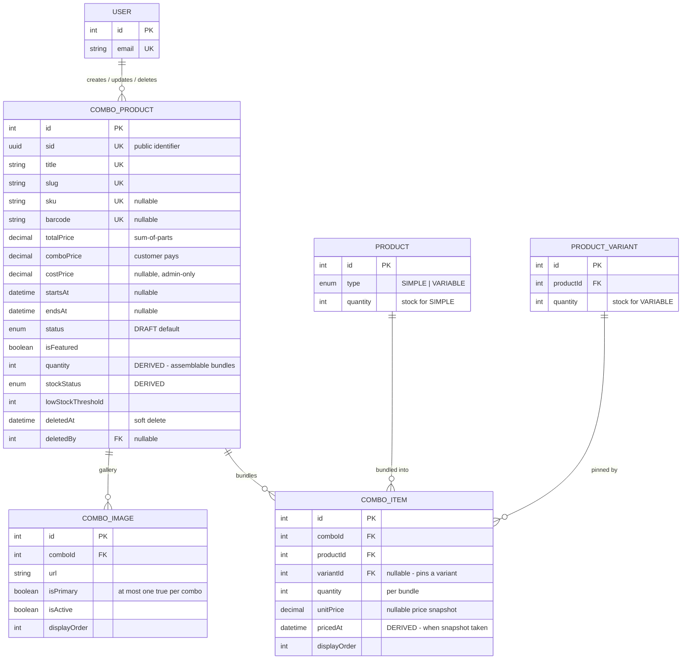

# Combo Product Module

A combo bundles existing products/variants together at a special price for a limited time window.
Kept separate from the `Product` model because the lifecycle, pricing, and content fields differ.

Schema source: `prisma/schema/combo-product.prisma` (models `ComboProduct`, `ComboItem`, `ComboImage`).

> **Scope note:** `Product`, `ProductVariant`, and `User` are documented in their own references — they appear here only as foreign-key targets needed to understand the combo relationships.

---

### DB Schema

#### Entity-Relationship Diagram (ERD)



**Cardinality legend:** `||--o{` = one-to-many. `ComboItem` is the join entity between a combo and the catalog — a combo has many items, and one product/variant can appear in many combos.

---

#### Enum Definitions

##### `CategoryProductStatus` (shared with `Category`/`Product`, defined in `shared.prisma`)

| Value      | Meaning                                                                    |
| :--------- | :------------------------------------------------------------------------- |
| `ACTIVE`   | Live and visible on the storefront (subject to the `publishedAt` gate).    |
| `INACTIVE` | Temporarily hidden, but not archived — can be reactivated freely.          |
| `DRAFT`    | Being authored, never shown publicly. **Default for a new combo.**         |
| `ARCHIVED` | Retired promotion. Convention: pair with `deletedAt` on soft delete.       |
| `HIDDEN`   | Exists and purchasable via direct link, but excluded from listings/search. |

> Unlike `Product` (defaults to `ACTIVE`), a combo defaults to `DRAFT` and must be **explicitly published**. `ComboProductService` only stamps `publishedAt` when the admin explicitly chose `ACTIVE` at create time.

##### `StockStatus` (shared with `Product`/`ProductVariant`, defined in `product.prisma`)

| Value          | Meaning                                                |
| :------------- | :----------------------------------------------------- |
| `IN_STOCK`     | Assemblable bundle count is above `lowStockThreshold`. |
| `LOW_STOCK`    | Between 1 and `lowStockThreshold` inclusive.           |
| `OUT_OF_STOCK` | Zero assemblable bundles. Default on creation.         |

> For a combo these describe **bundles**, not units of any one product. See [Availability Model](#availability-model-the-bottleneck-rule).

---

#### Data Dictionary — ComboProduct

**Table purpose:** the top-level bundle entity — a curated set of existing products/variants sold together at a special price for a limited time window. Kept as its own model rather than reusing `Product` because the lifecycle, the pricing shape (two prices, not one + discount), and the promotional window don't fit the single-product model. Maps to table `combo_products`.

| Field               | Type                          | Constraints                                                                       | Description                                                                                                                                                                                     |
| :------------------ | :---------------------------- | :-------------------------------------------------------------------------------- | :---------------------------------------------------------------------------------------------------------------------------------------------------------------------------------------------- |
| `id`                | `INT`                         | PK, AUTOINCREMENT                                                                 | Internal numeric key; FK joins only, never exposed externally.                                                                                                                                  |
| `sid`               | `UUID`                        | UNIQUE, NOT NULL, DEFAULT `uuid()`                                                | Public-facing identifier. Prevents ID enumeration/scraping.                                                                                                                                     |
| `title`             | `VARCHAR(255)`                | UNIQUE, NOT NULL                                                                  | English display title.                                                                                                                                                                          |
| `slug`              | `VARCHAR(255)`                | UNIQUE, NOT NULL                                                                  | URL-safe identifier — primary lookup key for the combo detail page.                                                                                                                             |
| `sku`               | `VARCHAR(100)`                | UNIQUE, NULLABLE                                                                  | SKU of the **bundle itself**, not derived from its items' SKUs. Ops/accounting/ERP identify a combo by this.                                                                                    |
| `barcode`           | `VARCHAR(100)`                | UNIQUE, NULLABLE                                                                  | EAN/UPC barcode for POS/warehouse scanning.                                                                                                                                                     |
| `description`       | `TEXT`                        | NULLABLE                                                                          | Long-form English description.                                                                                                                                                                  |
| `shortDescription`  | `VARCHAR(500)`                | NULLABLE, `@map("short_description")`                                             | Truncated summary for cards/listings.                                                                                                                                                           |
| `titleTh`           | `VARCHAR(255)`                | NULLABLE, `@map("title_th")`                                                      | Thai display title.                                                                                                                                                                             |
| `shortDescTh`       | `VARCHAR(500)`                | NULLABLE, `@map("short_desc_th")`                                                 | Thai summary.                                                                                                                                                                                   |
| `descriptionTh`     | `TEXT`                        | NULLABLE, `@map("description_th")`                                                | Thai long-form description.                                                                                                                                                                     |
| `totalPrice`        | `DECIMAL(12,2)`               | NOT NULL, DEFAULT `0`, `@map("total_price")`, `CHECK >= 0`                        | Sum-of-parts display price, computed by the service from the bundled items. Show struck-through against `comboPrice`.                                                                           |
| `comboPrice`        | `DECIMAL(12,2)`               | NOT NULL, DEFAULT `0`, `@map("combo_price")`, `CHECK >= 0`, `CHECK <= totalPrice` | The actual bundle price the customer pays.                                                                                                                                                      |
| `costPrice`         | `DECIMAL(12,2)`               | NULLABLE, `@map("cost_price")`, `CHECK NULL OR >= 0`                              | Landed cost of the bundle for margin reporting. **Entered, not summed** from items — a bundle carries its own packaging/assembly cost. Admin-only; never expose publicly.                       |
| `startsAt`          | `TIMESTAMPTZ(3)`              | NULLABLE, `@map("starts_at")`                                                     | Promotion window start. `null` = no start restriction.                                                                                                                                          |
| `endsAt`            | `TIMESTAMPTZ(3)`              | NULLABLE, `@map("ends_at")`, `CHECK` window valid                                 | Promotion window end. `null` = no end restriction.                                                                                                                                              |
| `status`            | `ENUM(CategoryProductStatus)` | NOT NULL, DEFAULT `DRAFT`                                                         | Lifecycle/visibility state.                                                                                                                                                                     |
| `isFeatured`        | `BOOLEAN`                     | NOT NULL, DEFAULT `false`, `@map("is_featured")`                                  | Drives homepage/featured combo sections.                                                                                                                                                        |
| `quantity`          | `INT`                         | NOT NULL, DEFAULT `0`, `CHECK >= 0`                                               | **Fully derived, never client input.** How many complete bundles current stock can assemble — a `MIN` over items, not a sum. See [Availability Model](#availability-model-the-bottleneck-rule). |
| `stockStatus`       | `ENUM(StockStatus)`           | NOT NULL, DEFAULT `OUT_OF_STOCK`, `@map("stock_status")`                          | **Fully derived** from `quantity` vs `lowStockThreshold`.                                                                                                                                       |
| `lowStockThreshold` | `INT`                         | NOT NULL, DEFAULT `10`, `@map("low_stock_threshold")`                             | Bundle count at or below which `stockStatus` reports `LOW_STOCK`, down to 1.                                                                                                                    |
| `seoMetadata`       | `JSONB`                       | DEFAULT `{}`, `@map("seo_metadata")`                                              | `metaTitle`/`metaDescription` (EN + TH) — same convention as `Product.seoMetadata`.                                                                                                             |
| `createdAt`         | `TIMESTAMPTZ(3)`              | NOT NULL, DEFAULT `now()`, `@map("created_at")`                                   | Row creation time.                                                                                                                                                                              |
| `updatedAt`         | `TIMESTAMPTZ(3)`              | NOT NULL, auto-updated, `@map("updated_at")`                                      | Last modification time.                                                                                                                                                                         |
| `deletedAt`         | `TIMESTAMPTZ(3)`              | NULLABLE, `@map("deleted_at")`                                                    | **Soft-delete marker.** Row is never physically deleted in normal operation.                                                                                                                    |
| `publishedAt`       | `TIMESTAMPTZ(3)`              | NULLABLE, `@map("published_at")`                                                  | Scheduled-publish gate, same convention as `Product.publishedAt`.                                                                                                                               |
| `createdBy`         | `INT`                         | FK → `users.id`, NULLABLE, **ON DELETE SET NULL**, `@map("created_by")`           | Actor who created the row.                                                                                                                                                                      |
| `updatedBy`         | `INT`                         | FK → `users.id`, NULLABLE, **ON DELETE SET NULL**, `@map("updated_by")`           | Actor who last modified the row.                                                                                                                                                                |
| `deletedBy`         | `INT`                         | FK → `users.id`, NULLABLE, **ON DELETE SET NULL**, `@map("deleted_by")`           | Actor who soft-deleted the row — the audit field you most want during an incident.                                                                                                              |

---

#### Data Dictionary — ComboItem

**Table purpose:** the join entity between a `ComboProduct` and the `Product` (optionally pinned to one `ProductVariant`) it bundles, carrying a per-bundle quantity and a price snapshot. Maps to table `combo_items`.

| Field          | Type             | Constraints                                                                        | Description                                                                                                                                                                                            |
| :------------- | :--------------- | :--------------------------------------------------------------------------------- | :----------------------------------------------------------------------------------------------------------------------------------------------------------------------------------------------------- |
| `id`           | `INT`            | PK, AUTOINCREMENT                                                                  | Internal key.                                                                                                                                                                                          |
| `comboId`      | `INT`            | FK → `combo_products.id`, NOT NULL, **ON DELETE CASCADE**, `@map("combo_id")`      | Owning combo. Deleting a combo removes its item rows.                                                                                                                                                  |
| `productId`    | `INT`            | FK → `products.id`, NOT NULL, **ON DELETE RESTRICT**, `@map("product_id")`         | Bundled product. `RESTRICT` prevents deleting a product that is still bundled.                                                                                                                         |
| `variantId`    | `INT`            | FK → `product_variants.id`, NULLABLE, **ON DELETE RESTRICT**, `@map("variant_id")` | Pins the item to a specific size/variant. `RESTRICT`, not `SET NULL`: nulling it would silently rewrite "Product A / 500ml" into "Product A / generic".                                                |
| `quantity`     | `INT`            | NOT NULL, DEFAULT `1`, `CHECK > 0`                                                 | How many units of this product/variant are included **per combo purchase**. Strictly positive — a 0-quantity item is a row that should not exist, and would make the availability divisor meaningless. |
| `unitPrice`    | `DECIMAL(12,2)`  | NULLABLE, `@map("unit_price")`, `CHECK NULL OR >= 0`                               | Snapshot of the unit price at bundling time — protects historical combo pricing from later product price changes.                                                                                      |
| `pricedAt`     | `TIMESTAMPTZ(3)` | NULLABLE, `@map("priced_at")`                                                      | **Fully derived, never client input.** When `unitPrice` was captured. `NULL` exactly when `unitPrice` is. See [Price Snapshot Dating](#price-snapshot-dating).                                         |
| `displayOrder` | `INT`            | NOT NULL, DEFAULT `0`, `@map("display_order")`                                     | Manual sort position within the combo's item list.                                                                                                                                                     |

**Uniqueness:** `@@unique([comboId, productId, variantId])` covers **pinned rows only**. Postgres treats every `NULL` as distinct in a unique index, so unpinned rows (`variantId IS NULL`) are guarded by the partial unique index `combo_items_unique_without_variant`. See [Bundling Rules](#bundling-rules).

---

#### Data Dictionary — ComboImage

**Table purpose:** combo-specific gallery imagery, mirroring `ProductImage`'s structure but scoped to a combo instead of a product/variant. Maps to table `combo_images`.

| Field          | Type           | Constraints                                                                   | Description                                                                                                                          |
| :------------- | :------------- | :---------------------------------------------------------------------------- | :----------------------------------------------------------------------------------------------------------------------------------- |
| `id`           | `INT`          | PK, AUTOINCREMENT                                                             | Internal key.                                                                                                                        |
| `url`          | `VARCHAR(512)` | NOT NULL                                                                      | Full-size image URL.                                                                                                                 |
| `thumbnailUrl` | `VARCHAR(512)` | NULLABLE, `@map("thumbnail_url")`                                             | Pre-resized thumbnail variant.                                                                                                       |
| `bannerUrl`    | `VARCHAR(512)` | NULLABLE, `@map("banner_url")`                                                | Pre-resized banner/hero variant.                                                                                                     |
| `iconUrl`      | `VARCHAR(512)` | NULLABLE, `@map("icon_url")`                                                  | Pre-resized icon variant.                                                                                                            |
| `altText`      | `TEXT`         | NULLABLE, `@map("alt_text")`                                                  | Accessibility / SEO alt text.                                                                                                        |
| `displayOrder` | `INT`          | NOT NULL, DEFAULT `0`, `@map("display_order")`                                | Sort order within the combo's gallery.                                                                                               |
| `isPrimary`    | `BOOLEAN`      | NOT NULL, DEFAULT `false`, `@map("is_primary")`                               | Marks the hero/cover image. At most one `true` per combo, enforced by the partial unique index `combo_images_one_primary_per_combo`. |
| `isActive`     | `BOOLEAN`      | NOT NULL, DEFAULT `true`, `@map("is_active")`                                 | Soft-hide an image without deleting it.                                                                                              |
| `comboId`      | `INT`          | FK → `combo_products.id`, NOT NULL, **ON DELETE CASCADE**, `@map("combo_id")` | Owning combo.                                                                                                                        |

> **Swapping the primary image takes two statements.** A unique index is not deferrable, so a single `UPDATE` that demotes one row and promotes another can transiently collide mid-statement. Demote all (`UPDATE ... SET is_primary = false WHERE combo_id = $1`), then promote one — the same pattern `ProductRepository.reorderImages` already uses.

---

#### Availability Model (The Bottleneck Rule)

A combo is sellable only if **every** item has enough stock, so the bundle is capped by its scarcest part:

```
combo.quantity = MIN over items of  floor(item stock / item per-bundle quantity)
```

This is a **`MIN`, not a `SUM`** — the opposite of `Product.totalStock`. Pattern-matching on the product roll-up will get this backwards.

| Scenario                                               | Result                                           |
| :----------------------------------------------------- | :----------------------------------------------- |
| 50 Face Washes + 7 Moisturizers, combo needs 1 of each | `MIN(50, 7)` = **7** bundles                     |
| 10 units in stock, combo needs 3 per bundle            | `floor(10/3)` = **3** bundles (leftover ignored) |
| Any single item at 0 stock                             | **0** bundles → `OUT_OF_STOCK`                   |
| Combo with no items                                    | **0** bundles → `OUT_OF_STOCK`                   |

**Item stock source:** a pinned row reads `product_variants.quantity`; an unpinned row reads `products.quantity`. That is only correct because the [Bundling Rules](#bundling-rules) guarantee unpinned ⇒ `SIMPLE`. **If that type rule is ever relaxed, this formula breaks** — an unpinned `VARIABLE` product would read `products.quantity`, which is `0` for variable products.

The rule is written down in two places that must stay in sync:

| Where                                            | Role                                                                                                                                            |
| :----------------------------------------------- | :---------------------------------------------------------------------------------------------------------------------------------------------- |
| `recompute_combo_quantity(int[])` (SQL function) | **Authoritative** once rows exist. Every trigger funnels into it, so the formula lives once.                                                    |
| `ComboProductService.resolveComboAvailability`   | Mirror, used only at create time — the trigger fires after the `combo_items` rows land, which is after the `combo_products` row Prisma returns. |

##### Trigger fan-in

| Trigger                                | Table              | Fires on                                                                             |
| :------------------------------------- | :----------------- | :----------------------------------------------------------------------------------- |
| `trg_sync_combo_stock_status`          | `combo_products`   | `BEFORE INSERT OR UPDATE OF quantity, low_stock_threshold` — derives `stock_status`. |
| `trg_sync_combo_quantity_from_items`   | `combo_items`      | `AFTER INSERT OR DELETE OR UPDATE OF quantity, product_id, variant_id, combo_id`     |
| `trg_sync_combo_quantity_from_product` | `products`         | `AFTER UPDATE OF quantity` — recomputes every combo holding it unpinned.             |
| `trg_sync_combo_quantity_from_variant` | `product_variants` | `AFTER UPDATE OF quantity` — recomputes every combo that pinned it.                  |

The `OF <columns>` lists keep these off the hot path: a price edit or a rename never fires them. Because `trg_sync_combo_stock_status` is `BEFORE`-row, the `UPDATE` issued by `recompute_combo_quantity` derives `stock_status` in the same pass — no second statement anywhere.

> **Event-driven, not lazy.** Nothing recomputes at read time; the value is written the moment stock or items change. A stock change made outside those `OF` column lists would not propagate.

---

#### Bundling Rules

Three rules govern what may be bundled:

1. **`VARIABLE` product ⇒ a variant must be pinned.**
2. **`SIMPLE` product ⇒ no variant may be pinned.**
3. **A combo with exactly one `items` row must bundle more than 1 unit of it** (`quantity > 1`, an omitted `quantity` counting as 1) — a single product at `quantity: 1` is just that product repackaged as a "combo" for no reason, not an actual bundle. Two or more rows already make a genuine bundle regardless of each row's own `quantity`.

Rules 1–2 need the product/variant rows loaded from the DB, so they're enforced in `ComboProductService.resolveComboItems`. Rule 3 is computable from the payload alone, so it's a DTO-level validator instead — `IsSingleItemQuantitySufficient` on both `CreateComboProductDto.items` and `UpdateComboProductDto.items` (`dto/single-item-quantity.validator.ts`).

A variant-level and a product-level row for the same product are each valid alone but ambiguous together, and no unique index can express a cross-row rule — so the constraint is pinned to the product's `type` instead. That also guarantees every row of one product sits on the same side of the `variant_id IS NULL` split the two unique indexes are built around.

A combo may legitimately contain:

- multiple `SIMPLE` products,
- a mix of `SIMPLE` and `VARIABLE` products,
- **the same `VARIABLE` product more than once, pinned to different variants** — which is why `@@unique([comboId, productId])` would be wrong.

---

#### Price Snapshot Dating

`unitPrice` is the price captured at bundling time. `pricedAt` records **when** — without it, a price dispute cannot tell a two-day-old snapshot from a two-year-old one.

`pricedAt` is deliberately **not** `updatedAt`: `updatedAt` moves on any column change, so a `displayOrder` reshuffle or a quantity edit would reset it and destroy the fact being recorded. The trigger `trg_sync_combo_item_priced_at` (`BEFORE INSERT OR UPDATE OF unit_price`) stamps it if and only if `unit_price` actually changes value:

| Action                             | `pricedAt`                           |
| :--------------------------------- | :----------------------------------- |
| INSERT with a price                | stamped `now()`                      |
| INSERT with `unitPrice = NULL`     | `NULL`                               |
| `displayOrder` / `quantity` edit   | unchanged                            |
| Same price written back            | unchanged (`IS DISTINCT FROM` guard) |
| Price actually changes             | re-stamped `now()`                   |
| Price cleared to `NULL`            | set to `NULL`                        |
| Client supplies its own `pricedAt` | overwritten                          |

> `now()` is **transaction** time, so several re-prices inside one transaction share a timestamp — consistent with `createdAt`/`updatedAt` semantics everywhere else in this schema.

---

#### Relationships and Cascading Rules

| Parent → Child                                                | FK Column             | On Delete    | Effect                                                                                                 |
| :------------------------------------------------------------ | :-------------------- | :----------- | :----------------------------------------------------------------------------------------------------- |
| `ComboProduct` → `ComboItem`                                  | `ComboItem.comboId`   | **CASCADE**  | Deleting a combo removes its item rows.                                                                |
| `ComboProduct` → `ComboImage`                                 | `ComboImage.comboId`  | **CASCADE**  | Deleting a combo removes its gallery rows (physical files are cleaned up by the service, best-effort). |
| `Product` → `ComboItem`                                       | `ComboItem.productId` | **RESTRICT** | A product bundled into any combo cannot be deleted.                                                    |
| `ProductVariant` → `ComboItem`                                | `ComboItem.variantId` | **RESTRICT** | A pinned variant cannot be deleted while a combo references it.                                        |
| `User` → `ComboProduct` (`createdBy`/`updatedBy`/`deletedBy`) | `ComboProduct.*By`    | **SET NULL** | Deleting a staff account preserves the combo; the audit pointer goes null.                             |

**Practical implications:**

- `ProductVariant → ComboItem` being `RESTRICT` means a normal product edit that removes a bundled variant will fail. `ProductService.assertVariantsNotBundled` runs before the update transaction and returns a `409` naming the blocking combo, instead of surfacing a raw `P2003`.
- Combos are intended to be **soft-deleted** (`deletedAt`/`deletedBy`), not hard-deleted. The repository's `deleteComboProduct` exists as the rollback path for a create that failed after the row was written.

---

#### Indexes & Constraints

##### Indexes

| Index                                            | Table            | Type                        | Purpose                                                                                                                                       |
| :----------------------------------------------- | :--------------- | :-------------------------- | :-------------------------------------------------------------------------------------------------------------------------------------------- |
| `sid`, `title`, `slug`, `sku`, `barcode`         | `combo_products` | B-Tree (unique)             | Identity lookups; one unique index per column, created automatically.                                                                         |
| `combo_products_live_idx`                        | `combo_products` | B-Tree (**partial**)        | `(status, is_featured, starts_at, ends_at) WHERE deleted_at IS NULL` — the storefront listing predicate. Equality columns lead, ranges trail. |
| `combo_items_combo_id_product_id_variant_id_key` | `combo_items`    | B-Tree (unique)             | Prevents duplicate **pinned** rows per `(combo, product, variant)`.                                                                           |
| `combo_items_unique_without_variant`             | `combo_items`    | B-Tree (**partial** unique) | `(combo_id, product_id) WHERE variant_id IS NULL` — closes the NULL half the constraint above cannot cover.                                   |
| `combo_items_product_id_idx`                     | `combo_items`    | B-Tree                      | FK lookup; also serves the product→combo trigger fan-in.                                                                                      |
| `combo_items_variant_id_idx`                     | `combo_items`    | B-Tree                      | FK lookup; also serves the variant→combo trigger fan-in.                                                                                      |
| `combo_images_one_primary_per_combo`             | `combo_images`   | B-Tree (**partial** unique) | `(combo_id) WHERE is_primary = true` — at most one cover image per combo.                                                                     |
| `combo_images_combo_id_is_primary_idx`           | `combo_images`   | B-Tree (composite)          | Fetching a combo's cover image without scanning the whole gallery.                                                                            |

> **`ComboProduct` declares no `@@index` in the Prisma schema on purpose.** Prisma's DSL cannot express a filtered (`WHERE`) index, so `combo_products_live_idx` is hand-written in a migration. A former `@@index([slug])` was dropped as pure write amplification — `slug @unique` already creates a B-Tree.

##### Check constraints

| Constraint                                | Rule                                                          |
| :---------------------------------------- | :------------------------------------------------------------ |
| `combo_items_quantity_positive`           | `quantity > 0`                                                |
| `combo_items_unit_price_non_negative`     | `unit_price IS NULL OR unit_price >= 0`                       |
| `combo_products_total_price_non_negative` | `total_price >= 0`                                            |
| `combo_products_combo_price_non_negative` | `combo_price >= 0`                                            |
| `combo_products_price_valid`              | `combo_price <= total_price`                                  |
| `combo_products_cost_price_non_negative`  | `cost_price IS NULL OR cost_price >= 0`                       |
| `combo_products_quantity_non_negative`    | `quantity >= 0`                                               |
| `combo_products_window_valid`             | `starts_at IS NULL OR ends_at IS NULL OR ends_at > starts_at` |

`combo_products_price_valid` is the DB backstop for the service rule _"Combo price cannot be greater than the sum of its bundled items."_ Note the consequence for any future update endpoint: `comboPrice` and `totalPrice` must be written in the **same statement**, since lowering `totalPrice` first would trip the constraint.

---

#### Conventions

- **All `DateTime` columns are `@db.Timestamptz(3)`.** Prisma's default mapping is timezone-naive, and comparing a naive column against SQL `now()` casts through the _server's_ `TimeZone` setting — so a promotion set to end at "midnight" would end at a different real instant depending on where the query runs. Any new `DateTime` field must carry `@db.Timestamptz(3)`.
- **All columns are `snake_case`** via `@map()`. Prisma field names stay camelCase; only the database identifiers are mapped.
- **Derived columns are never client input.** `quantity`, `stockStatus` (combo) and `pricedAt` (item) are written by triggers; DTOs deliberately expose no field for them.
- **`costPrice` and `barcode` are admin-only**; `sku` is public (customers quote it in support tickets), matching the `Product` visibility tiers.

---

#### Example Data

**ComboProduct**

| title                       | status     | sku           | totalPrice | comboPrice | quantity | stockStatus    | startsAt               | endsAt                 | isFeatured |
| :-------------------------- | :--------- | :------------ | :--------- | :--------- | :------- | :------------- | :--------------------- | :--------------------- | :--------- |
| **Wellness Starter Bundle** | `ACTIVE`   | `CMB-WELL-01` | `1850.00`  | `1499.00`  | `7`      | `LOW_STOCK`    | `2026-07-01T00:00:00Z` | `2026-07-31T23:59:59Z` | `true`     |
| **Immune Boost Duo**        | `DRAFT`    | `null`        | `620.00`   | `499.00`   | `0`      | `OUT_OF_STOCK` | `null`                 | `null`                 | `false`    |
| **Back-to-School Kit**      | `ARCHIVED` | `CMB-BTS-26`  | `990.00`   | `799.00`   | `0`      | `OUT_OF_STOCK` | `2026-05-01T00:00:00Z` | `2026-05-31T23:59:59Z` | `false`    |

**ComboItem** (for `Wellness Starter Bundle`, `comboId = 1`)

| productId | variantId | quantity | unitPrice | pricedAt               | displayOrder | note                       |
| :-------- | :-------- | :------- | :-------- | :--------------------- | :----------- | :------------------------- |
| `12`      | `null`    | `1`      | `450.00`  | `2026-07-01T09:12:00Z` | `0`          | `SIMPLE` product, unpinned |
| `27`      | `104`     | `2`      | `700.00`  | `2026-07-01T09:12:00Z` | `1`          | `VARIABLE` product, pinned |

> With stock of 50 for product `12` and 14 for variant `104`, the combo's `quantity` is `MIN(floor(50/1), floor(14/2))` = `MIN(50, 7)` = **7**.

---

#### Known Gaps / Recommended Hardening

- **Soft delete squats unique identifiers.** `title`, `slug`, `sku`, and `barcode` are unconditionally unique, so once soft delete exists for combos, a retired "Songkran Bundle 2026" reserves those values forever. The fix is partial unique indexes scoped to `WHERE deleted_at IS NULL` — which costs three `findUnique` → `findFirst` swaps in the repository. `Product` has the identical issue, live today.
- **No `softDeleteCombo` exists yet.** `deletedAt`/`deletedBy` are declared and the storefront read already filters `deletedAt: null`, but no write path sets them.
- **"At least one primary image" is not enforced.** The partial unique index only constrains "at most one". The service covers it by flagging the first uploaded image; a future delete-image path must promote a survivor, as `Product` does via `hasSurvivingPrimaryImage`.
- **`lowStockThreshold` is not settable per combo.** The column defaults to `10` and the create DTO has no field for it.
- **`pricedAt` is not exposed through the API.** `COMBO_ITEM_SELECT` is shared by the admin and public response shapes, so surfacing it would leak an audit field to the storefront; it needs the select split into admin/public variants first.

---

### API End Point & Business Logic

_Not documented yet._
