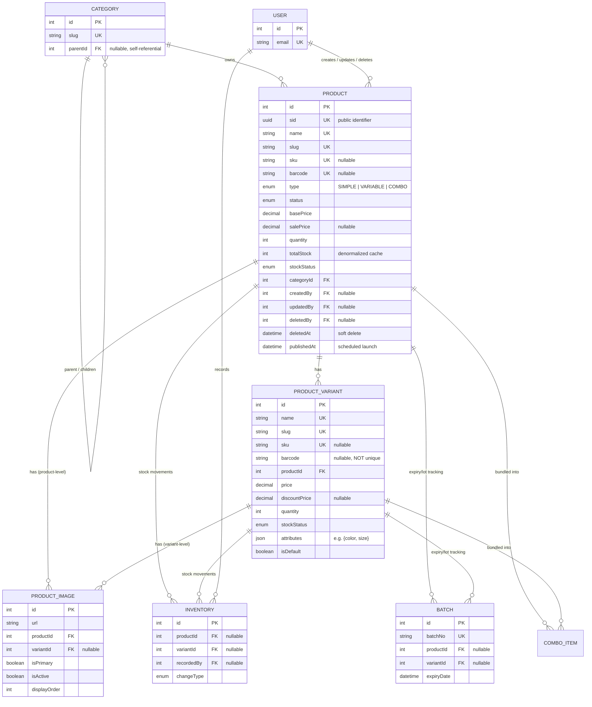

# Product Domain — Schema & Developer Reference

This document is the schema reference for the **Product domain**: `Product`, `ProductVariant`, and `ProductImage` (defined in `prisma/schema/product.prisma`). It covers the ERD, the full data dictionary, JSON field shapes, cascading rules, indexing strategy, and implementation guidance for backend developers building the `product` module.

> Scope note: `Category`, `User`, `Inventory`, `Batch`, and `ComboProduct`/`ComboItem` are documented elsewhere (their own `.prisma` files) — they appear here only as foreign-key targets/sources needed to understand Product's relationships.

---

<details>
  <summary><b>Entity-Relationship Diagram (ERD)</b></summary>



**Cardinality legend:** `||--o{` = one-to-many (parent must exist, child count is 0..N). `Product ↔ ProductVariant ↔ ProductImage` is a strict two-level tree — there is no many-to-many relationship inside this domain.

</details>

---

<details>
  <summary><b>Enum Definitions</b></summary>

### `ProductType`

| Value      | Meaning                                                                                                       |
| :--------- | :-------------------------------------------------------------------------------------------------------------- |
| `SIMPLE`   | Standalone product, no variants. Stock lives on `Product.quantity`.                                             |
| `VARIABLE` | Parent product with one or more `ProductVariant` rows. Stock lives on each variant; `Product.totalStock` is a cached sum. |
| `COMBO`    | **Not stored on this table.** Combos are modeled separately via `ComboProduct` / `ComboItem` (`combo-product.prisma`), which reference `Product`/`ProductVariant` by FK. Treat this enum value as reserved/legacy unless the combo tables are wired up. |

### `DiscountType`

| Value        | Meaning                                                                 |
| :----------- | :----------------------------------------------------------------------- |
| `FIXED`      | The discount is a flat currency amount.                                  |
| `PERCENTAGE` | The discount is a percentage of `basePrice` / `price`.                   |

> `DiscountType` only tags *how a discount was configured*. It does not itself compute anything — `salePrice` (Product) / `discountPrice` (ProductVariant) is expected to already hold the final, resolved price. There is no DB-level relationship enforcing `salePrice` against `discountType`; keep that consistent in the service layer (see [Financial Integrity](#financial-integrity--pricing) below).

### `StockStatus`

| Value          | Meaning                                                                                 |
| :------------- | :----------------------------------------------------------------------------------------- |
| `IN_STOCK`     | Available quantity above the low-stock threshold.                                          |
| `LOW_STOCK`    | Available but below a reorder threshold. **Note:** the schema has no `lowStockThreshold` column, so this value currently has no defined derivation rule — it must be computed and set by application logic. |
| `OUT_OF_STOCK` | Zero available quantity. Default value on creation.                                        |

### `CategoryProductStatus` (shared with `Category`, defined in `shared.prisma`)

| Value      | Meaning                                                              |
| :--------- | :--------------------------------------------------------------------- |
| `ACTIVE`   | Live and visible on the storefront (subject to `publishedAt` gate).   |
| `INACTIVE` | Temporarily hidden, but not archived — can be reactivated freely.     |
| `DRAFT`    | Being authored, never shown publicly regardless of `publishedAt`.     |
| `ARCHIVED` | Retired/discontinued. Convention: pair with `deletedAt` on soft delete. |
| `HIDDEN`   | Exists and purchasable via direct link, but excluded from listings/search. |

</details>

---

<details>
  <summary><b>Data Dictionary — Product</b></summary>

**Table purpose:** `Product` is the top-level catalog entity — every sellable item (simple or variable) has exactly one row here. It owns identity (slug/SKU/barcode), pricing defaults, aggregate stock state, SEO metadata, and the full audit trail.

| Field              | Type                    | Constraints                                                    | Description                                                                 |
| :----------------- | :---------------------- | :--------------------------------------------------------------- | :---------------------------------------------------------------------------- |
| `id`                | `INT`                   | PK, AUTOINCREMENT                                                 | Internal numeric key; used for FK joins only, never exposed externally.       |
| `sid`               | `UUID`                  | UNIQUE, NOT NULL, DEFAULT `uuid()`                                | Public-facing identifier. Prevents ID enumeration/scraping.                   |
| `name`              | `VARCHAR(255)`          | UNIQUE, NOT NULL                                                  | English display name.                                                         |
| `slug`              | `VARCHAR(255)`          | UNIQUE, NOT NULL                                                  | URL-safe identifier — primary lookup key for product detail pages (PDP).      |
| `sku`               | `VARCHAR(100)`          | UNIQUE, NULLABLE                                                  | Stock Keeping Unit for a `SIMPLE` product (variants carry their own SKU).     |
| `barcode`           | `VARCHAR(100)`          | UNIQUE, NULLABLE                                                  | EAN/UPC barcode for POS/warehouse scanning.                                   |
| `description`       | `TEXT`                  | NULLABLE                                                          | Long-form English description.                                                |
| `shortDescription`  | `VARCHAR(500)`          | NULLABLE                                                          | Truncated summary for cards/listings.                                         |
| `nameTh`            | `VARCHAR(255)`          | NULLABLE                                                          | Thai display name.                                                            |
| `descriptionTh`     | `TEXT`                  | NULLABLE                                                          | Thai long-form description.                                                   |
| `shortDescTh`       | `VARCHAR(500)`          | NULLABLE                                                          | Thai summary.                                                                 |
| `type`              | `ENUM(ProductType)`     | NOT NULL, DEFAULT `SIMPLE`                                        | Discriminates single-unit vs. multi-variant products.                         |
| `status`            | `ENUM(CategoryProductStatus)` | NOT NULL, DEFAULT `ACTIVE`                                  | Lifecycle/visibility state.                                                   |
| `isFeatured`        | `BOOLEAN`               | NOT NULL, DEFAULT `false`                                         | Drives homepage/featured sections.                                            |
| `hasVariants`       | `BOOLEAN`                | NOT NULL, DEFAULT `false`                                         | **Denormalized cache** of `variants.length > 0` — read-fast flag for UI branching (Add-to-Cart vs. Select-Options). |
| `costPrice`         | `DECIMAL(12,2)`          | NULLABLE                                                          | Internal cost basis for margin reporting. Never expose on public API.         |
| `discountType`      | `ENUM(DiscountType)`     | NULLABLE                                                          | `FIXED` or `PERCENTAGE` — informational tag for how `salePrice` was set.      |
| `basePrice`         | `DECIMAL(12,2)`          | NOT NULL, DEFAULT `0`                                             | MSRP / list price. `Decimal` avoids floating-point rounding errors.           |
| `salePrice`         | `DECIMAL(12,2)`          | NULLABLE                                                          | Final discounted price shown on storefront. No DB `CHECK` enforcing `salePrice < basePrice` — validate in the service layer. |
| `quantity`          | `INT`                    | NOT NULL, DEFAULT `0`                                             | Stock count — authoritative only when `type = SIMPLE`.                        |
| `totalStock`        | `INT`                    | NOT NULL, DEFAULT `0`, `@map("total_stock")`                       | **Denormalized cache** — sum of all `ProductVariant.quantity` for `VARIABLE` products. Must be kept in sync by application logic or a DB trigger; nothing enforces it automatically today. |
| `stockStatus`       | `ENUM(StockStatus)`      | NOT NULL, DEFAULT `OUT_OF_STOCK`                                  | Cached badge state for listing pages.                                         |
| `weight`            | `DECIMAL(10,3)`          | NULLABLE                                                          | Weight in kilograms, used for shipping cost calculation.                      |
| `dimensions`        | `JSONB`                  | DEFAULT `{}`                                                      | `{ length, width, height, unit }` — see [Detailed Field Examples](#detailed-field-examples-json-objects). |
| `seoMetadata`       | `JSONB`                  | DEFAULT `{}`                                                      | Consolidated `metaTitle`/`metaDescription` (EN + TH) for a cleaner API shape.  |
| `tags`               | `TEXT[]`                 | DEFAULT `[]`                                                      | Native Postgres array of free-form labels/keywords.                           |
| `categoryId`        | `INT`                    | FK → `categories.id`, NOT NULL, **ON DELETE RESTRICT**             | Owning category. A category with products cannot be deleted.                  |
| `createdAt`         | `TIMESTAMP`               | NOT NULL, DEFAULT `now()`                                          | Row creation time.                                                             |
| `updatedAt`         | `TIMESTAMP`               | NOT NULL, auto-updated                                             | Last modification time.                                                       |
| `deletedAt`         | `TIMESTAMP`               | NULLABLE                                                          | **Soft-delete marker.** Row is never physically deleted.                      |
| `publishedAt`       | `TIMESTAMP`               | NULLABLE                                                          | Scheduled-publish gate — see [Scheduled Launch](#4-search--discovery-optimization). |
| `createdBy`         | `INT`                     | FK → `users.id`, NULLABLE, **ON DELETE SET NULL**                   | Actor who created the row.                                                    |
| `updatedBy`         | `INT`                     | FK → `users.id`, NULLABLE, **ON DELETE SET NULL**                   | Actor who last modified the row.                                              |
| `deletedBy`         | `INT`                     | FK → `users.id`, NULLABLE, **ON DELETE SET NULL**                   | Actor who soft-deleted the row.                                               |

</details>

---

<details>
  <summary><b>Data Dictionary — ProductVariant</b></summary>

**Table purpose:** `ProductVariant` stores a specific sellable configuration (size, color, flavor, etc.) of a `VARIABLE` product — its own SKU, price, stock, and attributes.

| Field              | Type                | Constraints                                             | Description                                                                 |
| :----------------- | :------------------- | :--------------------------------------------------------- | :---------------------------------------------------------------------------- |
| `id`                | `INT`                | PK, AUTOINCREMENT                                            | Internal key.                                                                 |
| `name`              | `VARCHAR(255)`        | UNIQUE (global), NOT NULL                                    | ⚠️ Currently unique across **all** variants, not scoped per product — see [Known Gaps](#known-gaps--recommended-hardening). |
| `slug`              | `VARCHAR(255)`        | UNIQUE (global), NOT NULL                                    | Same caveat as `name`.                                                        |
| `description`       | `TEXT`                | NULLABLE                                                    | English long-form description.                                                |
| `shortDescription`  | `TEXT`                | NULLABLE                                                    | English summary.                                                              |
| `nameTh` / `descriptionTh` / `shortDescTh` | `VARCHAR/TEXT` | NULLABLE                                     | Thai counterparts.                                                            |
| `sku`               | `VARCHAR(100)`        | UNIQUE, NULLABLE                                             | Variant-level SKU.                                                            |
| `barcode`           | `VARCHAR(100)`        | NULLABLE, **no unique constraint**                            | ⚠️ Inconsistent with `Product.barcode`, which is unique — see Known Gaps.      |
| `quantity`          | `INT`                 | NOT NULL, DEFAULT `0`                                        | Stock count for this specific variant.                                        |
| `stockStatus`       | `ENUM(StockStatus)`   | NOT NULL, DEFAULT `OUT_OF_STOCK`                              | Cached badge state.                                                            |
| `weight`            | `DECIMAL(10,3)`        | NULLABLE                                                    | Weight in kg (overrides parent for shipping calc, if set).                    |
| `size`              | `VARCHAR(50)`          | NULLABLE                                                    | Free-text size label (e.g. `"500ml"`).                                        |
| `price`             | `DECIMAL(12,2)`        | NOT NULL, DEFAULT `0`                                        | Variant-specific list price.                                                  |
| `discountType`      | `ENUM(DiscountType)`   | NULLABLE                                                    | `FIXED` or `PERCENTAGE` tag for `discountPrice`.                              |
| `discountPrice`     | `DECIMAL(12,2)`        | NULLABLE                                                    | Final discounted price for this variant.                                      |
| `costPerItem`       | `DECIMAL(12,2)`        | NULLABLE                                                    | Cost basis for margin reporting.                                              |
| `attributes`        | `JSONB`                 | NOT NULL, DEFAULT `{}`                                       | Free-form key/value pairs, e.g. `{"color": "Red", "size": "XL"}`.             |
| `isDefault`         | `BOOLEAN`               | NOT NULL, DEFAULT `false`                                    | Marks the variant pre-selected on the PDP. **No DB constraint** prevents multiple defaults per product — see Known Gaps. |
| `productId`         | `INT`                   | FK → `products.id`, NOT NULL, **ON DELETE CASCADE**            | Parent product. Deleting the parent deletes all variants.                     |

</details>

---

<details>
  <summary><b>Data Dictionary — ProductImage</b></summary>

**Table purpose:** `ProductImage` stores gallery imagery for either a `Product` (general shots) or a specific `ProductVariant` (e.g. one image per color).

| Field           | Type            | Constraints                                                   | Description                                                          |
| :-------------- | :---------------- | :---------------------------------------------------------------- | :------------------------------------------------------------------------ |
| `id`             | `INT`             | PK, AUTOINCREMENT                                                    | Internal key.                                                             |
| `url`            | `VARCHAR(512)`      | NOT NULL                                                             | Full-size image URL.                                                     |
| `thumbnailUrl`   | `VARCHAR(512)`      | NULLABLE                                                             | Pre-resized thumbnail variant.                                           |
| `bannerUrl`      | `VARCHAR(512)`      | NULLABLE                                                             | Pre-resized banner/hero variant.                                         |
| `iconUrl`        | `VARCHAR(512)`      | NULLABLE                                                             | Pre-resized icon variant.                                                |
| `altText`        | `TEXT`               | NULLABLE                                                             | Accessibility / SEO alt text.                                            |
| `displayOrder`   | `INT`                | NOT NULL, DEFAULT `0`                                                | Sort order within the gallery.                                           |
| `isPrimary`      | `BOOLEAN`             | NOT NULL, DEFAULT `false`                                            | Marks the hero/cover image. **No DB constraint** prevents multiple primaries per product — see Known Gaps. |
| `isActive`       | `BOOLEAN`             | NOT NULL, DEFAULT `true`                                             | Soft-hide an image without deleting it.                                  |
| `productId`      | `INT`                 | FK → `products.id`, NOT NULL, **ON DELETE CASCADE**                    | Owning product.                                                          |
| `variantId`      | `INT`                 | FK → `product_variants.id`, NULLABLE, **ON DELETE CASCADE**            | Owning variant, if this image is variant-specific. Not constrained to belong to the same `productId` — see Known Gaps. |

</details>

---

<details>
  <summary><b>Detailed Field Examples (JSON Objects)</b></summary>

`dimensions` and `seoMetadata` (Product) and `attributes` (ProductVariant) are `JSONB` columns with **no DB-level schema validation** — Postgres will accept any valid JSON. Shape consistency is the responsibility of the DTO/validation layer.

| Field                       | Example Value                                                                                          | Notes                                                                 |
| :--------------------------- | :--------------------------------------------------------------------------------------------------------- | :------------------------------------------------------------------------ |
| `Product.dimensions`         | `{"length": 15.5, "width": 10.0, "height": 25.0, "unit": "cm"}`                                             | Keep the key set consistent — used for automated shipping cost calc.      |
| `Product.seoMetadata`        | `{"metaTitle": "Organic Arabica Coffee", "metaDescription": "Grown in Chiang Mai.", "metaTitleTh": "กาแฟอาราบิก้าออร์แกนิก", "metaDescriptionTh": "ปลูกที่เชียงใหม่"}` | Consolidates 4 legacy columns into one object.                            |
| `Product.tags`               | `["organic", "beverage", "chiang-mai", "bestseller"]`                                                       | Native `text[]`, not JSON — filterable with a GIN index (see [Indexes](#performance-optimizations-indexes--views)). |
| `ProductVariant.attributes`  | `{"color": "Red", "size": "XL"}`                                                                            | No enforced key set — different products may use different attribute keys. |

</details>

---

<details>
  <summary><b>Example Data</b></summary>

| name                   | type       | status   | basePrice | salePrice | quantity | totalStock | sku           | hasVariants | tags                    | publishedAt            |
| :--------------------- | :--------- | :------- | :-------- | :-------- | :------- | :--------- | :------------- | :---------- | :----------------------- | :------------------------ |
| **Arabica Dark Roast**  | `SIMPLE`   | `ACTIVE` | `450.00`  | `399.00`  | `150`    | `0`        | `COF-DRK-500`  | `false`     | `["coffee", "organic"]`  | `2026-01-10T08:00:00Z`    |
| **Elite Running Shoes** | `VARIABLE` | `ACTIVE` | `4500.00` | `3800.00` | `0`      | `120`      | `null`         | `true`      | `["sports", "shoes"]`    | `2026-02-15T09:00:00Z`    |
| **Smart Watch Series 6**| `SIMPLE`   | `DRAFT`  | `12500.00`| `null`    | `0`      | `0`        | `SWATCH-S6`    | `false`     | `[]`                     | `2026-06-01T00:00:00Z` *(future)* |
| **Vintage Film Camera** | `SIMPLE`   | `ARCHIVED` | `12000.00` | `null`  | `0`      | `0`        | `CAM-VINT-70`  | `false`     | `["legacy","collectible"]` | `null`                   |

> Note: for `SIMPLE` products, `totalStock` should be `0`/unused — `quantity` is authoritative. For `VARIABLE` products, `quantity` should be `0` — `totalStock` mirrors the sum of variants.

</details>

---

<details>
  <summary><b>Example Usage (JSON Response)</b></summary>

**Simple product** (standard stock, `type = SIMPLE`):

```json
{
  "sid": "7b2e9140-1b2c-4d3e-8f9a-2b1c3d4e5f6g",
  "name": "Organic Arabica Coffee",
  "nameTh": "กาแฟอาราบิก้าออร์แกนิก",
  "slug": "organic-arabica-coffee",
  "type": "SIMPLE",
  "status": "ACTIVE",
  "basePrice": 450.0,
  "salePrice": 399.0,
  "discountType": "FIXED",
  "quantity": 150,
  "totalStock": 0,
  "stockStatus": "IN_STOCK",
  "hasVariants": false,
  "dimensions": { "length": 10, "width": 5, "height": 20, "unit": "cm" },
  "tags": ["coffee", "organic", "beverage"],
  "publishedAt": "2026-01-10T08:00:00Z"
}
```

**Variable product — parent view** (what the Product Listing Page sees; note `totalStock` as the cache and no direct `sku`, since SKUs live on variants):

```json
{
  "sid": "a1b2c3d4-e5f6-4a5b-bc6d-7e8f9a0b1c2d",
  "name": "Elite Running Shoes",
  "slug": "elite-running-shoes",
  "type": "VARIABLE",
  "status": "ACTIVE",
  "basePrice": 4500.0,
  "salePrice": 3800.0,
  "hasVariants": true,
  "totalStock": 120,
  "stockStatus": "IN_STOCK",
  "seoMetadata": {
    "metaTitle": "Elite Run Pro | Professional Shoes",
    "metaDescription": "Engineered for speed and comfort.",
    "metaTitleTh": "รองเท้าวิ่งรุ่น Elite Run Pro"
  },
  "tags": ["sports", "shoes", "new-arrival"],
  "variants": [
    {
      "id": 1,
      "name": "Elite Running Shoes - EU 42",
      "slug": "elite-running-shoes-eu-42",
      "sku": "SHOE-ELITE-42",
      "price": 4500.0,
      "discountType": "PERCENTAGE",
      "discountPrice": 3800.0,
      "quantity": 60,
      "stockStatus": "IN_STOCK",
      "attributes": { "size": "EU 42", "color": "Black" },
      "isDefault": true
    },
    {
      "id": 2,
      "name": "Elite Running Shoes - EU 44",
      "slug": "elite-running-shoes-eu-44",
      "sku": "SHOE-ELITE-44",
      "price": 4500.0,
      "discountType": "PERCENTAGE",
      "discountPrice": 3800.0,
      "quantity": 60,
      "stockStatus": "IN_STOCK",
      "attributes": { "size": "EU 44", "color": "Black" },
      "isDefault": false
    }
  ]
}
```

**Scheduled launch** (`status = DRAFT`, not yet publicly visible because `publishedAt` is in the future):

```json
{
  "sid": "f47ac10b-58cc-4372-a567-0e02b2c3d479",
  "name": "Smart Watch Series 6",
  "slug": "smart-watch-series-6",
  "type": "SIMPLE",
  "status": "DRAFT",
  "basePrice": 12500.0,
  "salePrice": null,
  "quantity": 0,
  "totalStock": 0,
  "stockStatus": "OUT_OF_STOCK",
  "publishedAt": "2026-08-01T00:00:00Z",
  "createdBy": 12,
  "createdAt": "2026-06-29T08:47:00Z"
}
```

**Soft-deleted / archived** (back-office/admin view — includes audit fields not returned on public endpoints):

```json
{
  "sid": "999e888d-777c-666b-555a-444333222111",
  "name": "Vintage Film Camera",
  "slug": "vintage-film-camera-1970",
  "type": "SIMPLE",
  "status": "ARCHIVED",
  "sku": "CAM-VINT-70",
  "basePrice": 12000.0,
  "salePrice": null,
  "deletedAt": "2026-05-31T23:59:59Z",
  "deletedBy": 5,
  "seoMetadata": {},
  "tags": ["legacy", "collectible"]
}
```

</details>

---

<details>
  <summary><b>Relationships and Cascading Rules</b></summary>

| Parent → Child                              | FK Column                | On Delete       | Effect                                                                 |
| :-------------------------------------------- | :-------------------------- | :----------------- | :-------------------------------------------------------------------------- |
| `Category` → `Product`                        | `Product.categoryId`         | **RESTRICT**        | A category cannot be deleted while any product references it.              |
| `Product` → `ProductVariant`                  | `ProductVariant.productId`   | **CASCADE**         | Deleting a product deletes all its variants.                                |
| `Product` → `ProductImage`                    | `ProductImage.productId`     | **CASCADE**         | Deleting a product deletes all its (product- and variant-level) images.     |
| `ProductVariant` → `ProductImage`             | `ProductImage.variantId`     | **CASCADE**         | Deleting a variant deletes its variant-specific images.                     |
| `Product` → `Inventory`                       | `Inventory.productId`        | **CASCADE**         | Deleting a product wipes its stock-movement history.                        |
| `ProductVariant` → `Inventory`                | `Inventory.variantId`        | **CASCADE**         | Same, at variant granularity.                                               |
| `Product` → `Batch`                           | `Batch.productId`            | **CASCADE**         | Deleting a product wipes its lot/expiry batches.                            |
| `ProductVariant` → `Batch`                    | `Batch.variantId`            | **CASCADE**         | Same, at variant granularity.                                               |
| `Product` → `ComboItem`                       | `ComboItem.productId`        | **RESTRICT**        | A product bundled into any combo cannot be deleted.                         |
| `ProductVariant` → `ComboItem`                | `ComboItem.variantId`        | **SET NULL**        | Deleting the pinned variant loosens the combo item back to product-level.   |
| `User` → `Product` (`createdBy`/`updatedBy`/`deletedBy`) | `Product.*By`     | **SET NULL**        | Deleting a user preserves the product row; the audit pointer just goes null. |
| `User` → `Inventory` (`recordedBy`)           | `Inventory.recordedBy`       | **CASCADE**         | ⚠️ Inconsistent with the `Product` audit FKs above — deleting a user currently deletes their inventory audit history. Recommend `SET NULL` to match. |

**Practical implications:**

- **Products are never truly deleted in practice** — `deletedAt`/`deletedBy` (soft delete) is the intended path. The hard `ON DELETE CASCADE` chain above exists as a safety net for genuine data-purge operations (e.g. GDPR erasure, dev/test cleanup), not for normal product removal.
- Because `Product → Inventory` and `Product → Batch` are `CASCADE`, a hard delete silently destroys audit/compliance history (batch expiry records, stock movement logs). Always prefer soft delete for anything that has shipped or been sold.
- `Category → Product` is `RESTRICT` by design — the UI/service layer must guide admins to reassign or archive products before a category can be removed.

</details>

---

<details>
  <summary><b>Performance Optimizations (Indexes & Views)</b></summary>

### Current indexes (`product.prisma`)

| Index                                             | Type            | Purpose                                                                    |
| :--------------------------------------------------- | :---------------- | :------------------------------------------------------------------------------ |
| `sid`, `name`, `slug`, `sku`, `barcode` (each `@unique`) | B-Tree (unique)   | Identity lookups; Prisma/Postgres creates one unique index per column automatically. |
| `@@index([stockStatus])`                              | B-Tree            | Fast "in stock / out of stock" filtering.                                       |
| `@@index([status, type, publishedAt])`                | B-Tree (composite) | Storefront listing query: active + correct type + already-published.           |
| `@@index([categoryId, status])`                       | B-Tree (composite) | Category browsing pages.                                                       |
| `@@index([status, isFeatured])`                       | B-Tree (composite) | Homepage "Featured" sections.                                                  |
| `@@index([createdAt])`                                | B-Tree            | "Newest" sort order.                                                            |
| `@@index([productId, isPrimary])` (`ProductImage`)    | B-Tree (composite) | Fetching a product's cover image without scanning the whole gallery.           |
| FK columns (`categoryId`, `productId`, `variantId`, `createdBy`, `updatedBy`, `deletedBy`) | B-Tree (implicit)  | Prisma auto-creates an index on every relation scalar field.                    |

### Recommended future indexes (not yet implemented)

- **`@@index([tags], type: Gin)`** on `Product.tags` — required once tag-based filtering ("show all `organic` products") is a real query path; a plain B-Tree can't do array-containment lookups efficiently.
- **`@@index([attributes], type: Gin)`** on `ProductVariant.attributes` — same rationale for filtering by e.g. `{"color": "Red"}`.
- **Partial unique index** `ON product_variants (product_id) WHERE is_default = true` and `ON product_images (product_id) WHERE is_primary = true` — Prisma's schema DSL can't express partial indexes; add via a raw SQL migration to actually enforce "exactly one default variant / primary image per product."
- **Partial unique indexes scoped to live rows** on `slug`/`sku`/`barcode`/`name` (`WHERE deleted_at IS NULL`) — today, soft-deleting a product permanently reserves its slug/SKU, which blocks re-launching under the same identifier.
- **Full-text search (`tsvector` + GIN)** on `name`/`description` if the storefront needs free-text search beyond exact slug lookup — avoids `ILIKE '%term%'` sequential scans at catalog scale.

### Views / materialized views

None currently defined for this domain. If reporting needs (e.g. "products with margin below X%", "stock reconciliation drift") become common, prefer a materialized view refreshed on a schedule over ad-hoc application-side aggregation queries.

</details>

---

<details>
  <summary><b>Implementation & Best Practices</b></summary>

### 1. Product Type Architecture

- **`SIMPLE`**: `quantity` is the source of truth; `totalStock` should stay `0`/unused.
- **`VARIABLE`**: parent `quantity` should stay `0`; `totalStock` is a read-cache (denormalized sum) of all `ProductVariant.quantity`.
- **`COMBO`**: not backed by this table's own fields — model combo composition through `ComboProduct`/`ComboItem`, which reference `Product`/`ProductVariant` by FK. Don't try to represent a combo's contents by hijacking `ProductVariant`.
- **Frontend contract:** use `totalStock` (not a join over variants) for "In Stock/Out of Stock" badges on listing pages to avoid N+1 joins.

### 2. Financial Integrity & Pricing

- `basePrice`/`price` is always the pre-discount reference price. If `salePrice`/`discountPrice` is present, it is expected to be the final, already-resolved price — **not** a raw percentage.
- There is **no DB `CHECK` constraint** enforcing `salePrice < basePrice` or non-negative prices/quantities. Validate this at the DTO/service boundary (e.g. `class-validator` custom validator) before writing.
- Never do price arithmetic in plain JS floating point — use `Decimal` consistently end-to-end (Prisma already returns `Decimal.js`-backed values for these columns; don't coerce to `number` before doing math).

### 3. Inventory & Cache Sync Logic

`hasVariants`, `totalStock`, and `stockStatus` on `Product` are all **denormalized caches with no automatic sync mechanism** (no DB trigger exists today). Any service method that creates/updates/deletes a `ProductVariant`, or writes an `Inventory` movement, must also recompute the parent `Product`'s cached fields — inside the same transaction (see the `withTransaction` pattern in `docs/concepts/prisma-concepts.md`). Concretely:

```ts
await this.productRepo.withTransaction(async (tx) => {
  await this.variantRepo.updateQuantity(variantId, newQty, tx);
  await this.productRepo.recalculateTotalStock(productId, tx); // sum + stockStatus + hasVariants
});
```

Periodic reconciliation (a scheduled job comparing `SUM(product_variants.quantity)` against `products.total_stock`) is recommended to catch drift from any code path that skips this.

### 4. Search & Discovery Optimization

- `slug` should be generated once (from `name`) and treated as immutable in practice — support 301 redirects at the routing layer if it ever must change, since it's the primary SEO lookup key.
- Storefront listing queries should shape their `WHERE` clause to match the compound index `[status, type, publishedAt]` (in that column order) to get an index-only scan.
- A product is publicly "live" only when **both** `status == ACTIVE` **and** `publishedAt <= NOW()` (or `publishedAt IS NULL` if immediate-publish is allowed by convention — confirm with product owners before assuming).

### 5. Soft Delete & Data Retention

- Never hard-`DELETE` a `Product` row that has ever been ordered or has stock history — the `Product → Inventory`/`Product → Batch` cascades will destroy that history. Set `deletedAt`/`deletedBy` instead.
- All read queries (`findMany`, `findUnique`, list/search endpoints) must filter `deletedAt: null` unless explicitly serving an admin/audit view. There is no global Prisma middleware/extension doing this automatically yet — each repository method is responsible for adding the filter.
- Convention: when soft-deleting, also move `status` to `ARCHIVED` so the row can't leak into search/listing indexes that only filter on `status`, not `deletedAt`.

### 6. JSONB Structure & Extensibility

- `dimensions`: always `{"length": number, "width": number, "height": number, "unit": "cm" | "in"}` — required for automated shipping-cost calculation to work.
- `seoMetadata`: intentionally flexible; established key convention is `metaTitle` / `metaDescription` / `metaTitleTh` / `metaDescriptionTh`. Don't invent parallel ad-hoc keys per feature — extend this same object.
- `attributes` (variant): no enforced key set. If two variants of the same product use different attribute keys (e.g. one has `color`, another has `flavor`), filtering/faceting UI must handle sparse keys gracefully.

### 7. Known Gaps / Recommended Hardening

These are schema-level issues worth fixing before the `product` module goes to production — not blockers for reading/understanding the current design, but real bugs waiting to happen:

- `ProductVariant.name`/`slug` are unique **globally**, not scoped per product — two different products cannot both have a variant named `"Small"`. Should be `@@unique([productId, name])` / `@@unique([productId, slug])`.
- `ProductVariant.barcode` lacks `@unique`, inconsistent with `Product.barcode`.
- No constraint enforces "exactly one `isDefault` variant" or "exactly one `isPrimary` image" per product — needs a partial unique index (raw migration).
- No constraint ties a `ProductImage.variantId` to the variant's actual `productId` — a variant image could theoretically be attached to an unrelated product row.
- Soft-deleted products permanently reserve their `slug`/`sku`/`barcode`/`name` due to global (not partial) unique indexes.
- `Inventory.recordedBy` is `ON DELETE CASCADE`, inconsistent with every other audit FK in this domain (`SET NULL`) — deleting a user currently erases their inventory audit trail.

</details>
