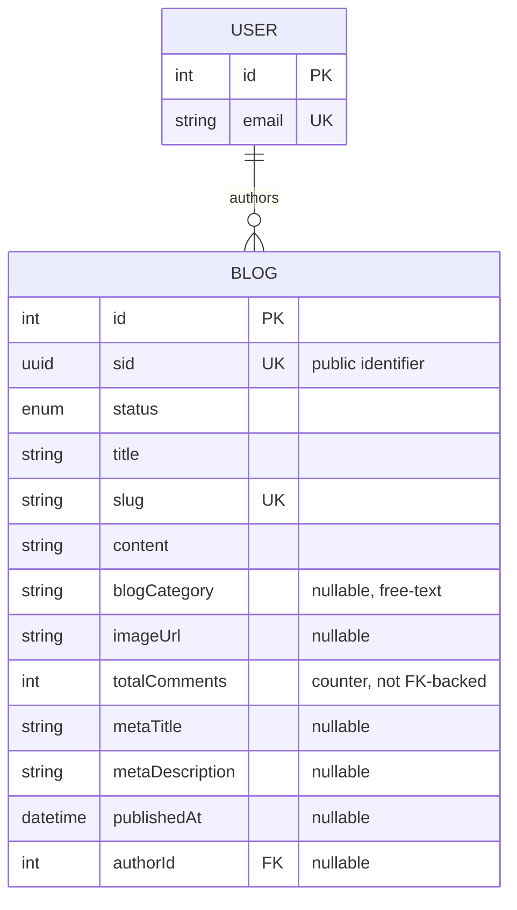

# Blog Domain — Schema & Developer Reference

This document is the schema reference for the **Blog domain**: `Blog` (defined in `prisma/schema/blog.prisma`). It covers the ERD, the full data dictionary, cascading rules, indexing strategy, and implementation guidance for backend developers building the `blog` module.

> Scope note: `User` is documented elsewhere (`user.prisma`) — it appears here only as the `author` foreign-key target needed to understand Blog's relationship.

---

<details>
  <summary><b>Entity-Relationship Diagram (ERD)</b></summary>



**Cardinality legend:** `||--o{` = one-to-many (parent must exist, child count is 0..N). A `User` may author zero or many `Blog` rows; a `Blog`'s `author` is optional (nullable FK).

</details>

---

<details>
  <summary><b>Enum Definitions</b></summary>

### `BlogStatus`

| Value       | Meaning                                                                         |
| :---------- | :--------------------------------------------------------------------------------- |
| `DRAFT`     | Being authored, never shown publicly. Default value on creation.                   |
| `PUBLISHED` | Live and visible on the storefront/blog listing (paired with a real `publishedAt`). |
| `ARCHIVED`  | Retired/unpublished but retained in the database (no soft-delete field exists — see [Known Gaps](#known-gaps--recommended-hardening)). |

</details>

---

<details>
  <summary><b>Data Dictionary — Blog</b></summary>

**Table purpose:** `Blog` is a standalone content entity for editorial/marketing articles (e.g. "Wellness Guides", "Patient Stories"). It owns identity (slug), content, SEO metadata, and an optional author link back to `User`. It has no child tables today — comments are tracked only as a denormalized counter.

| Field             | Type              | Constraints                                                      | Description                                                                 |
| :----------------- | :------------------ | :------------------------------------------------------------------ | :---------------------------------------------------------------------------- |
| `id`                | `INT`               | PK, AUTOINCREMENT                                                   | Internal numeric key; used for FK joins only, never exposed externally.       |
| `sid`               | `UUID`               | UNIQUE, NOT NULL, DEFAULT `uuid()`                                   | Public-facing identifier. Prevents ID enumeration/scraping.                   |
| `status`            | `ENUM(BlogStatus)`   | NOT NULL, DEFAULT `DRAFT`                                            | Lifecycle/visibility state.                                                    |
| `title`             | `VARCHAR(255)`       | NOT NULL                                                             | Display title.                                                                 |
| `slug`              | `VARCHAR(255)`       | UNIQUE, NOT NULL                                                     | URL-safe identifier — primary lookup key for the blog detail page.            |
| `content`           | `TEXT`               | NOT NULL                                                             | Full article body (assumed HTML/Markdown — enforced by the DTO/editor layer, not the DB). |
| `blogCategory`      | `VARCHAR(100)`       | NULLABLE                                                             | Free-text category label, e.g. `"Wellness Guides"`, `"Patient Stories"`. No FK to a `Category` table — see Known Gaps. |
| `imageUrl`          | `VARCHAR(512)`       | NULLABLE                                                             | Cover/hero image URL.                                                         |
| `totalComments`     | `INT`                | NOT NULL, DEFAULT `0`                                                | **Denormalized counter** — there is no `Comment` model in this schema today; nothing increments/decrements this automatically. |
| `metaTitle`         | `VARCHAR(255)`       | NULLABLE                                                             | SEO title override.                                                            |
| `metaDescription`   | `TEXT`               | NULLABLE                                                             | SEO description override.                                                     |
| `createdAt`         | `TIMESTAMP`          | NOT NULL, DEFAULT `now()`, `@map("created_at")`                       | Row creation time.                                                             |
| `updatedAt`         | `TIMESTAMP`          | NOT NULL, auto-updated, `@map("updated_at")`                          | Last modification time.                                                       |
| `publishedAt`       | `TIMESTAMP`          | NULLABLE, `@map("published_at")`                                      | Scheduled/actual publish timestamp — see [Search & Discovery](#3-search--discovery). |
| `authorId`          | `INT`                | FK → `users.id`, NULLABLE, **ON DELETE SET NULL**, `@map("author_id")` | Writing user. Nullable to allow author accounts to be deleted without losing the article. |

</details>

---

<details>
  <summary><b>Example Data</b></summary>

| title                        | status      | slug                          | blogCategory        | totalComments | authorId | publishedAt              |
| :---------------------------- | :----------- | :------------------------------ | :--------------------- | :------------- | :-------- | :-------------------------- |
| **5 Tips for Better Sleep**    | `PUBLISHED` | `5-tips-for-better-sleep`        | `Wellness Guides`      | `12`            | `3`       | `2026-05-20T09:00:00Z`      |
| **My Recovery Journey**        | `PUBLISHED` | `my-recovery-journey`            | `Patient Stories`       | `4`             | `null`    | `2026-06-01T09:00:00Z`      |
| **Upcoming Clinic Hours**      | `DRAFT`     | `upcoming-clinic-hours`          | `null`                  | `0`             | `7`       | `null`                       |
| **Old Promo Announcement**     | `ARCHIVED`  | `old-promo-announcement`         | `News`                  | `2`             | `7`       | `2025-11-01T09:00:00Z`      |

</details>

---

<details>
  <summary><b>Example Usage (JSON Response)</b></summary>

**Published blog** (public storefront view):

```json
{
  "sid": "c1d2e3f4-5678-4abc-9def-0123456789ab",
  "title": "5 Tips for Better Sleep",
  "slug": "5-tips-for-better-sleep",
  "status": "PUBLISHED",
  "content": "<p>Getting quality sleep starts with...</p>",
  "blogCategory": "Wellness Guides",
  "imageUrl": "https://cdn.example.com/blogs/sleep-tips.jpg",
  "totalComments": 12,
  "metaTitle": "5 Tips for Better Sleep | THP Blog",
  "metaDescription": "Simple, evidence-based habits for deeper sleep.",
  "publishedAt": "2026-05-20T09:00:00Z",
  "author": {
    "sid": "7b2e9140-1b2c-4d3e-8f9a-2b1c3d4e5f6g",
    "email": "editor@thaihealth.example"
  }
}
```

**Draft blog with no assigned author** (back-office view):

```json
{
  "sid": "d4e5f6a7-8901-4bcd-a234-56789abcdef0",
  "title": "Upcoming Clinic Hours",
  "slug": "upcoming-clinic-hours",
  "status": "DRAFT",
  "blogCategory": null,
  "totalComments": 0,
  "authorId": null,
  "publishedAt": null,
  "createdAt": "2026-06-28T10:00:00Z"
}
```

</details>

---

<details>
  <summary><b>Relationships and Cascading Rules</b></summary>

| Parent → Child       | FK Column         | On Delete       | Effect                                                                     |
| :---------------------- | :------------------ | :----------------- | :-------------------------------------------------------------------------- |
| `User` → `Blog` (`author`) | `Blog.authorId`   | **SET NULL**        | Deleting a user preserves the blog post; `authorId`/`author` simply goes null. |

**Practical implications:**

- There is no soft-delete field (`deletedAt`) on `Blog` — removing a post is a hard delete today. If audit/recovery matters, add `status = ARCHIVED` as the intended "hide, don't destroy" path rather than issuing a `DELETE`.
- Because the author FK is `SET NULL`, the UI must handle `author: null` gracefully (e.g. render "THP Team" as a fallback byline) rather than assuming an author is always present.

</details>

---

<details>
  <summary><b>Performance Optimizations (Indexes)</b></summary>

### Current indexes (`blog.prisma`)

| Index                                  | Type              | Purpose                                                              |
| :----------------------------------------- | :------------------ | :------------------------------------------------------------------------ |
| `sid`, `slug` (each `@unique`)              | B-Tree (unique)      | Identity lookups; Prisma/Postgres creates one unique index per column automatically. |
| `@@index([slug])`                          | B-Tree               | Redundant with the unique index above, but explicit for the primary detail-page lookup path — see Known Gaps. |
| `@@index([status, publishedAt])`           | B-Tree (composite)   | Storefront listing query: published posts ordered/filtered by publish date.  |
| `authorId` (FK column)                     | B-Tree (implicit)    | Prisma auto-creates an index on the relation scalar field.                |

### Recommended future indexes (not yet implemented)

- **`@@index([blogCategory, status])`** — once category-filtered blog listings (`/blog/category/wellness-guides`) are a real query path, this composite avoids a sequential scan combined with a separate `status` filter.
- **Full-text search (`tsvector` + GIN)** on `title`/`content` if the blog needs free-text search beyond exact slug lookup.

</details>

---

<details>
  <summary><b>Implementation & Best Practices</b></summary>

### 1. Publishing Workflow

- A blog post is publicly "live" only when **both** `status == PUBLISHED` **and** `publishedAt <= NOW()` — treat `publishedAt` as a scheduling gate, the same convention used by `Product` (see `product-db-schema.md`).
- `DRAFT` posts must never be returned by public list/detail endpoints regardless of `publishedAt`.

### 2. Comment Counter

- `totalComments` is a **denormalized counter with no backing `Comment` model and no DB trigger**. If/when a `Comment` table is introduced, `totalComments` must be recalculated (increment/decrement) inside the same transaction as the comment write — do not let it drift silently.

### 3. Search & Discovery

- `slug` should be generated once (from `title`) and treated as immutable in practice — support redirects at the routing layer if it ever must change, since it's the primary SEO lookup key.
- Storefront listing queries should shape their `WHERE` clause to match the compound index `[status, publishedAt]` (in that column order) to get an index-only scan.

### 4. Known Gaps / Recommended Hardening

These are schema-level issues worth fixing before the `blog` module goes to production — not blockers for reading/understanding the current design, but real bugs waiting to happen:

- No soft-delete field (`deletedAt`) — deleting a post is permanent and destroys its slug/SEO history immediately (no reservation, unlike `Product`'s planned partial-unique-index treatment).
- `blogCategory` is a free-text `VARCHAR`, not a FK to a dedicated `Category`/`BlogCategory` table — no referential integrity, and category renames require a bulk string update across every blog row.
- `@@index([slug])` is redundant given `slug` already has a `@unique` constraint (which Postgres backs with its own B-Tree index) — safe to drop unless there's a specific query-planner reason to keep both.
- `totalComments` has no backing relation or trigger — if a `Comment` feature ships, this counter needs an explicit sync strategy (see [Comment Counter](#2-comment-counter)).

</details>
