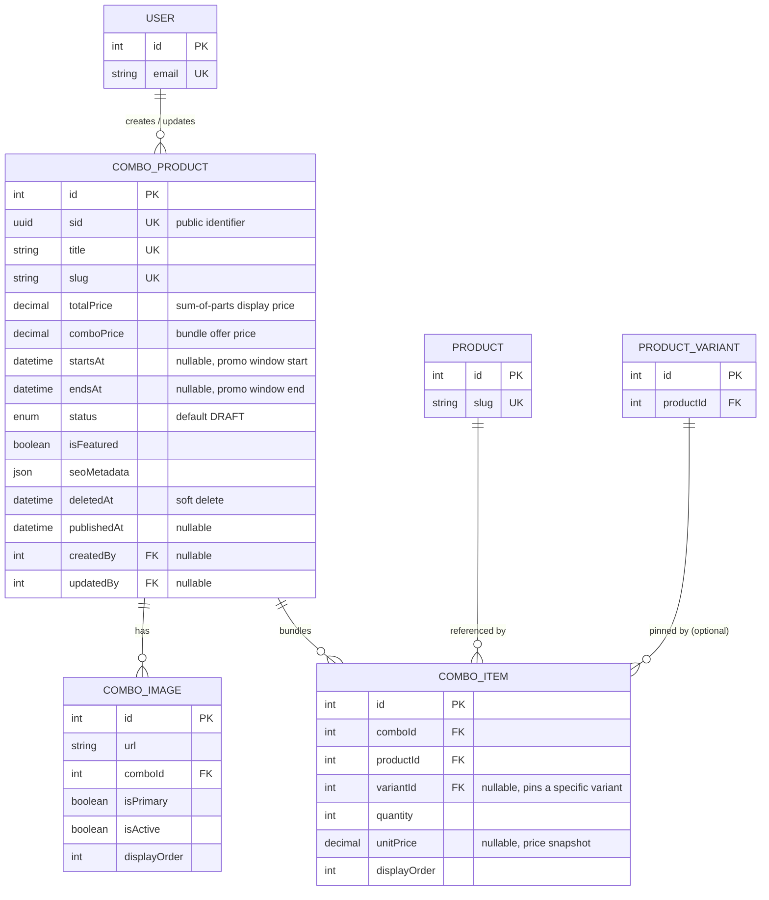

# Combo Domain — Schema & Developer Reference

This document is the schema reference for the **Combo domain**: `ComboProduct`, `ComboItem`, and `ComboImage` (defined in `prisma/schema/combo-product.prisma`). It covers the ERD, the full data dictionary, cascading rules, indexing strategy, and implementation guidance for backend developers building the `combo` module (time-boxed product bundles sold at a special price).

> Scope note: `Product`, `ProductVariant`, and `User` are documented elsewhere (`product.prisma`, `user.prisma`) — they appear here only as foreign-key targets needed to understand the Combo domain's relationships.

---

<details>
  <summary><b>Entity-Relationship Diagram (ERD)</b></summary>



**Cardinality legend:** `||--o{` = one-to-many (parent must exist, child count is 0..N). A `ComboProduct` owns its `ComboItem`/`ComboImage` rows outright (cascade-deleted with it); `ComboItem` merely *references* a `Product`/`ProductVariant` it does not own.

</details>

---

<details>
  <summary><b>Enum Definitions</b></summary>

### `CategoryProductStatus` (shared with `Category`/`Product`, defined in `shared.prisma`)

| Value      | Meaning                                                              |
| :--------- | :--------------------------------------------------------------------- |
| `ACTIVE`   | Live and visible on the storefront (subject to `publishedAt` gate).   |
| `INACTIVE` | Temporarily hidden, but not archived — can be reactivated freely.     |
| `DRAFT`    | Being authored, never shown publicly. **Default value on `ComboProduct` creation** — note this differs from `Product`, which defaults to `ACTIVE`; a combo must be explicitly published. |
| `ARCHIVED` | Retired/discontinued. Convention: pair with `deletedAt` on soft delete. |
| `HIDDEN`   | Exists and purchasable via direct link, but excluded from listings/search. |

> No enum is defined locally in `combo-product.prisma` — `status` reuses the cross-domain `CategoryProductStatus` rather than introducing a combo-specific status enum.

</details>

---

<details>
  <summary><b>Data Dictionary — ComboProduct</b></summary>

**Table purpose:** `ComboProduct` is the top-level bundle entity — a curated set of existing products/variants sold together at a special price for a limited time window. Kept as its own model rather than reusing `Product` because the lifecycle, pricing shape (two prices, not one + discount), and promotional window fields don't fit the single-product model. Maps to table `combo_products`.

| Field              | Type                          | Constraints                                             | Description                                                                 |
| :------------------ | :------------------------------ | :---------------------------------------------------------- | :---------------------------------------------------------------------------- |
| `id`                 | `INT`                           | PK, AUTOINCREMENT                                             | Internal numeric key; used for FK joins only, never exposed externally.       |
| `sid`                | `UUID`                          | UNIQUE, NOT NULL, DEFAULT `uuid()`                             | Public-facing identifier. Prevents ID enumeration/scraping.                   |
| `title`              | `VARCHAR(255)`                  | UNIQUE, NOT NULL                                               | English display title.                                                        |
| `slug`               | `VARCHAR(255)`                  | UNIQUE, NOT NULL                                               | URL-safe identifier — primary lookup key for the combo detail page.           |
| `description`        | `TEXT`                          | NULLABLE                                                       | Long-form English description.                                                |
| `shortDescription`   | `VARCHAR(500)`                  | NULLABLE                                                       | Truncated summary for cards/listings.                                         |
| `titleTh`            | `VARCHAR(255)`                  | NULLABLE                                                       | Thai display title.                                                           |
| `shortDescTh`        | `VARCHAR(500)`                  | NULLABLE                                                       | Thai summary.                                                                  |
| `descriptionTh`      | `TEXT`                          | NULLABLE                                                       | Thai long-form description.                                                   |
| `totalPrice`         | `DECIMAL(12,2)`                 | NOT NULL, DEFAULT `0`                                          | Sum-of-parts display price — either cached from item prices or entered manually. `Decimal` avoids floating-point rounding errors. |
| `comboPrice`         | `DECIMAL(12,2)`                 | NOT NULL, DEFAULT `0`                                          | The actual bundle price the customer pays. No DB constraint enforcing `comboPrice < totalPrice` — see [Financial Integrity](#2-financial-integrity--pricing). |
| `startsAt`           | `TIMESTAMP`                     | NULLABLE, `@map("starts_at")`                                    | Promotion window start. `null` = no start restriction.                        |
| `endsAt`             | `TIMESTAMP`                     | NULLABLE, `@map("ends_at")`                                      | Promotion window end. `null` = no end restriction — see [Promotion Window](#3-promotion-window-integrity). |
| `status`             | `ENUM(CategoryProductStatus)`   | NOT NULL, DEFAULT `DRAFT`                                      | Lifecycle/visibility state.                                                     |
| `isFeatured`         | `BOOLEAN`                       | NOT NULL, DEFAULT `false`                                      | Drives homepage/featured combo sections.                                       |
| `seoMetadata`        | `JSONB`                         | DEFAULT `{}`                                                   | `metaTitle`/`metaDescription` (EN + TH) — same convention as `Product.seoMetadata`. |
| `createdAt`          | `TIMESTAMP`                     | NOT NULL, DEFAULT `now()`, `@map("created_at")`                   | Row creation time.                                                             |
| `updatedAt`          | `TIMESTAMP`                     | NOT NULL, auto-updated, `@map("updated_at")`                      | Last modification time.                                                       |
| `deletedAt`          | `TIMESTAMP`                     | NULLABLE, `@map("deleted_at")`                                    | **Soft-delete marker.** Row is never physically deleted in normal operation.   |
| `publishedAt`        | `TIMESTAMP`                     | NULLABLE, `@map("published_at")`                                  | Scheduled-publish gate, same convention as `Product.publishedAt`.              |
| `createdBy`          | `INT`                           | FK → `users.id`, NULLABLE, **ON DELETE SET NULL**, `@map("created_by")` | Actor who created the row.                                                    |
| `updatedBy`          | `INT`                           | FK → `users.id`, NULLABLE, **ON DELETE SET NULL**, `@map("updated_by")` | Actor who last modified the row.                                              |

> Unlike `Product`, there is **no `deletedBy` column** — see [Known Gaps](#known-gaps--recommended-hardening).

</details>

---

<details>
  <summary><b>Data Dictionary — ComboItem</b></summary>

**Table purpose:** `ComboItem` is the join entity between a `ComboProduct` and the `Product` (optionally pinned to one `ProductVariant`) it bundles, carrying a quantity and an optional price snapshot. Maps to table `combo_items`.

| Field         | Type              | Constraints                                                        | Description                                                                 |
| :------------- | :------------------ | :---------------------------------------------------------------------- | :---------------------------------------------------------------------------- |
| `id`            | `INT`               | PK, AUTOINCREMENT                                                        | Internal key.                                                                 |
| `comboId`       | `INT`               | FK → `combo_products.id`, NOT NULL, **ON DELETE CASCADE**, `@map("combo_id")` | Owning combo.                                                                 |
| `productId`     | `INT`               | FK → `products.id`, NOT NULL, **ON DELETE RESTRICT**, `@map("product_id")`   | Bundled product. Restrict prevents deleting a product that's still bundled.   |
| `variantId`     | `INT`               | FK → `product_variants.id`, NULLABLE, **ON DELETE SET NULL**, `@map("variant_id")` | Optional: pins the item to a specific size/variant rather than the product generically. |
| `quantity`      | `INT`                | NOT NULL, DEFAULT `1`                                                    | How many units of this product/variant are included per combo purchase.       |
| `unitPrice`     | `DECIMAL(12,2)`       | NULLABLE                                                                | Snapshot of the unit price at the time the item was bundled — protects historical combo pricing/reporting from later product price changes. Nothing recomputes it automatically; see [Known Gaps](#known-gaps--recommended-hardening). |
| `displayOrder`  | `INT`                 | NOT NULL, DEFAULT `0`                                                    | Manual sort position within the combo's item list.                            |

**Constraints:** `@@unique([comboId, productId, variantId])` — prevents a literal duplicate row for the same `(combo, product, variant)` triple. See [Known Gaps](#known-gaps--recommended-hardening) for the nullable-`variantId` caveat.

</details>

---

<details>
  <summary><b>Data Dictionary — ComboImage</b></summary>

**Table purpose:** `ComboImage` stores combo-specific gallery imagery, mirroring `ProductImage`'s structure but scoped to a combo instead of a product/variant. Maps to table `combo_images`.

| Field           | Type            | Constraints                                                    | Description                                                          |
| :-------------- | :---------------- | :----------------------------------------------------------------- | :------------------------------------------------------------------------ |
| `id`             | `INT`             | PK, AUTOINCREMENT                                                     | Internal key.                                                             |
| `url`            | `VARCHAR(512)`      | NOT NULL                                                              | Full-size image URL.                                                     |
| `thumbnailUrl`   | `VARCHAR(512)`      | NULLABLE                                                              | Pre-resized thumbnail variant.                                           |
| `bannerUrl`      | `VARCHAR(512)`      | NULLABLE                                                              | Pre-resized banner/hero variant.                                         |
| `iconUrl`        | `VARCHAR(512)`      | NULLABLE                                                              | Pre-resized icon variant.                                                |
| `altText`        | `TEXT`               | NULLABLE                                                              | Accessibility / SEO alt text.                                            |
| `displayOrder`   | `INT`                | NOT NULL, DEFAULT `0`                                                 | Sort order within the combo's gallery.                                   |
| `isPrimary`      | `BOOLEAN`             | NOT NULL, DEFAULT `false`                                             | Marks the hero/cover image. **No DB constraint** prevents multiple primaries per combo — see Known Gaps. |
| `isActive`       | `BOOLEAN`             | NOT NULL, DEFAULT `true`                                              | Soft-hide an image without deleting it.                                  |
| `comboId`        | `INT`                 | FK → `combo_products.id`, NOT NULL, **ON DELETE CASCADE**, `@map("combo_id")` | Owning combo.                                                            |

</details>

---

<details>
  <summary><b>Example Data</b></summary>

**ComboProduct**

| title                       | status   | totalPrice | comboPrice | startsAt                 | endsAt                    | isFeatured |
| :--------------------------- | :------- | :--------- | :--------- | :--------------------------- | :---------------------------- | :---------- |
| **Wellness Starter Bundle**   | `ACTIVE` | `1850.00`  | `1499.00`  | `2026-07-01T00:00:00Z`         | `2026-07-31T23:59:59Z`          | `true`      |
| **Immune Boost Duo**          | `DRAFT`  | `620.00`   | `499.00`   | `null`                        | `null`                        | `false`     |
| **Back-to-School Health Kit** | `ARCHIVED` | `990.00` | `799.00`   | `2026-05-01T00:00:00Z`         | `2026-05-31T23:59:59Z`          | `false`     |

**ComboItem** (for `Wellness Starter Bundle`, `comboId = 1`)

| productId | variantId | quantity | unitPrice | displayOrder |
| :--------- | :--------- | :-------- | :--------- | :------------- |
| `12`       | `null`     | `1`       | `450.00`   | `0`             |
| `27`       | `104`      | `2`       | `700.00`   | `1`             |

</details>

---

<details>
  <summary><b>Example Usage (JSON Response)</b></summary>

**Active combo** (public storefront view):

```json
{
  "sid": "c1d2e3f4-5678-4abc-9def-0123456789ab",
  "title": "Wellness Starter Bundle",
  "titleTh": "ชุดเริ่มต้นสุขภาพดี",
  "slug": "wellness-starter-bundle",
  "status": "ACTIVE",
  "totalPrice": 1850.0,
  "comboPrice": 1499.0,
  "startsAt": "2026-07-01T00:00:00Z",
  "endsAt": "2026-07-31T23:59:59Z",
  "isFeatured": true,
  "seoMetadata": {
    "metaTitle": "Wellness Starter Bundle | Save 350 THB",
    "metaDescription": "Everything you need to start your wellness journey."
  },
  "items": [
    { "productId": 12, "variantId": null, "quantity": 1, "unitPrice": 450.0 },
    { "productId": 27, "variantId": 104, "quantity": 2, "unitPrice": 700.0 }
  ],
  "images": [
    { "url": "https://cdn.example.com/combo/wellness-bundle-hero.jpg", "isPrimary": true }
  ],
  "publishedAt": "2026-06-25T09:00:00Z"
}
```

**Draft combo with no promotion window** (back-office view with audit fields):

```json
{
  "sid": "d4e5f6a7-8901-4bcd-a234-56789abcdef0",
  "title": "Immune Boost Duo",
  "slug": "immune-boost-duo",
  "status": "DRAFT",
  "totalPrice": 620.0,
  "comboPrice": 499.0,
  "startsAt": null,
  "endsAt": null,
  "createdBy": 3,
  "createdAt": "2026-07-05T09:00:00Z"
}
```

</details>

---

<details>
  <summary><b>Relationships and Cascading Rules</b></summary>

| Parent → Child                                          | FK Column                | On Delete       | Effect                                                                     |
| :---------------------------------------------------------- | :--------------------------- | :----------------- | :-------------------------------------------------------------------------- |
| `ComboProduct` → `ComboItem`                                 | `ComboItem.comboId`           | **CASCADE**          | Deleting a combo deletes all its item rows.                                  |
| `ComboProduct` → `ComboImage`                                | `ComboImage.comboId`          | **CASCADE**          | Deleting a combo deletes all its gallery images.                             |
| `Product` → `ComboItem`                                      | `ComboItem.productId`         | **RESTRICT**         | A product bundled into any combo cannot be deleted — matches `product-db-schema.md`'s documentation of this same FK from `Product`'s side. |
| `ProductVariant` → `ComboItem`                               | `ComboItem.variantId`         | **SET NULL**         | Deleting the pinned variant loosens the item back to product-level (not removed from the combo). |
| `User` → `ComboProduct` (`createdByUser`/`updatedByUser`)     | `ComboProduct.createdBy`/`ComboProduct.updatedBy` | **SET NULL** | Deleting a user preserves the combo row; the audit pointer simply goes null. |

**Practical implications:**

- Because `Product → ComboItem` is `RESTRICT`, the product module's delete/archive flow must check for (or gracefully surface) "this product is currently bundled" before allowing deletion — soft-deleting the product instead is the safer default, same as `Product`'s own recommended pattern.
- `deletedAt` (soft delete) is the intended "remove from storefront" path for a combo — the hard `CASCADE` to `ComboItem`/`ComboImage` exists as a safety net for genuine data-purge operations, not normal combo retirement.
- Because both audit FKs on `ComboProduct` are `SET NULL`, back-office UI must handle `createdByUser: null`/`updatedByUser: null` gracefully rather than assuming an actor is always present.

</details>

---

<details>
  <summary><b>Performance Optimizations (Indexes)</b></summary>

### Current indexes (`combo-product.prisma`)

| Index                                   | Type              | Purpose                                                                    |
| :------------------------------------------ | :------------------ | :------------------------------------------------------------------------------ |
| `sid`, `title`, `slug` (each `@unique`)      | B-Tree (unique)      | Identity lookups; Prisma/Postgres creates one unique index per column automatically. |
| `@@index([slug])` (`ComboProduct`)           | B-Tree               | Explicit index for the primary detail-page lookup path — redundant with the unique index above, kept for parity with other domains (see e.g. `blog-db-schema.md`'s equivalent note). |
| `@@index([status, isFeatured])` (`ComboProduct`) | B-Tree (composite) | Fast featured/active combo listings on the storefront homepage.                |
| `@@index([startsAt, endsAt])` (`ComboProduct`)   | B-Tree (composite) | Window queries for "which combos are currently within their promotion period." |
| `@@unique([comboId, productId, variantId])` (`ComboItem`) | B-Tree (unique, composite) | Prevents duplicate bundling rows; also serves item lookups scoped to a combo. |
| `@@index([productId])`, `@@index([variantId])` (`ComboItem`) | B-Tree | "Which combos is this product/variant bundled into" reverse-lookups (e.g. for the product delete-guard check). |
| `@@index([comboId, isPrimary])` (`ComboImage`) | B-Tree (composite) | Fetching a combo's cover image without scanning the whole gallery.             |
| FK columns (`createdBy`, `updatedBy`)        | B-Tree (implicit)    | Prisma auto-creates an index on every relation scalar field.                    |

### Recommended future indexes (not yet implemented)

- **Partial unique index** `ON combo_images (combo_id) WHERE is_primary = true` — Prisma's schema DSL can't express partial indexes; add via a raw SQL migration to actually enforce "exactly one primary image per combo" (same gap as `ProductImage`, see `product-db-schema.md`).
- **Partial unique indexes scoped to live rows** on `title`/`slug` (`WHERE deleted_at IS NULL`) — today, soft-deleting a combo permanently reserves its title/slug, blocking a re-launch under the same identifier.

</details>

---

<details>
  <summary><b>Implementation & Best Practices</b></summary>

### 1. Why Combo Is Not Just Another Product

- `ComboProduct` is deliberately **not** modeled as a `Product` row with `type = COMBO` (that enum value is documented as reserved/legacy in `product-db-schema.md`). A combo has two prices (`totalPrice`/`comboPrice`, not one price + a discount tag), a promotion time window (`startsAt`/`endsAt`), and its content is a *set of references* to other products rather than owned inventory — different enough shape that reusing `Product` would mean a table full of nullable, combo-only columns.
- `ComboItem.unitPrice` exists specifically to **snapshot** the bundled product's price at bundling time, so that later price changes on the underlying `Product`/`ProductVariant` don't retroactively change historical combo pricing/reporting. Nothing populates or refreshes this automatically — the service layer must set it explicitly when an item is added to a combo.

### 2. Financial Integrity & Pricing

- `comboPrice` is the actual charge; `totalPrice` is informational (sum-of-parts, for showing a "you save X" comparison). There is **no DB `CHECK` constraint** enforcing `comboPrice <= totalPrice` — a combo priced *higher* than its parts is representable and will render an incoherent "discount." Validate this at the DTO/service boundary before writing, the same way `Product.salePrice < basePrice` is handled (see `product-db-schema.md`).
- As with every `Decimal(12,2)` column across this schema, do price arithmetic with `Decimal`-aware operations end-to-end — never coerce to plain JS `number` before math.

### 3. Promotion Window Integrity

- `startsAt`/`endsAt` are both nullable and independent — there is no `CHECK (startsAt < endsAt)`. A combo with `startsAt` after `endsAt` is representable and would never appear as "currently active" under a naive `startsAt <= NOW() <= endsAt` query. Validate the ordering at the DTO/service boundary.
- A combo is publicly "live" only when **all three** hold: `status == ACTIVE`, `publishedAt <= NOW()` (or `null`, by the same convention documented for `Product`), and it is within its `[startsAt, endsAt]` window (or those bounds are `null`, meaning unrestricted). Shape list queries to hit the `[startsAt, endsAt]` composite index for the window check.

### 4. Bundling Rules & the `ComboItem` Uniqueness Gap

- `@@unique([comboId, productId, variantId])` is meant to prevent the same product/variant from being bundled twice into one combo. Because `variantId` is **nullable**, and Postgres treats `NULL` as distinct from every other `NULL` in a unique index, this constraint does **not** actually block two rows of `(comboId, productId, NULL)` — i.e. the same product bundled twice at product-level (no variant pin). Enforce single-row-per-`(combo, product)` at product-level explicitly in the service layer (e.g. an existence check before insert) until this is hardened with a partial unique index or a generated non-null sentinel column.
- `Product → ComboItem` is `RESTRICT` specifically so a product actively sold inside a live combo can't be deleted out from under it — prefer soft-deleting/archiving the product instead, which combo listings must then account for when rendering bundle contents.

### 5. Known Gaps / Recommended Hardening

These are schema-level issues worth fixing before the `combo` module goes to production — not blockers for reading/understanding the current design, but real bugs waiting to happen:

- `ComboProduct` has **no `deletedBy` column**, unlike `Product`'s full `createdBy`/`updatedBy`/`deletedBy` triad — a soft-deleted combo has no record of which admin removed it.
- No DB `CHECK` enforcing `comboPrice <= totalPrice` (see [Financial Integrity](#2-financial-integrity--pricing)).
- No DB `CHECK` enforcing `startsAt < endsAt` (see [Promotion Window Integrity](#3-promotion-window-integrity)).
- `@@unique([comboId, productId, variantId])` does not prevent duplicate product-level (`variantId = null`) bundling rows, due to Postgres's NULL-is-distinct unique-index semantics (see [Bundling Rules](#4-bundling-rules--the-comboitem-uniqueness-gap)).
- No constraint enforces "exactly one `isPrimary` image" per combo — needs a partial unique index (raw migration), same gap as `ProductImage`.
- Soft-deleted combos permanently reserve their `title`/`slug` due to global (not partial) unique indexes.
- `ComboItem.unitPrice` has no backing trigger or service-layer guarantee that it's always set on insert — a `null` snapshot silently falls back to whatever the caller does at read time, which isn't specified anywhere in the schema itself.

</details>
