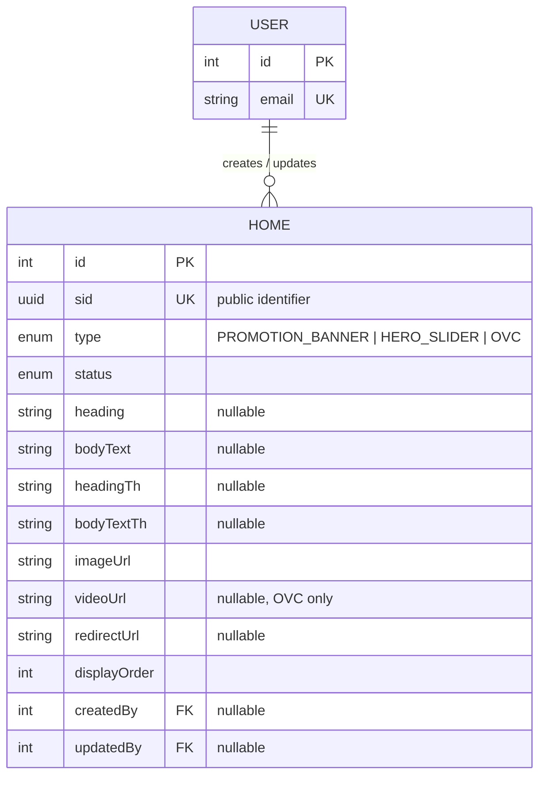

# Home Domain — Schema & Developer Reference

This document is the schema reference for the **Home domain**: `Home` (defined in `prisma/schema/home.prisma`). It covers the ERD, the full data dictionary, cascading rules, indexing strategy, and implementation guidance for backend developers building the `home` module (storefront landing-page content: hero slider, promotion banner, OVC).

> Scope note: `User` is documented elsewhere (`user.prisma`) — it appears here only as the `createdByUser`/`updatedByUser` foreign-key target needed to understand `Home`'s relationships.

---

<details>
  <summary><b>Entity-Relationship Diagram (ERD)</b></summary>



**Cardinality legend:** `||--o{` = one-to-many (parent must exist, child count is 0..N). A `User` may create/update zero or many `Home` rows; a `Home` row's `createdByUser`/`updatedByUser` are optional (nullable FK).

</details>

---

<details>
  <summary><b>Enum Definitions</b></summary>

### `HomeContentType`

| Value               | Meaning                                                                                          |
| :------------------- | :--------------------------------------------------------------------------------------------------- |
| `PROMOTION_BANNER`   | Image-only marketing banner. `heading`/`bodyText` are typically left `null` for this type.            |
| `HERO_SLIDER`        | Homepage carousel slide. The only type expected to populate `heading`/`bodyText` (+ Thai variants).   |
| `OVC`                | Online Video Commercial (web/social media). Expected to populate `videoUrl`; `heading`/`bodyText` optional. |

> All three content kinds share one table (single polymorphic model, not three separate tables) because they're all "an ordered, schedulable piece of homepage content with an image" — see [Implementation & Best Practices](#1-polymorphic-content-model) for the trade-off this creates.

### `HomeContentStatus`

| Value      | Meaning                                                              |
| :--------- | :--------------------------------------------------------------------- |
| `ACTIVE`   | Live and visible on the storefront homepage. Default value on creation. |
| `INACTIVE` | Hidden but retained in the database — the intended "pause, don't destroy" path (no soft-delete field exists — see [Known Gaps](#known-gaps--recommended-hardening)). |

</details>

---

<details>
  <summary><b>Data Dictionary — Home</b></summary>

**Table purpose:** `Home` is a single polymorphic content entity backing every homepage/landing-page section — hero slider, promotion banner, and OVC. `type` discriminates which of the optional fields below are actually in use for a given row. It owns display copy (EN + TH), imagery, an optional click-through target, manual ordering, and the full audit trail.

| Field           | Type                     | Constraints                                          | Description                                                                 |
| :--------------- | :------------------------- | :------------------------------------------------------ | :---------------------------------------------------------------------------- |
| `id`              | `INT`                      | PK, AUTOINCREMENT                                        | Internal numeric key; used for FK joins only, never exposed externally.       |
| `sid`             | `UUID`                     | UNIQUE, NOT NULL, DEFAULT `uuid()`                        | Public-facing identifier. Prevents ID enumeration/scraping.                   |
| `type`            | `ENUM(HomeContentType)`    | NOT NULL                                                 | Discriminates hero slide / promotion banner / OVC. No default — every row must declare its type explicitly. |
| `status`          | `ENUM(HomeContentStatus)`  | NOT NULL, DEFAULT `ACTIVE`                                | Lifecycle/visibility state.                                                    |
| `heading`         | `VARCHAR(255)`             | NULLABLE                                                 | English slide heading. Populated for `HERO_SLIDER`; expected `null` for `PROMOTION_BANNER`. |
| `bodyText`        | `TEXT`                     | NULLABLE                                                 | English body copy, paired with `heading`.                                     |
| `headingTh`       | `VARCHAR(255)`             | NULLABLE                                                 | Thai heading, mirrors `heading`.                                              |
| `bodyTextTh`      | `TEXT`                     | NULLABLE                                                 | Thai body copy, mirrors `bodyText`.                                           |
| `imageUrl`        | `VARCHAR(512)`             | NOT NULL                                                 | Cover image, required for every type (including `OVC`, as a video thumbnail). |
| `videoUrl`        | `VARCHAR(512)`             | NULLABLE                                                 | Video source, populated for `OVC` only.                                       |
| `redirectUrl`     | `VARCHAR(512)`             | NULLABLE                                                 | Click-through target, e.g. a "Shop Now"/"Learn More" destination.             |
| `displayOrder`    | `INT`                      | NOT NULL, DEFAULT `0`                                     | Manual sort position within its `type` (carousel/list order).                 |
| `createdAt`       | `TIMESTAMP`                | NOT NULL, DEFAULT `now()`                                 | Row creation time.                                                             |
| `updatedAt`       | `TIMESTAMP`                | NOT NULL, auto-updated                                    | Last modification time.                                                       |
| `createdBy`       | `INT`                      | FK → `users.id`, NULLABLE, **ON DELETE SET NULL**          | Actor who created the row.                                                    |
| `updatedBy`       | `INT`                      | FK → `users.id`, NULLABLE, **ON DELETE SET NULL**          | Actor who last modified the row.                                              |

</details>

---

<details>
  <summary><b>Example Data</b></summary>

| type                | status     | heading                    | imageUrl                                | videoUrl                          | redirectUrl              | displayOrder |
| :------------------- | :---------- | :---------------------------- | :------------------------------------------ | :------------------------------------ | :--------------------------- | :------------- |
| `HERO_SLIDER`         | `ACTIVE`   | `"Better Health Made Simple"` | `https://cdn.example.com/hero/couple.jpg`    | `null`                                 | `/products`                    | `0`             |
| `HERO_SLIDER`         | `INACTIVE` | `"Better Health Made Simple"` | `https://cdn.example.com/hero/woman.jpg`     | `null`                                 | `/products`                    | `1`             |
| `PROMOTION_BANNER`    | `ACTIVE`   | `null`                          | `https://cdn.example.com/promo/sale-50.jpg`  | `null`                                 | `/promotions/save-50`          | `0`             |
| `PROMOTION_BANNER`    | `INACTIVE` | `null`                          | `https://cdn.example.com/promo/sale-old.jpg` | `null`                                 | `/promotions/expired`          | `1`             |
| `OVC`                 | `ACTIVE`   | `null`                          | `https://cdn.example.com/ovc/thumb.jpg`      | `https://cdn.example.com/ovc/ad.mp4`   | `https://youtube.com/watch?v=x` | `0`             |

</details>

---

<details>
  <summary><b>Example Usage (JSON Response)</b></summary>

**Hero slider** (bilingual, active carousel slide):

```json
{
  "sid": "c1d2e3f4-5678-4abc-9def-0123456789ab",
  "type": "HERO_SLIDER",
  "status": "ACTIVE",
  "heading": "Better Health Made Simple",
  "bodyText": "Science-backed healthcare products designed to support your daily health",
  "headingTh": "สุขภาพที่ดีทำได้ง่ายๆ",
  "bodyTextTh": "ผลิตภัณฑ์เพื่อสุขภาพที่มีหลักฐานทางวิทยาศาสตร์รองรับ",
  "imageUrl": "https://cdn.example.com/hero/couple.jpg",
  "redirectUrl": "/products",
  "displayOrder": 0
}
```

**Promotion banner** (image-only, no heading/body):

```json
{
  "sid": "d4e5f6a7-8901-4bcd-a234-56789abcdef0",
  "type": "PROMOTION_BANNER",
  "status": "ACTIVE",
  "heading": null,
  "bodyText": null,
  "imageUrl": "https://cdn.example.com/promo/sale-50.jpg",
  "redirectUrl": "/promotions/save-50",
  "displayOrder": 0
}
```

**OVC** (video content, back-office view with audit fields):

```json
{
  "sid": "f47ac10b-58cc-4372-a567-0e02b2c3d479",
  "type": "OVC",
  "status": "ACTIVE",
  "imageUrl": "https://cdn.example.com/ovc/thumb.jpg",
  "videoUrl": "https://cdn.example.com/ovc/ad.mp4",
  "redirectUrl": "https://youtube.com/watch?v=x",
  "displayOrder": 0,
  "createdBy": 3,
  "createdAt": "2026-07-01T09:00:00Z"
}
```

</details>

---

<details>
  <summary><b>Relationships and Cascading Rules</b></summary>

| Parent → Child                                | FK Column         | On Delete       | Effect                                                                     |
| :----------------------------------------------- | :------------------- | :----------------- | :-------------------------------------------------------------------------- |
| `User` → `Home` (`createdByUser`/`updatedByUser`) | `Home.createdBy`/`Home.updatedBy` | **SET NULL** | Deleting a user preserves the homepage content row; the audit pointer simply goes null. |

**Practical implications:**

- There is no soft-delete field (`deletedAt`) on `Home` — removing a row is a hard delete today. `status = INACTIVE` is the intended "hide, don't destroy" path rather than issuing a `DELETE`, matching the convention used by `Blog`.
- Because both audit FKs are `SET NULL`, back-office UI must handle `createdByUser: null`/`updatedByUser: null` gracefully (e.g. render "System" as a fallback) rather than assuming an actor is always present.

</details>

---

<details>
  <summary><b>Performance Optimizations (Indexes)</b></summary>

### Current indexes (`home.prisma`)

| Index                                   | Type              | Purpose                                                                    |
| :------------------------------------------ | :------------------ | :------------------------------------------------------------------------------ |
| `sid` (`@unique`)                            | B-Tree (unique)      | Identity lookup; Prisma/Postgres creates this automatically.                    |
| `@@index([type, status, displayOrder])`      | B-Tree (composite)   | The actual homepage query pattern: active rows of one section type, in manual order. Leads with `type` first since a single query never spans multiple content kinds. |
| FK columns (`createdBy`, `updatedBy`)        | B-Tree (implicit)    | Prisma auto-creates an index on every relation scalar field.                    |

### Recommended future indexes (not yet implemented)

- **Partial unique index** on `PROMOTION_BANNER`/`OVC` rows if a hard cap ("at most N active banners") is ever required — Prisma's schema DSL can't express partial indexes; add via a raw SQL migration.

</details>

---

<details>
  <summary><b>Implementation & Best Practices</b></summary>

### 1. Polymorphic Content Model

- `Home` intentionally covers three different content kinds in one table rather than three separate models (`HeroSlide`, `PromotionalBanner`, `Ovc`) — this keeps the homepage read query to a single shape (`where: { type, status }, orderBy: { displayOrder: 'asc' }`) instead of a fan-out across tables.
- The cost of that choice: **the database does not enforce which fields are required per `type`.** Nothing stops an `OVC` row from being inserted with `videoUrl: null`, or a `PROMOTION_BANNER` row with `heading` filled in. Per-type required-field validation must live in the DTO/service layer (e.g. a `class-validator` custom validator keyed on `type`) before it ever reaches Prisma.

### 2. Bilingual Content

- `heading`/`bodyText` (English) and `headingTh`/`bodyTextTh` (Thai) follow the same pairing convention used by `Category` (`name`/`nameTh`) — always write both together for `HERO_SLIDER` rows; a `null` Thai field means "fall back to English" at render time, not "untranslated error."

### 3. Ordering & Scheduling

- `displayOrder` is scoped per `type` in practice (two `HERO_SLIDER` rows can both be `displayOrder = 0`; that's fine, since list queries always filter by `type` first via the composite index). Don't assume global uniqueness across types.
- There is no `startAt`/`endAt` scheduling window on this table — a row is either `ACTIVE` now or it isn't. If campaign scheduling becomes a requirement, add nullable `startAt`/`endAt` columns and extend the composite index accordingly, rather than modeling it in the service layer with cron toggling `status`.

### 4. Known Gaps / Recommended Hardening

These are schema-level issues worth fixing before the `home` module goes to production — not blockers for reading/understanding the current design, but real bugs waiting to happen:

- No soft-delete field (`deletedAt`) — deleting a row is permanent. Use `status = INACTIVE` as the "hide" path.
- No DB-level enforcement of per-`type` required fields (see [Polymorphic Content Model](#1-polymorphic-content-model)) — a malformed row (e.g. `HERO_SLIDER` with no `heading`) is only caught if the service layer validates it.
- No mobile-specific image variant (`mobileImageUrl`) — if the storefront needs a different crop for small viewports, this table doesn't yet carry it.

</details>
