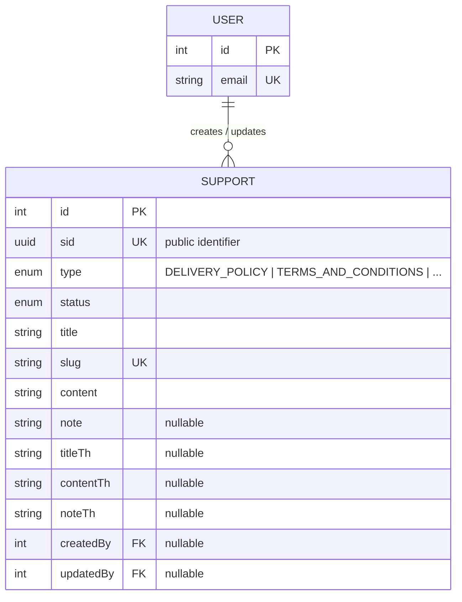

# Support Domain — Schema & Developer Reference

This document is the schema reference for the **Support domain**: `Support` (defined in `prisma/schema/support.prisma`). It covers the ERD, the full data dictionary, cascading rules, indexing strategy, and implementation guidance for backend developers building the `support` module (static support/policy pages: Delivery Policy, Terms & Conditions, Privacy Policy, Cancellation Policy, Return Policy).

> Scope note: `User` is documented elsewhere (`user.prisma`) — it appears here only as the `createdByUser`/`updatedByUser` foreign-key target needed to understand `Support`'s relationships.

---

<details>
  <summary><b>Entity-Relationship Diagram (ERD)</b></summary>



**Cardinality legend:** `||--o{` = one-to-many (parent must exist, child count is 0..N). A `User` may create/update zero or many `Support` rows; a `Support` row's `createdByUser`/`updatedByUser` are optional (nullable FK).

</details>

---

<details>
  <summary><b>Enum Definitions</b></summary>

### `SupportType`

| Value                   | Meaning                                                                                          |
| :----------------------- | :----------------------------------------------------------------------------------------------- |
| `DELIVERY_POLICY`        | Shipping/delivery terms. Singleton page by convention — one row.                                  |
| `TERMS_AND_CONDITIONS`   | Site-wide terms of use. Singleton page by convention.                                             |
| `PRIVACY_POLICY`         | Data/privacy handling terms. Singleton page by convention.                                        |
| `CANCELLATION_POLICY`    | Order cancellation terms. Singleton page by convention.                                           |
| `RETURN_POLICY`          | Return/refund terms. Singleton page by convention.                                                |
| `OTHERS`                 | Catch-all for any policy/info page not covered above. **Not** singleton — may have multiple rows, disambiguated by `slug`. |

> The five named types are enforced as one-row-per-type **in the service layer only** — there is no DB-level partial unique constraint (Prisma's schema DSL can't express one; see [Known Gaps](#known-gaps--recommended-hardening)). `OTHERS` is the deliberate exception and is looked up by `slug`, not `type`.

### `SupportStatus`

| Value      | Meaning                                                                 |
| :--------- | :----------------------------------------------------------------------- |
| `ACTIVE`   | Live and visible on the storefront. Default value on creation.           |
| `INACTIVE` | Hidden but retained in the database — the intended "pause, don't destroy" path (no soft-delete field exists — see [Known Gaps](#known-gaps--recommended-hardening)). |
| `DRAFT`    | Being authored, never shown publicly.                                    |

</details>

---

<details>
  <summary><b>Data Dictionary — Support</b></summary>

**Table purpose:** `Support` is a single content entity backing every static support/policy page rendered as a tab on the storefront (Delivery Policy, Terms & Conditions, Privacy Policy, Cancellation Policy, Return Policy) plus an open-ended `OTHERS` bucket for anything else. It owns display copy (EN + TH), an optional extra note/disclaimer, and the full audit trail. Maps to table `support_pages`.

| Field           | Type                    | Constraints                                         | Description                                                                 |
| :--------------- | :------------------------ | :----------------------------------------------------- | :---------------------------------------------------------------------------- |
| `id`              | `INT`                     | PK, AUTOINCREMENT                                       | Internal numeric key; used for FK joins only, never exposed externally.       |
| `sid`             | `UUID`                    | UNIQUE, NOT NULL, DEFAULT `uuid()`                       | Public-facing identifier. Prevents ID enumeration/scraping.                   |
| `type`            | `ENUM(SupportType)`       | NOT NULL                                                | Which tab/route this row belongs to. No default — every row must declare its type explicitly. |
| `status`          | `ENUM(SupportStatus)`     | NOT NULL, DEFAULT `ACTIVE`                               | Lifecycle/visibility state.                                                    |
| `title`           | `VARCHAR(255)`            | NOT NULL                                                | English page title. Source for the generated `slug`.                          |
| `slug`            | `VARCHAR(255)`            | UNIQUE, NOT NULL                                        | URL-safe identifier — primary lookup key for the public page, and the only way to disambiguate multiple `OTHERS` rows. |
| `content`         | `TEXT`                    | NOT NULL                                                | Full English page body (assumed HTML/rich text — enforced by the DTO/editor layer, not the DB). |
| `note`            | `TEXT`                    | NULLABLE                                                | Extra note/disclaimer rendered below the main content.                        |
| `titleTh`         | `VARCHAR(255)`            | NULLABLE                                                | Thai title, mirrors `title`.                                                  |
| `contentTh`       | `TEXT`                    | NULLABLE                                                | Thai page body, mirrors `content`.                                            |
| `noteTh`          | `TEXT`                    | NULLABLE                                                | Thai extra note, mirrors `note`.                                              |
| `createdAt`       | `TIMESTAMP`               | NOT NULL, DEFAULT `now()`                                | Row creation time.                                                             |
| `updatedAt`       | `TIMESTAMP`               | NOT NULL, auto-updated                                   | Last modification time.                                                       |
| `createdBy`       | `INT`                     | FK → `users.id`, NULLABLE, **ON DELETE SET NULL**         | Actor who created the row.                                                    |
| `updatedBy`       | `INT`                     | FK → `users.id`, NULLABLE, **ON DELETE SET NULL**         | Actor who last modified the row.                                              |

</details>

---

<details>
  <summary><b>Example Data</b></summary>

| type                    | status     | title                    | slug                       | note                                              |
| :----------------------- | :---------- | :-------------------------- | :---------------------------- | :--------------------------------------------------- |
| `DELIVERY_POLICY`         | `ACTIVE`   | `Delivery Policy`            | `delivery-policy`               | `Delivery times may vary during public holidays.`      |
| `TERMS_AND_CONDITIONS`    | `ACTIVE`   | `Terms & Conditions`         | `terms-conditions`              | `null`                                                 |
| `PRIVACY_POLICY`          | `ACTIVE`   | `Privacy Policy`             | `privacy-policy`                | `null`                                                 |
| `CANCELLATION_POLICY`     | `DRAFT`    | `Cancellation Policy`        | `cancellation-policy`           | `null`                                                 |
| `RETURN_POLICY`           | `ACTIVE`   | `Return Policy`              | `return-policy`                 | `Custom orders are non-refundable.`                     |
| `OTHERS`                  | `ACTIVE`   | `COVID-19 Store Advisory`    | `covid-19-store-advisory`       | `null`                                                 |

</details>

---

<details>
  <summary><b>Example Usage (JSON Response)</b></summary>

**Delivery Policy** (public storefront view):

```json
{
  "sid": "c1d2e3f4-5678-4abc-9def-0123456789ab",
  "type": "DELIVERY_POLICY",
  "title": "Delivery Policy",
  "slug": "delivery-policy",
  "content": "Orders are delivered within 3-5 business days across Thailand.",
  "note": "Delivery times may vary during public holidays.",
  "titleTh": "นโยบายการจัดส่ง",
  "contentTh": null,
  "noteTh": null
}
```

**Ad-hoc OTHERS page** (back-office view with audit fields):

```json
{
  "sid": "d4e5f6a7-8901-4bcd-a234-56789abcdef0",
  "type": "OTHERS",
  "status": "ACTIVE",
  "title": "COVID-19 Store Advisory",
  "slug": "covid-19-store-advisory",
  "content": "<p>Store hours are temporarily reduced...</p>",
  "note": null,
  "createdBy": 3,
  "createdAt": "2026-07-01T09:00:00Z"
}
```

</details>

---

<details>
  <summary><b>Relationships and Cascading Rules</b></summary>

| Parent → Child                                       | FK Column                          | On Delete       | Effect                                                                     |
| :------------------------------------------------------ | :------------------------------------ | :----------------- | :-------------------------------------------------------------------------- |
| `User` → `Support` (`createdByUser`/`updatedByUser`)     | `Support.createdBy`/`Support.updatedBy` | **SET NULL**       | Deleting a user preserves the support page; the audit pointer simply goes null. |

**Practical implications:**

- There is no soft-delete field (`deletedAt`) on `Support` — removing a row is a hard delete today. `status = INACTIVE` is the intended "hide, don't destroy" path rather than issuing a `DELETE`, matching the convention used by `Home`/`Blog`.
- Because both audit FKs are `SET NULL`, back-office UI must handle `createdByUser: null`/`updatedByUser: null` gracefully (e.g. render "System" as a fallback) rather than assuming an actor is always present.

</details>

---

<details>
  <summary><b>Performance Optimizations (Indexes)</b></summary>

### Current indexes (`support.prisma`)

| Index                              | Type              | Purpose                                                                    |
| :------------------------------------ | :------------------ | :------------------------------------------------------------------------------ |
| `sid`, `slug` (each `@unique`)         | B-Tree (unique)      | Identity lookups; Prisma/Postgres creates one unique index per column automatically. |
| `@@index([slug])`                     | B-Tree               | Redundant with the unique index above, but explicit for the primary detail-page lookup path — see Known Gaps. |
| `@@index([type, status])`             | B-Tree (composite)   | The actual query pattern for a single policy tab: "the active row for this type." Leads with `type` first since a lookup never spans multiple types. |
| FK columns (`createdBy`, `updatedBy`) | B-Tree (implicit)    | Prisma auto-creates an index on every relation scalar field.                    |

### Recommended future indexes (not yet implemented)

- **Partial unique index** on `type` for every value except `OTHERS`, once Postgres-level enforcement of "one row per named policy type" is required — Prisma's schema DSL can't express partial indexes; add via a raw SQL migration.

</details>

---

<details>
  <summary><b>Implementation & Best Practices</b></summary>

### 1. Singleton-by-Convention Types

- The five named `SupportType` values are meant to have **exactly one row each** — but nothing in the schema enforces that. `SupportService.createSupport` does not currently check for an existing row of the same `type` before inserting a second one; only the `slug` uniqueness constraint (derived from `title`) prevents an exact duplicate title. Two `DELIVERY_POLICY` rows with different titles can coexist today, and `findActiveByType` will silently return whichever one Postgres happens to pick first — see [Known Gaps](#known-gaps--recommended-hardening).
- `OTHERS` is the intentional exception and is designed to have multiple rows, resolved by `slug` via `findActiveBySlug`/`GET /support/page/:slug` — never by `type`.

### 2. Bilingual Content

- `title`/`content`/`note` (English) and `titleTh`/`contentTh`/`noteTh` (Thai) follow the same pairing convention used by `Category` (`name`/`nameTh`) and `Home` (`heading`/`headingTh`) — a `null` Thai field means "fall back to English" at render time, not "untranslated error."

### 3. Slug Generation & Immutability

- `slug` is derived once from `title` via `generateSlug()` on create, and re-derived (with a collision check against other rows) if `title` changes on update — mirrors `Category`'s slug-regeneration pattern. `type` itself is immutable after creation (deliberately omitted from `UpdateSupportDto`) — delete and re-create instead of re-typing a row.
- Because `slug` is the primary lookup key for the public detail route, treat it as effectively stable in practice; a `title` edit that changes the slug will break any bookmarked/indexed URL to that page (no redirect mechanism exists).

### 4. Known Gaps / Recommended Hardening

These are schema-level and service-level issues worth fixing before the `support` module goes to production — not blockers for reading/understanding the current design, but real bugs waiting to happen:

- No DB-level (or service-level) enforcement of "one row per named `SupportType`" — see [Singleton-by-Convention Types](#1-singleton-by-convention-types). A second `DELIVERY_POLICY` row can be created today with no error, and which one the public endpoint serves is undefined.
- No soft-delete field (`deletedAt`) — deleting a page is permanent.
- `@@index([slug])` is redundant given `slug` already has a `@unique` constraint (which Postgres backs with its own B-Tree index) — safe to drop unless there's a specific query-planner reason to keep both.
- No slug-history/redirect table — renaming `title` changes the public URL with no forwarding for the old one.

</details>
