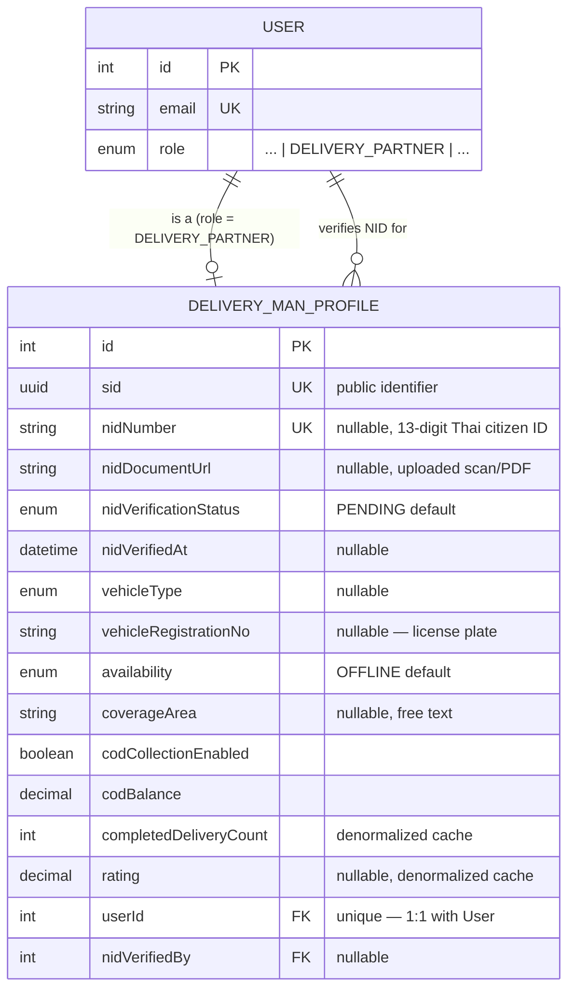

# Delivery Man Module (In-House Delivery Staff)

NID/KYC verification, vehicle info, dispatch availability, and COD (cash-on-delivery) settlement for the storefront's **Set Up → Delivery Man** admin tab: `DeliveryManProfile`, a 1:1 extension of `User` for staff with `role = DELIVERY_PARTNER`.

> **Not the same thing as `DeliveryProvider`/`DeliveryZone`/`DeliveryShipment`** (`delivery.prisma`, see [delivery.md](./delivery.md)). Those model **outsourced third-party couriers** — companies with no login and no `User` row, the Set Up page's separate **"External Delivery Service"** tab. This module is for **real people who work for the business** — the **"Delivery Man"** tab shown in the screenshot this doc was written from.

Schema source: `prisma/schema/delivery-man.prisma` (model `DeliveryManProfile`; enums `DeliveryVehicleType`, `DeliveryAvailability`, `DeliveryEmploymentType`, `NidVerificationStatus`).
Module source: **not implemented yet.** This doc is a schema + API **design**, written before any `src/modules/delivery-man/` code exists — see [API End Point & Business Logic (Planned)](#api-end-point--business-logic-planned).

> **Scope note:** `User`/`Profile`/`Address` are documented in their own references (`user.md`, `address.md`) — they appear here only as the relationship this domain is built on top of. `Image`/`Name`/`Number`/`Email`/`Address` (the Set Up table's first five columns) are deliberately **not** duplicated onto `DeliveryManProfile` — they already exist on `User`/`Profile`/`Address` and are reused as-is. See [Conventions](#conventions-1).

---

### DB Schema

#### Entity-Relationship Diagram (ERD)



**Cardinality legend:** `||--o|` = one-to-one, optional on the child side (a `User` has at most one `DeliveryManProfile`; most `User` rows have none — only `role = DELIVERY_PARTNER` accounts). `||--o{` = one-to-many, optional (an admin `User` may verify zero or many NID submissions).

---

#### Enum Definitions

##### `DeliveryVehicleType`

| Value        | Meaning                                                           |
| :----------- | :------------------------------------------------------------------ |
| `BICYCLE`    | Pedal bicycle.                                                        |
| `MOTORCYCLE` | Motorbike/scooter — the common case for Thai last-mile delivery.      |
| `CAR`        | Passenger car.                                                        |
| `VAN`        | Van/pickup, for bulkier orders.                                       |
| `ON_FOOT`    | No vehicle — walking routes only.                                     |

##### `DeliveryAvailability`

| Value         | Meaning                                                                                                  |
| :------------ | :----------------------------------------------------------------------------------------------------------- |
| `AVAILABLE`   | On shift, not currently carrying an order — eligible for new assignment.                                       |
| `ON_DELIVERY` | Currently carrying one or more orders.                                                                          |
| `OFFLINE`     | Off shift / not working right now. **Default value on creation** — a newly onboarded delivery man isn't dispatched to until someone actively puts them on shift. |
| `ON_LEAVE`    | Approved leave/vacation — distinct from `OFFLINE` so dispatch tooling can tell "not working today" from "took planned leave" apart. |

> This is a real-time **dispatch** state, not an account-lifecycle state — see [`UserStatus` vs. `DeliveryAvailability`](#userstatus-vs-deliveryavailability-read-this-first). This is the most important modeling decision in this domain.

##### `DeliveryEmploymentType`

| Value       | Meaning                                    |
| :---------- | :-------------------------------------------- |
| `FULL_TIME` | Salaried, full-time staff.                      |
| `PART_TIME` | Salaried, part-time/shift-based.                |
| `CONTRACT`  | Fixed-term contractor.                          |
| `GIG`       | Per-delivery gig worker, no fixed schedule.      |

##### `NidVerificationStatus`

| Value      | Meaning                                                                                            |
| :--------- | :------------------------------------------------------------------------------------------------------ |
| `PENDING`  | NID number + document submitted, awaiting admin review. **Default value.**                                 |
| `VERIFIED` | An admin confirmed the document matches the entered number and the person.                                 |
| `REJECTED` | An admin rejected the submission (mismatch, blurry scan, expired ID, etc.) — the delivery man must resubmit. |

---

#### Data Dictionary — DeliveryManProfile

**Table purpose:** the 1:1 extension of `User` holding everything specific to being an in-house delivery staff member — NID/KYC identity verification, vehicle/operational info, employment metadata, and COD settlement. Deliberately does **not** duplicate `avatarUrl`/name/phone/email/address, which already live on `Profile`/`User`/`Address`. Maps to table `delivery_man_profiles`.

| Field                     | Type                            | Constraints                                                          | Description                                                                                                       |
| :------------------------- | :--------------------------------- | :------------------------------------------------------------------------ | :----------------------------------------------------------------------------------------------------------------- |
| `id`                        | `INT`                              | PK, AUTOINCREMENT                                                            | Internal numeric key; FK joins only, never exposed externally.                                                      |
| `sid`                       | `UUID`                             | UNIQUE, NOT NULL, DEFAULT `uuid()`, `@db.Uuid`                                | Public-facing identifier. Prevents ID enumeration/scraping.                                                         |
| `nidNumber`                 | `VARCHAR(13)`                      | UNIQUE, NULLABLE, `@map("nid_number")`                                        | Thai 13-digit national ID number. Nullable — collected during onboarding, not guaranteed at row-creation time. No format/checksum validation at the DB level — see [Known Gaps](#known-gaps--recommended-hardening). |
| `nidDocumentUrl`            | `VARCHAR`                          | NULLABLE, `@map("nid_document_url")`                                          | Path to the uploaded scan/PDF of the physical ID card — the **"NID.pdf"** link in the mockup. Never served from a public path — see [NID / KYC Verification Workflow](#nid--kyc-verification-workflow). |
| `nidVerificationStatus`     | `ENUM(NidVerificationStatus)`      | NOT NULL, DEFAULT `PENDING`, `@map("nid_verification_status")`                | KYC review state.                                                                                                     |
| `nidVerifiedAt`             | `TIMESTAMPTZ(3)`                   | NULLABLE, `@map("nid_verified_at")`                                           | When an admin last set `VERIFIED`/`REJECTED`.                                                                        |
| `vehicleType`               | `ENUM(DeliveryVehicleType)`        | NULLABLE, `@map("vehicle_type")`                                              | Not required at creation — some delivery men may onboard before their vehicle is confirmed.                          |
| `vehicleRegistrationNo`     | `VARCHAR(50)`                      | NULLABLE, `@map("vehicle_registration_no")`                                   | License plate. Not format-validated — Thai plates vary by province/vehicle class.                                    |
| `drivingLicenseNo`          | `VARCHAR(50)`                      | NULLABLE, `@map("driving_license_no")`                                        | Optional; only meaningful for motorized `vehicleType`s.                                                              |
| `availability`              | `ENUM(DeliveryAvailability)`       | NOT NULL, DEFAULT `OFFLINE`                                                    | Real-time dispatch state — **not** the same thing as account status, see below.                                       |
| `coverageArea`              | `VARCHAR(255)`                     | NULLABLE, `@map("coverage_area")`                                             | Free-text description of the delivery area. Not normalized/queryable — see [Known Gaps](#known-gaps--recommended-hardening). |
| `employmentType`            | `ENUM(DeliveryEmploymentType)`     | NULLABLE, `@map("employment_type")`                                           | Optional HR metadata.                                                                                                 |
| `joinedAt`                  | `TIMESTAMPTZ(3)`                   | NULLABLE, `@map("joined_at")`                                                 | Distinct from `User.createdAt` — an account row can exist before the actual start date is confirmed.                 |
| `codCollectionEnabled`      | `BOOLEAN`                          | NOT NULL, DEFAULT `false`, `@map("cod_collection_enabled")`                   | Whether this person is trusted to collect cash on delivery. Should be gated behind `nidVerificationStatus = VERIFIED` in the service layer — not enforced by the schema. |
| `codBalance`                | `DECIMAL(12,2)`                    | NOT NULL, DEFAULT `0`, `@map("cod_balance")`                                  | Cash currently held, pending settlement to the business. See [COD Settlement](#cod-cash-on-delivery-settlement).      |
| `bankName`                  | `VARCHAR(100)`                     | NULLABLE, `@map("bank_name")`                                                 | For COD settlement payouts / salary, if paid via this system.                                                        |
| `bankAccountName`           | `VARCHAR(200)`                     | NULLABLE, `@map("bank_account_name")`                                         | Should match the NID holder's legal name — not enforced by the schema.                                               |
| `bankAccountNumber`         | `VARCHAR(50)`                      | NULLABLE, `@map("bank_account_number")`                                       | Sensitive — same access-control caveat as the NID fields, see [Known Gaps](#known-gaps--recommended-hardening).       |
| `completedDeliveryCount`    | `INT`                              | NOT NULL, DEFAULT `0`, `@map("completed_delivery_count")`                     | **Denormalized cache**, not a live count — see [Performance Fields Are Caches](#performance-fields-are-caches-not-live-counts). |
| `rating`                    | `DECIMAL(3,2)`                     | NULLABLE                                                                       | 0.00–5.00. Same denormalized-cache caveat as `completedDeliveryCount`.                                                |
| `createdAt`/`updatedAt`     | `TIMESTAMPTZ(3)`                   | NOT NULL, `@map("created_at"/"updated_at")`                                   | Standard audit timestamps.                                                                                            |
| `userId`                    | `INT`                              | FK → `users.id`, UNIQUE, NOT NULL, **ON DELETE CASCADE**, `@map("user_id")`     | The underlying account. Deleting the `User` deletes this extension row — matches `Profile`/`UserSecurity`.            |
| `nidVerifiedBy`             | `INT`                              | FK → `users.id`, NULLABLE, **ON DELETE SET NULL**, `@map("nid_verified_by")`   | Which admin reviewed the NID submission. Deleting that admin preserves the record, nulling the actor.                 |

---

#### Relationships and Cascading Rules

| Parent → Child                                        | FK Column                        | On Delete       | Effect                                                                                           |
| :------------------------------------------------------- | :---------------------------------- | :----------------- | :--------------------------------------------------------------------------------------------------- |
| `User` → `DeliveryManProfile`                             | `DeliveryManProfile.userId`          | **CASCADE**          | Deleting the underlying user account deletes their delivery-man extension data — same rule as `Profile`/`UserSecurity`. In practice this should rarely fire directly once a delivery man has COD/order history — prefer `User.status = DEACTIVATED` (the existing `DELETE /user/deactivate-user/:id` endpoint) instead of a hard delete. |
| `User` → `DeliveryManProfile` (`nidVerifiedByUser`)        | `DeliveryManProfile.nidVerifiedBy`   | **SET NULL**         | Deleting the reviewing admin preserves the verification record; the actor pointer goes null — same audit-FK convention as every `createdBy`/`updatedBy` elsewhere in this schema. |

**Practical implications:**

- There is no separate soft-delete field on `DeliveryManProfile`. "Removing" a delivery man from the table means `User.status = DEACTIVATED`, which keeps `codBalance`/`completedDeliveryCount`/NID history intact instead of cascading it away.
- Because `userId` is `@unique`, a `User` can have **at most one** `DeliveryManProfile`. If a delivery man's role later changes away from `DELIVERY_PARTNER`, nothing in the schema cleans up or invalidates the orphaned profile — see [Known Gaps](#known-gaps--recommended-hardening).

---

#### Performance Optimizations (Indexes)

##### Current indexes (`delivery-man.prisma`)

| Index                                   | Type              | Purpose                                                                    |
| :------------------------------------------ | :------------------ | :------------------------------------------------------------------------------ |
| `sid` / `nidNumber` (each `@unique`)         | B-Tree (unique)      | Identity/uniqueness lookups; Prisma/Postgres creates these automatically.       |
| `@@index([availability])`                    | B-Tree               | Dispatch query: "find an available rider".                                       |
| `@@index([nidVerificationStatus])`           | B-Tree               | Admin KYC queue: "show all `PENDING` NID submissions".                          |
| FK columns (`userId`, `nidVerifiedBy`)       | B-Tree (implicit)    | Prisma auto-creates an index on every relation scalar field.                    |

##### Recommended future indexes (not yet needed at current scale)

- **Composite `@@index([availability, coverageArea])`** — once dispatch needs "find an available rider in this area" rather than just "find any available rider". A normalized zone model (possibly shared with `DeliveryZone` in `delivery.prisma`) would outperform this once coverage matching gets more precise than free text — see [Known Gaps](#known-gaps--recommended-hardening).

---

#### Conventions

- **All `DateTime` columns are `@db.Timestamptz(3)`** — no exceptions in this module.
- **`sid` is the public identifier, `id` is internal** — same convention as every other module.
- **Money is always `@db.Decimal(12,2)`** — matches `order.prisma`/`delivery.prisma` precision.
- **This is a role-specific extension table, not a widened `Profile`.** The pattern to follow for any *future* role-specific data (e.g. a `VendorProfile` for `UserRole.VENDOR`) is the one used here: a new 1:1 model with `userId @unique`, `onDelete: Cascade`, never new nullable columns bolted onto `Profile` itself — bolting NID/vehicle/COD fields onto `Profile` would leave them permanently null on every ordinary customer row.

---

#### Example Data

| nidNumber       | nidVerificationStatus | vehicleType    | availability  | codBalance | completedDeliveryCount | userId |
| :--------------- | :---------------------- | :-------------- | :-------------- | :----------- | :------------------------ | :------- |
| `1234567890123`   | `VERIFIED`               | `MOTORCYCLE`      | `AVAILABLE`       | `0.00`         | `312`                      | `41`      |
| `9876543210987`   | `PENDING`                | `MOTORCYCLE`      | `OFFLINE`          | `0.00`         | `0`                        | `52`      |
| `null`             | `PENDING`                | `null`            | `OFFLINE`          | `0.00`         | `0`                        | `58`      |

> The third row is a delivery man who was onboarded (an admin created the `User`/`DeliveryManProfile` pair) but hasn't submitted their NID yet — `nidNumber`/`vehicleType` are still `null`. This is an expected, valid state, not a data-quality bug.

---

#### Example Usage (JSON Response)

**Admin list row** (joined `User`/`Profile`/`Address`/`DeliveryManProfile` — matches the Set Up → Delivery Man table columns: Photo, Name, Number, Email, Address, NID):

```json
{
  "id": 41,
  "sid": "c1d2e3f4-5678-4abc-9def-0123456789ab",
  "email": "somchai.rakdee@example.com",
  "phone": "+66812345678",
  "role": "DELIVERY_PARTNER",
  "status": "ACTIVE",
  "profile": {
    "name": "Somchai Rakdee",
    "avatarUrl": "https://cdn.example.com/uploads/profiles/somchai.jpg"
  },
  "defaultAddress": {
    "addressLine": "45 Sukhumvit Soi 21",
    "state": "Bangkok",
    "region": "Watthana"
  },
  "deliveryManProfile": {
    "nidNumber": "1234567890123",
    "nidDocumentUrl": "/uploads/delivery-man/nid/somchai-nid.pdf",
    "nidVerificationStatus": "VERIFIED",
    "vehicleType": "MOTORCYCLE",
    "availability": "AVAILABLE",
    "completedDeliveryCount": 312,
    "rating": 4.85
  }
}
```

**Pending NID review** (admin KYC queue):

```json
{
  "sid": "d4e5f6a7-8901-4bcd-a234-56789abcdef0",
  "nidNumber": "9876543210987",
  "nidDocumentUrl": "/uploads/delivery-man/nid/pending-review.pdf",
  "nidVerificationStatus": "PENDING",
  "nidVerifiedAt": null,
  "userId": 52
}
```

---

#### Implementation & Best Practices

##### `UserStatus` vs. `DeliveryAvailability` (Read This First)

These are two independent state machines and must never be conflated in application code:

- **`UserStatus`** (on `User`) answers *"can this account authenticate at all"* — `ACTIVE`, `SUSPENDED`, `DEACTIVATED`, etc. Changing it is an account-lifecycle/admin action.
- **`DeliveryAvailability`** (on `DeliveryManProfile`) answers *"is this person currently reachable for a new dispatch"* — changes many times a day, likely self-service (the delivery man toggling it from a phone), and should go through a lightweight, high-frequency endpoint, not the same code path as account moderation.

A delivery man can be `UserStatus.ACTIVE` + `DeliveryAvailability.OFFLINE` (off shift right now) — this is the normal, expected state outside working hours, not an error condition.

##### NID / KYC Verification Workflow

1. Delivery man (or the admin, on their behalf) submits `nidNumber` + uploads a document → `nidDocumentUrl` is set, `nidVerificationStatus` stays/resets to `PENDING`.
2. An admin reviews the document against the entered number in the admin dashboard.
3. Admin approves → `nidVerificationStatus = VERIFIED`, `nidVerifiedAt = now()`, `nidVerifiedBy = <admin's User.id>`. Admin rejects → `nidVerificationStatus = REJECTED`, same two audit fields set; the delivery man is expected to resubmit (there is currently no `nidRejectionReason` field — see [Known Gaps](#known-gaps--recommended-hardening)).
4. **`codCollectionEnabled` should only ever be set `true` by application logic gated on `nidVerificationStatus = VERIFIED`** — nothing in the schema itself prevents enabling COD collection for an unverified person; this must be enforced in the service layer.

**Security requirements for whoever builds the module on top of this schema** (not enforceable by Prisma, listed here so they aren't lost between plan and implementation):

- `nidNumber`/`nidDocumentUrl`/`bankAccountNumber` reads must be restricted to `ADMIN`/`SUPER_ADMIN` at the service layer, not just hidden in the UI.
- `nidDocumentUrl` must **not** be served from the same public `/uploads/**` path convention used for avatars/product images — use an authenticated/signed-URL route.
- Strongly recommended: encrypt `nidNumber` at rest (application-level encrypt-before-write, or `pgcrypto`) rather than storing it in plaintext — this is government-issued PII, not ordinary user content.

##### COD (Cash on Delivery) Settlement

`codBalance` is a running total of cash this delivery man is currently holding on the business's behalf. It must move in a disciplined way, mirroring the ledger discipline established for `Inventory` (see [inventory.md's Ledger Sign Convention](./inventory.md#ledger-sign-convention-read-this-first)):

- Increment when a COD order is marked delivered and cash is collected.
- Decrement when the delivery man remits cash to the business (end of shift/day settlement).
- **This schema does not include a COD movement ledger** — only the running total. If per-transaction COD audit history becomes a requirement (it likely will, the moment there's a discrepancy to investigate), add a `DeliveryCodMovement` table analogous to `Inventory`, rather than reconstructing history from `codBalance` deltas after the fact.

##### Performance Fields Are Caches, Not Live Counts

`completedDeliveryCount` and `rating` are denormalized aggregates — same philosophy as `Product.totalStock`/`ComboProduct.quantity` elsewhere in this schema. They are currently **unwired placeholders**: nothing writes to them yet, because there is no `Order` → `DeliveryManProfile` assignment relationship (see [Relationship to `delivery.prisma`](#relationship-to-deliverymanprisma-and-orderprisma)). Don't surface them in a UI as trustworthy until that assignment path exists and updates them.

##### Relationship to `delivery.prisma` and `order.prisma`

`delivery.prisma` models outsourced third-party couriers; this file models in-house staff — deliberately not unified behind one polymorphic "delivery fulfiller" shape, for the same reason `DeliveryManProfile` was kept out of the generic `Profile` table (most columns would be null for one side or the other on every row).

Once `Order` gains a delivery-assignment concept, it will most likely need **two** optional pointers — one at `DeliveryManProfile` for in-house fulfillment, one at `DeliveryProvider`/`DeliveryShipment` for outsourced fulfillment (or one polymorphic `deliveryMethod` discriminator choosing between them). That is out of scope for this document; flagged here so it isn't a surprise later.

---

#### Known Gaps / Recommended Hardening

This is a **from-scratch schema design**, not a hardening pass on existing production data — so this list doubles as the open design questions to resolve before implementation, not just after:

- **No format/checksum validation on `nidNumber` at the DB level** — it's a plain `VARCHAR(13)`. Thai national IDs have a documented checksum algorithm; validate it in the DTO layer (a `class-validator` custom decorator, same pattern as `IsThaiPhone`), not just length.
- **No encryption at rest for `nidNumber`/`bankAccountNumber`** — see [NID / KYC Verification Workflow](#nid--kyc-verification-workflow). The single highest-priority hardening item in this domain given what the data is.
- **No `nidRejectionReason` field** — an admin can reject a submission but the schema has nowhere to record *why*, so the delivery man gets no structured feedback on what to fix before resubmitting.
- **No COD movement ledger** — `codBalance` is a running total with no per-transaction history. See [COD Settlement](#cod-cash-on-delivery-settlement).
- **`coverageArea` is unnormalized free text** — can't be queried/filtered programmatically ("find riders covering postal code X"). Mirrors the same trade-off `DeliveryZone.areaName` documents in `delivery.prisma`, deliberately deferred for the same reason: not needed until dispatch logic gets smarter than "any available rider".
- **No guard preventing a non-`DELIVERY_PARTNER` `User` from having a `DeliveryManProfile`**, and no cleanup path if a delivery man's role changes later — both are service-layer responsibilities the schema can't express.
- **`completedDeliveryCount`/`rating` are unwired placeholders** — see [Performance Fields Are Caches](#performance-fields-are-caches-not-live-counts). Don't surface them in a UI as trustworthy until an `Order` assignment path exists to actually update them.

---

### API End Point & Business Logic (Planned)

**Nothing below is implemented.** No `src/modules/delivery-man/` exists yet — this section is the proposed contract, written so the eventual controller/service/repository trio can be built against a single agreed design rather than improvised endpoint-by-endpoint. Treat every route, DTO name, and business-logic step below as a **plan to review and revise**, not documentation of running code. Suggested base path: `/api/v1/delivery-man`, following the existing per-module prefix convention.

#### Reuse, Don't Duplicate

A delivery man **is** a `User` (`role = DELIVERY_PARTNER`) with a `DeliveryManProfile` extension. Several endpoints already built for `UserModule` apply here unchanged — **do not re-implement them under `/delivery-man`**:

| Need                                              | Reuse this existing endpoint                                                                        |
| :-------------------------------------------------- | :-------------------------------------------------------------------------------------------------------- |
| Update name / phone / profile photo                  | `PATCH /user/update-profile/:id` (already handles firstName/lastName/phone/avatar, incl. `removeAvatar`)  |
| Change password (only if delivery men ever log in — see [Open Questions](#open-questions)) | `PATCH /user/update-password/:id`                                                                          |
| Promote an existing user to delivery staff            | `PATCH /user/update-user-role/:id` → `role: DELIVERY_PARTNER`                                              |
| "Delete" a delivery man (the table's trash-can action) | `DELETE /user/deactivate-user/:id` — soft-delete via `UserStatus.DEACTIVATED`, preserves `codBalance`/NID history/delivery stats |

Only what's genuinely new to this domain gets a new endpoint below: **onboarding a brand-new delivery man** (there's currently no "admin creates a user directly" flow — `POST /user/create-user` is self-service signup, not admin-onboarding-someone-else), **listing with the delivery-specific columns joined in**, and everything that touches `DeliveryManProfile` itself.

#### Endpoint Overview

| Method   | Path                                      | Access                     | Purpose                                                                     |
| :------- | :------------------------------------------ | :--------------------------- | :------------------------------------------------------------------------------ |
| `POST`   | `/create`                                   | `ADMIN`                       | [Onboard a new delivery man](#onboard-a-new-delivery-man)                        |
| `GET`    | `/all`                                       | `ADMIN`                       | [Paginated list — the Set Up table](#list-delivery-men-admin)                     |
| `GET`    | `/:id`                                       | `ADMIN`                       | [Full detail view](#get-a-delivery-man-admin)                                     |
| `PATCH`  | `/update/:id`                               | `ADMIN`                       | [Update delivery-specific fields](#update-delivery-specific-fields)               |
| `PATCH`  | `/update-availability/:id`                  | Self (own row) or `ADMIN`     | [Toggle dispatch availability](#toggle-dispatch-availability)                     |
| `PATCH`  | `/verify-nid/:id`                           | `ADMIN`                       | [Approve a submitted NID](#verify--reject-nid)                                    |
| `PATCH`  | `/reject-nid/:id`                           | `ADMIN`                       | [Reject a submitted NID](#verify--reject-nid)                                     |

All admin routes: `JwtAuthGuard` + `RolesGuard` + `@Roles(UserRole.ADMIN)`, matching the pattern already established by `UserController`'s `update-user-role`/`deactivate-user` routes.

---

#### Onboard a New Delivery Man

**`POST /api/v1/delivery-man/create`**

**Purpose**: The "+ Add Delivery Man" button — an admin directly creates a new delivery-staff account.

**Access**: `ADMIN` only, `multipart/form-data` (NID document + optional profile photo).

**Business logic — proposed, in order:**

1. **Validate uniqueness** the same way `registerUser` does — `email` must not already exist (`409` otherwise).
2. **No self-chosen password.** Unlike self-service signup, the delivery man isn't present to set one. Two options, pick one deliberately:
   - Generate a random password server-side and require a first-login reset (needs a way to hand it to them — SMS is more realistic than email for field staff).
   - Leave `password: null` entirely, same as an OAuth user, if delivery men never log in at all (see [Open Questions](#open-questions)).
3. **Create `User` + `Profile` + `DeliveryManProfile` in one transaction** — same `withTransaction` pattern `registerUser` already uses for `User`+`Profile`+`UserSecurity`. `role: DELIVERY_PARTNER`, `status: ACTIVE` immediately (an admin-created account doesn't need email verification the way self-signup does).
4. **NID document upload**, if provided at creation time: upload via the existing `IStorageService` (same service `updateProfile` already uses for avatars) to a `delivery-man/nid` folder — **not** the public `profiles`/`products` folders, see [security requirements](#nid--kyc-verification-workflow). Store the path in `nidDocumentUrl`; `nidVerificationStatus` stays at its default `PENDING`.
5. **`availability` defaults to `OFFLINE`** — a freshly onboarded delivery man isn't dispatched to until someone actively puts them on shift.

**Response shape**: the joined admin detail shape (see [Get a Delivery Man](#get-a-delivery-man-admin)).

| Status | Cause                                     |
| :----- | :-------------------------------------------- |
| `201`  | Created.                                        |
| `400`  | DTO validation failed.                          |
| `401`/`403` | Missing/invalid JWT, or not `ADMIN`.        |
| `409`  | Email already registered.                       |

---

#### List Delivery Men (Admin)

**`GET /api/v1/delivery-man/all`**

**Purpose**: The Set Up → Delivery Man table (Photo, Name, Number, Email, Address, NID, Action).

**Business logic — proposed:**

1. **Filter to `role: DELIVERY_PARTNER`** — this is *not* a generic user list; scope it at the query level.
2. **Join, don't N+1**: one paginated query selecting `User` fields (`id`, `email`, `phone`, `status`), `Profile.name`/`avatarUrl`, the default `Address` row (reuse `AddressRepository`'s existing default-first ordering), and `DeliveryManProfile` (`nidVerificationStatus`, `nidDocumentUrl` for the "NID.pdf" link, `availability`).
3. **Search** — name/email/phone, same `searchableFields` idea as every other paginated list in this codebase.
4. Standard `page`/`limit`/`sortOrder` via the shared `PaginationQueryDto`.

**Response shape**: `{ data: DeliveryManListItemDto[], meta: IPaginationMeta }`.

---

#### Get a Delivery Man (Admin)

**`GET /api/v1/delivery-man/:id`**

**Purpose**: Full detail — everything from the list, plus every `DeliveryManProfile` field (vehicle, employment, COD balance, bank info) for an edit form or detail drawer.

**Business logic — proposed**: single lookup by `User.id`, joining `Profile`, `Address[]`, `DeliveryManProfile`. `404` if the user doesn't exist or isn't `role: DELIVERY_PARTNER` — don't silently return an ordinary customer's row just because the ID matches one.

---

#### Update Delivery-Specific Fields

**`PATCH /api/v1/delivery-man/update/:id`**

**Purpose**: Everything on `DeliveryManProfile` not already covered by `PATCH /user/update-profile/:id` — vehicle info, coverage area, employment type, bank details, and resubmitting a new NID number/document after a rejection.

**Business logic — proposed:**

1. Only dirty/provided fields update.
2. **If `nidNumber` or a new NID document is provided, reset `nidVerificationStatus` back to `PENDING`** and clear `nidVerifiedAt`/`nidVerifiedBy` — a resubmission must go through review again.
3. New NID document upload follows the same upload-before-write, delete-old-file-after-commit pattern `UserService.updateProfile` already established for avatars.
4. This endpoint does **not** touch `availability` or `nidVerificationStatus` directly — keeping "edit my details" and "admin makes a KYC decision" as separate write paths means an edit form can never accidentally flip verification state.

---

#### Toggle Dispatch Availability

**`PATCH /api/v1/delivery-man/update-availability/:id`**

**Purpose**: The frequently-changing operational status — realistically called from a delivery man's own phone many times a day, not just from the admin dashboard.

**Access**: the delivery man updating their own row, **or** an admin (dispatch override — e.g. forcing someone `OFFLINE` after a complaint). Same self-or-admin ownership check already used by `PATCH /user/update-password/:id`.

**Business logic — proposed**: single-field update, `{ availability: DeliveryAvailability }`. Deliberately its own tiny endpoint rather than folded into [Update Delivery-Specific Fields](#update-delivery-specific-fields) — a mobile client polling/pushing this many times a day shouldn't need to send (or validate) the entire profile payload each time.

---

#### Verify / Reject NID

**`PATCH /api/v1/delivery-man/verify-nid/:id`** and **`PATCH /api/v1/delivery-man/reject-nid/:id`**

**Purpose**: The admin KYC decision — see [NID / KYC Verification Workflow](#nid--kyc-verification-workflow).

**Business logic — proposed:**

1. `404` if no `DeliveryManProfile`, `400` if `nidVerificationStatus` isn't currently `PENDING` (an already-`VERIFIED` row shouldn't be re-verified through this route; resubmission via [Update Delivery-Specific Fields](#update-delivery-specific-fields) resets it back to `PENDING`).
2. **Verify**: `nidVerificationStatus = VERIFIED`, `nidVerifiedAt = now()`, `nidVerifiedBy = req.user.id`.
3. **Reject**: same two audit fields set, `nidVerificationStatus = REJECTED`. The schema currently has **no field to record why** — see [Known Gaps](#known-gaps--recommended-hardening). Until `nidRejectionReason` exists, the reason has to be communicated out-of-band.
4. Neither action should also flip `codCollectionEnabled` — that's a separate, deliberate admin decision even after `VERIFIED`, not an automatic side effect.

---

#### Business Rules Summary

- A `DeliveryManProfile` should only ever be created for a `User` whose `role` is `DELIVERY_PARTNER` — enforce this in the service layer at both creation time and in `PATCH /user/update-user-role/:id`'s handler.
- `codCollectionEnabled` is only ever flipped `true` after `nidVerificationStatus = VERIFIED` — never as a side effect of any other write.
- `completedDeliveryCount`/`rating` are not written by anything in this plan — they stay `0`/`null` until an `Order` → delivery-man assignment path exists. Don't build a UI that implies they're live numbers before that exists.

#### Open Questions

Decisions that materially change this plan, listed here rather than guessed at:

1. **Does a delivery man ever log in?** If yes (a mobile app to accept jobs / update `availability` / mark deliveries complete), phone + OTP (`OTPType.LOGIN_2FA`, already in the schema) is the realistic auth method for field staff, and step 2 of [Onboard a New Delivery Man](#onboard-a-new-delivery-man) needs a real password/first-login flow. If no (purely an admin-managed directory — what the current Figma, Add/Edit/Delete from a table, suggests), skip login entirely and this whole module is simpler.
2. **Does `coverageArea` need to be queryable soon?** If dispatch will ever auto-suggest "nearest available rider", free text isn't enough — plan for a normalized zone model (possibly shared with `DeliveryZone` in `delivery.prisma`) before building the dispatch feature, not after.
3. **Is a COD movement ledger needed for v1**, or is a running `codBalance` total acceptable until the first reconciliation discrepancy makes the case for it?

#### Suggested Module Structure

Mirrors `UserModule`'s own layering:

```
src/modules/delivery-man/
  delivery-man.controller.ts
  delivery-man.service.ts       // imports UserService/ProfileRepository for the create-transaction, StorageModule for NID uploads
  repositories/
    delivery-man.repository.ts  // DeliveryManProfile CRUD only — identity fields stay in UserRepository/ProfileRepository, not duplicated here
  dto/
    create-delivery-man.dto.ts
    update-delivery-man.dto.ts
    update-availability.dto.ts
```
