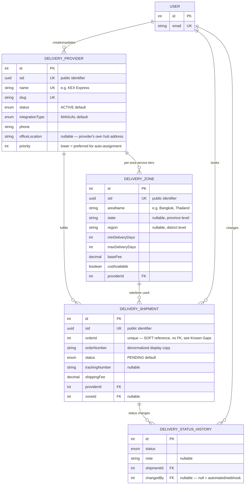

# Delivery Module (External Delivery Service)

Third-party courier directory and shipment tracking for the storefront's **Set Up → External Delivery Service** admin tab: `DeliveryProvider` (the courier company, e.g. "KEX Express"), `DeliveryZone` (a provider's per-area service tier — coverage, delivery-time range, and fee), `DeliveryShipment` (a single order's fulfillment through a chosen provider), and `DeliveryStatusHistory` (the shipment's audit trail).

> **Not the same thing as `UserRole.DELIVERY_PARTNER`** (`user.prisma`). That role is for **in-house delivery staff** accounts — the Set Up page's separate **"Delivery Man"** tab. This module is for **outsourced third-party couriers** (KEX Express, Flash Express, Thailand Post, etc.) — the **"External Delivery Service"** tab shown in the screenshot this doc was written from.

Schema source: `prisma/schema/delivery.prisma` (models `DeliveryProvider`, `DeliveryZone`, `DeliveryShipment`, `DeliveryStatusHistory`; enums `DeliveryEntityStatus`, `DeliveryIntegrationType`, `DeliveryPricingModel`, `DeliveryShipmentStatus`).
Module source: **`DeliveryProvider`/`DeliveryZone` are implemented** — `src/modules/delivery/` (`delivery.controller.ts`, `delivery.service.ts`, `delivery.repository.ts`, `delivery.select.ts`, `dto/`). **`DeliveryShipment`/`DeliveryStatusHistory` are schema-only** — no module reads or writes them yet. See [API End Point & Business Logic](#api-end-point--business-logic) for what's real vs. still a roadmap sketch.

> **Scope note:** `User` is documented in its own reference (`user.md`) — it appears here only as the `createdBy`/`updatedBy`/`changedBy` foreign-key target needed for the audit trail. `Order` is deliberately **not** a Prisma relation from this module — see [Known Gaps](#known-gaps--recommended-hardening).

---

### DB Schema

#### Entity-Relationship Diagram (ERD)



**Cardinality legend:** `||--o{` = one-to-many (parent must exist, child count is 0..N). `Order` is intentionally absent from this diagram — `DeliveryShipment.orderId` is a plain integer, not a Prisma relation. See [Known Gaps](#known-gaps--recommended-hardening).

---

#### Enum Definitions

##### `DeliveryEntityStatus` (shared by `DeliveryProvider.status` and `DeliveryZone.status`)

| Value       | Meaning                                                                                     |
| :---------- | :-------------------------------------------------------------------------------------------- |
| `ACTIVE`    | Visible and selectable — appears in checkout quotes / admin dropdowns. **Default on creation.** |
| `INACTIVE`  | Hidden from checkout and new-shipment booking, but existing `DeliveryShipment` history is untouched. The intended "delete" path for a provider/zone that already has shipment history — see [Known Gaps](#known-gaps--recommended-hardening) re: no `deletedAt`. |
| `SUSPENDED` | Temporarily paused pending review (e.g. repeated late deliveries, a support escalation) — distinct from `INACTIVE` so staff can tell "we turned this off" apart from "we're investigating this." |

> Defined once in `delivery.prisma` and reused by both models — same pattern as `shared.prisma`'s `CategoryProductStatus`, except this enum is only used *within* this one file, so it stays local rather than moving to `shared.prisma`.

##### `DeliveryIntegrationType`

| Value     | Meaning                                                                                      |
| :-------- | :--------------------------------------------------------------------------------------------- |
| `MANUAL`  | Staff book and update tracking by hand — no API call ever leaves the server. **Default.**       |
| `API`     | The server calls the provider's API to book shipments and/or pull tracking status.              |
| `WEBHOOK` | The provider pushes status updates to us (`DeliveryStatusHistory.changedBy = null` rows); we never poll them. |

##### `DeliveryPricingModel`

| Value             | Meaning                                                                          |
| :---------------- | :--------------------------------------------------------------------------------- |
| `FLAT`             | `DeliveryZone.baseFee` is charged regardless of order weight/size.                 |
| `WEIGHT_BASED`     | `baseFee` is a per-kg (or per-unit-weight) rate — cart/order weight is required at quote time. |
| `DISTANCE_BASED`   | `baseFee` is a per-km rate — origin/destination distance is required at quote time. |

> Only `FLAT` has a concrete computation defined today (`baseFee` charged as-is). `WEIGHT_BASED`/`DISTANCE_BASED` are declared so the schema doesn't need a migration when those pricing strategies are implemented, but the multiplier inputs (order weight, distance lookup) don't exist anywhere in this schema yet — see [Known Gaps](#known-gaps--recommended-hardening).

##### `DeliveryShipmentStatus`

| Value              | Meaning                                                                                     |
| :----------------- | :----------------------------------------------------------------------------------------------|
| `PENDING`           | Shipment row created, not yet handed to the courier. **Default on creation.**                  |
| `BOOKED`            | Booked with the provider (API call succeeded, or staff manually recorded the booking) — awaiting pickup. |
| `PICKED_UP`         | Courier has physically collected the package.                                                   |
| `IN_TRANSIT`        | En route between the courier's own hubs.                                                        |
| `OUT_FOR_DELIVERY`  | On the last-mile vehicle, expected today.                                                       |
| `DELIVERED`         | Successfully delivered — pairs with `deliveredAt`.                                              |
| `FAILED_ATTEMPT`    | Courier attempted delivery and failed (recipient unavailable, bad address, etc.) — pairs with `failureReason`. Not necessarily terminal; the next attempt can move back to `OUT_FOR_DELIVERY`. |
| `RETURNED`          | Package returned to the provider's depot / back to the warehouse — terminal.                    |
| `CANCELLED`         | Shipment cancelled before delivery (order cancelled, wrong provider picked, etc.) — terminal.    |

---

#### Data Dictionary — DeliveryProvider

**Table purpose:** the third-party courier company directory — one row per company (e.g. "KEX Express"). Maps to table `delivery_providers`.

| Field                  | Type                          | Constraints                                                              | Description                                                                                                    |
| :---------------------- | :----------------------------- | :---------------------------------------------------------------------------- | :---------------------------------------------------------------------------------------------------------------- |
| `id`                    | `INT`                          | PK, AUTOINCREMENT                                                              | Internal numeric key; FK joins only.                                                                              |
| `sid`                   | `UUID`                         | UNIQUE, NOT NULL, DEFAULT `uuid()`, `@db.Uuid`                                 | Public-facing identifier.                                                                                         |
| `name`                  | `VARCHAR(150)`                 | UNIQUE, NOT NULL                                                               | **"Company Name"** column in the Set Up table, e.g. `"KEX Express"`.                                              |
| `slug`                  | `VARCHAR(150)`                 | UNIQUE, NOT NULL                                                               | URL/lookup-safe identifier, derived from `name` (same pattern as `Blog.slug`).                                    |
| `status`                | `ENUM(DeliveryEntityStatus)`   | NOT NULL, DEFAULT `ACTIVE`                                                     | Lifecycle state — gates checkout visibility.                                                                      |
| `integrationType`       | `ENUM(DeliveryIntegrationType)`| NOT NULL, DEFAULT `MANUAL`, `@map("integration_type")`                        | Whether booking/tracking is manual, API-driven, or webhook-driven.                                                |
| `logoUrl`               | `VARCHAR(512)`                 | NULLABLE, `@map("logo_url")`                                                   | Courier logo for the admin table / checkout selector.                                                             |
| `contactPerson`         | `VARCHAR(150)`                 | NULLABLE, `@map("contact_person")`                                             | Account manager / point of contact at the courier.                                                                |
| `phone`                 | `VARCHAR(20)`                  | NOT NULL                                                                       | **"Number"** column, e.g. `"+66 2 123 4567"`.                                                                     |
| `email`                 | `VARCHAR(255)`                 | NULLABLE                                                                       | Courier support/ops email.                                                                                        |
| `website`               | `VARCHAR(255)`                 | NULLABLE                                                                       | Courier's public website.                                                                                         |
| `officeLocation`        | `VARCHAR(255)`                 | NULLABLE, `@map("office_location")`                                            | **"Location"** column — the provider's own hub/head-office address. **Distinct from `DeliveryZone.areaName`**, which is where *they deliver to*, not where they're based. |
| `apiBaseUrl`            | `VARCHAR(255)`                 | NULLABLE, `@map("api_base_url")`                                               | Base URL for `integrationType = API` calls.                                                                       |
| `apiCredentialRef`      | `VARCHAR(255)`                 | NULLABLE, `@map("api_credential_ref")`                                         | **Name/key of the secret in a vault/secrets manager — never the raw API key.** See [Implementation & Best Practices](#credential-handling). |
| `trackingUrlTemplate`   | `VARCHAR(512)`                 | NULLABLE, `@map("tracking_url_template")`                                      | E.g. `"https://kex.com/track/{trackingNumber}"` — resolved into `DeliveryShipment.trackingUrl` at booking time.   |
| `priority`              | `INT`                          | NOT NULL, DEFAULT `0`                                                          | Lower = preferred when several providers' zones cover the same destination — see [Provider Selection](#provider--zone-selection). |
| `notes`                 | `TEXT`                         | NULLABLE                                                                       | Free-text internal notes (SLA terms, account number, etc.).                                                       |
| `createdAt`/`updatedAt` | `TIMESTAMPTZ(3)`               | NOT NULL, `@map("created_at"/"updated_at")`                                    | Standard audit timestamps.                                                                                        |
| `createdBy`/`updatedBy` | `INT`                          | FK → `users.id`, NULLABLE, **ON DELETE SET NULL**                              | Staff who created/last edited this provider — same convention as `Support.createdBy`/`updatedBy`.                 |

---

#### Data Dictionary — DeliveryZone

**Table purpose:** one provider's service offering for one coverage area — the delivery-time range, fee, and COD availability. A provider has **one row per area per service tier** (e.g. KEX Express "Bangkok, Thailand" has two rows: a 3–7 day tier and a slower 7–10 day tier). Maps to table `delivery_zones`.

| Field                   | Type                             | Constraints                                                                          | Description                                                                                                 |
| :----------------------- | :--------------------------------- | :----------------------------------------------------------------------------------------- | :--------------------------------------------------------------------------------------------------------------- |
| `id`                     | `INT`                              | PK, AUTOINCREMENT                                                                            | Internal numeric key.                                                                                            |
| `sid`                    | `UUID`                             | UNIQUE, NOT NULL, DEFAULT `uuid()`, `@db.Uuid`                                               | Public-facing identifier.                                                                                        |
| `serviceName`            | `VARCHAR(100)`                     | NULLABLE, `@map("service_name")`                                                             | Optional tier label, e.g. `"Standard"`, `"Express"`, `"Economy"`.                                                |
| `areaName`               | `VARCHAR(150)`                     | NOT NULL, `@map("area_name")`                                                                | **"Delivery Area"** column — display label, e.g. `"Bangkok, Thailand"`.                                          |
| `state`                  | `VARCHAR(100)`                     | NULLABLE                                                                                     | Province level — same field semantics as `Address.state`. `NULL` = covers the whole country.                     |
| `region`                 | `VARCHAR(100)`                     | NULLABLE                                                                                     | District level — same field semantics as `Address.region`. `NULL` = covers the whole `state`.                    |
| `postalCodePrefix`       | `VARCHAR(10)`                      | NULLABLE, `@map("postal_code_prefix")`                                                       | E.g. `"10"` to match all Bangkok postal codes — finer-grained matching than `state`/`region` alone.               |
| `country`                | `VARCHAR(100)`                     | NOT NULL, DEFAULT `"Thailand"`                                                                | Same default as `Address.country`.                                                                               |
| `minDeliveryDays`        | `INT`                              | NOT NULL, `@map("min_delivery_days")`                                                        | Lower bound of the **"Delivery Time"** column, e.g. `3`.                                                          |
| `maxDeliveryDays`        | `INT`                              | NOT NULL, `@map("max_delivery_days")`                                                        | Upper bound, e.g. `7`. UI renders `"${min}-${max} days"` — never stored as a string. See [Conventions](#conventions-1). |
| `pricingModel`           | `ENUM(DeliveryPricingModel)`       | NOT NULL, DEFAULT `FLAT`, `@map("pricing_model")`                                            | How `baseFee` is interpreted.                                                                                     |
| `baseFee`                | `DECIMAL(12,2)`                    | NOT NULL, DEFAULT `0`, `@map("base_fee")`                                                    | Flat fee, or per-kg/per-km rate depending on `pricingModel`.                                                      |
| `codAvailable`           | `BOOLEAN`                          | NOT NULL, DEFAULT `false`, `@map("cod_available")`                                           | Whether Cash-on-Delivery is offered on this zone — relevant since `Order.paymentMethod` includes `CASH_ON_DELIVERY` (`order.prisma`). |
| `codFeePercent`          | `DECIMAL(5,2)`                     | NULLABLE, `@map("cod_fee_percent")`                                                          | Extra percentage fee for COD orders, if any.                                                                      |
| `status`                 | `ENUM(DeliveryEntityStatus)`       | NOT NULL, DEFAULT `ACTIVE`                                                                    | Independent of `DeliveryProvider.status` — a provider can be `ACTIVE` with one zone `INACTIVE` (e.g. seasonally). |
| `createdAt`/`updatedAt`  | `TIMESTAMPTZ(3)`                   | NOT NULL, `@map("created_at"/"updated_at")`                                                   | Standard audit timestamps.                                                                                        |
| `providerId`             | `INT`                              | FK → `delivery_providers.id`, NOT NULL, **ON DELETE CASCADE**, `@map("provider_id")`         | Owning provider — deleting a provider deletes its zones (see [Known Gaps](#known-gaps--recommended-hardening) on why hard-deleting a provider should be rare in practice). |

---

#### Data Dictionary — DeliveryShipment

**Table purpose:** one row per order's fulfillment through a chosen provider — the operational record that tracks a package from booking to delivery. Maps to table `delivery_shipments`.

| Field                       | Type                             | Constraints                                                                              | Description                                                                                                    |
| :--------------------------- | :--------------------------------- | :---------------------------------------------------------------------------------------------- | :------------------------------------------------------------------------------------------------------------------ |
| `id`                         | `INT`                              | PK, AUTOINCREMENT                                                                                  | Internal numeric key.                                                                                                |
| `sid`                        | `UUID`                             | UNIQUE, NOT NULL, DEFAULT `uuid()`, `@db.Uuid`                                                     | Public-facing identifier.                                                                                            |
| `orderId`                    | `INT`                              | **UNIQUE, NOT NULL**, `@map("order_id")` — **not a Prisma relation**                                | Soft reference to `Order.id`. `@unique` enforces **at most one active shipment per order** at the DB level even without an FK. See [Known Gaps](#known-gaps--recommended-hardening). |
| `orderNumber`                | `VARCHAR(50)`                      | NOT NULL, `@map("order_number")`                                                                   | Denormalized copy of `Order.orderNumber`, so the admin shipment list never needs to resolve `orderId` to display anything. |
| `status`                     | `ENUM(DeliveryShipmentStatus)`     | NOT NULL, DEFAULT `PENDING`                                                                         | Current lifecycle state — see also `DeliveryStatusHistory` for the full trail.                                       |
| `trackingNumber`             | `VARCHAR(100)`                     | NULLABLE, `@map("tracking_number")`                                                                 | Courier's own tracking reference. `NULL` until `BOOKED`.                                                             |
| `trackingUrl`                | `VARCHAR(512)`                     | NULLABLE, `@map("tracking_url")`                                                                    | Resolved from `DeliveryProvider.trackingUrlTemplate` at booking time — frozen, not re-derived if the template later changes. |
| `providerNameSnapshot`       | `VARCHAR(150)`                     | NOT NULL, `@map("provider_name_snapshot")`                                                          | Frozen copy of `DeliveryProvider.name` — same contract as `OrderItem`'s product-name snapshot, so this row still renders correctly if the provider is later renamed. |
| `shippingFee`                | `DECIMAL(12,2)`                    | NOT NULL, DEFAULT `0`, `@map("shipping_fee")`                                                       | Actual fee charged — may differ from `DeliveryZone.baseFee` (weight surcharge, promo, manual override).             |
| `estimatedDeliveryFrom`/`To` | `TIMESTAMPTZ(3)`                   | NULLABLE, `@map("estimated_delivery_from"/"_to")`                                                   | Computed from `DeliveryZone.minDeliveryDays`/`maxDeliveryDays` relative to the booking date, frozen at booking time. |
| `pickedUpAt`/`deliveredAt`/`failedAt` | `TIMESTAMPTZ(3)`         | NULLABLE, `@map(...)`                                                                               | Lifecycle timestamps, same pattern as `Order.confirmedAt`/`shippedAt`/`deliveredAt` (`order.prisma`).                |
| `failureReason`              | `TEXT`                             | NULLABLE, `@map("failure_reason")`                                                                  | Populated on `FAILED_ATTEMPT`.                                                                                       |
| `providerResponse`           | `JSON`                             | NULLABLE, DEFAULT `{}`, `@map("provider_response")`                                                 | Raw API/webhook payload snapshot for auditing/debugging — same pattern as `Payment.gatewayResponse` (`order.prisma`). |
| `createdAt`/`updatedAt`      | `TIMESTAMPTZ(3)`                   | NOT NULL, `@map("created_at"/"updated_at")`                                                         | Standard audit timestamps.                                                                                           |
| `providerId`                 | `INT`                              | FK → `delivery_providers.id`, NOT NULL, **ON DELETE RESTRICT**, `@map("provider_id")`               | The courier used. `RESTRICT`, not `CASCADE`/`SET NULL` — see [Relationships and Cascading Rules](#relationships-and-cascading-rules). |
| `zoneId`                     | `INT`                              | FK → `delivery_zones.id`, NULLABLE, **ON DELETE SET NULL**, `@map("zone_id")`                       | The rate/time tier used at booking — nullable so a zone can later be pruned without losing shipment history.        |
| `createdBy`                  | `INT`                              | FK → `users.id`, NULLABLE, **ON DELETE SET NULL**                                                   | Staff who booked the shipment. `NULL` = booked automatically (e.g. auto-assignment on order confirmation).           |

---

#### Data Dictionary — DeliveryStatusHistory

**Table purpose:** append-only audit trail of every status change a shipment goes through — the same role `OrderStatusHistory` plays for `Order` (`order.prisma`). Maps to table `delivery_status_history`.

| Field         | Type                            | Constraints                                                                    | Description                                                                 |
| :------------- | :-------------------------------- | :----------------------------------------------------------------------------------- | :------------------------------------------------------------------------------ |
| `id`          | `INT`                            | PK, AUTOINCREMENT                                                                     | Internal numeric key.                                                          |
| `status`      | `ENUM(DeliveryShipmentStatus)`   | NOT NULL                                                                              | The status this row transitioned *to*.                                        |
| `note`        | `TEXT`                           | NULLABLE                                                                              | Optional reason, e.g. a failed-attempt explanation.                            |
| `shipmentId`  | `INT`                            | FK → `delivery_shipments.id`, NOT NULL, **ON DELETE CASCADE**, `@map("shipment_id")`  | Owning shipment.                                                               |
| `changedBy`   | `INT`                            | FK → `users.id`, NULLABLE, **ON DELETE SET NULL**, `@map("changed_by")`               | `NULL` = system/automated transition (e.g. a courier webhook), matching the `OrderStatusHistory.changedBy` convention exactly. |
| `createdAt`   | `TIMESTAMPTZ(3)`                 | NOT NULL, DEFAULT `now()`, `@map("created_at")`                                       | When this transition was recorded.                                            |

---

#### Relationships and Cascading Rules

| Parent → Child                                     | FK Column                        | On Delete    | Effect                                                                                                                       |
| :---------------------------------------------------- | :---------------------------------- | :----------- | :---------------------------------------------------------------------------------------------------------------------------- |
| `DeliveryProvider` → `DeliveryZone`                    | `DeliveryZone.providerId`            | **CASCADE**   | Deleting a provider deletes its zones. In practice a provider should be deactivated (`status = INACTIVE`), not deleted, once it has ever had a zone booked against it — see [Known Gaps](#known-gaps--recommended-hardening) re: no `deletedAt`. |
| `DeliveryProvider` → `DeliveryShipment`                | `DeliveryShipment.providerId`        | **RESTRICT**  | **Deleting a provider that has any shipment history is rejected outright** (Postgres raises a FK violation). This is the schema's only `RESTRICT` — deliberate, because a courier with real shipment history is a regulatory/support record, not something that should silently cascade away or leave `providerId` dangling. Deactivate via `status = INACTIVE` instead. |
| `DeliveryZone` → `DeliveryShipment`                    | `DeliveryShipment.zoneId`            | **SET NULL**  | Deleting a zone (e.g. a discontinued service tier) preserves shipment history; `zoneId` goes `null`. `providerNameSnapshot`/`shippingFee` still make the row fully readable without it. |
| `DeliveryShipment` → `DeliveryStatusHistory`           | `DeliveryStatusHistory.shipmentId`   | **CASCADE**   | Deleting a shipment (should be rare/never in production) deletes its status trail with it — same as `Order` → `OrderStatusHistory`. |
| `User` → `DeliveryProvider` (`createdBy`/`updatedBy`)  | —                                     | **SET NULL**  | Deleting a staff account preserves the provider row, nulling the actor — consistent with every other audit FK in this schema. |
| `User` → `DeliveryShipment` (`createdBy`)              | —                                     | **SET NULL**  | Same, for who booked the shipment.                                                                                            |
| `User` → `DeliveryStatusHistory` (`changedBy`)         | —                                     | **SET NULL**  | Same, for who recorded the status change.                                                                                     |

**Practical implications:**

- `DeliveryProvider → DeliveryShipment` is the **only `RESTRICT`** anywhere in this schema (every other cross-domain FK in the codebase is `CASCADE` or `SET NULL`). This is an intentional divergence — see the row above — and should be called out in code review if it's ever weakened.
- Because `DeliveryZone` has no shipment-history guard (`CASCADE` from `Provider`, but `SET NULL` *to* `Shipment`), deleting a whole provider (which cascades to its zones) is still blocked by the zones' shipments pointing at the provider directly — the `RESTRICT` on `DeliveryShipment.providerId` fires before the `CASCADE` to `DeliveryZone` can complete. A provider truly can't be hard-deleted once it has shipped anything.

---

#### Performance Optimizations (Indexes)

##### Current indexes (`delivery.prisma`)

| Index                                                                                          | Type              | Purpose                                                                                          |
| :------------------------------------------------------------------------------------------------ | :------------------ | :--------------------------------------------------------------------------------------------------- |
| `sid`, `name`, `slug` (`DeliveryProvider`, each `@unique`)                                          | B-Tree (unique)      | Identity lookups.                                                                                     |
| `@@index([status])` (`DeliveryProvider`)                                                            | B-Tree               | The checkout quote query and admin "active providers" filter.                                          |
| `@@unique([providerId, areaName, minDeliveryDays, maxDeliveryDays])` (`DeliveryZone`)                | B-Tree (unique)      | Prevents true duplicate zone rows while allowing multiple service tiers per area.                       |
| `@@index([providerId])`, `@@index([areaName])`, `@@index([state, region])` (`DeliveryZone`)          | B-Tree               | Listing a provider's zones; matching a checkout address to candidate zones.                             |
| `orderId` (`DeliveryShipment`, `@unique`)                                                            | B-Tree (unique)      | "Does this order already have a shipment?" lookup — also the enforcement mechanism itself.               |
| `@@index([providerId])`, `@@index([zoneId])`, `@@index([status])`, `@@index([trackingNumber])` (`DeliveryShipment`) | B-Tree      | Admin filtering by courier/zone/status; the public tracking-number lookup.                              |
| `@@index([shipmentId, createdAt])` (`DeliveryStatusHistory`)                                         | B-Tree (composite)   | Chronological status trail for one shipment — same shape as `OrderStatusHistory`'s index.               |
| FK columns (`createdBy`, `updatedBy`, `zoneId`, `changedBy`, etc.)                                    | B-Tree (implicit)    | Prisma auto-creates an index on every relation scalar field.                                            |

##### Recommended future indexes (not yet needed at current scale)

- **`@@index([postalCodePrefix])`** on `DeliveryZone` — once checkout quoting does high-volume prefix matching, a plain `state`/`region` composite may not be selective enough.
- **Partial index** `ON delivery_shipments (order_id) WHERE status NOT IN ('CANCELLED')` — if shipments are ever allowed to be re-created after a cancellation (which today's plain `orderId @unique` forbids entirely, see [Known Gaps](#known-gaps--recommended-hardening)).

---

#### Conventions

- **All `DateTime` columns are `@db.Timestamptz(3)`** — no exceptions in this module.
- **`sid` is the public identifier, `id` is internal** — same convention as every other module.
- **Delivery time is a numeric range, never a formatted string.** `minDeliveryDays`/`maxDeliveryDays` are stored as plain `INT`; the `"3-7 days"` display string is a read-time render, never persisted — keeps the range sortable/filterable/queryable (`ORDER BY minDeliveryDays`, `WHERE maxDeliveryDays <= 5`, etc.).
- **The Set Up page's flat table is a join, not a table.** Each row the admin sees (Company / Number / Location / Delivery Area / Delivery Time) is `DeliveryProvider ⋈ DeliveryZone`, not a 1:1 mapping to either table alone — this is why "KEX Express" can legitimately appear twice with two different delivery-time ranges.
- **Money is always `@db.Decimal(12,2)`**, percentages `@db.Decimal(5,2)` — matches `order.prisma`/`combo-product.prisma` precision exactly, unlike `Inventory.costPrice`/`sellingPrice`'s known gap.
- **Enum reuse stays file-local.** `DeliveryEntityStatus` is shared by two models but both live in `delivery.prisma`, so it's declared once at the top of this file rather than promoted to `shared.prisma` (which is reserved for enums shared *across* domain files).

---

#### Example Data

**DeliveryProvider**

| name             | status   | integrationType | phone             | officeLocation      | priority |
| :---------------- | :------- | :--------------- | :------------------ | :-------------------- | :------- |
| **KEX Express**    | `ACTIVE` | `MANUAL`          | `+66 2 123 4567`     | `Bangkok, Thailand`    | `0`       |
| **Express Delivery** | `ACTIVE` | `API`            | `+66 2 123 4567`     | `Bangkok, Thailand`    | `1`       |

**DeliveryZone** (both rows below belong to the `KEX Express` provider — this is how one company produces two rows in the Set Up table)

| serviceName | areaName             | minDeliveryDays | maxDeliveryDays | baseFee | codAvailable | providerId |
| :----------- | :--------------------- | :--------------- | :--------------- | :------- | :------------ | :---------- |
| `Standard`   | `Bangkok, Thailand`     | `3`               | `7`               | `60.00`  | `true`         | `1`          |
| `Economy`    | `Bangkok, Thailand`     | `7`               | `10`              | `40.00`  | `false`        | `1`          |

**DeliveryShipment**

| orderNumber        | status     | trackingNumber | providerNameSnapshot | shippingFee | providerId | zoneId |
| :-------------------- | :--------- | :--------------- | :---------------------- | :----------- | :---------- | :------ |
| `THP-20260810-00042`   | `IN_TRANSIT` | `KEX998877665`    | `KEX Express`            | `60.00`       | `1`          | `1`      |

> `Standard` and `Economy` share the same `areaName` but never collide on the `@@unique([providerId, areaName, minDeliveryDays, maxDeliveryDays])` constraint because their day ranges differ.

---

#### Example Usage (JSON Response)

**Checkout delivery-option quote** (public — see [Get Delivery Quote](#get-delivery-quote-public)):

```json
{
  "options": [
    {
      "providerSid": "b2c3d4e5-...",
      "providerName": "KEX Express",
      "zoneSid": "c3d4e5f6-...",
      "serviceName": "Standard",
      "deliveryTime": "3-7 days",
      "fee": 60.0,
      "codAvailable": true
    },
    {
      "providerSid": "b2c3d4e5-...",
      "providerName": "KEX Express",
      "zoneSid": "d4e5f6a7-...",
      "serviceName": "Economy",
      "deliveryTime": "7-10 days",
      "fee": 40.0,
      "codAvailable": false
    }
  ]
}
```

**Admin shipment detail** (back-office order fulfillment view):

```json
{
  "sid": "e5f6a7b8-9012-4cde-b345-6789abcdef01",
  "orderNumber": "THP-20260810-00042",
  "status": "IN_TRANSIT",
  "trackingNumber": "KEX998877665",
  "trackingUrl": "https://kex.com/track/KEX998877665",
  "providerNameSnapshot": "KEX Express",
  "shippingFee": 60.0,
  "estimatedDeliveryFrom": "2026-08-13T00:00:00Z",
  "estimatedDeliveryTo": "2026-08-17T00:00:00Z",
  "statusHistory": [
    { "status": "PENDING", "createdAt": "2026-08-10T09:00:00Z", "changedBy": 3 },
    { "status": "BOOKED", "createdAt": "2026-08-10T09:05:00Z", "changedBy": 3 },
    { "status": "PICKED_UP", "createdAt": "2026-08-10T14:30:00Z", "changedBy": null },
    { "status": "IN_TRANSIT", "createdAt": "2026-08-11T08:00:00Z", "changedBy": null }
  ]
}
```

---

#### Implementation & Best Practices

##### Provider & Zone Selection

- When several `ACTIVE` providers have a zone matching a checkout address, rank candidates by **`DeliveryProvider.priority` ascending, then `DeliveryZone.baseFee` ascending** — cheapest of the preferred provider first, not a global cheapest-wins auction. This keeps the merchant able to bias toward a preferred courier even if a competitor is momentarily cheaper.
- Zone matching should try the **most specific field first**: `postalCodePrefix` → `region` → `state` → country-wide (`state IS NULL`). A zone with a narrower match should always win over a broader one covering the same address, even if the broader one has a better `priority`.

##### Delivery-Time Rendering

- `minDeliveryDays`/`maxDeliveryDays` render as `` `${min}-${max} days` `` at the DTO layer (matching the Set Up screenshot's `"3-7 days"` format). If `min === max`, prefer rendering a single number (`"5 days"`) rather than `"5-5 days"`.

##### Credential Handling

- `DeliveryProvider.apiCredentialRef` must **never** hold a raw API key/secret — only a name/reference the application layer resolves against an actual secrets manager (env var name, vault path, etc.) at call time. The column exists so which credential a provider uses is visible/editable from the admin UI without the underlying secret ever touching the database or an admin's screen.

##### Shipment Booking Flow

1. Resolve the winning `DeliveryProvider`/`DeliveryZone` pair (either the customer's checkout selection, or auto-assignment per [Provider & Zone Selection](#provider--zone-selection)).
2. Freeze `providerNameSnapshot` from `DeliveryProvider.name` and compute `estimatedDeliveryFrom`/`To` as `bookingDate + zone.minDeliveryDays`/`maxDeliveryDays`.
3. If `integrationType = API`, call the provider's booking endpoint using the secret resolved from `apiCredentialRef`; store the raw response in `providerResponse` and the returned tracking number in `trackingNumber`. Resolve `trackingUrl` by substituting `trackingNumber` into `trackingUrlTemplate`.
4. Insert the `DeliveryShipment` row and an initial `DeliveryStatusHistory` row (`status: PENDING` or `BOOKED`, depending on whether step 3 already confirmed booking) in the **same transaction** — same pattern as `Order` + its first `OrderStatusHistory` row.
5. Every subsequent status change (manual update, webhook callback) must write to **both** `DeliveryShipment.status` and a new `DeliveryStatusHistory` row, atomically — never update one without the other, or the audit trail silently diverges from the current state.

##### Webhook Handling (`integrationType = WEBHOOK`)

- Inbound webhook payloads should be **verified (signature/HMAC) before being trusted**, matched to a shipment via `trackingNumber` (not `orderId`, which the courier doesn't know), and processed idempotently — a courier that retries a webhook delivery must not produce duplicate `DeliveryStatusHistory` rows for the same transition. `changedBy: null` marks these as system-originated, exactly like `OrderStatusHistory.changedBy: null` for payment-webhook-driven order transitions.

---

#### Known Gaps / Recommended Hardening

This is a **from-scratch schema design**, not a hardening pass on existing production data — so this list doubles as the open design questions to resolve before implementation, not just after:

- **`DeliveryShipment.orderId` is a soft reference, not an FK.** It's typed as `Int` (not `String`, unlike `Inventory.referenceId`) and is `@unique`, so it gets real integrity properties (can't silently be non-numeric, at-most-one-shipment-per-order is DB-enforced) — but nothing stops it from pointing at an `Order.id` that doesn't exist, and `order.prisma` carries no back-relation. **Before wiring this module into checkout/fulfillment**, either (a) add `DeliveryShipment.orderId Int @unique` as a real `@relation` to `Order` plus an `Order.deliveryShipment DeliveryShipment?` back-relation in `order.prisma`, or (b) keep it soft but validate `orderId` existence in the service layer on every write, the way `Inventory.referenceId` is left entirely unvalidated today.
- **`orderId @unique` forbids re-shipping.** If a shipment is `CANCELLED` or `RETURNED`, there is no way to book a second `DeliveryShipment` for the same order without changing the constraint to something like a partial unique index (`WHERE status NOT IN ('CANCELLED', 'RETURNED')`) — Prisma doesn't express partial unique indexes directly; this needs a raw SQL migration if re-shipping becomes a real requirement.
- **No `deletedAt` on `DeliveryProvider`/`DeliveryZone`.** "Removing" a provider from the Set Up list today means either `status = INACTIVE` (reversible, recommended) or a hard `DELETE` that is only even possible if it has zero shipment history (blocked by `RESTRICT` otherwise). There's no soft-delete audit trail (`deletedAt`/`deletedBy`) matching `Product`'s pattern.
- **`WEIGHT_BASED`/`DISTANCE_BASED` pricing has no supporting data.** Neither `Order`/`OrderItem` (weight) nor any distance/geocoding source exists in the current schema to actually compute those fees — the enum values are placeholders for a future iteration, not a working feature today.
- **No constraint ties `DeliveryShipment.zoneId` to `DeliveryShipment.providerId`.** A `zoneId` belonging to a *different* provider than `providerId` is representable and meaningless — same class of gap as `Batch.variantId` not being checked against `Batch.productId` (`inventory.prisma`).
- **`codFeePercent` has no defined base.** It's a percentage but the schema doesn't say percentage *of what* (order subtotal? `baseFee`? `Order.totalAmount`?) — must be pinned down before implementation, not left to whichever developer writes the fee-calculation code first.

---

### API End Point & Business Logic (Planned)

**Nothing below is implemented.** No `src/modules/delivery/` exists yet — this section is the proposed contract, written so the eventual controller/service/repository trio (and the client checkout/admin UI) can be built against a single agreed design rather than improvised endpoint-by-endpoint. Treat every route, DTO name, and business-logic step below as a **plan to review and revise**, not documentation of running code. Suggested base path: `/api/v1/delivery`, following the existing per-module prefix convention (`/api/v1/blog`, `/api/v1/combo`, etc.).

#### Endpoint Overview

| Method   | Path                              | Access                     | Purpose                                                     |
| :------- | :--------------------------------- | :-------------------------- | :------------------------------------------------------------ |
| `POST`   | `/create-provider`                 | `ADMIN`, `MANAGER`           | [Create a delivery provider](#create-a-delivery-provider)       |
| `GET`    | `/all-providers`                   | `ADMIN`, `MANAGER`           | [Admin listing — every status](#list-all-providers-admin)       |
| `GET`    | `/active-providers`                | **Public**                   | [Active providers for checkout](#list-active-providers-public)  |
| `PATCH`  | `/update-provider/:id`             | `ADMIN`, `MANAGER`           | [Update a provider](#update-a-delivery-provider)                 |
| `PATCH`  | `/deactivate-provider/:id`         | `ADMIN`, `MANAGER`           | [Deactivate a provider](#deactivate-a-delivery-provider) (`status → INACTIVE`, the "delete" path) |
| `DELETE` | `/delete-provider/:id`             | `ADMIN` only                  | [Hard delete a provider](#hard-delete-a-delivery-provider) (only succeeds with zero shipment history) |
| `POST`   | `/create-zone`                     | `ADMIN`, `MANAGER`           | [Create a delivery zone](#create-a-delivery-zone)                |
| `GET`    | `/zones-by-provider/:providerId`   | `ADMIN`, `MANAGER`           | List a provider's zones                                        |
| `PATCH`  | `/update-zone/:id`                 | `ADMIN`, `MANAGER`           | Update a zone's time/fee/coverage                               |
| `DELETE` | `/delete-zone/:id`                 | `ADMIN`, `MANAGER`           | Delete a zone (`SET NULL`s any `DeliveryShipment.zoneId` pointing to it) |
| `POST`   | `/quote`                           | **Public**                   | [Get delivery quote](#get-delivery-quote-public) for a checkout address |
| `POST`   | `/book-shipment`                   | `ADMIN`, `MANAGER`, `WAREHOUSE` | [Book a shipment](#book-a-shipment) for a confirmed order      |
| `PATCH`  | `/update-shipment-status/:id`      | `ADMIN`, `MANAGER`, `WAREHOUSE` | [Update shipment status](#update-shipment-status) + history row |
| `GET`    | `/all-shipments`                   | `ADMIN`, `MANAGER`, `WAREHOUSE` | Admin shipment dashboard, filterable by status/provider/date    |
| `GET`    | `/shipment-by-order/:orderId`      | `ADMIN`, `MANAGER`, **owning customer** | Shipment detail for one order                          |
| `GET`    | `/track/:trackingNumber`           | **Public**                   | [Public tracking lookup](#public-tracking-lookup) — no login required |
| `POST`   | `/webhook/:providerSlug`           | **Provider (signed)**        | [Inbound courier webhook](#inbound-courier-webhook)              |

Guarded routes follow the existing `JwtAuthGuard` + `RolesGuard` + `@Roles(...)` pattern used across every other module.

---

#### Get Delivery Quote (Public)

**`POST /api/v1/delivery/quote`**

**Purpose**: Given a destination (state/region/postalCode — the same shape as checkout's address form), return every matching, `ACTIVE` provider/zone option so the customer can pick one before placing the order.

**Access**: Public — no auth guard, so guest checkout can quote delivery options too.

**Proposed request body**: `{ state, region?, postalCode?, codRequired?: boolean }`.

**Business logic — proposed:**

1. Filter `DeliveryZone` rows where `status = ACTIVE` **and** the destination matches per [Provider & Zone Selection](#provider--zone-selection) (`postalCodePrefix` → `region` → `state` → country-wide), joined to `DeliveryProvider` where `status = ACTIVE`.
2. If `codRequired` is true, additionally filter `codAvailable = true`.
3. Sort results by `DeliveryProvider.priority` ascending, then `DeliveryZone.baseFee` ascending.
4. Return each match as `{ providerSid, providerName, zoneSid, serviceName, deliveryTime: "${min}-${max} days", fee, codAvailable }` — never expose `apiCredentialRef`, internal `id`s, or `notes`.
5. **Empty result is a valid `200`, not a `404`** — the checkout UI must handle "no delivery option available for this address" as a first-class state (e.g. fall back to a default flat rate, or block checkout with a clear message), not treat it as an error.

| Status | Cause                                                          |
| :----- | :---------------------------------------------------------------- |
| `200`  | Always — `options: []` is valid when nothing covers the address.    |
| `400`  | Missing/invalid `state`.                                            |

---

#### Book a Shipment

**`POST /api/v1/delivery/book-shipment`**

**Purpose**: Create the `DeliveryShipment` row for a confirmed order, using either the customer's quote selection or server-side auto-assignment.

**Access**: `JwtAuthGuard` + `RolesGuard` + `@Roles(ADMIN, MANAGER, WAREHOUSE)`.

**Proposed request body**: `{ orderId, orderNumber, providerSid?, zoneSid? }` — `providerSid`/`zoneSid` optional; if omitted, the server auto-assigns per [Provider & Zone Selection](#provider--zone-selection) using the order's shipping address (from `OrderAddress`, `order.prisma`).

**Business logic — proposed, in order:**

1. **Reject if `orderId` already has a shipment** — the `@unique` constraint on `DeliveryShipment.orderId` makes this a guaranteed `409`, but the service should check first (`findByOrderId`) to return a clean error rather than surfacing a raw Prisma `P2002`.
2. **Existence validation of `orderId`** is the service's responsibility (see [Known Gaps](#known-gaps--recommended-hardening) — there's no FK to enforce it) — look the order up via the `order` module before proceeding; `404` if it doesn't exist.
3. Resolve provider/zone (explicit selection or auto-assignment), run the [Shipment Booking Flow](#shipment-booking-flow) described above.
4. Return the created `DeliveryShipment` plus its first `DeliveryStatusHistory` entry.

| Status | Cause                                                              |
| :----- | :--------------------------------------------------------------------|
| `201`  | Shipment booked.                                                      |
| `404`  | `orderId` doesn't correspond to a real order, or `providerSid`/`zoneSid` don't exist. |
| `409`  | Order already has a shipment.                                        |
| `422`  | Provider/zone auto-assignment found no coverage for the order's address. |

---

#### Update Shipment Status

**`PATCH /api/v1/delivery/update-shipment-status/:id`**

**Purpose**: Manually advance a shipment's status (staff correcting/advancing tracking that the courier doesn't push automatically under `MANUAL`/`API` integration).

**Access**: `JwtAuthGuard` + `RolesGuard` + `@Roles(ADMIN, MANAGER, WAREHOUSE)`.

**Business logic — proposed:**

1. Existence check on `:id` → `404`.
2. Write the new `status` to `DeliveryShipment` **and** insert a `DeliveryStatusHistory` row in the same transaction — never one without the other (see [Shipment Booking Flow](#shipment-booking-flow), step 5).
3. Stamp the relevant lifecycle timestamp (`pickedUpAt`/`deliveredAt`/`failedAt`) when the new status is `PICKED_UP`/`DELIVERED`/`FAILED_ATTEMPT` respectively.
4. Reject transitions out of terminal states (`DELIVERED`, `RETURNED`, `CANCELLED`) with `409` — a delivered shipment shouldn't be movable back to `IN_TRANSIT` through this route; correcting a mistaken terminal state should be a deliberate admin action, not implied by a generic status PATCH.

---

#### Public Tracking Lookup

**`GET /api/v1/delivery/track/:trackingNumber`**

**Purpose**: Let a customer check their delivery status without logging in — the "modern facility" a courier's own tracking page provides, surfaced inside the storefront.

**Access**: Public.

**Business logic — proposed:** Look up by `trackingNumber` (indexed), return a **trimmed** shape — `status`, `providerNameSnapshot`, `estimatedDeliveryFrom/To`, and the **public-safe subset** of `statusHistory` (`status`, `createdAt`, `note`; never `changedBy`). `404` if no shipment has that tracking number. Because `trackingNumber` is courier-issued and not sequential/guessable in the way `id` is, this is treated as an acceptable public lookup key — same reasoning as `Order.orderNumber` being safe for guest order lookups (`order.md`).

---

#### Inbound Courier Webhook

**`POST /api/v1/delivery/webhook/:providerSlug`**

**Purpose**: Receive push status updates from providers configured with `integrationType = WEBHOOK`.

**Access**: Not a normal user role — authenticated by the provider's own signature/HMAC scheme (provider-specific, stored via `apiCredentialRef`), verified before any DB write.

**Business logic — proposed:** Resolve `DeliveryProvider` by `:providerSlug`, verify the payload signature, map the provider's own status vocabulary to `DeliveryShipmentStatus`, look up the shipment by `trackingNumber` (never `orderId`), and apply the same status-write-plus-history-row transaction as [Update Shipment Status](#update-shipment-status) with `changedBy: null`. Must be **idempotent** — replay of the same webhook event (couriers commonly retry on a missed `200`) must not create duplicate `DeliveryStatusHistory` rows; dedupe on `(shipmentId, status)` when the incoming status matches the shipment's current status.

---

#### Create / List / Update Provider & Zone Endpoints

The remaining routes in the [Endpoint Overview](#endpoint-overview) table (`create-provider`, `all-providers`, `active-providers`, `update-provider`, `deactivate-provider`, `delete-provider`, `create-zone`, `zones-by-provider`, `update-zone`, `delete-zone`, `all-shipments`, `shipment-by-order`) follow the same admin-CRUD shape already established by `blog.md`/`combo-product.md`/`product.md` (`PaginationQueryDto` for listings, DTO-validated create/update bodies, `ParseIntPipe` on numeric `:id` params, existence checks before update/delete) and are intentionally **not** spelled out step-by-step here — there is no behavior to document yet, only the shape to follow once the module is built. The two exceptions worth flagging in advance:

- **`deactivate-provider` vs `delete-provider` are two different routes on purpose.** `delete-provider` attempts a real `DELETE` and will `409` (via the `RESTRICT` FK) the moment the provider has any shipment history — which, for an active courier, is almost always. `deactivate-provider` (`status → INACTIVE`) is the route the admin UI's "delete" button should actually call in the common case; `delete-provider` exists for cleaning up a provider added by mistake that never shipped anything.
- **`active-providers` (public) must never return `apiCredentialRef`, `apiBaseUrl`, `notes`, or audit columns** — it exists so the checkout flow (or a public "we ship with" marketing page) can list couriers without going through `/quote`, and needs the same response trimming as `/quote`.
