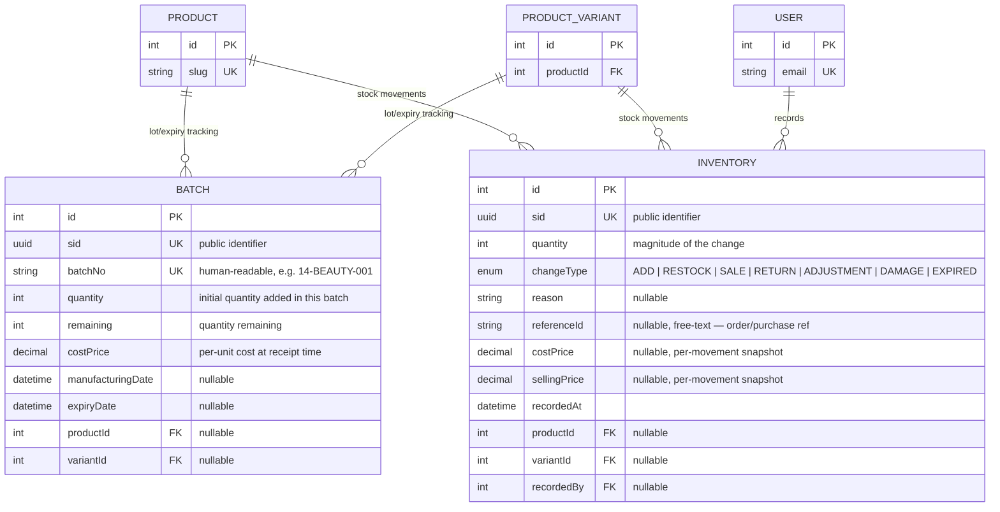

# Inventory Module

Lot/expiry tracking and the stock-movement ledger: `Batch` and `Inventory`. `Batch` answers "what lots of stock do we have, and when do they expire" (FEFO picking, expiry write-offs); `Inventory` answers "what happened to the stock, when, and why" (the audit ledger behind `Product.totalStock`/`ProductVariant.quantity`). They are related in practice but not by any FK.

Schema source: `prisma/schema/inventory.prisma` (models `Batch`, `Inventory`; enum `InventoryExchangeType`).
Module source: `src/modules/inventory/` (`inventory.controller.ts`, `inventory.service.ts`, `inventory.repository.ts`, `dto/`).

> **Scope note:** `Product`, `ProductVariant`, and `User` are documented in their own references — they appear here only as foreign-key targets needed to understand this domain's relationships.

---

### DB Schema

#### Entity-Relationship Diagram (ERD)



**Cardinality legend:** `||--o{` = one-to-many (parent must exist, child count is 0..N). Both `Batch` and `Inventory` can point to **either** a `Product` or a `ProductVariant` (or, per the current schema, neither — both FKs are independently nullable) — see [Known Gaps](#known-gaps--recommended-hardening).

---

#### Enum Definitions

##### `InventoryExchangeType`

| Value        | Meaning                                                                                            |
| :----------- | :--------------------------------------------------------------------------------------------------- |
| `ADD`        | Initial stock entry for a product/variant that had none recorded yet. **Default value on creation.** |
| `RESTOCK`    | Replenishment — a new shipment/batch arriving for stock that already exists.                          |
| `SALE`       | Stock decremented because an order was placed/fulfilled.                                              |
| `RETURN`     | Stock incremented because a customer returned a unit.                                                 |
| `ADJUSTMENT` | Manual correction (cycle count reconciliation, data-entry fix) — can be an increase or a decrease.    |
| `DAMAGE`     | Stock decremented because units were found damaged/unsellable.                                        |
| `EXPIRED`    | Stock decremented because a batch's `expiryDate` passed and the remaining units were written off.     |

> The enum only tags *why* a movement happened — it does not itself determine the arithmetic sign of `quantity`. See [Ledger Sign Convention](#ledger-sign-convention-read-this-first) below; this is the most important implementation detail in this domain.

---

#### Data Dictionary — Batch

**Table purpose:** tracks a discrete lot of stock received for a product or variant — its manufacturing/expiry dates, its per-unit acquisition cost, and how much of the original quantity remains. This is what powers FEFO (first-expired-first-out) picking and expiry-driven write-offs, distinct from `Inventory`, which is the movement ledger. Maps to table `batches`.

| Field               | Type              | Constraints                                                         | Description                                                                                                        |
| :------------------ | :----------------- | :--------------------------------------------------------------------- | :---------------------------------------------------------------------------------------------------------------- |
| `id`                | `INT`              | PK, AUTOINCREMENT                                                       | Internal numeric key; FK joins only, never exposed externally.                                                     |
| `sid`               | `UUID`             | UNIQUE, NOT NULL, DEFAULT `uuid()`, `@db.Uuid`                          | Public-facing identifier. Prevents ID enumeration/scraping.                                                        |
| `batchNo`           | `VARCHAR(100)`     | UNIQUE, NOT NULL, `@map("batch_no")`                                    | Human-readable batch/lot number, e.g. `"14-BEAUTY-001"`. Globally unique across every product.                     |
| `quantity`          | `INT`              | NOT NULL, DEFAULT `0`                                                   | Original quantity added when this batch was received. Immutable in practice — a historical record, not a running count. |
| `remaining`         | `INT`              | NOT NULL, DEFAULT `0`                                                   | Quantity still available from this batch. Decrements as units from this specific lot are sold/damaged/expired. No DB `CHECK` keeps `0 <= remaining <= quantity` — see [Known Gaps](#known-gaps--recommended-hardening). |
| `costPrice`         | `DECIMAL(12,2)`    | NOT NULL, DEFAULT `0`, `@map("cost_price")`                             | Cost paid **per unit** to acquire this batch — a snapshot at receipt time, used for COGS/FIFO valuation. **Distinct from `Inventory.costPrice`**, which is a per-*movement* snapshot, not per-batch. |
| `manufacturingDate` | `TIMESTAMPTZ(3)`   | NULLABLE, `@map("manufacturing_date")`                                  | Date the batch was manufactured.                                                                                   |
| `expiryDate`        | `TIMESTAMPTZ(3)`   | NULLABLE, `@map("expiry_date")`                                         | Date the batch expires — drives FEFO picking and expiry write-offs.                                                |
| `createdAt`         | `TIMESTAMPTZ(3)`   | NOT NULL, DEFAULT `now()`, `@map("created_at")`                         | Row creation time (when the batch was received/entered).                                                           |
| `updatedAt`         | `TIMESTAMPTZ(3)`   | NOT NULL, `@updatedAt`, `@map("updated_at")`                            | Last modification time (e.g. `remaining` decremented).                                                             |
| `productId`         | `INT`              | FK → `products.id`, NULLABLE, **ON DELETE CASCADE**, `@map("product_id")` | Owning product, if this batch is for a `SIMPLE` product.                                                         |
| `variantId`         | `INT`              | FK → `product_variants.id`, NULLABLE, **ON DELETE CASCADE**, `@map("variant_id")` | Owning variant, if this batch is for one specific variant.                                               |

---

#### Data Dictionary — Inventory

**Table purpose:** the append-only stock-movement ledger — one row per quantity change, with the reason (`changeType`), the actor who recorded it, and a price snapshot at the time of the change. This is the audit trail behind `Product.totalStock`/`ProductVariant.quantity` (see [product.md's Inventory & Cache Sync Logic](./product.md#inventory--cache-sync-logic)) — those columns are the cached *current* total; this table is the *history* that explains how the total got there. Maps to table `inventory`.

| Field          | Type                           | Constraints                                                         | Description                                                                                                       |
| :------------- | :------------------------------ | :--------------------------------------------------------------------- | :-------------------------------------------------------------------------------------------------------------- |
| `id`           | `INT`                           | PK, AUTOINCREMENT                                                       | Internal numeric key.                                                                                             |
| `sid`          | `UUID`                          | UNIQUE, NOT NULL, DEFAULT `uuid()`, `@db.Uuid`                          | Public-facing identifier. Prevents ID enumeration/scraping.                                                       |
| `quantity`     | `INT`                           | NOT NULL, DEFAULT `0`                                                   | Magnitude of this single movement. Sign convention is **not enforced by the schema** — see [Ledger Sign Convention](#ledger-sign-convention-read-this-first). |
| `changeType`   | `ENUM(InventoryExchangeType)`   | NOT NULL, DEFAULT `ADD`, `@map("change_type")`                          | Why the movement happened.                                                                                        |
| `reason`       | `TEXT`                          | NULLABLE                                                                | Free-text human note (e.g. "cycle count discrepancy, warehouse B").                                              |
| `referenceId`  | `TEXT`                          | NULLABLE, `@map("reference_id")`                                        | Free-text pointer to an external record (order ID, purchase order, etc.). **No `referenceType` column and no FK** — see [Known Gaps](#known-gaps--recommended-hardening). |
| `costPrice`    | `DECIMAL`                       | NULLABLE, `@map("cost_price")`, **no explicit precision/scale**         | Cost basis snapshot at the time of this stock change. See [Known Gaps](#known-gaps--recommended-hardening) re: missing `@db.Decimal(p,s)`. |
| `sellingPrice` | `DECIMAL`                       | NULLABLE, `@map("selling_price")`, **no explicit precision/scale**      | Selling price snapshot at the time of this stock change. Same precision caveat as `costPrice`.                   |
| `recordedAt`   | `TIMESTAMPTZ(3)`                | NOT NULL, DEFAULT `now()`, `@map("recorded_at")`                        | When this movement was recorded. There is no `updatedAt` — rows are treated as immutable log entries, never edited after the fact. |
| `productId`    | `INT`                           | FK → `products.id`, NULLABLE, **ON DELETE CASCADE**, `@map("product_id")` | Product this movement applies to, if not variant-specific.                                                     |
| `variantId`    | `INT`                           | FK → `product_variants.id`, NULLABLE, **ON DELETE CASCADE**, `@map("variant_id")` | Variant this movement applies to, if variant-specific.                                                  |
| `recordedBy`   | `INT`                           | FK → `users.id`, NULLABLE, **ON DELETE SET NULL**, `@map("recorded_by")` | Actor who recorded the movement. Deleting the user preserves the ledger row and nulls out the actor.             |

> **`costPrice` means two different things on these two tables.** `Batch.costPrice` is `NOT NULL`, has an explicit `Decimal(12,2)`, and is a **per-unit** acquisition cost fixed at receipt time for the whole lot. `Inventory.costPrice` is nullable, has no explicit precision, and is a **per-movement** snapshot — it can legitimately differ across two `SALE` rows for the same product if the cost basis changed between them. Don't conflate the two when reconciling margins.

---

#### Relationships and Cascading Rules

| Parent → Child                               | FK Column               | On Delete    | Effect                                                                                                                                            |
| :-------------------------------------------- | :----------------------- | :----------- | :---------------------------------------------------------------------------------------------------------------------------------------------------- |
| `Product` → `Batch`                          | `Batch.productId`         | **CASCADE**   | Deleting a product wipes its lot/expiry batches — same rule documented from `Product`'s side in [product.md](./product.md#relationships-and-cascading-rules). |
| `ProductVariant` → `Batch`                   | `Batch.variantId`         | **CASCADE**   | Same, at variant granularity.                                                                                                                          |
| `Product` → `Inventory`                      | `Inventory.productId`     | **CASCADE**   | Deleting a product wipes its stock-movement history.                                                                                                   |
| `ProductVariant` → `Inventory`               | `Inventory.variantId`     | **CASCADE**   | Same, at variant granularity.                                                                                                                          |
| `User` → `Inventory` (`InventoryRecordedBy`) | `Inventory.recordedBy`    | **SET NULL**  | Deleting a user preserves the inventory rows they recorded, nulling out the actor — consistent with every other audit FK in this schema (`createdBy`/`updatedBy`/`deletedBy` on `Product`, `ComboProduct`, `Home`, etc.). |

**Practical implications:**

- Because `Product → Batch` and `Product → Inventory` are both `CASCADE`, a hard-deleted product silently destroys its entire lot/expiry and stock-movement history — a regulatory/compliance record for a pharmaceutical retailer. Always prefer `Product.deletedAt` (soft delete) over a hard `DELETE` once a product has ever had stock movement.

---

#### Performance Optimizations (Indexes)

##### Current indexes (`inventory.prisma`)

| Index                                                                | Type              | Purpose                                                                              |
| :--------------------------------------------------------------------- | :------------------ | :----------------------------------------------------------------------------------- |
| `sid` (`Batch`, `Inventory`), `batchNo` (`Batch`) (each `@unique`)      | B-Tree (unique)      | Identity lookups; Prisma/Postgres creates one unique index per column automatically.  |
| `@@index([productId])`, `@@index([variantId])` (`Batch`)               | B-Tree               | Listing a product/variant's batches (e.g. for FEFO picking).                          |
| `@@index([productId])`, `@@index([variantId])` (`Inventory`)           | B-Tree               | Listing a product/variant's movement history.                                         |
| `@@index([changeType])` (`Inventory`)                                  | B-Tree               | Filtering the ledger by movement type (e.g. "show all `DAMAGE` entries").              |
| `recordedBy` (FK column)                                               | B-Tree (implicit)    | Prisma auto-creates an index on every relation scalar field.                          |

##### Recommended future indexes (not yet implemented)

- **`@@index([expiryDate])`** on `Batch` — required for an efficient "batches expiring within N days" alert query; today that's a sequential scan filtered/sorted at query time.
- **`@@index([productId, recordedAt])`** on `Inventory` — the natural "stock movement history for this product, in chronological order" query isn't served by the current single-column `productId` index alone once a product accumulates many ledger rows.
- **Partial index** `ON batches (product_id) WHERE remaining > 0` (or the variant equivalent) — speeds up "which batches still have stock" lookups without scanning fully-depleted historical batches.

---

#### Conventions

- **All `DateTime` columns are `@db.Timestamptz(3)`.** Prisma's default mapping is timezone-naive; comparing a naive column against SQL `now()` casts through the *server's* `TimeZone` setting. Any new `DateTime` field must carry `@db.Timestamptz(3)`.
- **`sid` is the public identifier, `id` is internal** — the same convention as every other module in this schema.
- **Priced columns should carry an explicit `@db.Decimal(12,2)`** — `Batch.costPrice` does; `Inventory.costPrice`/`sellingPrice` don't, which is an inconsistency, not a deliberate exception. See [Known Gaps](#known-gaps--recommended-hardening).
- **`Batch` and `Inventory` are not linked by any FK.** They cover overlapping ground (both scoped by `productId`/`variantId`) but serve different jobs — see [Batch vs. Inventory](#batch-vs-inventory--two-different-jobs).

---

#### Example Data

**Batch**

| batchNo                | quantity | remaining | costPrice | manufacturingDate      | expiryDate              | productId |
| :---------------------- | :------- | :-------- | :-------- | :---------------------- | :----------------------- | :-------- |
| **14-BEAUTY-001**       | `500`    | `120`     | `210.00`  | `2026-01-15T00:00:00Z`   | `2027-01-15T00:00:00Z`    | `14`      |
| **27-SUPP-VARIANT-104** | `200`    | `0`       | `85.50`   | `2026-03-01T00:00:00Z`   | `2026-09-01T00:00:00Z`    | `null`    |

**Inventory**

| changeType     | quantity | productId | variantId | referenceId   | recordedBy | recordedAt              |
| :-------------- | :------- | :-------- | :-------- | :------------- | :--------- | :------------------------ |
| **ADD**         | `500`    | `14`      | `null`    | `null`          | `3`         | `2026-01-15T09:00:00Z`     |
| **SALE**        | `5`      | `14`      | `null`    | `"ORD-10234"`   | `null`      | `2026-02-02T14:22:00Z`     |
| **DAMAGE**      | `2`      | `14`      | `null`    | `null`          | `7`         | `2026-02-10T11:05:00Z`     |
| **RETURN**      | `1`      | `14`      | `null`    | `"ORD-10234"`   | `7`         | `2026-02-12T16:40:00Z`     |

> The second `Batch` row (`27-SUPP-VARIANT-104`) has `productId: null` — it's a variant-level batch, so only `variantId` is set. `remaining: 0` means the lot is fully depleted but the row is retained as history, not deleted.
> The `SALE` row has `recordedBy: null` — an automated system-triggered movement (e.g. order fulfillment) rather than a manual action by staff.

---

#### Example Usage (JSON Response)

**Batch nearing expiry** (back-office inventory dashboard):

```json
{
  "sid": "c1d2e3f4-5678-4abc-9def-0123456789ab",
  "batchNo": "14-BEAUTY-001",
  "quantity": 500,
  "remaining": 120,
  "costPrice": 210.0,
  "manufacturingDate": "2026-01-15T00:00:00Z",
  "expiryDate": "2027-01-15T00:00:00Z",
  "productId": 14
}
```

**Sale movement** (stock-ledger entry, generated at order fulfillment):

```json
{
  "sid": "d4e5f6a7-8901-4bcd-a234-56789abcdef0",
  "quantity": 5,
  "changeType": "SALE",
  "referenceId": "ORD-10234",
  "costPrice": 210.0,
  "sellingPrice": 450.0,
  "recordedAt": "2026-02-02T14:22:00Z",
  "productId": 14,
  "recordedBy": null
}
```

**Manual adjustment** (back-office view, includes the actor):

```json
{
  "sid": "f47ac10b-58cc-4372-a567-0e02b2c3d479",
  "quantity": 3,
  "changeType": "ADJUSTMENT",
  "reason": "Cycle count discrepancy, warehouse B",
  "recordedAt": "2026-03-01T08:12:00Z",
  "productId": 14,
  "recordedBy": 7
}
```

---

#### Implementation & Best Practices

##### Ledger Sign Convention (Read This First)

- `Inventory.quantity` is typed as a plain `INT` with no enforced sign. The schema does not specify whether a `SALE`/`DAMAGE`/`EXPIRED` row stores its `quantity` as a **positive magnitude** (with the sign implied by `changeType`) or as a **signed delta** (negative for decrements). Both are representable today, and mixing the two conventions in application code would silently corrupt any `SUM(quantity)` reconciliation query.
- **Recommended convention:** store `quantity` as an always-positive magnitude, and derive the arithmetic sign from `changeType` at read time (`ADD`/`RESTOCK`/`RETURN` = `+`, `SALE`/`DAMAGE`/`EXPIRED` = `-`, `ADJUSTMENT` = caller-determined, ideally split into `ADJUSTMENT_UP`/`ADJUSTMENT_DOWN` if that ambiguity becomes a real problem). Whichever convention is chosen, enforce it in exactly one place (the repository's `createMovement` method), never inline at each call site.

##### Batch vs. Inventory — Two Different Jobs

- `Batch` answers "what lots of stock do we have, and when do they expire" (FEFO picking, expiry write-offs). `Inventory` answers "what happened to the stock, when, and why" (the audit ledger). They are related in practice (an `EXPIRED` `Inventory` row should correspond to a `Batch.remaining` write-down) but there is **no FK between them** — nothing in the schema ties a specific `Inventory` row to the `Batch` it drew from. If per-batch movement tracking becomes a requirement, add a nullable `batchId` FK to `Inventory` rather than trying to infer it after the fact from timestamps.
- `Batch.remaining` and `Product.totalStock`/`ProductVariant.quantity` are three separate denormalized numbers that must all move together inside the same transaction whenever stock changes — see the `withTransaction` pattern documented in [product.md's Inventory & Cache Sync Logic](./product.md#inventory--cache-sync-logic). Nothing in this schema enforces that sync automatically.

##### Compliance & Retention

- For a pharmaceutical retailer, `Batch` (lot/expiry) and `Inventory` (movement history) rows are regulatory records, not disposable cache data. Never hard-delete them directly — they should only ever disappear as a side effect of a deliberate, audited product purge, not routine cleanup.
- `referenceId` is the only link back to the order/purchase that caused a movement, and it is an unvalidated free-text field — a typo there silently orphans the traceability chain between a `SALE` row and the order that produced it. Populate it programmatically from the order/PO service, never via manual entry.

---

#### Known Gaps / Recommended Hardening

Schema-level issues worth fixing before the `inventory` module goes to production — not blockers for understanding the current design, but real bugs waiting to happen:

- **No `CHECK` constraint keeps `0 <= Batch.remaining <= Batch.quantity`** — a buggy decrement could drive `remaining` negative or above the original lot size with nothing rejecting the write.
- **Both `Batch.productId`/`variantId` and `Inventory.productId`/`variantId` are independently nullable with no `CHECK` requiring at least one to be set** — a row scoped to neither a product nor a variant is representable and meaningless.
- **No constraint ties `variantId` to actually belong to the referenced `productId`** when both are set — same class of gap as `ProductImage.variantId` in [product.md](./product.md#known-gaps--recommended-hardening).
- **`Inventory.costPrice`/`sellingPrice` are declared as plain `Decimal` with no `@db.Decimal(precision, scale)`**, unlike every priced column elsewhere in the schema (`Product.basePrice`, `ComboProduct.totalPrice`, and even `Batch.costPrice` on this same table, all `Decimal(12,2)`). Without an explicit native type, Postgres/Prisma falls back to a much wider default precision — align these two columns to `@db.Decimal(12, 2)` for consistency and predictable storage.
- **`Inventory.referenceId` has no companion `referenceType` column and no FK** — it's an untyped, unvalidated pointer to "an order, purchase, etc." with no way to enforce or even reliably determine which table it refers to.
- **No index on `Batch.expiryDate`** — expiry-alert queries ("what's expiring in the next 30 days") currently require a full scan.

---

### API End Point & Business Logic

_Not documented yet._ A real `inventory` module exists (`src/modules/inventory/`: controller, service, repository, DTOs) — this section covers only what's been written up so far. Ask for this to be filled in from the actual endpoint code when it's needed.
