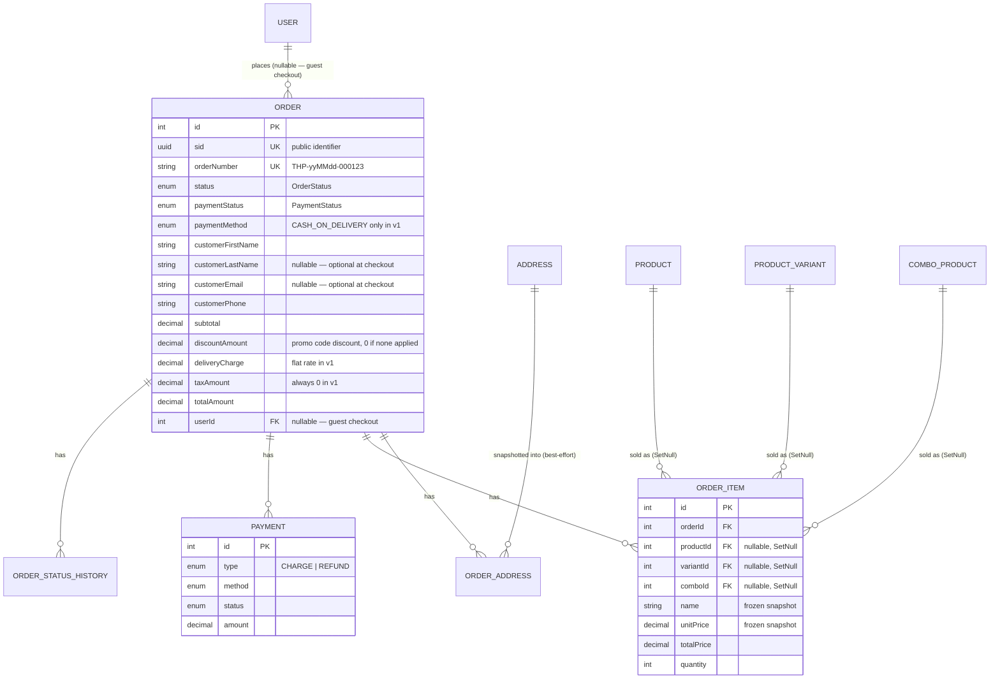

# Order Module

Checkout and order management. A logged-in customer or a guest places an order from a flat list of line items (products, variants, or combos); the server validates availability, freezes prices/addresses into an immutable snapshot, decrements stock, and creates the order inside a single transaction. Admins manage the order lifecycle from there (status transitions, payment confirmation).

Schema source: `prisma/schema/order.prisma` (`Order`, `OrderAddress`, `OrderItem`, `OrderStatusHistory`, `Payment`, plus enums `OrderStatus`/`PaymentMethod`/`PaymentStatus`/`PaymentTransactionType`/`AddressType`).
Module source: `src/modules/order/` (`order.controller.ts`, `order.service.ts`, `order.repository.ts`, `order.select.ts`, `dto/`).

> **Scope note:** This is the v1 implementation. A few features are deliberately deferred — see [Known Gaps / Deferred Features](#known-gaps--deferred-features) — but the schema and code are shaped so none of them require a breaking change later: `Cart`/`CartItem` (`cart.prisma`) and any delivery-partner/courier concept are unreferenced by this module or wired as a no-op placeholder. `PromoCode`/`PromoCodeRedemption` (`promotion.prisma`) are **no longer deferred** — see [Promo Code Integration](#promo-code-integration) and `docs/promotion.md` for the standalone `PromotionModule`.

---

### DB Schema

#### Entity-Relationship Diagram (ERD)

**Cardinality legend:** `||--o{` = one-to-many. `Order.userId` is nullable (guest checkout); `OrderItem.productId`/`variantId`/`comboId` are all nullable and `ON DELETE SET NULL` so a placed order survives the source catalog row being deleted later — the frozen `name`/`unitPrice`/etc. columns are what actually render order history.

---

#### Data Dictionary — Order (selected fields; full list in `order.prisma`)

| Field | Type | Description |
| :--- | :--- | :--- |
| `orderNumber` | `VARCHAR(50)` UNIQUE | Human-readable, customer-facing (`THP-260810-000123`). Generated server-side in two steps — see [Order Number Generation](#order-number-generation). |
| `status` | `ENUM(OrderStatus)` | See [Order Status Lifecycle](#order-status-lifecycle). |
| `paymentMethod` | `ENUM(PaymentMethod)` | The schema allows `CARD`/`SCANPAY`/`CASH_ON_DELIVERY`; **`CreateOrderDto` only accepts `CASH_ON_DELIVERY`** — see [Conventions](#conventions). |
| `customerFirstName`/`customerLastName`/`customerEmail`/`customerPhone` | — | Snapshot from the checkout form, never joined live off `User`/`Profile` — works identically for guest and logged-in checkout. Only `customerFirstName`/`customerPhone` are mandatory — `customerLastName`/`customerEmail` are optional; `phone` is the guaranteed contact channel for Cash on Delivery. |
| `subtotal`/`discountAmount`/`deliveryCharge`/`taxAmount`/`totalAmount` | `DECIMAL(12,2)` | Frozen at placement, never recomputed from current product prices. `totalAmount = subtotal - discountAmount + deliveryCharge + taxAmount`. |
| `appliedPromoCode` | `VARCHAR(50)` NULLABLE | Denormalized display copy of the applied `PromoCode.code`, set when `CreateOrderDto.promoCode` was supplied and validated. `PromoCodeRedemption` (`promotion.prisma`) is the authoritative ledger — see [Promo Code Integration](#promo-code-integration). |
| `userId` | `INT` NULLABLE, **ON DELETE SET NULL** | `null` for guest checkout. |

---

#### Relationships and Cascading Rules

| Parent → Child | FK Column | On Delete | Effect |
| :--- | :--- | :--- | :--- |
| `Order` → `OrderItem`/`OrderAddress`/`Payment`/`OrderStatusHistory` | `orderId` | **CASCADE** | Deleting an order (never exposed through the API — orders are cancelled, not deleted) removes its children. |
| `Product`/`ProductVariant`/`ComboProduct` → `OrderItem` | `productId`/`variantId`/`comboId` | **SET NULL** | A placed order survives the catalog row being deleted — the item's own snapshot columns (`name`, `unitPrice`, ...) render order history regardless. |
| `Address` → `OrderAddress` | `sourceAddressId` | **SET NULL** | Editing/deleting a saved address never rewrites a past order's delivery details — `OrderAddress` already holds its own frozen copy. |
| `User` → `Order` | `userId` | **SET NULL** | Deleting a user account does not delete their order history. |

---

#### Conventions

- **Every DateTime column is `@db.Timestamptz(3)`** — repo-wide convention.
- **Money math uses plain `Number` + `Math.round(x * 100) / 100`**, not a `Decimal` arithmetic library — matches the rounding approach already established in `InventoryRepository.weightedAverageCost`, not a new pattern.
- **Only Cash on Delivery is accepted in v1.** `PaymentMethod` (`order.prisma`) has three values, but `CreateOrderDto.paymentMethod` is validated with `@IsIn([PaymentMethod.CASH_ON_DELIVERY])`, not `@IsEnum(PaymentMethod)`. Accepting `CARD`/`SCANPAY` today would silently create an order nobody actually charges — there is no payment gateway wired up yet. Widen that validator once one exists.
- **Order placement never touches `ProductModule`/`ComboProductModule`.** `OrderRepository` reads `product`/`productVariant`/`comboProduct` directly with its own lean `select`s (`findProductForOrder`/`findVariantForOrder`/`findComboForOrder`), the same pattern `InventoryRepository` already uses for its own "stock target" lookups (`findProductStockInfo`/`findVariantStockInfo`). This keeps `OrderModule`'s import graph to `AddressModule` + `InventoryModule` only.
- **Stock deduction reuses `InventoryService`, never duplicates its math.** `InventoryService.deductStockForSale`/`restoreStockForSale` (new methods, added for this module) wrap the same `product`/`productVariant` quantity columns and `Inventory` ledger `InventoryRepository` already owns — see [Stock & Inventory Integration](#stock--inventory-integration).
- **A combo purchase decrements the underlying products/variants, never `ComboProduct.quantity` directly** — that column is trigger-derived and recomputes itself once the underlying stock changes, per `combo-product.prisma`'s own documented contract.
- **Guests never touch the address book.** `AddressModule`'s every route requires `@Roles(UserRole.CUSTOMER)` — a guest order's `newAddress` is used inline to build the `OrderAddress` snapshot and nothing is written to `addresses`.
- **A logged-in customer's `newAddress` is saved to their address book as a side effect**, via `AddressService.createAddress` — which opens its own transaction, not this order's. See [Address Resolution](#address-resolution) for why that's a deliberate trade-off.
- **A promo code is validated, reserved, and redeemed entirely inside `placeOrder`'s own transaction.** `OrderModule` imports `PromotionModule` and calls `PromotionService.validateAndReserveForOrder`/`recordRedemption` — no discount math is duplicated in `OrderService`. See [Promo Code Integration](#promo-code-integration).

---

#### Known Gaps / Deferred Features

- **No cart.** Checkout takes a flat `items[]` array in the request body; `Cart`/`CartItem` (`cart.prisma`) are unreferenced. Wiring a cart in later means a new `POST /cart/checkout` that reads a `Cart` row and shapes it into the same `OrderItemDto[]` — `OrderService.placeOrder`'s core doesn't change.
- **No delivery-pricing module.** `deliveryCharge` is a flat constant (`FLAT_DELIVERY_CHARGE` in `order.service.ts`), not a configurable rule engine. `Order.deliveryCharge` is its own column, so swapping the constant for a real computation later doesn't touch the total formula.
- **No payment gateway.** Only `CASH_ON_DELIVERY` is accepted (see [Conventions](#conventions)). `Payment.provider`/`transactionId`/`gatewayResponse` exist on the schema for when one is added; nothing populates them yet.
- **No courier/delivery-partner integration.** `OrderStatus` has no delivery-partner assignment concept. Status is entirely admin-driven today.
- **No partial (line-item) editing of a placed order.** Only whole-order cancellation is implemented (full stock restoration via `restoreStockForCancelledOrder`). Removing/adjusting individual lines from an already-placed order (natura's `itemsToRemove`/`itemsToUpdate` reconciliation) is a deferred admin power-tool, not core v1.
- **No batch/FIFO attribution for a sale.** `InventoryService.deductStockForSale` decrements the product's/variant's own running `quantity` directly — it does not draw from specific `Batch` rows the way admin-driven `removeStock` does. Precise expiry-accurate COGS per order line is a documented future enhancement.
- **No guest post-purchase order lookup.** A guest receives their full order in the `POST /order/place-order` response; there is no `GET /order/track/:sid` (or similar) for a guest to look up an order later without an account.
- **`isDefault`-style race safety aside, the guarded stock decrement is the only concurrency protection.** `decrementProductQuantityGuarded`/`decrementVariantQuantityGuarded` (`InventoryRepository`) use a `WHERE quantity >= amount` guard so a race can't push stock negative, but there is no optimistic-locking/retry — a losing request simply gets a `400`.

---

### API Endpoints & Business Logic

Every endpoint is served by `OrderController` → `OrderService` → `OrderRepository`. All routes are prefixed `/api/v1/order`.

#### Endpoint Overview

| Method | Path | Access | Purpose |
| :--- | :--- | :--- | :--- |
| `POST` | `/place-order` | Public (optional JWT) | [Place an order](#place-an-order) |
| `GET` | `/my-orders` | `CUSTOMER` | List my orders, paginated |
| `GET` | `/all-order` | `ADMIN` | List all orders, paginated |
| `GET` | `/:id/history` | `ADMIN` | One order with full status history |
| `GET` | `/:id` | Owner or `ADMIN` | One order by id |
| `PATCH` | `/:id/status` | `ADMIN` | [Update order status](#order-status-lifecycle) |
| `PATCH` | `/:id/payment-status` | `ADMIN` | Update payment status |

---

#### Place an Order

**`POST /api/v1/order/place-order`**

Works with or without a Bearer token (`@Public()` + `JwtAuthGuard` — the guard still attempts JWT validation if a token is present, attaching `req.user`, but doesn't fail the request if one isn't). A logged-in account whose role isn't `CUSTOMER` is rejected outright — checkout is a customer/guest surface, not a staff one.

**Business logic — in order, all inside one `$transaction`:**

1. **Address resolution** (`OrderService.resolveAddress`) — see [Address Resolution](#address-resolution) below.
2. **Item aggregation** (`aggregateItems`) — duplicate lines for the same product/variant/combo are merged (summed quantity) before validation, so a client double-submit is checked and charged once, not twice.
3. **Per-line validation + snapshot build** (`buildOrderItems`):
   - **Product/variant**: must be `ACTIVE`, not soft-deleted, requested quantity ≤ live `quantity`. Unit price is read directly from `Product.salePrice`/`ProductVariant.salePrice` — both are already server-derived from `discountType`/`discountValue` at write time, so there is no discount recomputation at order time.
   - **Combo**: must be `ACTIVE`, not soft-deleted. Effective sellable bundles = `min(ComboProduct.quantity, ComboProduct.offeredQuantity ?? Infinity)` — the same formula `ComboProductService` uses internally. A combo line also expands into a stock-deduction entry per underlying `ComboItem` (`ComboItem.quantity × bundles purchased`), merged with any other line touching the same product/variant.
   - Each validated line becomes a frozen `OrderItem` row: `name`/`nameTh`/`sku`/`imageUrl`/`attributes` are all copied at this moment, not joined later.
4. **Promo code** (if `dto.promoCode` is present): `PromotionService.validateAndReserveForOrder` validates it against the just-computed `subtotal` and reserves one use; the returned discount is split across `orderItems` — see [Promo Code Integration](#promo-code-integration).
5. **Pricing**: `subtotal` = sum of item totals (pre-discount); `deliveryCharge` = flat v1 constant; `discountAmount` = the promo discount (`0` if none applied); `taxAmount` = `0`; `totalAmount` computed and asserted `> 0`.
6. **Order row created** with a placeholder `orderNumber`, then immediately updated to its real value once the row's own `id` is known — see [Order Number Generation](#order-number-generation).
7. **Promo redemption recorded** (if a code was reserved in step 4) — `PromotionService.recordRedemption` writes the `PromoCodeRedemption` ledger row now that `Order.id` is known.
8. **`OrderAddress` snapshot created** (`type: SHIPPING`) from the resolved address.
9. **`OrderItem` rows created** via `createMany` — each carrying its own share of the promo discount, if any.
10. **Stock decremented** via `InventoryService.deductStockForSale` — see [Stock & Inventory Integration](#stock--inventory-integration).
11. **Initial `OrderStatusHistory` row created** (`status: PENDING`, `note: 'Order placed'`, `changedBy: null` — customer/system-initiated).
12. **`Payment` row created** (`type: CHARGE`, `status: PENDING`, `amount: totalAmount`).
13. Order re-fetched inside the same transaction and returned as `OrderResponseDto`.

**Response shape**: `OrderResponseDto` (no `statusHistory` — only the admin `/:id/history` endpoint includes it).

| Status | Cause |
| :--- | :--- |
| `201` | Order placed successfully. |
| `400` | Invalid input; an item/combo not `ACTIVE`; requested quantity exceeds live stock (including a race lost to a concurrent checkout); an invalid/expired/exhausted promo code; `totalAmount <= 0`. |
| `403` | A logged-in non-`CUSTOMER` account attempted to check out. |
| `404` | A referenced `productId`/`variantId`/`comboId`/`addressId` doesn't exist. |

---

#### Promo Code Integration

`CreateOrderDto.promoCode` is optional. When present, `OrderService.placeOrder` calls into `PromotionModule` (imported alongside `AddressModule`/`InventoryModule`) entirely inside its own `$transaction`, right after `buildOrderItems` has produced a `subtotal` and before the `Order` row is created:

1. **`PromotionService.validateAndReserveForOrder(code, subtotal, userId, email, tx)`** re-runs every check `POST /promotion/promo-codes/validate` already ran at cart time (active, within its date window, `subtotal >= minOrderAmount`, per-code and per-customer usage limits) — a preview and the actual placement can be minutes apart, so nothing is trusted from an earlier call. On success it also **reserves** the redemption with a guarded `UPDATE ... WHERE usedCount < usageLimit` (same shape as `InventoryRepository`'s guarded stock decrement), so a race that already claimed the last redemption fails this order with `400` instead of oversubscribing the code. Any failure anywhere later in the same transaction (e.g. a stock check) unwinds this reservation automatically.
2. The returned `discountAmount` is split across `orderItems` by `OrderService.allocateDiscountAcrossItems`, weighted by each line's own pre-discount `totalPrice`, with the last line absorbing the rounding remainder. This is what makes each `OrderItem.totalPrice` satisfy its documented formula (`(unitPrice * quantity) - discountAmount`, `order.prisma`) — `Order.subtotal` itself stays the pre-discount sum computed in `buildOrderItems`, exactly as documented on that column.
3. Once the `Order` row's own `id` exists, **`PromotionService.recordRedemption(promoCodeId, userId, orderId, discountAmount, tx)`** writes the `PromoCodeRedemption` ledger row — the authoritative record `PromoCode.usageLimitPerUser` enforcement reads from; `Order.appliedPromoCode` is only a denormalized display copy.

See `docs/promotion.md` for the standalone `PromotionModule` (admin CRUD + the public validate/preview endpoint) and the discount-computation rules (`FIXED` vs `PERCENTAGE`, `maxDiscountAmount` capping).

---

#### Address Resolution

Not a separate endpoint — internal to `placeOrder`, but documented on its own since the logic branches on both auth state and which of `addressId`/`newAddress` was sent (enforced mutually exclusive by `CreateOrderDto`'s `AddressSourceConstraint`).

| Caller | `addressId` | `newAddress` | Behavior |
| :--- | :--- | :--- | :--- |
| Logged-in | ✓ | — | `AddressService.getAddressById(userId, addressId)` — 404/ownership-checked (throws if the address belongs to someone else). |
| Logged-in | — | ✓ | `AddressService.createAddress(userId, ...)` — saved to the address book (becomes their default if it's their first), *then* used for this order. `recipientName`/`phone` default to the checkout form's name/phone when omitted from `newAddress`. |
| Guest | ✓ | — | Rejected — `400`, "Guests cannot use a saved address". |
| Guest | — | ✓ | Used inline only — no `Address` row is ever created; `sourceAddressId` on the resulting `OrderAddress` is `null`. |

**Deliberate trade-off**: `AddressService.createAddress` opens its own transaction (it's `AddressModule`'s existing public API, already shipped, with no `tx`-aware variant), not this order's. If the order later fails validation (e.g. an item goes out of stock further down the same request), the newly saved address is **not** rolled back — it stays in the customer's address book. This is intentional: a saved address is a reusable asset independent of any single order's outcome, not something that should vanish because an unrelated line item failed.

---

#### Stock & Inventory Integration

`OrderModule` imports `InventoryModule` and calls two new `InventoryService` methods added specifically for this module (`inventory.service.ts`, "Sales (order fulfillment)" section) — no stock math is duplicated in `OrderRepository`:

- **`deductStockForSale(items, referenceId, userId, tx)`** — called once per placed order with every merged product/variant deduction line. Internally: `InventoryRepository.decrementProductQuantityGuarded`/`decrementVariantQuantityGuarded` (new repository methods — `UPDATE ... WHERE quantity >= amount`, so a race that's already sold the last unit updates zero rows instead of going negative) followed by one `InventoryRepository.createMovement` per line (`changeType: SALE`, `referenceId: "order:{id}"`).
- **`restoreStockForSale(items, referenceId, reason, userId, tx)`** — the inverse, called on whole-order cancellation. Increments stock via the existing `incrementProductQuantity`/`incrementVariantQuantity` and logs `changeType: RETURN` (not `RESTOCK`, which implies a fresh vendor intake rather than stock coming back from a cancelled sale).

Neither method touches `Batch` rows — a sale draws down the product's/variant's own running `quantity` directly, with no per-batch/FIFO attribution. That precision (which specific batch a given order line came from, for expiry-accurate COGS) belongs to the admin-driven `removeStock` flow and is a deferred enhancement here — see [Known Gaps](#known-gaps--deferred-features). The `sync_product_stock_fields`/`sync_variant_stock_status` DB triggers still recompute `stockStatus`/`totalStock` automatically from the `quantity` change either way — nothing extra is written for that.

---

#### Order Number Generation

`orderNumber` (`THP-yyMMdd-{id padded to 6}`, e.g. `THP-260810-000123`) depends on the row's own `id`, which doesn't exist before the insert. Same two-step dance as `InventoryService.createBatchWithGeneratedNumber`: the `Order` row is first created with a throwaway placeholder (`PENDING-{uuid}`, satisfying the `NOT NULL UNIQUE` constraint for the instant before the real number is known), then immediately updated to its real value — all inside the same transaction, so the placeholder is never visible outside it.

---

#### Order Status Lifecycle

**`PATCH /api/v1/order/:id/status`** (Admin only)

`OrderStatus`: `PENDING → CONFIRMED → PROCESSING → PACKED → SHIPPED → OUT_FOR_DELIVERY → DELIVERED`, with `CANCELLED`/`RETURNED`/`REFUNDED`/`FAILED` as exits. Legal transitions are enforced by a full table (`ALLOWED_TRANSITIONS` in `order.service.ts`), generalizing natura's single guard (which only blocked `CONFIRMED`/`CANCELLED → PENDING`) since THP has more intermediate stops that also shouldn't be reachable from a terminal state.

**Side effects per transition:**

| Transition | Effect |
| :--- | :--- |
| `→ CONFIRMED` | Stamps `confirmedAt`. |
| `→ SHIPPED` | Stamps `shippedAt`. |
| `→ DELIVERED` | Stamps `deliveredAt`. **If `paymentMethod` is `CASH_ON_DELIVERY` and `paymentStatus` is still `PENDING`, also flips `paymentStatus` to `PAID`** — for COD, delivery confirmation *is* the moment payment happens. A future card/QR gateway would move `paymentStatus` via its own webhook instead, not this transition. |
| `→ CANCELLED` | Requires `cancelReason` (validated on `UpdateOrderStatusDto`). Stamps `cancelledAt`. Restores stock for every order line (`restoreStockForCancelledOrder` — whole-order only, see [Known Gaps](#known-gaps--deferred-features)). If `paymentStatus` was still `PENDING`, also flips it to `CANCELLED`; an already-`PAID` order is left alone — reversing collected money is a refund, a separate decision from "stop fulfilling this order". |

Every transition writes one `OrderStatusHistory` row (`changedBy` = the acting admin's user id).

| Status | Cause |
| :--- | :--- |
| `200` | Status updated successfully. |
| `400` | Illegal transition for the order's current status; `cancelReason` missing on a `CANCELLED` transition. |
| `404` | Order not found. |

---

#### Update Payment Status

**`PATCH /api/v1/order/:id/payment-status`** (Admin only)

Directly sets `Order.paymentStatus` and the order's `Payment` row's `status` (stamping `paidAt` when the new status is `PAID`). An optional `note` is recorded as an `OrderStatusHistory` entry against the order's *current* `status` (this endpoint never changes `status` itself). Primarily exists today for manually confirming a COD payment outside the `DELIVERED` auto-flip (e.g. a partial refund, a correction) — it's also the shape a future gateway webhook handler would call into.
