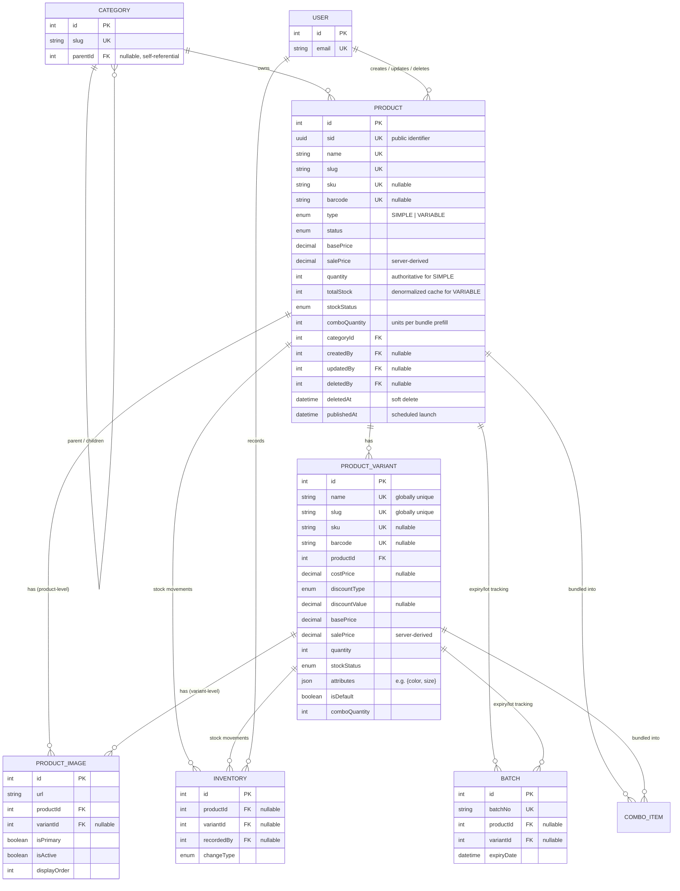

# Product Module

The top-level catalog domain — every sellable item in the store. `Product` owns identity (slug/SKU/barcode), pricing, aggregate stock state, SEO metadata, bilingual health/compliance labeling, and a full audit trail. `ProductVariant` holds each sellable configuration of a `VARIABLE` product, and `ProductImage` holds gallery imagery for either level.

Schema source: `prisma/schema/product.prisma` (models `Product`, `ProductVariant`, `ProductImage`; enums `ProductType`, `DiscountType`, `StockStatus`).
Module source: `src/modules/product/` (`product.controller.ts`, `product.service.ts`, `product.repository.ts`, `product.select.ts`, `dto/`).

> **Scope note:** `Category`, `User`, `Inventory`, `Batch`, and `ComboProduct`/`ComboItem` are documented in their own references — they appear here only as foreign-key targets/sources needed to understand Product's relationships.

---

### DB Schema

#### Entity-Relationship Diagram (ERD)



**Cardinality legend:** `||--o{` = one-to-many (parent must exist, child count is 0..N). `Product ↔ ProductVariant ↔ ProductImage` is a strict two-level tree — there is no many-to-many relationship inside this domain.

---

#### Enum Definitions

##### `ProductType`

| Value      | Meaning                                                                                                                  |
| :--------- | :------------------------------------------------------------------------------------------------------------------------ |
| `SIMPLE`   | Standalone product, no variants. Stock lives on `Product.quantity`.                                                       |
| `VARIABLE` | Parent product with one or more `ProductVariant` rows. Stock lives on each variant; `Product.totalStock` is a cached sum.  |

> There is no `COMBO` value on this enum — it was removed via `prisma/migrations/20260714200004_remove_combo_product_type`. Combos are modeled separately as `ComboProduct`/`ComboItem` (`combo-product.prisma`), which reference `Product`/`ProductVariant` by FK; don't try to represent one by hijacking `ProductType`.

> **Column default vs. service default disagree on purpose.** The schema declares `@default(SIMPLE)`, but `ProductService.createProduct` resolves an omitted `dto.type` to `VARIABLE` — see [Create a Product](#create-a-product), step 4.

##### `DiscountType`

| Value        | Meaning                                       |
| :----------- | :--------------------------------------------- |
| `FIXED`      | The discount is a flat currency amount.        |
| `PERCENTAGE` | The discount is a percentage of `basePrice`. Column default on both `Product` and `ProductVariant`. |

> `DiscountType` tags *how a discount was configured*, paired with `discountValue` (the raw configured amount/percentage) — identical shape on `Product` and `ProductVariant`. The resolved `salePrice` is computed from these two by `ProductService.resolveSalePrice`; a DB `CHECK` bounds `discountValue` against `discountType` (see [Financial Integrity & Pricing](#financial-integrity--pricing)), but nothing at the DB level ties the *resolved* `salePrice` back to them — that derivation stays a service-layer responsibility.

##### `StockStatus`

| Value          | Meaning                                                      |
| :------------- | :------------------------------------------------------------ |
| `IN_STOCK`     | Available quantity above `lowStockThreshold`.                 |
| `LOW_STOCK`    | Available (quantity > 0) but at or below `lowStockThreshold`. |
| `OUT_OF_STOCK` | Zero available quantity. Default value on creation.           |

`lowStockThreshold` lives on both `Product` and `ProductVariant` (default `10`), compared against the row's own effective count — `quantity`/`totalStock` for `Product` (whichever is authoritative for its `type`), `quantity` for `ProductVariant`. Both `stockStatus` and `lowStockThreshold` are kept in sync by DB triggers as well as application logic — see `sync_variant_stock_status` / `sync_product_stock_fields` (`prisma/migrations/20260715130000_add_low_stock_threshold`) and [Inventory & Cache Sync Logic](#inventory--cache-sync-logic).

##### `CategoryProductStatus` (shared with `Category`/`ComboProduct`, defined in `shared.prisma`)

| Value      | Meaning                                                                    |
| :--------- | :-------------------------------------------------------------------------- |
| `ACTIVE`   | Live and visible on the storefront. **Default for a new product.**           |
| `INACTIVE` | Temporarily hidden, but not archived — can be reactivated freely.            |
| `DRAFT`    | Being authored, never shown publicly regardless of `publishedAt`.            |
| `ARCHIVED` | Retired/discontinued. Set automatically by soft delete.                      |
| `HIDDEN`   | Exists and purchasable via direct link, but excluded from listings/search.   |

> Only `ACTIVE` passes the public visibility gate. Every other value returns `404` from public routes — see [Get Product by Slug (Public)](#get-product-by-slug-public).

---

#### Data Dictionary — Product

**Table purpose:** the top-level catalog entity — every sellable item (simple or variable) has exactly one row here. It owns identity (slug/SKU/barcode), pricing defaults, aggregate stock state, SEO metadata, bilingual health/compliance labeling (dosage, ingredients, warnings), and the full audit trail. Maps to table `products`.

| Field                   | Type                          | Constraints                                                          | Description                                                                                              |
| :---------------------- | :---------------------------- | :-------------------------------------------------------------------- | :-------------------------------------------------------------------------------------------------------- |
| `id`                    | `INT`                         | PK, AUTOINCREMENT                                                     | Internal numeric key; FK joins and admin routes.                                                          |
| `sid`                   | `UUID`                        | UNIQUE, NOT NULL, DEFAULT `uuid()`, `@db.Uuid`                        | Public-facing identifier. Prevents ID enumeration/scraping.                                               |
| `name`                  | `VARCHAR(255)`                | UNIQUE, NOT NULL                                                      | English display name. Uniqueness is checked in the service before the insert for a clean `409`.           |
| `slug`                  | `VARCHAR(255)`                | UNIQUE, NOT NULL                                                      | URL-safe identifier — primary lookup key for the product detail page (PDP). Derived from `name`.          |
| `sku`                   | `VARCHAR(100)`                | UNIQUE, NULLABLE                                                      | Stock Keeping Unit for a `SIMPLE` product (variants carry their own SKU).                                 |
| `barcode`               | `VARCHAR(100)`                | UNIQUE, NULLABLE                                                      | EAN/UPC barcode for POS/warehouse scanning. Admin-only — never returned publicly.                         |
| `description`           | `TEXT`                        | NULLABLE                                                              | Long-form English description.                                                                            |
| `shortDescription`      | `VARCHAR(500)`                | NULLABLE, `@map("short_description")`                                 | Truncated summary for cards/listings.                                                                     |
| `nameTh`                | `VARCHAR(255)`                | NULLABLE, `@map("name_th")`                                           | Thai display name. Also a searchable field on both list endpoints.                                        |
| `descriptionTh`         | `TEXT`                        | NULLABLE, `@map("description_th")`                                    | Thai long-form description.                                                                               |
| `shortDescTh`           | `VARCHAR(500)`                | NULLABLE, `@map("short_desc_th")`                                     | Thai summary.                                                                                             |
| `type`                  | `ENUM(ProductType)`           | NOT NULL, DEFAULT `SIMPLE`                                            | Discriminates single-unit vs. multi-variant products. **The service defaults an omitted value to `VARIABLE` instead.** |
| `status`                | `ENUM(CategoryProductStatus)` | NOT NULL, DEFAULT `ACTIVE`                                            | Lifecycle/visibility state.                                                                               |
| `isFeatured`            | `BOOLEAN`                     | NOT NULL, DEFAULT `false`, `@map("is_featured")`                      | Drives homepage/featured sections.                                                                        |
| `hasVariants`           | `BOOLEAN`                     | NOT NULL, DEFAULT `false`, `@map("has_variants")`                     | **Denormalized cache** of `variants.length > 0` — read-fast flag for UI branching (Add-to-Cart vs. Select-Options). No trigger; application code must set it. |
| `comboQuantity`         | `INT`                         | NOT NULL, DEFAULT `1`, `@map("combo_quantity")`, `CHECK > 0`          | How many units of this product go into a combo — prefills `ComboItem.quantity` when bundled. `ComboItem.quantity` stays authoritative per combo and may override it. |
| `costPrice`             | `DECIMAL(12,2)`               | NULLABLE, `@map("cost_price")`                                        | Internal cost basis for margin reporting. **Never expose on a public API.**                               |
| `discountType`          | `ENUM(DiscountType)`          | NOT NULL, DEFAULT `PERCENTAGE`, `@map("discount_type")`               | `FIXED` or `PERCENTAGE` — how `discountValue` should be read.                                             |
| `discountValue`         | `DECIMAL(12,2)`               | NULLABLE, `@map("discount_value")`, `CHECK` (see below)               | Raw configured discount. `CHECK`: `NULL`, or `>= 0` and (`PERCENTAGE` → `<= 100`, `FIXED` → `<= basePrice`). |
| `basePrice`             | `DECIMAL(12,2)`               | NOT NULL, DEFAULT `0`, `@map("base_price")`, `CHECK >= 0`             | MSRP / list price. `Decimal` avoids floating-point rounding errors.                                       |
| `salePrice`             | `DECIMAL(12,2)`               | NOT NULL, DEFAULT `0`, `@map("sale_price")`, `CHECK 0 <= salePrice <= basePrice` | Final storefront price. **Server-derived from `basePrice` + `discountType`/`discountValue`, never client input.** |
| `quantity`              | `INT`                         | NOT NULL, DEFAULT `0`, `CHECK >= 0`                                   | Stock count — authoritative only when `type = SIMPLE`. Forced to `0` for `VARIABLE`.                       |
| `totalStock`            | `INT`                         | NOT NULL, DEFAULT `0`, `@map("total_stock")`, `CHECK >= 0`            | **Denormalized cache** — sum of all `ProductVariant.quantity` for `VARIABLE` products. Kept in sync by the `sync_product_total_stock_from_variants` trigger; service code sets it explicitly too. |
| `stockStatus`           | `ENUM(StockStatus)`           | NOT NULL, DEFAULT `OUT_OF_STOCK`, `@map("stock_status")`              | Cached badge state for listing pages.                                                                     |
| `lowStockThreshold`     | `INT`                         | NOT NULL, DEFAULT `10`, `@map("low_stock_threshold")`                 | Threshold `stockStatus` compares the effective count against to decide `LOW_STOCK`.                       |
| `weight`                | `DECIMAL(10,3)`               | NULLABLE                                                              | Weight in kilograms, used for shipping cost calculation.                                                  |
| `dimensions`            | `JSONB`                       | NULLABLE, DEFAULT `{}`                                                | `{ length, width, height, unit }` — see [Detailed Field Examples](#detailed-field-examples-json-objects).  |
| `size`                  | `VARCHAR(50)`                 | NULLABLE                                                              | Free-text size label (e.g. `"500ml"`, `"30 tablets"`). **Only meaningful when `type = SIMPLE`** — a `VARIABLE` product expresses size per variant. Passed straight through from the DTO, no derivation. |
| `seoMetadata`           | `JSONB`                       | NULLABLE, DEFAULT `{}`, `@map("seo_metadata")`                        | Consolidated `metaTitle`/`metaDescription` (EN + TH) for a cleaner API shape.                             |
| `tags`                  | `TEXT[]`                      | DEFAULT `[]`                                                          | Native Postgres array of free-form labels/keywords. GIN-indexed.                                          |
| `dosage`                | `TEXT`                        | NULLABLE                                                              | Recommended dosage/usage instructions (English), customer-visible.                                        |
| `dosageTh`              | `TEXT`                        | NULLABLE, `@map("dosage_th")`                                         | Thai translation of `dosage`.                                                                             |
| `ingredients`           | `TEXT`                        | NULLABLE                                                              | Ingredient list (English), customer-visible.                                                              |
| `ingredientsTh`         | `TEXT`                        | NULLABLE, `@map("ingredients_th")`                                    | Thai translation of `ingredients`.                                                                        |
| `healthBenefits`        | `TEXT`                        | NULLABLE, `@map("health_benefits")`                                   | Claimed health benefits (English), customer-visible.                                                      |
| `healthBenefitsTh`      | `TEXT`                        | NULLABLE, `@map("health_benefits_th")`                                | Thai translation of `healthBenefits`.                                                                     |
| `warning`               | `TEXT`                        | NULLABLE                                                              | Safety warnings/contraindications (English), customer-visible.                                            |
| `warningTh`             | `TEXT`                        | NULLABLE, `@map("warning_th")`                                        | Thai translation of `warning`.                                                                            |
| `storageInstructions`   | `TEXT`                        | NULLABLE, `@map("storage_instructions")`                              | Storage guidance (English), e.g. "Store below 25°C, away from direct sunlight."                           |
| `storageInstructionsTh` | `TEXT`                        | NULLABLE, `@map("storage_instructions_th")`                           | Thai translation of `storageInstructions`.                                                                |
| `origin`                | `VARCHAR(255)`                | NULLABLE                                                              | Country/region of origin or manufacture.                                                                  |
| `genericName`           | `VARCHAR(255)`                | NULLABLE, `@map("generic")`                                           | Generic/active-ingredient name, distinct from the marketing `name`. **Note the column name is `generic`, not `generic_name`.** |
| `categoryId`            | `INT`                         | FK → `categories.id`, NOT NULL, **ON DELETE RESTRICT**, `@map("category_id")` | Owning category. A category with products cannot be deleted.                                       |
| `createdAt`             | `TIMESTAMPTZ(3)`              | NOT NULL, DEFAULT `now()`, `@map("created_at")`                       | Row creation time. Default sort field for both list endpoints.                                            |
| `updatedAt`             | `TIMESTAMPTZ(3)`              | NOT NULL, `@updatedAt`, `@map("updated_at")`                          | Last modification time.                                                                                   |
| `deletedAt`             | `TIMESTAMPTZ(3)`              | NULLABLE, `@map("deleted_at")`                                        | **Soft-delete marker.** Row is never physically deleted in normal operation.                              |
| `publishedAt`           | `TIMESTAMPTZ(3)`              | NULLABLE, `@map("published_at")`                                      | Scheduled-launch timestamp. Stamped automatically when a product is/becomes `ACTIVE` without one — but **not currently enforced at read time**, see [Known Gaps](#known-gaps--recommended-hardening). |
| `createdBy`             | `INT`                         | FK → `users.id`, NULLABLE, **ON DELETE SET NULL**, `@map("created_by")` | Actor who created the row.                                                                              |
| `updatedBy`             | `INT`                         | FK → `users.id`, NULLABLE, **ON DELETE SET NULL**, `@map("updated_by")` | Actor who last modified the row.                                                                        |
| `deletedBy`             | `INT`                         | FK → `users.id`, NULLABLE, **ON DELETE SET NULL**, `@map("deleted_by")` | Actor who soft-deleted the row.                                                                         |

---

#### Data Dictionary — ProductVariant

**Table purpose:** a specific sellable configuration (size, color, flavor, etc.) of a `VARIABLE` product — its own SKU, price, stock, and attributes. Maps to table `product_variants`.

| Field                                      | Type                 | Constraints                                                       | Description                                                                                        |
| :----------------------------------------- | :------------------- | :----------------------------------------------------------------- | :--------------------------------------------------------------------------------------------------- |
| `id`                                       | `INT`                | PK, AUTOINCREMENT                                                   | Internal key. Referenced by `ComboItem`, `Inventory`, and `Batch` — stable across updates.           |
| `name`                                     | `VARCHAR(255)`       | **UNIQUE (global)**, NOT NULL                                       | Unique across **all** variants, not scoped per product — a deliberate design decision, not a bug.    |
| `slug`                                     | `VARCHAR(255)`       | **UNIQUE (global)**, NOT NULL                                       | Same as `name` — globally unique by design. The service prefixes it with the parent's slug to stay collision-free. |
| `description`                              | `TEXT`               | NULLABLE                                                            | English long-form description.                                                                       |
| `shortDescription`                         | `TEXT`               | NULLABLE, `@map("short_description")`                               | English summary.                                                                                     |
| `nameTh` / `descriptionTh` / `shortDescTh` | `VARCHAR(255)`/`TEXT` | NULLABLE, each `@map`-ed to snake_case                             | Thai counterparts.                                                                                   |
| `sku`                                      | `VARCHAR(100)`       | UNIQUE, NULLABLE                                                    | Variant-level SKU.                                                                                   |
| `barcode`                                  | `VARCHAR(100)`       | UNIQUE, NULLABLE                                                    | Variant-level barcode for POS/warehouse scanning. Admin-only.                                        |
| `quantity`                                 | `INT`                | NOT NULL, DEFAULT `0`, `CHECK >= 0`                                 | Stock count for this specific variant. Rolls up into `Product.totalStock`.                           |
| `stockStatus`                              | `ENUM(StockStatus)`  | NOT NULL, DEFAULT `OUT_OF_STOCK`, `@map("stock_status")`            | Cached badge state, computed from this variant's own `quantity`.                                     |
| `lowStockThreshold`                        | `INT`                | NOT NULL, DEFAULT `10`, `@map("low_stock_threshold")`               | Same semantics as `Product.lowStockThreshold`, scoped to this variant's own `quantity`.              |
| `weight`                                   | `DECIMAL(10,3)`      | NULLABLE                                                            | Weight in kg (overrides parent for shipping calc, if set).                                           |
| `size`                                     | `VARCHAR(50)`        | NULLABLE                                                            | Free-text size label (e.g. `"500ml"`). Also seeds the auto-generated variant `name`/`slug`.          |
| `costPrice`                                | `DECIMAL(12,2)`      | NULLABLE, `@map("cost_price")`                                      | Cost basis for margin reporting. Admin-only.                                                         |
| `discountType`                             | `ENUM(DiscountType)` | NOT NULL, DEFAULT `PERCENTAGE`, `@map("discount_type")`             | `FIXED` or `PERCENTAGE` tag for `discountValue`.                                                     |
| `discountValue`                            | `DECIMAL(12,2)`      | NULLABLE, `@map("discount_value")`, `CHECK` (same rule as Product)  | Raw configured discount. `CHECK`: `NULL`, or `>= 0` and (`PERCENTAGE` → `<= 100`, `FIXED` → `<= basePrice`). |
| `basePrice`                                | `DECIMAL(12,2)`      | NOT NULL, DEFAULT `0`, `@map("base_price")`                         | Variant-specific list price.                                                                         |
| `salePrice`                                | `DECIMAL(12,2)`      | NOT NULL, DEFAULT `0`, `@map("sale_price")`, `CHECK 0 <= salePrice <= basePrice` | Final price for this variant. Server-derived, never client input.                        |
| `attributes`                               | `JSONB`              | NOT NULL, DEFAULT `{}`                                              | Free-form key/value pairs, e.g. `{"color": "Red", "size": "XL"}`. Defaults to `{}` when omitted.      |
| `isDefault`                                | `BOOLEAN`            | NOT NULL, DEFAULT `false`, `@map("is_default")`                     | Marks the variant pre-selected on the PDP. **No DB constraint** prevents multiple defaults per product — see [Known Gaps](#known-gaps--recommended-hardening). |
| `comboQuantity`                            | `INT`                | NOT NULL, DEFAULT `1`, `@map("combo_quantity")`, `CHECK > 0`        | Same semantics as `Product.comboQuantity`, scoped to this variant — wins over the parent's value when a `ComboItem` pins this variant. |
| `productId`                                | `INT`                | FK → `products.id`, NOT NULL, **ON DELETE CASCADE**, `@map("product_id")` | Parent product. Deleting the parent deletes all variants.                                      |

> `ProductVariant` has **no timestamp columns of its own** — no `createdAt`, no `updatedAt`, no `deletedAt`. Anything needing a variant's "last modified" reads the parent product's `updatedAt`.

---

#### Data Dictionary — ProductImage

**Table purpose:** gallery imagery for either a `Product` (general shots) or a specific `ProductVariant` (e.g. one image per color). Maps to table `product_images`.

| Field          | Type            | Constraints                                                              | Description                                                                       |
| :------------- | :-------------- | :------------------------------------------------------------------------ | :---------------------------------------------------------------------------------- |
| `id`           | `INT`           | PK, AUTOINCREMENT                                                         | Internal key. Referenced by the update endpoint's `deleteImageIds`/`imageOrder`.    |
| `url`          | `VARCHAR(512)`  | NOT NULL                                                                  | Full-size image path. Stored **relative**; absolutized in the response DTO.         |
| `thumbnailUrl` | `VARCHAR(512)`  | NULLABLE, `@map("thumbnail_url")`                                         | Pre-resized thumbnail variant.                                                      |
| `bannerUrl`    | `VARCHAR(512)`  | NULLABLE, `@map("banner_url")`                                            | Pre-resized banner/hero variant.                                                    |
| `iconUrl`      | `VARCHAR(512)`  | NULLABLE, `@map("icon_url")`                                              | Pre-resized icon variant.                                                           |
| `altText`      | `TEXT`          | NULLABLE, `@map("alt_text")`                                              | Accessibility / SEO alt text.                                                       |
| `displayOrder` | `INT`           | NOT NULL, DEFAULT `0`, `@map("display_order")`                            | Sort order within the gallery.                                                      |
| `isPrimary`    | `BOOLEAN`       | NOT NULL, DEFAULT `false`, `@map("is_primary")`                           | Marks the hero/cover image. At most one `true` per `productId`, enforced by the partial unique index `product_images_one_primary_per_product` (`prisma/migrations/20260719170000_one_primary_image_per_product`). |
| `isActive`     | `BOOLEAN`       | NOT NULL, DEFAULT `true`, `@map("is_active")`                             | Soft-hide an image without deleting it. Set to `false` in bulk by soft delete.       |
| `productId`    | `INT`           | FK → `products.id`, NOT NULL, **ON DELETE CASCADE**, `@map("product_id")` | Owning product.                                                                     |
| `variantId`    | `INT`           | FK → `product_variants.id`, NULLABLE, **ON DELETE CASCADE**, `@map("variant_id")` | Owning variant, if variant-specific. **Not constrained to belong to the same `productId`** — see Known Gaps. |

> **Swapping the primary image takes two statements.** A unique index is not deferrable, so a single `UPDATE` that demotes one row and promotes another can transiently collide mid-statement. `ProductRepository.reorderImages` demotes all, then promotes one.

---

#### Detailed Field Examples (JSON Objects)

`dimensions` and `seoMetadata` (Product) and `attributes` (ProductVariant) are `JSONB` columns with **no DB-level schema validation** — Postgres will accept any valid JSON. Shape consistency is the responsibility of the DTO/validation layer (`ProductDimensionsInputDto`, `ProductSeoMetadataInputDto`).

| Field                       | Example Value                                                                                          | Notes                                                                     |
| :-------------------------- | :------------------------------------------------------------------------------------------------------ | :-------------------------------------------------------------------------- |
| `Product.dimensions`        | `{"length": 15.5, "width": 10.0, "height": 25.0, "unit": "cm"}`                                          | Keep the key set consistent — used for automated shipping cost calc.       |
| `Product.seoMetadata`       | `{"metaTitle": "Organic Arabica Coffee", "metaDescription": "Grown in Chiang Mai.", "metaTitleTh": "กาแฟอาราบิก้าออร์แกนิก", "metaDescriptionTh": "ปลูกที่เชียงใหม่"}` | Consolidates 4 legacy columns into one object.       |
| `Product.tags`              | `["organic", "beverage", "chiang-mai", "bestseller"]`                                                    | Native `text[]`, not JSON — filterable with a GIN index (see [Indexes](#performance-optimizations-indexes--views)). |
| `ProductVariant.attributes` | `{"color": "Red", "size": "XL"}`                                                                         | No enforced key set — different products may use different attribute keys. |

---

#### Relationships and Cascading Rules

| Parent → Child                                            | FK Column                  | On Delete    | Effect                                                                                     |
| :-------------------------------------------------------- | :------------------------- | :----------- | :------------------------------------------------------------------------------------------ |
| `Category` → `Product`                                    | `Product.categoryId`        | **RESTRICT**  | A category cannot be deleted while any product references it.                               |
| `Product` → `ProductVariant`                              | `ProductVariant.productId`  | **CASCADE**   | Deleting a product deletes all its variants.                                                |
| `Product` → `ProductImage`                                | `ProductImage.productId`    | **CASCADE**   | Deleting a product deletes all its (product- and variant-level) images.                     |
| `ProductVariant` → `ProductImage`                         | `ProductImage.variantId`    | **CASCADE**   | Deleting a variant deletes its variant-specific images.                                     |
| `Product` → `Inventory`                                   | `Inventory.productId`       | **CASCADE**   | Deleting a product wipes its stock-movement history.                                        |
| `ProductVariant` → `Inventory`                            | `Inventory.variantId`       | **CASCADE**   | Same, at variant granularity.                                                               |
| `Product` → `Batch`                                       | `Batch.productId`           | **CASCADE**   | Deleting a product wipes its lot/expiry batches.                                            |
| `ProductVariant` → `Batch`                                | `Batch.variantId`           | **CASCADE**   | Same, at variant granularity.                                                               |
| `Product` → `ComboItem`                                   | `ComboItem.productId`       | **RESTRICT**  | A product bundled into any combo cannot be deleted.                                         |
| `ProductVariant` → `ComboItem`                            | `ComboItem.variantId`       | **RESTRICT**  | A pinned variant cannot be deleted while a combo references it — `RESTRICT`, not `SET NULL`: nulling it would silently rewrite "Product A / 500ml" into "Product A / generic". |
| `User` → `Product` (`createdBy`/`updatedBy`/`deletedBy`)  | `Product.*By`               | **SET NULL**  | Deleting a user preserves the product row; the audit pointer goes null.                     |
| `User` → `Inventory` (`recordedBy`)                       | `Inventory.recordedBy`      | **SET NULL**  | Consistent with the `Product` audit FKs — deleting a user preserves inventory audit history. |

**Practical implications:**

- **Products are never truly deleted in practice** — `deletedAt`/`deletedBy` (soft delete) is the intended path. The hard `ON DELETE CASCADE` chain exists as a safety net for genuine data-purge operations (GDPR erasure, dev/test cleanup), not for normal product removal. Both paths are exposed: [Soft Delete](#soft-delete-a-product) and [Permanently Delete](#permanently-delete-a-product).
- Because `Product → Inventory` and `Product → Batch` are `CASCADE`, a hard delete silently destroys audit/compliance history (batch expiry records, stock movement logs). Always prefer soft delete for anything that has shipped or been sold.
- `Category → Product` is `RESTRICT` by design — the UI/service layer must guide admins to reassign or archive products before a category can be removed.
- `ProductVariant → ComboItem` being `RESTRICT` means a normal product update that removes a bundled variant will fail. `ProductService.assertVariantsNotBundled` runs before the update transaction and returns a `409` naming the blocking combo, instead of surfacing a raw Prisma `P2003`.

---

#### Performance Optimizations (Indexes & Views)

##### Current indexes (`product.prisma`)

| Index                                                  | Type                                       | Purpose                                                                                          |
| :----------------------------------------------------- | :----------------------------------------- | :------------------------------------------------------------------------------------------------ |
| `sid`, `name`, `slug`, `sku`, `barcode` on `Product`; `name`, `slug`, `sku`, `barcode` on `ProductVariant` (each `@unique`) | B-Tree (unique) | Identity lookups; Postgres backs each unique constraint with its own index automatically.        |
| `@@index([status, stockStatus])` (`Product`)           | B-Tree (composite)                          | Admin dashboard: active products that are low/out of stock. Replaced an earlier standalone `stockStatus` index — a 3-value enum is too low-cardinality for the planner to prefer a single-column B-Tree over a sequential scan. |
| `@@index([status, type, publishedAt])` (`Product`)     | B-Tree (composite)                          | Storefront listing query: active + correct type + already-published.                              |
| `@@index([categoryId, status])` (`Product`)            | B-Tree (composite)                          | Category browsing pages.                                                                          |
| `@@index([status, isFeatured])` (`Product`)            | B-Tree (composite)                          | Homepage "Featured" sections.                                                                     |
| `@@index([createdAt])` (`Product`)                     | B-Tree                                      | "Newest" sort order — the default `orderBy` on both list endpoints.                               |
| `@@index([tags], type: Gin)` (`Product`, mapped `products_tags_gin_idx`) | GIN                        | `tags @> ARRAY[...]` containment filtering.                                                       |
| `@@index([productId])` (`ProductVariant`)              | B-Tree                                      | FK lookup for `Product → variants` joins.                                                         |
| `@@index([productId, isDefault])` (`ProductVariant`)   | B-Tree (composite)                          | Fetching the default variant without scanning all of a product's variants.                        |
| `@@index([productId, stockStatus])` (`ProductVariant`) | B-Tree (composite)                          | Admin dashboard: this product's low/out-of-stock variants.                                        |
| `@@index([productId, isPrimary])` (`ProductImage`)     | B-Tree (composite)                          | Fetching a product's cover image without scanning the whole gallery.                              |
| `@@index([variantId])` (`ProductImage`)                | B-Tree                                      | FK lookup for filtering images by variant.                                                        |
| `product_images_one_primary_per_product`               | B-Tree (**partial** unique)                 | `(product_id) WHERE is_primary = true` — hand-written migration; Prisma's DSL can't express a filtered index. |
| `categoryId`, `createdBy`, `updatedBy`, `deletedBy`    | B-Tree (implicit via FK/unique constraint)  | Standard Prisma-managed FK/audit-column indexes.                                                  |

> **Prisma does *not* auto-index every relation scalar field** — `productId` (`ProductVariant`) and `variantId` (`ProductImage`) needed the explicit `@@index` entries above; they were missing for a while and only added later (`prisma/migrations/20260719120000_add_product_variant_image_fk_indexes`). Add an explicit index any time a new FK column is introduced — don't assume Prisma covers it.

##### Recommended future indexes (not yet implemented)

- **`@@index([attributes], type: Gin)`** on `ProductVariant.attributes` — for filtering by e.g. `{"color": "Red"}`; a plain B-Tree can't do JSON-containment lookups efficiently.
- **Partial unique index** `ON product_variants (product_id) WHERE is_default = true` — to enforce "exactly one default variant per product." The `ProductImage` equivalent already exists; this variant-side one doesn't.
- **Partial unique indexes scoped to live rows** on `slug`/`sku`/`barcode`/`name` (`WHERE deleted_at IS NULL`) — today, soft-deleting a product permanently reserves its identifiers, blocking a re-launch under the same name.
- **Full-text search (`tsvector` + GIN)** on `name`/`description` — the current `search` param does `contains` matching through `PaginationService`, which cannot use a B-Tree index and degrades into a sequential scan at catalog scale.

##### Views / materialized views

None currently defined for this domain. If reporting needs (e.g. "products with margin below X%", "stock reconciliation drift") become common, prefer a materialized view refreshed on a schedule over ad-hoc application-side aggregation queries.

---

#### Conventions

- **All `DateTime` columns are `@db.Timestamptz(3)`.** Prisma's default mapping is timezone-naive; comparing a naive column against SQL `now()` casts through the *server's* `TimeZone` setting. Any new `DateTime` field must carry `@db.Timestamptz(3)`.
- **Derived values are never client input.** `slug` (from `name`), `salePrice` (from `basePrice` + discount), `hasVariants`, `quantity`/`totalStock`, and `stockStatus` are all computed server-side; the DTOs expose no field for most of them, and discard the rest.
- **`sid` is the public identifier, `id` is internal** — though admin routes do address products by `id` in the URL.
- **Cost/margin fields are admin-only**: `costPrice`, `discountType`, `discountValue`, `barcode`, and exact `quantity`/`totalStock` never appear in a public response. `sku` is public (customers quote it in support tickets).
- **Column mapping is only partial.** Most columns carry `@map()` to snake_case, but `quantity`, `weight`, `dimensions`, `size`, `tags`, `dosage`, `ingredients`, `warning`, `origin`, `description`, and `attributes` land in Postgres under their camelCase Prisma names. Check the schema before hand-writing SQL. Also note `genericName` maps to `generic`, not `generic_name`.

---

#### Example Data

| name                     | type       | status     | basePrice  | salePrice | quantity | totalStock | sku           | hasVariants | tags                        | publishedAt                       |
| :----------------------- | :--------- | :--------- | :--------- | :-------- | :------- | :--------- | :------------ | :---------- | :-------------------------- | :-------------------------------- |
| **Arabica Dark Roast**   | `SIMPLE`   | `ACTIVE`   | `450.00`   | `399.00`  | `150`    | `150`      | `COF-DRK-500` | `false`     | `["coffee", "organic"]`      | `2026-01-10T08:00:00Z`             |
| **Elite Running Shoes**  | `VARIABLE` | `ACTIVE`   | `4500.00`  | `3800.00` | `0`      | `120`      | `null`        | `true`      | `["sports", "shoes"]`        | `2026-02-15T09:00:00Z`             |
| **Smart Watch Series 6** | `SIMPLE`   | `DRAFT`    | `12500.00` | `0.00`    | `0`      | `0`        | `SWATCH-S6`   | `false`     | `[]`                         | `2026-08-01T00:00:00Z` *(future)*  |
| **Vintage Film Camera**  | `SIMPLE`   | `ARCHIVED` | `12000.00` | `0.00`    | `0`      | `0`        | `CAM-VINT-70` | `false`     | `["legacy","collectible"]`   | `null`                             |

> **The stock invariant:** for `SIMPLE` products `quantity` is authoritative and `totalStock` mirrors it (the service sets `totalStock = quantity`). For `VARIABLE` products `quantity` is forced to `0` and `totalStock` holds the sum of every variant's `quantity`.
> `salePrice` is `NOT NULL DEFAULT 0` — it is never `null`. With no discount configured it equals `basePrice`.

---

#### Example Usage (JSON Response)

**Simple product** (`type = SIMPLE`, public view):

```json
{
  "sid": "7b2e9140-1b2c-4d3e-8f9a-2b1c3d4e5f6a",
  "name": "Organic Arabica Coffee",
  "nameTh": "กาแฟอาราบิก้าออร์แกนิก",
  "slug": "organic-arabica-coffee",
  "type": "SIMPLE",
  "basePrice": 450.0,
  "salePrice": 399.0,
  "stockStatus": "IN_STOCK",
  "hasVariants": false,
  "size": "500ml",
  "dimensions": { "length": 10, "width": 5, "height": 20, "unit": "cm" },
  "tags": ["coffee", "organic", "beverage"],
  "images": [
    {
      "id": 41,
      "url": "https://api.example.com/uploads/products/gallery/coffee-1.webp",
      "isPrimary": true,
      "displayOrder": 0
    }
  ],
  "publishedAt": "2026-01-10T08:00:00Z"
}
```

**Variable product — parent view** (note `totalStock` as the cache, and no product-level `sku`, since SKUs live on variants):

```json
{
  "sid": "a1b2c3d4-e5f6-4a5b-bc6d-7e8f9a0b1c2d",
  "name": "Elite Running Shoes",
  "slug": "elite-running-shoes",
  "type": "VARIABLE",
  "basePrice": 4500.0,
  "salePrice": 3800.0,
  "hasVariants": true,
  "stockStatus": "IN_STOCK",
  "seoMetadata": {
    "metaTitle": "Elite Run Pro | Professional Shoes",
    "metaDescription": "Engineered for speed and comfort.",
    "metaTitleTh": "รองเท้าวิ่งรุ่น Elite Run Pro"
  },
  "tags": ["sports", "shoes", "new-arrival"],
  "variants": [
    {
      "id": 1,
      "name": "Elite Running Shoes variant EU 42",
      "slug": "elite-running-shoes-variant-eu-42",
      "sku": "SHOE-ELITE-42",
      "size": "EU 42",
      "basePrice": 4500.0,
      "salePrice": 3800.0,
      "stockStatus": "IN_STOCK",
      "attributes": { "size": "EU 42", "color": "Black" },
      "isDefault": true
    },
    {
      "id": 2,
      "name": "Elite Running Shoes variant EU 44",
      "slug": "elite-running-shoes-variant-eu-44",
      "sku": "SHOE-ELITE-44",
      "size": "EU 44",
      "basePrice": 4500.0,
      "salePrice": 3800.0,
      "stockStatus": "IN_STOCK",
      "attributes": { "size": "EU 44", "color": "Black" },
      "isDefault": false
    }
  ]
}
```

**Scheduled launch** (admin view — `status = DRAFT`, so not publicly visible; `publishedAt` was supplied explicitly):

```json
{
  "sid": "f47ac10b-58cc-4372-a567-0e02b2c3d479",
  "name": "Smart Watch Series 6",
  "slug": "smart-watch-series-6",
  "type": "SIMPLE",
  "status": "DRAFT",
  "basePrice": 12500.0,
  "discountType": "PERCENTAGE",
  "discountValue": null,
  "salePrice": 12500.0,
  "costPrice": 9000.0,
  "quantity": 0,
  "totalStock": 0,
  "stockStatus": "OUT_OF_STOCK",
  "publishedAt": "2026-08-01T00:00:00Z",
  "categoryId": 7,
  "createdBy": 12,
  "createdAt": "2026-06-29T08:47:00Z"
}
```

**Soft-deleted / archived** (admin view — includes audit fields no public endpoint returns):

```json
{
  "sid": "999e888d-777c-666b-555a-444333222111",
  "name": "Vintage Film Camera",
  "slug": "vintage-film-camera-1970",
  "type": "SIMPLE",
  "status": "ARCHIVED",
  "sku": "CAM-VINT-70",
  "basePrice": 12000.0,
  "salePrice": 12000.0,
  "deletedAt": "2026-05-31T23:59:59Z",
  "deletedBy": 5,
  "deletedByUser": { "id": 5, "email": "admin@thaihealth.example" },
  "seoMetadata": {},
  "tags": ["legacy", "collectible"]
}
```

---

#### Implementation & Best Practices

##### Product Type Architecture

- **`SIMPLE`**: `quantity` is the source of truth; the service mirrors it into `totalStock`. A `SIMPLE` product may not have variants — both create and update reject `variants` with a `400`.
- **`VARIABLE`**: parent `quantity` is forced to `0`; `totalStock` is the denormalized sum of all `ProductVariant.quantity`.
- **`COMBO`**: not backed by this table's fields — model combo composition through `ComboProduct`/`ComboItem`, which reference `Product`/`ProductVariant` by FK. Don't try to represent a combo's contents by hijacking `ProductVariant`.
- **Frontend contract:** use `totalStock`/`stockStatus` (not a join over variants) for "In Stock/Out of Stock" badges on listing pages to avoid N+1 joins.

##### Financial Integrity & Pricing

- `basePrice` (identical field name/shape on `Product` and `ProductVariant`) is always the pre-discount reference price. `salePrice` is the final, already-resolved price — computed by `ProductService.resolveSalePrice` from `basePrice` + `discountType`/`discountValue`, **not** accepted from the client. With no `discountValue`, `salePrice` equals `basePrice`.
- DB `CHECK` constraints exist as defense-in-depth on both `products` and `product_variants` (`prisma/migrations/20260714200001_backfill_stock_price_check_constraints`, `20260715140000_add_discount_value_check_constraints`): `basePrice`/`quantity`/`total_stock` non-negative, `0 <= salePrice <= basePrice`, and `discountValue` bound to `discountType` (`NULL`, or `>= 0` and — `PERCENTAGE` → `<= 100`, `FIXED` → `<= basePrice`). These mirror, not replace, the app-level validation in `resolveSalePrice`/`resolvePricingUpdate` — the service checks first so the client gets a clean `400` instead of a raw DB error.
- Never do price arithmetic in plain JS floating point — use `Decimal` consistently end-to-end (Prisma returns `Decimal.js`-backed values for these columns; don't coerce to `number` before doing math).

##### Inventory & Cache Sync Logic

`hasVariants`, `totalStock`, and `stockStatus` on `Product` are **denormalized caches**. `totalStock` and `stockStatus` (on both `Product` and `ProductVariant`) *are* kept in sync by DB triggers (`sync_variant_stock_status`, `sync_product_stock_fields`, `sync_product_total_stock_from_variants` — `prisma/migrations/20260714200002_backfill_stock_sync_triggers` and `20260715130000_add_low_stock_threshold`) as a safety net, but service code still sets them explicitly rather than relying on the trigger alone. **`hasVariants` has no trigger and must be set by application code.**

Any service method that creates/updates/deletes a `ProductVariant`, or writes an `Inventory` movement, should recompute the parent `Product`'s cached fields — inside the same transaction (see the `withTransaction` pattern in `docs/concepts/prisma.md`):

```ts
await this.productRepo.withTransaction(async (tx) => {
  await this.variantRepo.updateQuantity(variantId, newQty, tx);
  await this.productRepo.recalculateTotalStock(productId, tx); // sum + stockStatus + hasVariants
});
```

Periodic reconciliation (a scheduled job comparing `SUM(product_variants.quantity)` against `products.total_stock`) is recommended to catch drift from any code path that skips this.

##### Search & Discovery Optimization

- `slug` should be generated once (from `name`) and treated as immutable in practice — support 301 redirects at the routing layer if it ever must change, since it's the primary SEO lookup key. `updateProduct` re-derives it whenever `name` changes, which silently breaks existing inbound links.
- Storefront listing queries should shape their `WHERE` clause to match the compound index `[status, type, publishedAt]` (in that column order) to get an index-only scan.
- **The intended convention** is that a product is publicly "live" only when **both** `status == ACTIVE` **and** `publishedAt <= NOW()`. The service writes `publishedAt` on that assumption, but `activeVisibilityWhere()` does not currently check it — see [Known Gaps](#known-gaps--recommended-hardening).

##### Soft Delete & Data Retention

- Never hard-`DELETE` a `Product` row that has ever been ordered or has stock history — the `Product → Inventory`/`Product → Batch` cascades will destroy that history. Use [Soft Delete](#soft-delete-a-product) instead.
- All read queries must filter `deletedAt: null` unless explicitly serving an admin/audit view. There is no global Prisma middleware/extension doing this automatically — each repository method is responsible for the filter, which is why `activeVisibilityWhere()` exists as a single reusable predicate.
- Convention: when soft-deleting, also move `status` to `ARCHIVED` so the row can't leak into any index that only filters on `status`, not `deletedAt`. `softDeleteProduct` does this automatically.

##### JSONB Structure & Extensibility

- `dimensions`: always `{"length": number, "width": number, "height": number, "unit": "cm" | "in"}` — required for automated shipping-cost calculation to work.
- `seoMetadata`: intentionally flexible; the established key convention is `metaTitle` / `metaDescription` / `metaTitleTh` / `metaDescriptionTh`. Don't invent parallel ad-hoc keys per feature — extend this same object.
- `attributes` (variant): no enforced key set. If two variants of the same product use different attribute keys (e.g. one has `color`, another has `flavor`), filtering/faceting UI must handle sparse keys gracefully.

---

#### Known Gaps / Recommended Hardening

Schema-level issues worth fixing before the `product` module goes to production — not blockers for understanding the current design, but real bugs waiting to happen:

- **`publishedAt` is written but never enforced.** Both create and update stamp it (and the service comments describe a `publishedAt <= now()` gate), but `ProductRepository.activeVisibilityWhere()` only checks `deletedAt IS NULL` and `status = ACTIVE`. A product scheduled to launch next month is publicly visible today the moment it's `ACTIVE`. Either add the condition to the gate or stop advertising scheduled launches.
- **`ProductVariant.name`/`slug` are unique globally**, not scoped per product — two different products cannot both have a variant named `"Small"`. Flagged during schema review; kept as-is by deliberate product decision, not an open bug.
- **No constraint enforces "exactly one `isDefault` variant" per product** — needs a partial unique index (raw migration), the same pattern already used for `isPrimary` images. The service compensates by forcing the first variant to `isDefault: true` when none is marked.
- **No constraint ties a `ProductImage.variantId` to the variant's actual `productId`** — a variant image could theoretically be attached to an unrelated product row.
- **Soft-deleted products permanently reserve their `slug`/`sku`/`barcode`/`name`** due to global (not partial) unique indexes, so a discontinued product can never be re-launched under the same identifiers.
- **`ProductVariant` has no timestamps of its own** — there is no way to tell when an individual variant was last edited; every consumer falls back to the parent product's `updatedAt`.
- **Mixed `@map()` coverage** (see [Conventions](#conventions)) — camelCase and snake_case column names coexist in the same table, which makes hand-written SQL and migrations error-prone.

---

### API End Point & Business Logic

Every endpoint below is served by `ProductController` → `ProductService` → `ProductRepository`. All routes are prefixed `/api/v1/product`. For the DTO/Swagger contract see `src/modules/product/dto/`; for the Prisma `select` shapes behind each read see `src/modules/product/product.select.ts`.

> **Scope note:** the repository/service layer has more capability than is wired to a route today (minified lookups, standalone image management, home-section listings). Those are listed under [Built but Not Yet Exposed](#built-but-not-yet-exposed) — everything above that section describes only what is actually reachable over HTTP right now.

#### Endpoint Overview

| Method   | Path                            | Access      | Purpose                                                          |
| :------- | :------------------------------ | :---------- | :--------------------------------------------------------------- |
| `POST`   | `/create-product`               | `ADMIN`      | [Create a product with images and variants](#create-a-product)     |
| `GET`    | `/all-product`                  | `ADMIN`      | [Admin listing — no visibility filter](#list-all-products-admin)   |
| `GET`    | `/active-products`              | **Public**   | [Storefront listing with filters](#list-active-products-public)     |
| `GET`    | `/product-inventory`            | `ADMIN`      | [Flattened dropdown options](#get-product-dropdown-options-admin)   |
| `GET`    | `/product-by-id/:id`            | `ADMIN`      | [Admin detail lookup](#get-product-by-id-admin)                     |
| `GET`    | `/product-by-slug/:slug`        | **Public**   | [Storefront PDP lookup](#get-product-by-slug-public)                |
| `PATCH`  | `/update-product/:id`           | `ADMIN`      | [Partial update + variant/image reconciliation](#update-a-product)  |
| `DELETE` | `/soft-delete-product/:id`      | `ADMIN`      | [Reversible retire](#soft-delete-a-product)                         |
| `DELETE` | `/permanently-delete-product/:id` | `ADMIN`    | [Irreversible purge + file cleanup](#permanently-delete-a-product)   |

Every guarded route uses `JwtAuthGuard` + `RolesGuard` + `@Roles(UserRole.ADMIN)` — unlike `blog`, this module has no secondary write role. Only the two public reads are unguarded.

---

#### Response Shapes & Select Projections

The projections in `product.select.ts` each feed exactly one DTO and must be kept in sync with the constructor they feed.

| Select                    | Fed to                       | Contains                                                                                                     |
| :------------------------ | :--------------------------- | :------------------------------------------------------------------------------------------------------------ |
| `PRODUCT_SELECT_ADMIN`    | `ProductResponseDto`          | Everything: cost/margin fields, raw FKs, soft-delete state, and the full `createdByUser`/`updatedByUser`/`deletedByUser` audit trail. Variants via `VARIANT_SELECT_ADMIN`. **Never reuse on an unauthenticated route.** |
| `PRODUCT_SELECT_PUBLIC`   | `ProductResponsePublicDto`    | No cost/margin data, no raw FKs or audit trail, no exact stock counts (`stockStatus` only). Health/compliance labeling **is** included. Variants via `VARIANT_SELECT_PUBLIC`. |
| `PRODUCT_SELECT_MINIFIED` | `ProductMinifiedResponseDto`  | Cart lines, order lines, wishlist, related-product widgets, autocomplete. Deliberately cheap — no relations joined; `thumbnailUrl` is populated by the caller, not this select. |
| `VARIANT_SELECT_ADMIN`    | `ProductVariantDto`           | Adds `barcode`, exact `quantity`, `discountType`, `discountValue`, `costPrice` on top of the common shape.     |
| `VARIANT_SELECT_PUBLIC`   | `ProductVariantPublicDto`     | The common shape only — excludes `barcode`, `costPrice`, exact `quantity`, `discountType`, `discountValue`.     |
| `IMAGE_SELECT`            | `ProductImageDto`             | No sensitive fields; identical shape for every role.                                                          |
| `CATEGORY_MINIFIED_SELECT` / `USER_MINIFIED_SELECT` | `ProductCategoryMinifiedDto` / `UserMinifiedResponseDto` | Shared sub-selects for the nested category and audit-user snapshots. |

**Image URLs:** `ProductImage.url`/`thumbnailUrl`/`bannerUrl`/`iconUrl` are stored as relative paths (e.g. `/uploads/products/gallery/abc.webp`). Every response DTO that returns one (`ProductImageDto`, and `ProductMinifiedResponseDto.thumbnailUrl`) prefixes it with `ConfigService.get('app.baseUrl')` via the shared `toAbsoluteUrl()` helper (`dto/product-shared.dto.ts`) before it reaches the client. A value already starting with `http` is left untouched, so the helper is safe to apply unconditionally. (`blog` does this inline in each DTO instead — `product` is the module with the shared helper.)

---

#### Create a Product

**`POST /api/v1/product/create-product`**

**Purpose**: Create a product (`SIMPLE` or `VARIABLE`) with optional gallery images and variants.

**Access**: `JwtAuthGuard` + `RolesGuard` + `@Roles(UserRole.ADMIN)`, `multipart/form-data` (images uploaded via the `images` field, up to 10, handled by `FilesInterceptor`).

| Layer      | What happens                                                                                                                                                       |
| :--------- | :------------------------------------------------------------------------------------------------------------------------------------------------------------------ |
| Controller | `createProduct(dto, images, req)` — reads the acting admin's id off `req.user.id` (`UnauthorizedException` if missing); no other logic.                              |
| Service    | `createProduct(userId, dto, images)` — validates the category, uniqueness checks, uploads images, computes derived fields, builds variant inputs, creates the row, rolls back files on failure. |
| Repository | `CategoryRepository.findById` (via `CategoryService`) → `findByName` / `findBySlugAdmin` (uniqueness) → `createProduct(data)` — one `product.create()` with nested `images`/`variants`. |

**Business logic — in order:**

1. **Category eligibility check** — `CategoryService.assertCategoryAssignableToProduct(dto.categoryId)` (injected from `CategoryModule`), run *before* any uniqueness check or file upload since it's a pure read with nothing to unwind. The category must:
   - **Exist** — `404 Not Found` otherwise.
   - **Be `ACTIVE`** — `400 Bad Request` if `DRAFT`/`ARCHIVED`/`HIDDEN`/`INACTIVE`.
   - **Not be a root category** (`parentId IS NULL`) — `400 Bad Request` otherwise. Root categories are organizational containers only; every product must be filed under one of their children, so the browsing tree never has products sitting directly on a top-level node alongside its subcategories.
2. **Uniqueness checks.** `findByName(dto.name)` → `409` if taken. The slug is derived via `generateSlug(dto.name)`, then `findBySlugAdmin(slug)` → `409` if that collides too (only possible when two different names sanitize to the same slug, since `name` itself is already unique).
3. **Type/variant coherence.** An explicit `type: SIMPLE` combined with a non-empty `variants` array is rejected with `400 'SIMPLE products cannot have variants'` before anything is written.
4. **`type` defaults to `VARIABLE`, not `SIMPLE`.** If `dto.type` is omitted the service resolves it to `ProductType.VARIABLE` explicitly — deliberate, because the column's own default is `SIMPLE`, so forwarding `dto.type` unchanged would silently create a `SIMPLE` product whenever the client didn't specify one. **DTO consequence**: `variants` is required (`@ArrayMinSize(1)`) whenever the *effective* type is `VARIABLE` — i.e. `dto.type === 'VARIABLE'` **or** `dto.type` omitted entirely. Only an explicit `type: 'SIMPLE'` skips the requirement.
5. **Images are uploaded to disk *before* the DB write**, because the nested `images` create needs each file's final path as input — there's no "create empty then attach" step. If any upload fails partway, whatever succeeded so far is deleted immediately and the error propagates.
6. **Pricing resolution** (`resolveSalePrice`): `salePrice` is computed, never taken from the client. `PERCENTAGE` → `basePrice * (1 - discountValue/100)`, rejected with `400` above `100`. `FIXED` → `basePrice - discountValue`, rejected with `400` above `basePrice`. With no `discountValue` at all, `salePrice = basePrice`. The result is rounded to 2 decimals.
7. **`publishedAt` is stamped automatically.** An explicit `dto.publishedAt` always wins (scheduled launch). Otherwise, a product that is or defaults to `ACTIVE` gets `new Date()`; a non-`ACTIVE` product gets nothing (`undefined`).
8. **Derived stock fields, computed regardless of what the client sent** (`buildStockAndVariants`):
   - `hasVariants` — `true` if `dto.variants` is a non-empty array, otherwise `false`. The DTO doesn't even expose this field.
   - `quantity` / `totalStock` — enforces the model invariant: **SIMPLE** → `dto.quantity` (default `0`) is authoritative and `totalStock` mirrors it. **VARIABLE** → `quantity` is forced to `0` and `totalStock` is the sum of every variant's `quantity`, even if the client also sent a top-level `quantity` (it's discarded).
   - `stockStatus` — derived from the effective count (`totalStock` for VARIABLE, `quantity` for SIMPLE) against `lowStockThreshold` (default `10`): `OUT_OF_STOCK` at `0`, `LOW_STOCK` from `1` up to and including the threshold, `IN_STOCK` above it.

   > **Product-level `size`** (e.g. `"500ml"`, `"30 tablets"`) is a plain scalar column on `Product`, passed straight through from `dto.size` with no derivation — the same treatment as `weight`. Only meaningful when `type = SIMPLE`; a `VARIABLE` product expresses size per **variant** instead (`ProductVariant.size`, step 9).

9. **Per-variant computation** (`buildVariantInput`), for each entry in `dto.variants`:
   - `name` — the client's value, or `"${productName} variant ${size}"` if omitted (e.g. `"Organic Arabica Coffee variant 500ml"`) — built from the product's display name, not its slug.
   - `slug` — `${productSlug}-variant-${generateSlug(name ?? size ?? 'variant-N')}`. `ProductVariant.slug` is globally unique (a schema characteristic, not something this endpoint changes) — prefixing with the parent's already-unique slug plus the size-derived seed keeps this collision-free in practice.
   - `stockStatus` — the same three-state rule, computed from that variant's own `quantity` and its own `lowStockThreshold` (default `10`), independently of the aggregate.
   - `salePrice` — resolved per variant from its own `basePrice`/`discountType`/`discountValue`.
   - `attributes` — defaults to `{}` if omitted; passed through `toPlainJson()` to strip it to a plain serializable value.
   - Everything else (`basePrice`, `costPrice`, `sku`, `barcode`, `weight`, `size`, `isDefault`) passes through as given.
10. **Default-variant guarantee**: if the effective type is `VARIABLE` and no variant is marked `isDefault: true`, the **first** variant is forced to it. The storefront always needs a pre-selected variant; the DTO doesn't require the client to mark one.
11. **The DB write is one atomic call** — `product.create({ data: { ..., images: { createMany }, variants: { createMany } } })`. Prisma wraps a single `create()` with nested writes in one transaction; there's no window where the product row exists without its images/variants.
12. **Rollback on DB failure**: if step 11 throws, every file uploaded in step 5 is deleted before the error propagates — otherwise a failed create would leave orphaned files with no row pointing at them.

**Response shape**: `ProductResponseDto` (full admin detail — the creator needs to see everything just created, including `costPrice`, the audit trail, and the raw `categoryId`), with the new `images` and `variants` nested in.

| Status | Cause                                                                                                                                                                       |
| :----- | :---------------------------------------------------------------------------------------------------------------------------------------------------------------------------- |
| `201`  | Product created successfully.                                                                                                                                                 |
| `400`  | DTO validation failed (see `CreateProductDto`/`CreateProductVariantDto` — e.g. a `VARIABLE` product with no `variants`, malformed `dimensions`/`seoMetadata`); **or** a `SIMPLE` product was sent with `variants`; **or** `discountValue` exceeds `100` (`PERCENTAGE`) or `basePrice` (`FIXED`); **or** `categoryId` points at an inactive or root category. |
| `401`  | Missing/invalid JWT.                                                                                                                                                          |
| `403`  | Authenticated but not `ADMIN`.                                                                                                                                                |
| `404`  | `categoryId` doesn't exist.                                                                                                                                                   |
| `409`  | A product with this name (or the derived slug) already exists.                                                                                                                |

---

#### List All Products (Admin)

**`GET /api/v1/product/all-product`**

**Purpose**: Management-dashboard listing — paginated, searchable, with **no visibility filter at all**.

**Access**: `JwtAuthGuard` + `RolesGuard` + `@Roles(UserRole.ADMIN)`.

| Layer      | What happens                                                                                                                    |
| :--------- | :-------------------------------------------------------------------------------------------------------------------------------- |
| Controller | `getAllProducts(query)` — binds the shared `PaginationQueryDto`; no other logic.                                                  |
| Service    | `getAllProducts(query)` — passes params straight through, wraps each row in `ProductResponseDto`.                                 |
| Repository | `findAllProductsAdmin(params)` — **no `where` clause at all**; `PaginationService.paginate()` runs against every row unconditionally. |

**Business logic:**

1. **No visibility filtering, by design.** Unlike `active-products`, none of `activeVisibilityWhere()`'s conditions apply — `DRAFT`, `ARCHIVED`, `HIDDEN`, `INACTIVE`, and even **soft-deleted** (`deletedAt IS NOT NULL`) rows are all included. A management dashboard needs to see and act on everything.
2. **Search** — `search` matches `name`/`slug`/`sku`/`nameTh` (identical `searchableFields` to the public list), handled inside `PaginationService.paginate()`.
3. **Sorting/pagination** — standard `page`/`limit` or `cursor`-based, default sort field `createdAt`, direction from `sortOrder` (default `desc`).
4. **Response mapping** — every row wrapped in `new ProductResponseDto(product, baseUrl)`: the full admin shape, including `costPrice`, `discountValue`, raw `categoryId`, exact `quantity`/`totalStock`, and the complete audit trail with user snapshots.

**Response shape**: `{ data: ProductResponseDto[], meta: IPaginationMeta }`.

| Status | Cause                                                            |
| :----- | :----------------------------------------------------------------- |
| `200`  | Always — an empty `data` array is a valid response, not a `404`.   |
| `401`  | Missing/invalid JWT.                                              |
| `403`  | Authenticated but not `ADMIN`.                                    |

---

#### List Active Products (Public)

**`GET /api/v1/product/active-products`**

**Purpose**: Paginated, filterable storefront listing (search/category/type/sort) for category pages, search results, and browse grids.

**Access**: Public — no auth guard, no role restriction.

| Layer      | What happens                                                                                                                                                         |
| :--------- | :--------------------------------------------------------------------------------------------------------------------------------------------------------------------- |
| Controller | `getActiveProducts(query)` — binds `ActiveProductsQueryDto`; no other logic.                                                                                            |
| Service    | `getActiveProducts(query)` — delegates CSV/filter parsing to `parseStorefrontQuery(query)`, calls the repository, wraps each row in `ProductResponsePublicDto`.          |
| Repository | `findAllProductsActive(paginationParams, { categoryIds, type, sortBy })` — builds the `where` from `activeVisibilityWhere()` plus optional `categoryId: { in }` / `type`, applies `sortBy` (or `createdAt`) as `orderBy`, calls `PaginationService.paginate()`. |

**Business logic — in order:**

1. **Query binding.** `ActiveProductsQueryDto` extends the shared `PaginationQueryDto` (`page`, `limit`, `sortOrder`, `search`, `cursor`) with three storefront-only filters:
   - `categoryIds` — a comma-separated string of positive integers, regex-validated (e.g. `"1,2,3"`).
   - `productType` — `SIMPLE` or `VARIABLE`, validated with `@IsEnum`. (The enum no longer has a `COMBO` value — combo products are a separate model merged into listings at the response/search layer, not filterable through this param.)
   - `sortBy` — whitelisted against `PRODUCT_SORT_FIELDS = ['createdAt', 'basePrice', 'name']` via `@IsIn`. **This whitelist is a hard security boundary, not documentation**: the value is interpolated directly into a Prisma `orderBy` key downstream, so only columns validated here may ever reach it.
2. **CSV/filter parsing happens in the service** (`parseStorefrontQuery`), **not the repository** — `findAllProductsActive`'s contract expects an already-parsed `StorefrontListFilters` (`categoryIds: number[]`, `type`, `sortBy`), so this is the one place request-shape parsing belongs. `categoryIds` is split on `,`, each piece `Number()`-coerced and trimmed, and any non-integer result filtered out defensively.
3. **Visibility gate** — `activeVisibilityWhere()`: `deletedAt IS NULL` **and** `status = ACTIVE`. Applied unconditionally; the extra filters only narrow it further, never bypass it. The gate is always composed via `AND`, never object-spread-merged with caller conditions — spreading would let a later key silently overwrite `status`/`deletedAt`, while `AND` makes widening structurally impossible.
   > **`publishedAt` is NOT part of this gate.** The column is recorded on create/update, but the storefront shows every `ACTIVE` product regardless of its scheduled launch date. `product-by-slug` shares the exact same two-condition gate. See [Known Gaps](#known-gaps--recommended-hardening).
4. **Search** — matches `name`, `slug`, `sku`, `nameTh` (same `searchableFields` as the admin list), handled inside `PaginationService.paginate()`.
5. **Sorting/pagination** — offset (`page`/`limit`) or cursor-based (`cursor` takes precedence over `page` when present); sort column from `sortBy` (default `createdAt`), direction from `sortOrder` (default `desc`, so newest leads).
6. **Response mapping** — every row wrapped in `new ProductResponsePublicDto(product, baseUrl)` (same shape as `product-by-slug`), while `meta` (`totalItems`/`itemCount`/`itemsPerPage`/`totalPages`/`currentPage`/`nextCursor`) passes through unchanged.

**Response shape**: `{ data: ProductResponsePublicDto[], meta: IPaginationMeta }` — see `ApiPaginatedResponse` for the exact Swagger schema.

| Status | Cause                                                                                                                                         |
| :----- | :---------------------------------------------------------------------------------------------------------------------------------------------- |
| `200`  | Always — an empty `data` array (with accurate `meta.totalItems: 0`) is a valid, successful response, not a `404`.                                |
| `400`  | Query validation failed (`categoryIds` not a comma-separated integer list, `productType` not an enum value, `sortBy` not whitelisted, `limit` over the max). |

---

#### Get Product Dropdown Options (Admin)

**`GET /api/v1/product/product-inventory`**

**Purpose**: Flattened product/variant option list for admin dropdowns (order lines, discount-rule pickers, inventory forms).

**Access**: `JwtAuthGuard` + `RolesGuard` + `@Roles(UserRole.ADMIN)`.

| Layer      | What happens                                                                                                              |
| :--------- | :-------------------------------------------------------------------------------------------------------------------------- |
| Controller | `getProductDropdownOptions()` — no params at all; the endpoint takes no pagination or filters.                              |
| Service    | `getProductDropdownOptions()` — `flatMap`s each product into one `ProductDropdownOptionDto` per variant, or a single option for the product itself when it has none. |
| Repository | `findProductDropdownOptions()` — `product.findMany({ where: { deletedAt: null, status: ACTIVE }, orderBy: { name: 'asc' } })` with a lean select. |

**Business logic:**

1. **One option per *selectable thing*, not per product row.** A product with no variants contributes itself; a product with variants contributes **one option per variant instead of its own row** (e.g. `"Colette Collins 23 July variant 200 ml"`, `"… variant 30 Capsules"`) — a variant is what an order line or discount rule actually needs to reference.
2. **Only `ACTIVE`, non-deleted products** are included — the same visibility rule as the storefront, since you can't sell what isn't live.
3. **Product-level values are shared across every option that product contributes.** `type`, `status`, `updatedAt`, and the image are always the *product's* own, because `ProductVariant` has none of its own. `stockStatus` is the exception: a variant option carries the variant's own, a product option the product's.
4. **Image selection is a single-row read** — `where: { variantId: null }` (product-level gallery only), ordered `isPrimary: 'desc'` then `displayOrder: 'asc'`, `take: 1`. That picks the primary image if one is flagged, otherwise the first in gallery order, without fetching the whole gallery.
5. **No pagination.** The response is the complete list, sorted by product name ascending.

**Response shape**: `ProductDropdownOptionDto[]` (a bare array, not paginated).

| Status | Cause                                        |
| :----- | :--------------------------------------------- |
| `200`  | Always — an empty array is a valid response.   |
| `401`  | Missing/invalid JWT.                          |
| `403`  | Authenticated but not `ADMIN`.                |

---

#### Get Product by ID (Admin)

**`GET /api/v1/product/product-by-id/:id`**

**Purpose**: Full admin detail for a single product — variants, images, pricing, stock, and audit fields.

**Access**: `JwtAuthGuard` + `RolesGuard` + `@Roles(UserRole.ADMIN)`.

| Layer      | What happens                                                                                             |
| :--------- | :-------------------------------------------------------------------------------------------------------- |
| Controller | `getProductById(id)` — `ParseIntPipe` on `:id`; no other logic.                                            |
| Service    | `getProductById(id)` — calls the repository, throws `NotFoundException('Product not found')` on a miss, otherwise wraps the row in `ProductResponseDto`. |
| Repository | `findByIdAdmin(id)` — `product.findUnique()` using `PRODUCT_SELECT_ADMIN`.                                  |

**Business logic:**

**No visibility filter, mirroring the admin list.** Drafts, archived, hidden, inactive, and **soft-deleted** products are all retrievable by id — this is the back-office edit-form loader, and you must be able to open a row in order to restore or correct it. `404` means the id matches no row at all, nothing more.

The same `findByIdAdmin` call is the existence check inside `updateProduct` and `softDeleteProduct`, which is why those endpoints can compare against current state without a second query.

**Response shape**: `ProductResponseDto` (full admin detail).

| Status | Cause                                       |
| :----- | :-------------------------------------------- |
| `200`  | Product exists (any status, deleted or not).  |
| `401`  | Missing/invalid JWT.                         |
| `403`  | Authenticated but not `ADMIN`.               |
| `404`  | No product with this id.                     |

---

#### Get Product by Slug (Public)

**`GET /api/v1/product/product-by-slug/:slug`**

**Purpose**: Storefront product detail page (PDP) lookup.

**Access**: Public — no auth guard, no role restriction.

| Layer      | What happens                                                                                                                |
| :--------- | :---------------------------------------------------------------------------------------------------------------------------- |
| Controller | `getProductBySlug(slug)` — takes the raw `:slug` path param; no validation pipe beyond the implicit string type.                |
| Service    | `getProductBySlug(slug)` — calls the repository, throws `NotFoundException('Product not found')` on a miss, otherwise wraps the row. |
| Repository | `findBySlugPublic(slug)` — `product.findFirst()` using `PRODUCT_SELECT_PUBLIC`, filtered by `activeVisibilityWhere()`.          |

**Business logic — the visibility gate.** A product is returned only if **both** hold:

- `deletedAt IS NULL` (not soft-deleted)
- `status = ACTIVE`

`publishedAt` is recorded on the row (stamped automatically on create/update) but is **deliberately not part of this gate** — an `ACTIVE` product is publicly visible immediately regardless of its `publishedAt` value. There is no scheduled-launch enforcement at read time today, only the timestamp being tracked for future use.

A product that's `DRAFT`, `ARCHIVED`, `HIDDEN`, `INACTIVE`, or soft-deleted returns **404**, identical to a genuinely nonexistent slug — intentional: the response never reveals *why* a product isn't visible, only that it isn't.

**Response shape**: `ProductResponsePublicDto` — includes `id`/`sid`; excludes `barcode`, `status`, `costPrice`, `discountType`, `discountValue`, exact `quantity`/`totalStock` (only the `stockStatus` badge), the raw `categoryId`, and the entire audit trail. Includes nested `images` (`ProductImageDto[]`) and `variants` (`ProductVariantPublicDto[]`, itself excluding `barcode`/`discountType`/`discountValue`/`costPrice`/raw `quantity`).

| Status | Cause                                                                                        |
| :----- | :---------------------------------------------------------------------------------------------- |
| `200`  | Product exists and passes the visibility gate.                                                 |
| `404`  | Slug doesn't exist, **or** exists but fails the gate (deleted/draft/archived/hidden/inactive).  |

---

#### Update a Product

**`PATCH /api/v1/product/update-product/:id`**

**Purpose**: Partially update an existing product — only the fields present in the request body are touched — plus gallery and variant reconciliation.

**Access**: `JwtAuthGuard` + `RolesGuard` + `@Roles(UserRole.ADMIN)`, `multipart/form-data` (new images via the `images` field, up to 10).

| Layer      | What happens                                                                                                                                                                     |
| :--------- | :--------------------------------------------------------------------------------------------------------------------------------------------------------------------------------- |
| Controller | `updateProduct(id, dto, images, req)` — `ParseIntPipe` on `:id`; reads the acting admin's id off `req.user.id` (`UnauthorizedException` if missing).                                |
| Service    | `updateProduct(id, userId, dto, images)` — existence check, conditional category/name checks, image deletion + reorder planning, upload, stock/pricing resolution, combo guard, one transaction, file rollback on failure. |
| Repository | `findByIdAdmin` → `findByName` / `findBySlugAdmin` (conflict re-check) → `findCombosUsingVariants` → `withTransaction(reconcileVariants? → deleteImages? → reorderImages\|createImages? → updateProduct)`. |

**Business logic — in order:**

1. **Existence check.** `findByIdAdmin(id)` → `404` if missing. Its result supplies the *current* `name`, `slug`, `type`, `status`, `quantity`, `totalStock`, `lowStockThreshold`, `publishedAt`, `variants`, and `images` — this endpoint never blindly trusts the request for anything comparative.
2. **Conditional category eligibility check** — only if `dto.categoryId` is present. Same three rules as create (`exists` / `ACTIVE` / not root → `404`/`400`/`400`). Omitting it leaves the product filed where it is, with no re-check.
3. **Conditional name/slug conflict check** — only if `dto.name` is present **and** differs from the current name. Both `findByName` and `findBySlugAdmin` are re-checked, but a match only counts as a conflict if it belongs to a *different* row (`match.id !== id`) — otherwise a product would conflict with itself on every update that resends its own unchanged name.
4. **Image deletions are resolved up front.** `dto.deleteImageIds` is de-duplicated and matched against *this product's own* gallery; any id that doesn't belong to it fails the whole request with `400 'One or more image IDs do not belong to this product'` — **before** any file is uploaded or row touched.
5. **Primary-image survival is computed before the write.** If `deleteImageIds` removes the current primary (or the gallery was already empty), the first newly-uploaded image is promoted to `isPrimary: true` so the product is never left without one. Otherwise new images are appended with `isPrimary: false` — an existing primary is never silently displaced.
6. **`imageOrder`, if supplied, is validated against the surviving gallery** (`resolveImageReorderPlan`), also before upload. Each token is either an existing image id or `new:<n>` for an uploaded file. It must reference every surviving existing image **exactly once** plus exactly one `new:` entry per uploaded file — anything else is a `400`. Validating against `images.length` rather than the not-yet-existing upload paths is what lets a bad `imageOrder` fail before a single byte hits disk.
7. **New images are uploaded to disk**, with the same rollback-on-failure behavior as create. Without `imageOrder` they are appended via `createImages` with `displayOrder` continuing from `existing.images.length` (never `0`); with `imageOrder` the whole gallery is rewritten by `reorderImages`.

   > `size`, if present in the request, updates the `Product` row's own scalar column exactly like `weight` — no derivation, no conditional logic. Only meaningful for a `SIMPLE` product.

8. **`resolveStockUpdate(existing, dto, name, slug)`** decides whether `hasVariants`/`quantity`/`totalStock`/`stockStatus`/`lowStockThreshold` need recomputing at all:
   - **Not touched** unless the request includes `type`, `quantity`, `variants`, **or** `lowStockThreshold` — otherwise these fields are omitted from the payload entirely (Prisma ignores `undefined` keys, so stored values stay as they are). A request that *only* changes `lowStockThreshold` still enters this block, since `stockStatus` can flip even when the count didn't change.
   - **Effective type** = `dto.type ?? existing.type`. **Effective threshold** = `dto.lowStockThreshold ?? existing.lowStockThreshold`.
   - Effective type `VARIABLE` **with** `dto.variants`: every entry is rebuilt via the same `buildVariantInput` used by create (own slug/stockStatus/attributes/threshold, first-variant-default fallback); `totalStock` becomes the sum of the new set, `quantity` is forced to `0`, `stockStatus` recomputed against the new `totalStock`.
   - Effective type `VARIABLE` **without** `variants` (e.g. only `isFeatured` changed): `hasVariants: true, quantity: 0` are set and `stockStatus` is recomputed against the *unchanged* `existing.totalStock` — existing variants are left alone. If the product currently has **no** variants at all, this is a `400 'At least one variant is required when type is VARIABLE'`.
   - Effective type `SIMPLE`: `quantity = dto.quantity ?? existing.quantity`, `totalStock` mirrors it, `stockStatus` recomputed. Sending `variants` at all is a `400`; switching to `SIMPLE` while variants still exist is a `400 'Cannot switch to SIMPLE while variants exist — remove all variants first'`.
   - Per-variant `stockStatus` is recomputed whenever that entry's `quantity` **or** `lowStockThreshold` is present, against whichever of the two wasn't sent.
   - Per-variant `name`/`slug` are **regenerated whenever `entry.name` or `entry.size` is present** — not only on an explicit `name` override. The admin UI never sends `name` (it's server-derived), so without keying off `size` too, editing just a variant's size would leave it wearing the stale name/slug from creation time.
   - **Known limitation, by design**: flipping `type` without also sending `variants` does not itself create variant rows — that's a separate, more destructive operation this endpoint won't trigger implicitly (hence the `400`s above).
9. **Pricing** (`resolvePricingUpdate`) only recomputes `salePrice` when pricing inputs are actually present, with the same `PERCENTAGE`/`FIXED` bounds as create. **Ordering matters in the final payload**: `stockFields` spreads *after* `pricingFields`, because when `dto.variants` is provided for a `VARIABLE` product the stock block already carries `basePrice`/`discountType`/`discountValue`/`salePrice` resolved from the **default variant** — those must win over a redundant top-level `basePrice` the admin form also sends, or the correct variant-derived discount would be silently overwritten with the product row's own stale values.
10. **`variants`, if provided, is reconciled by id — not wiped and replaced.** `buildVariantReconcilePlan` diffs the payload against the current set: entries with an `id` update in place, entries without one are created, and existing variants missing from the list are deleted. An `id` that doesn't belong to this product is a `404`; the same `id` twice is a `400`. IDs — and everything referencing them (order history, cart lines, combo items) — survive for every variant that's merely edited. Omitting `variants` entirely leaves them untouched.
11. **Combo guard before the transaction.** If the plan deletes any variant, `assertVariantsNotBundled` checks `findCombosUsingVariants` first and throws `409` naming the blocking variant and combo (`Cannot remove a variant that is still bundled in a combo: …`). Without this, the `RESTRICT` FK on `ComboItem.variantId` would blow up the transaction with a raw Prisma `P2003`.
12. **`publishedAt` backfill.** An explicit `dto.publishedAt` always wins. Otherwise, if the product is or becomes `ACTIVE` and has no `publishedAt` on record, it's stamped `new Date()` — which also backfills rows created before this rule existed, on their next save.
13. **One transaction** wraps `reconcileVariants` (if any) → `deleteImages` (if any) → `reorderImages`/`createImages` (if any) → the scalar `updateProduct`, via `productRepository.withTransaction(...)`. A failure partway never leaves new variants committed alongside stale scalar fields, or new images attached to a row whose other fields never updated.
14. **Rollback on transaction failure**: every file uploaded in step 7 is deleted before the error propagates. Files belonging to *successfully deleted* image rows are removed best-effort **after** the transaction commits — a failed unlink must not roll back a committed update.

**Response shape**: `ProductResponseDto` (full admin detail), reflecting the row after all of the above — including the new gallery order and the reconciled variant set.

| Status | Cause                                                                                                                                                                     |
| :----- | :-------------------------------------------------------------------------------------------------------------------------------------------------------------------------- |
| `200`  | Product updated successfully.                                                                                                                                               |
| `400`  | DTO validation failed (see `UpdateProductDto`); **or** an image id doesn't belong to this product; **or** `imageOrder` is incomplete/duplicated; **or** a `SIMPLE`/`VARIABLE` type-switch rule was violated; **or** a discount bound was exceeded; **or** `categoryId` points at an inactive or root category. |
| `401`  | Missing/invalid JWT.                                                                                                                                                        |
| `403`  | Authenticated but not `ADMIN`.                                                                                                                                              |
| `404`  | Product doesn't exist; **or** `categoryId` doesn't exist; **or** a `variants[].id` doesn't belong to this product.                                                            |
| `409`  | The new `name` (or its derived slug) collides with a *different* product; **or** the update would delete a variant still bundled in a combo.                                  |

---

#### Soft Delete a Product

**`DELETE /api/v1/product/soft-delete-product/:id`**

**Purpose**: Retire a product without destroying it — reversible.

**Access**: `JwtAuthGuard` + `RolesGuard` + `@Roles(UserRole.ADMIN)`, requires a valid Bearer token.

| Layer      | What happens                                                                                                                                                     |
| :--------- | :------------------------------------------------------------------------------------------------------------------------------------------------------------------ |
| Controller | `softDeleteProduct(id, req)` — `ParseIntPipe` on `:id`; reads the acting admin's id off `req.user.id` (guaranteed past `JwtAuthGuard`, but still re-checked and thrown as `UnauthorizedException` if missing). |
| Service    | `softDeleteProduct(id, deletedBy)` — existence check via `findByIdAdmin`, idempotency check (`ConflictException` if `deletedAt` is already set), then delegates.    |
| Repository | `softDeleteProduct(id, deletedBy)` — a transaction: updates the `Product` row **and** `productImage.updateMany({ where: { productId: id } }, { isActive: false })`. |

**Business logic — what "soft delete" actually touches:**

- **Product**: `deletedAt` set to now, `deletedBy` set to the acting admin, `status` forced to `ARCHIVED` regardless of its previous value.
- **Images**: every image belonging to the product — both product-level and variant-level, since both are scoped by the same `productId` — gets `isActive: false`. One `updateMany`, not per-image calls.
- **Variants**: **deliberately untouched.** `ProductVariant` has no soft-delete-capable column (no `deletedAt`, no `isActive`). This isn't a gap: nothing queries a variant independently of its parent, so once the parent fails `activeVisibilityWhere()`, its variants are unreachable through the public API regardless of their own row state.
- Both writes run in one transaction — a failure partway never leaves the product archived with its images still active, or vice versa.

**Idempotency**: calling this twice on the same product returns `409 Conflict` the second time, not a silent no-op or a `500`.

| Status | Cause                                          |
| :----- | :----------------------------------------------- |
| `204`  | Soft delete succeeded (no response body).        |
| `401`  | Missing/invalid JWT.                            |
| `403`  | Authenticated but not `ADMIN`.                  |
| `404`  | Product doesn't exist.                          |
| `409`  | Product's `deletedAt` is already set.           |

---

#### Permanently Delete a Product

**`DELETE /api/v1/product/permanently-delete-product/:id`**

**Purpose**: Irreversibly remove a product, its variants, its images (DB rows), and the underlying image files on disk.

**Access**: `JwtAuthGuard` + `RolesGuard` + `@Roles(UserRole.ADMIN)` — same stack as soft delete.

| Layer      | What happens                                                                                                        |
| :--------- | :-------------------------------------------------------------------------------------------------------------------- |
| Controller | `permanentlyDeleteProduct(id)` — `ParseIntPipe` on `:id`, no user-identity requirement (nothing is attributed for a hard delete). |
| Service    | `hardDeleteProduct(id)` — fetches image paths first, deletes the row, then best-effort cleans up files.               |
| Repository | `findImagePathsForDeletion(id)` (lean pre-delete lookup) → `hardDeleteProduct(id)` (`product.delete()`).              |

**Business logic — the three-step sequence, in order:**

1. **`findImagePathsForDeletion(id)`** — a lean `findUnique` selecting only `{ id, images: { url, thumbnailUrl, bannerUrl, iconUrl } }`. This both confirms the product exists (`null` → `404`) and captures every stored file path *before* anything is deleted, since the rows won't exist to query afterward.
2. **`hardDeleteProduct(id)`** — `product.delete()`. The schema's `onDelete: Cascade` on `ProductImage.product` and `ProductVariant.product` means Postgres removes every associated `product_images` and `product_variants` row automatically; the application issues no separate deletes. `Inventory` and `Batch` rows cascade away too — **this destroys stock-movement and expiry history**.
3. **File cleanup** — for every collected path (`url`, `thumbnailUrl`, `bannerUrl`, `iconUrl` across all images), `parseStoragePath()` splits it back into `{ filename, folder }` and `StorageService.deleteFile()` removes it from disk. Best-effort: a failed unlink is caught and logged (`logger.warn`), never thrown — the DB delete has already committed, so failing the HTTP request over a stray file would be misleading. All deletions run concurrently via `Promise.all`.

**Why cascade isn't enough on its own**: `ON DELETE CASCADE` only removes database rows. The image files live on disk (or would live in S3/a CDN under a future storage backend) and are never touched by a SQL cascade — step 3 exists specifically to stop orphaned files accumulating with every hard delete.

> A product bundled into any combo **cannot** be hard-deleted at all — `ComboItem.productId` is `ON DELETE RESTRICT`, so Postgres rejects the delete and the request surfaces as a Prisma `P2003`. Unlike the variant path in `update`, there is no pre-check here that turns it into a friendly `409`.

| Status | Cause                                                                                             |
| :----- | :-------------------------------------------------------------------------------------------------- |
| `204`  | Hard delete succeeded (no response body). File-cleanup failures don't change this — logged, not surfaced. |
| `401`  | Missing/invalid JWT.                                                                               |
| `403`  | Authenticated but not `ADMIN`.                                                                     |
| `404`  | Product doesn't exist.                                                                             |

---

#### Built but Not Yet Exposed

These exist in `ProductRepository`/`ProductService` (or have a DTO already) but no `ProductController` route reaches them:

| Capability                                       | Method                                                                    | Notes                                                                                                                     |
| :----------------------------------------------- | :------------------------------------------------------------------------ | :-------------------------------------------------------------------------------------------------------------------------- |
| Admin lookup by slug                             | `findBySlugAdmin`                                                          | Used internally only, for the create/update slug-conflict check — there's no "get by slug as admin" route.                  |
| Minified lookups (cart/order/wishlist embedding) | `findByIdMinified`, `findByIdPublic`                                       | Feed `ProductMinifiedResponseDto`; intended for other modules to consume, not for a product route.                          |
| Standalone image management                      | `findImagesByIds`                                                          | `createImages`, `deleteImages`, and `reorderImages` are all used internally by create/update now.                           |
| Home-section listings                            | `ProductService.getFeaturedProducts`, `getNonFeaturedProducts`, `getBestProducts` | Not dead code — reachable indirectly via `GET /home/featured-home-contents` (`HomeService`), just never through a `ProductController` route. `getBestProducts` is built but unused even by `HomeService`: there's no sales/order-volume ranking yet, so it's the same active-product pool as everything else, newest first. |

> `findByIdAdmin` and `findProductDropdownOptions` are **not** in this list — they now power [`GET /product-by-id/:id`](#get-product-by-id-admin) and [`GET /product-inventory`](#get-product-dropdown-options-admin) respectively.

---

#### Repository Organization

**Why `ProductVariant`/`ProductImage` live inside `ProductRepository`.** They are separate tables but deliberately don't get their own repository classes today, unlike the `user` module (`UserRepository` / `ProfileRepository` / `UserSecurityRepository` are three classes for what is also a 1:1 / 1:many child-table relationship).

The difference: `Profile`/`UserSecurity` represent genuinely distinct concerns accessed in their own right. `ProductVariant`/`ProductImage` have no standalone access pattern — nothing outside `ProductService` queries them directly, and every endpoint above touches them only *as part of* a product's own lifecycle (nested create, reconcile-by-id, cascade delete, `updateMany` scoped by `productId`). Splitting them out now would just move a handful of methods into new files with no behavior change.

**Revisit this if** variant/image methods grow enough to need standalone endpoints (a dedicated `GET /product-variant/:id`, bulk image reordering as its own route, variant search) — at that point, mirror the `user` module's structure exactly: `repositories/product-variant.repository.ts` + `repositories/product-image.repository.ts`.
