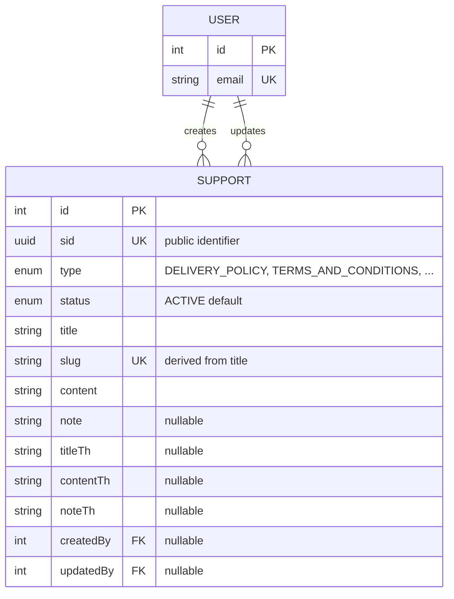

# Support Module

The storefront's static policy/information pages — Delivery Policy, Terms & Conditions, Privacy Policy, Cancellation Policy, Return Policy, plus an `OTHERS` catch-all for any ad-hoc page (FAQ, About Us, …). `Support` is a flat, standalone content entity: one row per page, no child tables, no file uploads, no relations except the two audit FKs back to `User`. Each row carries an **English primary body and an optional Thai mirror** of the same three fields, so the storefront can render either language from a single record.

Schema source: `prisma/schema/support.prisma` (model `Support`, enums `SupportType`, `SupportStatus`).
Module source: `src/modules/support/` (`support.controller.ts`, `support.service.ts`, `support.repository.ts`, `support.module.ts`, `dto/`).

> **Scope note:** `User` is documented in its own reference ([user.md](./user.md)) — it appears here only as the `createdBy`/`updatedBy` foreign-key target needed to understand Support's relationships.

> **Two shapes of "a page".** The five named types are **singleton pages by convention** — one live row each, addressed by type. `OTHERS` is explicitly **not** a singleton and is addressed by slug. Nearly every design decision below follows from that split; see [The Singleton-by-Convention Rule](#the-singleton-by-convention-rule).

---

### DB Schema

#### Entity-Relationship Diagram (ERD)



**Cardinality legend:** `||--o{` = one-to-many (parent must exist, child count is 0..N). A `User` may create/update zero or many `Support` rows; both FKs on `Support` are nullable, so a page can exist with no recorded author at all. The two relations are distinct (`SupportCreatedBy`, `SupportUpdatedBy`) and surface on `User` as `createdSupports` / `updatedSupports`.

---

#### Enum Definitions

##### `SupportType` (defined in `support.prisma`, used only by `Support`)

| Value                  | Meaning                                                                                                    |
| :--------------------- | :--------------------------------------------------------------------------------------------------------- |
| `DELIVERY_POLICY`      | Shipping/delivery terms. Singleton by convention.                                                           |
| `TERMS_AND_CONDITIONS` | Site-wide T&C. Singleton by convention.                                                                     |
| `PRIVACY_POLICY`       | Privacy/data-handling notice. Singleton by convention.                                                      |
| `CANCELLATION_POLICY`  | Order-cancellation rules. Singleton by convention.                                                          |
| `RETURN_POLICY`        | Returns/refunds rules. Singleton by convention.                                                             |
| `OTHERS`               | **Catch-all.** Any policy/info page not covered above (FAQ, About Us, …). **May legitimately have many rows** — disambiguated by `slug`, never by type. |

> **Declaration order is load-bearing.** Postgres sorts an enum by the order its values were declared, and [List Active Pages (Public)](#list-active-pages-public) orders by `type ASC` — so the storefront tab list comes back in exactly the order above, with every `OTHERS` page trailing. Reordering the enum in the schema reorders the storefront tabs.

##### `SupportStatus` (defined in `support.prisma`, used only by `Support`)

| Value      | Meaning                                                                                                    |
| :--------- | :---------------------------------------------------------------------------------------------------------- |
| `ACTIVE`   | Live on the storefront. **Default value on creation** — the only status any public route will return.        |
| `INACTIVE` | Retired/unpublished but retained in the database. Hidden from every public route.                            |
| `DRAFT`    | Being authored, never public. Hidden from every public route.                                                |

> `INACTIVE` and `DRAFT` are **operationally identical** — no query anywhere distinguishes them, both are simply "not `ACTIVE`". The difference is editorial intent (*not yet live* vs *no longer live*), not behaviour.
>
> `Support` deliberately does **not** reuse the shared `CategoryProductStatus` enum, and unlike `Blog` it has no `PUBLISHED`/`publishedAt` pair — there is no scheduling concept here, a page is live the moment its status is `ACTIVE`.

---

#### Data Dictionary — Support

**Table purpose:** a single support/policy page, in English with an optional Thai mirror. Maps to table `support_pages`.

| Field       | Type                  | Constraints                                                           | Description                                                                                                                              |
| :---------- | :-------------------- | :-------------------------------------------------------------------- | :----------------------------------------------------------------------------------------------------------------------------------------- |
| `id`        | `INT`                 | PK, AUTOINCREMENT                                                      | Internal numeric key. Exposed in the admin `update`/`delete` route URLs.                                                                     |
| `sid`       | `UUID`                | UNIQUE, NOT NULL, DEFAULT `uuid()`, `@db.Uuid`                         | Public-facing identifier. Returned by every response DTO, but **no route looks a page up by it** — see [Conventions](#conventions).           |
| `type`      | `ENUM(SupportType)`   | NOT NULL                                                               | Which support tab this row belongs to. **Immutable after creation** — `UpdateSupportDto` has no field for it.                                |
| `status`    | `ENUM(SupportStatus)` | NOT NULL, DEFAULT `ACTIVE`                                             | Lifecycle/visibility state. Note the default is `ACTIVE`, not `DRAFT` — an omitted status publishes immediately.                             |
| `title`     | `VARCHAR(255)`        | NOT NULL                                                               | English page title. **Not uniquely constrained in the DB** — uniqueness is enforced indirectly, via the `slug` derived from it.               |
| `slug`      | `VARCHAR(255)`        | UNIQUE, NOT NULL                                                       | URL/route identifier and the public lookup key. Derived from `title` by `generateSlug()`, never client-set. Also what disambiguates multiple `OTHERS` rows. |
| `content`   | `TEXT`                | NOT NULL                                                               | English page body (HTML/Markdown — an editor convention, not a DB constraint).                                                               |
| `note`      | `TEXT`                | NULLABLE                                                               | Extra note/disclaimer rendered *below* the main content.                                                                                     |
| `titleTh`   | `VARCHAR(255)`        | NULLABLE                                                               | Thai title, mirrors `title`. Display-only — **never** used to derive the slug.                                                               |
| `contentTh` | `TEXT`                | NULLABLE                                                               | Thai body, mirrors `content`.                                                                                                                |
| `noteTh`    | `TEXT`                | NULLABLE                                                               | Thai note, mirrors `note`.                                                                                                                   |
| `createdAt` | `TIMESTAMPTZ(3)`      | NOT NULL, DEFAULT `now()`                                              | Row creation time. Default sort field for the admin listing.                                                                                  |
| `updatedAt` | `TIMESTAMPTZ(3)`      | NOT NULL, `@updatedAt`                                                 | Last modification time, maintained by Prisma.                                                                                                |
| `createdBy` | `INT`                 | FK → `users.id`, NULLABLE, **ON DELETE SET NULL**                      | Staff user who created the page — stamped by the service from the JWT, never accepted from the client.                                        |
| `updatedBy` | `INT`                 | FK → `users.id`, NULLABLE, **ON DELETE SET NULL**                      | Staff user who last updated the page — restamped on every successful update.                                                                 |

> **No `@map()` anywhere.** Only the table itself is mapped (`@@map("support_pages")`); every column lands in Postgres as a camelCase identifier (`"createdAt"`, `"titleTh"`, …), which hand-written SQL must double-quote. See [Conventions](#conventions).

---

#### Relationships and Cascading Rules

| Parent → Child                       | FK Column           | On Delete    | Effect                                                                                         |
| :----------------------------------- | :------------------ | :----------- | :----------------------------------------------------------------------------------------------- |
| `User` → `Support` (`createdByUser`) | `Support.createdBy` | **SET NULL** | Deleting a staff user preserves the pages they wrote; `createdBy`/`createdByUser` goes `null`.    |
| `User` → `Support` (`updatedByUser`) | `Support.updatedBy` | **SET NULL** | Same, for the last editor.                                                                       |

**Practical implications:**

- `Support` has **no child tables at all** — deleting a page cascades to nothing, and nothing in the schema references a support row's `id`. That is why [Delete a Support Page](#delete-a-support-page) can be a plain `delete()` with no transaction.
- The `SET NULL` direction is `User → Support` only. Deleting a *page* has no effect on the staff users referenced by it.
- Both FKs are nullable, so every consumer must handle `createdByUser: null` / `updatedByUser: null` — the admin response DTO already normalizes a missing relation to `null` rather than omitting the key.
- There is **no soft-delete field** and no file/asset relation. The intended "hide, don't destroy" path is `status = INACTIVE`, not `DELETE`.

---

#### Performance Optimizations (Indexes)

##### Current indexes (`support.prisma`)

| Index                          | Type               | Purpose                                                                                                                          |
| :----------------------------- | :----------------- | :--------------------------------------------------------------------------------------------------------------------------------- |
| `sid`, `slug` (each `@unique`) | B-Tree (unique)    | Identity lookups; Postgres backs each unique constraint with its own index automatically.                                            |
| `@@index([slug])`              | B-Tree             | Explicit index for the public detail lookup — **redundant** with the unique index above, see [Known Gaps](#known-gaps--recommended-hardening). |
| `@@index([type, status])`      | B-Tree (composite) | The hot public query: `WHERE type = ? AND status = 'ACTIVE'` ([Get the Active Page for a Type](#get-the-active-page-for-a-type-public)), and the admin tab filter. Equality on both columns, so column order costs nothing here. |
| `createdBy`, `updatedBy`       | B-Tree (implicit)  | Prisma auto-creates an index on each relation scalar field.                                                                        |

##### Not covered by an index

- **`WHERE status = 'ACTIVE'` alone** — the [active-tabs](#list-active-pages-public) query cannot use `[type, status]` (its leading column is unconstrained). With one row per type this is a trivial scan of a table holding single-digit rows; it only becomes worth an index if `OTHERS` pages grow into the hundreds.
- **Free-text `search`** on `title`/`titleTh` is a `contains` match with `mode: 'insensitive'` through `PaginationService` — a B-Tree cannot serve it. Same limitation as every other module's search; a `tsvector` + GIN index is the fix if it ever matters, which for a table this small it likely never will.

---

#### Conventions

- **All `DateTime` columns are `@db.Timestamptz(3)`.** Prisma's default mapping is timezone-naive; comparing a naive column against SQL `now()` casts through the *server's* `TimeZone` setting. Any new `DateTime` field must carry `@db.Timestamptz(3)`.
- **English is the source of truth; Thai is display-only.** `slug` is always derived from `title`, never from `titleTh`, so the URL stays ASCII and stable regardless of the Thai copy. The Thai trio (`titleTh`/`contentTh`/`noteTh`) is independently optional — a page may ship with a Thai title but no Thai body; nothing validates that the three move together.
- **Derived values are never client input.** `slug` comes from `generateSlug(title)`; `createdBy`/`updatedBy` come from the JWT. No DTO exposes a field for any of them.
- **`sid` is the public identifier, `id` is internal** — the same convention as `Product`/`Blog`. Note `Support` follows it only in what it *returns*: public routes address a page by `slug` and admin routes by `id`, so `sid` is currently informational only.
- **`type` is immutable.** `UpdateSupportDto` deliberately omits it (see the comment at the top of `dto/update-support.dto.ts`) — retyping a row would silently move it to a different storefront tab, and possibly create a second live page for that tab. Delete and re-create instead.
- **No column mapping.** Unlike `Blog` (partial `@map()`) or the `user` schema (full snake_case), `Support` maps only the table name. It is internally consistent, just inconsistent with its neighbours — see [Known Gaps](#known-gaps--recommended-hardening).
- **Changes are audited automatically.** `Support` is one of the eight models in `TRACKED_AUDIT_MODELS`, so every create/update/delete writes an `AuditLog` row with a field-level diff, without this module containing any audit code. See [audit-log.md](./audit-log.md#tracked-models).

---

#### Example Data

| id  | type                   | status     | title                      | slug                         | titleTh            | createdBy | updatedBy |
| :-- | :--------------------- | :--------- | :------------------------- | :--------------------------- | :----------------- | :-------- | :-------- |
| 1   | `DELIVERY_POLICY`      | `ACTIVE`   | Delivery Policy            | `delivery-policy`             | นโยบายการจัดส่ง       | `3`        | `3`        |
| 2   | `TERMS_AND_CONDITIONS` | `ACTIVE`   | Terms & Conditions         | `terms-conditions`            | ข้อกำหนดและเงื่อนไข    | `3`        | `null`     |
| 3   | `PRIVACY_POLICY`       | `DRAFT`    | Privacy Policy             | `privacy-policy`              | `null`             | `7`        | `null`     |
| 4   | `RETURN_POLICY`        | `INACTIVE` | Return Policy 2025         | `return-policy-2025`          | `null`             | `3`        | `7`        |
| 5   | `OTHERS`               | `ACTIVE`   | Frequently Asked Questions | `frequently-asked-questions`  | คำถามที่พบบ่อย        | `7`        | `7`        |
| 6   | `OTHERS`               | `ACTIVE`   | About Us                   | `about-us`                    | `null`             | `7`        | `7`        |

> Row 2's slug is `terms-conditions`, not `terms-and-conditions` — `generateSlug()` strips `&` as a non-word character and collapses the resulting double hyphen. The slug is **not** derived from the enum name.
> Row 4 is `INACTIVE`, so `GET /active-page/RETURN_POLICY` returns `404` even though a return-policy row exists.
> Rows 5 and 6 are both `OTHERS` and both `ACTIVE` — legitimate, and exactly why `OTHERS` pages are fetched by slug. Their relative order inside [active-tabs](#list-active-pages-public) is not defined by the query.
> Row 2 has `updatedBy: null` because it has never been edited since creation; `createdBy`/`updatedBy` are independent, and nothing back-fills the latter.

---

#### Example Usage (JSON Response)

Every response below is wrapped by the global `ResponseInterceptor` envelope (`{ statusCode, success, message, data, meta? }`); only the `data` payload is shown.

**Public storefront view** (`SupportResponsePublicDto`) — no `status`, no audit fields, no timestamps:

```json
{
  "id": 1,
  "sid": "550e8400-e29b-41d4-a716-446655440000",
  "type": "DELIVERY_POLICY",
  "title": "Delivery Policy",
  "slug": "delivery-policy",
  "content": "Orders are delivered within 3-5 business days across Thailand.",
  "note": "Delivery times may vary during public holidays.",
  "titleTh": "นโยบายการจัดส่ง",
  "contentTh": "คำสั่งซื้อจะถูกจัดส่งภายใน 3-5 วันทำการทั่วประเทศไทย"
}
```

**Back-office view** (`SupportResponseDto`) — adds `status`, timestamps, and both resolved actors:

```json
{
  "id": 3,
  "sid": "6b1f0c2e-9a44-4f0e-8f7a-2c1d3e4b5a60",
  "type": "PRIVACY_POLICY",
  "status": "DRAFT",
  "title": "Privacy Policy",
  "slug": "privacy-policy",
  "content": "<p>We collect the minimum data required to fulfil your order...</p>",
  "createdAt": "2026-07-02T08:15:00.000Z",
  "updatedAt": "2026-07-02T08:15:00.000Z",
  "createdByUser": {
    "id": 7,
    "name": "Editor Somchai",
    "email": "editor@thaihealth.example",
    "role": "MARKETING",
    "status": "ACTIVE"
  },
  "updatedByUser": null
}
```

> `createdByUser.name` is composed from `profile.firstName` + `profile.lastName` by `formatDisplayName()` inside `UserMinifiedResponseDto` — the repository selects the two name parts, never a `name` column.
> The optional Thai fields and `note` are **absent, not `null`**, in both payloads above: their DTO constructors coerce Prisma's `null` to `undefined`, which `JSON.stringify` then drops. `createdByUser`/`updatedByUser` are the exception — they are explicitly set to `null`, so they always appear.

---

#### Implementation & Best Practices

##### The Singleton-by-Convention Rule

- The five named types are meant to have **exactly one `ACTIVE` row each**. That is a *convention*, enforced nowhere: no partial unique index, no service-level check on create or update.
- [Get the Active Page for a Type](#get-the-active-page-for-a-type-public) resolves that convention with `findFirst({ where: { type, status: ACTIVE } })` and **no `orderBy`** — so if a second `ACTIVE` row for a type is ever created, which one the storefront shows is decided by the query planner, and can change between deploys or after a `VACUUM`.
- The safe editorial workflow is therefore **retire, then publish**: set the outgoing row to `INACTIVE` first, then set the incoming one to `ACTIVE`. Doing it the other way round leaves a window with two live rows for one tab.
- `OTHERS` is the deliberate exception. Never fetch it by type; fetch it by [slug](#get-an-active-page-by-slug-public).

##### Slug Handling

- `generateSlug()` (`src/common/utils/slug.util.ts`) lowercases, strips diacritics, turns whitespace into `-`, and **deletes every character outside `[A-Za-z0-9_-]`**. Thai script is not `\w` in JavaScript, so a title written entirely in Thai derives to an **empty slug** — the first such row saves with `slug: ""` and every subsequent one collides on the unique constraint. Keep `title` English (that is what `titleTh` exists for); see [Known Gaps](#known-gaps--recommended-hardening).
- The uniqueness check is **table-wide, not per type** — `findBySlug(slug)` looks at every row. An `OTHERS` page titled "Return Policy" conflicts with the real `RETURN_POLICY` page, which is usually the behaviour you want, but is worth knowing before naming an ad-hoc page.
- The check also **ignores status**: a `DRAFT` or `INACTIVE` row still owns its slug and still blocks a new page from taking it.
- Renaming a page re-derives its slug ([Update a Support Page](#update-a-support-page)), which silently breaks every existing inbound link to `/page/:slug`. Treat the slug as immutable in practice, or add redirects at the routing layer before relying on renames.

##### Admin-Form UX (multipart/form-data)

Both write routes are decorated with `@UseInterceptors(AnyFilesInterceptor())` + `@ApiConsumes('multipart/form-data')` **even though `Support` has no file field**. The reason is purely Swagger UI: an `application/json` body renders as one raw JSON textarea, while a multipart body renders one labelled input per field — matching the admin-form UX already used by the `home` and `category` modules. At runtime it costs nothing and blocks nothing: `multer` ignores requests that are not multipart, so a plain JSON `POST`/`PATCH` still works against both routes — it is just not what Swagger advertises.

Consequence for clients that *do* send multipart: every value arrives as a string. The DTOs account for it — `@Transform(trimString)` on every text field, and `@IsEnum` validating `type`/`status` as strings — and because there are no numeric or boolean fields here, none of the `blankNumberToUndefined` / `parseBooleanInput` helpers other modules need apply.

##### Validation

The global `ValidationPipe` runs with `whitelist: true` **and** `forbidNonWhitelisted: true`, so an unknown field is a `400`, not a silent strip. In particular, sending `type` to the update route fails with a validation error rather than being quietly ignored — the immutability of `type` is enforced by the DTO, and the error message says so.

---

#### Known Gaps / Recommended Hardening

Issues worth fixing before this module is considered production-hardened — none of them block understanding the current design:

- **Nothing enforces one `ACTIVE` row per named type.** The whole public contract for the five named types rests on a convention the database does not know about. The fix is a partial unique index — `CREATE UNIQUE INDEX ... ON support_pages(type) WHERE status = 'ACTIVE' AND type <> 'OTHERS'` — which Prisma cannot express in the schema today and would need a hand-written migration.
- **`findActiveByType` has no `orderBy`.** Even accepting the gap above, adding `orderBy: { updatedAt: 'desc' }` would make "which duplicate wins" deterministic (newest edit wins) instead of planner-dependent.
- **`findActiveTabs` has no tie-breaker.** Ordering is `type ASC` only, so the relative order of multiple `OTHERS` pages is undefined and can shift between calls. A secondary `title ASC` — or a dedicated `displayOrder` column — would stabilize the storefront tab list.
- **A fully-Thai `title` derives to an empty slug** (see [Slug Handling](#slug-handling)). Rejecting it in the DTO, or adding a transliteration/fallback in `generateSlug()`, would turn a confusing `409` into a clear error.
- **No soft delete.** `DELETE /delete-support-page/:id` destroys the row and frees its slug immediately — no recovery, no SEO redirect history. The `AuditLog` `DELETE` entry preserves the deleted row's *content* ([audit-log.md](./audit-log.md#diff-shape)), which is a genuine safety net, but restoring from it is a manual job.
- **`@@index([slug])` is redundant** — `slug @unique` already creates a B-Tree. Pure write amplification; safe to drop. (`ComboProduct` dropped exactly this index for the same reason; `Blog` still carries it.)
- **`title` is not unique in the DB.** Two pages whose titles differ only by punctuation collide on the *derived* slug — the service returns `409`, and the unique constraint on `slug` is the real backstop.
- **No `@map()` on any column** (see [Conventions](#conventions)) — camelCase identifiers in Postgres must be double-quoted in hand-written SQL, and the module reads differently from the rest of the schema.
- **`sid` is dead weight today.** It is generated, indexed, and returned, but no route accepts it; admin routes take `id` and public routes take `slug`. Either add a `sid` lookup, or accept that the enumeration-resistance argument behind `sid` does not really apply to a table whose rows are meant to be listed publicly anyway.
- **Existence checks pull the full admin projection.** `updateSupport`/`deleteSupport` call `findByIdAdmin(id)`, which joins both user relations just to answer "does this row exist" (`update` does need the current `title`; `delete` needs nothing). `Blog` solved the same problem with a slim dedicated `findSlugConflict` projection — worth copying for `findBySlug`, which is likewise used only as an existence probe.
- **No transaction usage.** Every repository method accepts an optional `tx` and none is ever called with one. That is correct today — every write touches a single row — but note the audit extension's own write is not transactional either, see [audit-log.md](./audit-log.md#known-gaps--recommended-hardening).

---

### API End Point & Business Logic

Every endpoint below is served by `SupportController` → `SupportService` → `SupportRepository`. All routes are prefixed `/api/v1/support` (`app.apiPrefix`, default `api/v1`). For the DTO/Swagger contract see `src/modules/support/dto/`; the Prisma `select` shapes live as private constants on the repository rather than in a separate `.select.ts` file — see [Response Shapes & Select Projections](#response-shapes--select-projections).

Successful responses are wrapped by the global `ResponseInterceptor` into `{ statusCode, success, message, data, meta? }`, where `message` comes from each route's `@ResponseMessage(...)`. Errors never reach that interceptor — `GlobalExceptionFilter` formats them.

#### Endpoint Overview

| Method   | Path                       | Access                          | Purpose                                                                             |
| :------- | :------------------------- | :------------------------------ | :------------------------------------------------------------------------------------ |
| `POST`   | `/create-support-page`     | `ADMIN`, `MARKETING`, `SUPPORT`  | [Create a support page](#create-a-support-page)                                       |
| `GET`    | `/all-support-pages`       | `ADMIN`, `MARKETING`, `SUPPORT`  | [Admin listing — every status, optional type filter](#list-all-support-pages-admin)   |
| `GET`    | `/active-tabs`             | **Public**                       | [Every live page, for the storefront tab list](#list-active-pages-public)             |
| `GET`    | `/active-page/:type`       | **Public**                       | [The live page for one type](#get-the-active-page-for-a-type-public)                  |
| `GET`    | `/page/:slug`              | **Public**                       | [The live page for one slug](#get-an-active-page-by-slug-public)                      |
| `PATCH`  | `/update-support-page/:id` | `ADMIN`, `MARKETING`, `SUPPORT`  | [Partial update](#update-a-support-page)                                              |
| `DELETE` | `/delete-support-page/:id` | `ADMIN` only                     | [Hard delete](#delete-a-support-page)                                                 |

Guarded routes use `JwtAuthGuard` + `RolesGuard` + `@Roles(...)`. `RolesGuard` matches the caller's role against the listed roles **exactly** — there is no hierarchy, so `SUPER_ADMIN` and `MANAGER` are *not* implicitly allowed anywhere in this module. Note `DELETE` is stricter than create/update: `MARKETING` and `SUPPORT` staff can write and publish pages, but only `ADMIN` can destroy one.

---

#### Response Shapes & Select Projections

Two projections live as private readonly constants on `SupportRepository`; each feeds exactly one DTO and must be kept in sync with the DTO constructor it feeds.

| Select                  | Fed to                     | Contains                                                                                                                        |
| :---------------------- | :------------------------- | :-------------------------------------------------------------------------------------------------------------------------------- |
| `SUPPORT_SELECT_ADMIN`  | `SupportResponseDto`        | Every column, plus the raw `createdBy`/`updatedBy` **and** the resolved `createdByUser`/`updatedByUser` (`id`, `email`, `status`, `role`, `profile.firstName`/`lastName`). Never reuse on an unauthenticated route. |
| `SUPPORT_SELECT_PUBLIC` | `SupportResponsePublicDto`  | Identity + both language trios only. No `status` (internal workflow state), no audit FKs, no timestamps.                          |

**Why the public shape drops `status`:** every query using this projection already filters `status: ACTIVE`, so the field would be a constant — and advertising the existence of a `DRAFT`/`INACTIVE` workflow to the storefront buys nothing. The raw `createdBy`/`updatedBy` integers are excluded for the same reason `Blog`'s public DTO excludes `authorId`: they are internal user IDs.

**Why the admin select embeds the user relations:** the back-office list needs a display name per row, and resolving it with one extra request per row would be N+1 by construction. `UserMinifiedResponseDto` is the shared shape used across modules, so the admin dashboard renders creator/editor bylines with no support-specific client code.

---

#### Create a Support Page

**`POST /api/v1/support/create-support-page`**

**Purpose**: Create a new policy/information page of a given type.

**Access**: `JwtAuthGuard` + `RolesGuard` + `@Roles(UserRole.ADMIN, UserRole.MARKETING, UserRole.SUPPORT)`. Documented as `multipart/form-data` for admin-form UX — see [Admin-Form UX](#admin-form-ux-multipartform-data).

| Layer      | What happens                                                                                                                    |
| :--------- | :-------------------------------------------------------------------------------------------------------------------------------- |
| Controller | `createSupport(dto, req)` — reads the acting user off `req.user.id` and throws `UnauthorizedException('User identity missing from request')` if absent; no other logic. |
| Service    | `createSupport(userId, dto)` — derives the slug, checks it, writes the row.                                                        |
| Repository | `findBySlug(slug)` → `createSupport(data)` — a single `support.create()`.                                                          |

**Business logic — in order:**

1. **Slug derivation.** `generateSlug(title)` — from the English `title` only. `titleTh` never influences the slug.
2. **Uniqueness check.** `findBySlug(slug)` → `409 Conflict` (`"A support page with this title already exists"`) if any row already owns that slug. The check is **table-wide and status-agnostic**: a `DRAFT` page, or a page of a completely different `type`, still blocks the slug. See [Slug Handling](#slug-handling).
3. **One `support.create()`** with the DTO's remaining fields, the derived `slug`, and `createdBy: userId`. `updatedBy` is left `null` — it is only ever set by [update](#update-a-support-page).
4. **`status` defaults to `ACTIVE` at the database level** when the DTO omits it. There is no separate publish step: creating a page without specifying a status puts it live immediately, and **without checking whether that type already has a live page** — see [The Singleton-by-Convention Rule](#the-singleton-by-convention-rule).
5. **No file handling, no rollback logic, no transaction.** Unlike `blog`/`product` create, nothing is written outside Postgres, so a failed insert leaves nothing behind to clean up. The write is separately recorded as a `CREATE` row in `audit_logs` by the Prisma extension ([audit-log.md](./audit-log.md#how-rows-get-written)).

**Response shape**: `SupportResponseDto` (admin/full detail, with `createdByUser` resolved).

| Status | Cause                                                                                                                    |
| :----- | :------------------------------------------------------------------------------------------------------------------------- |
| `201`  | Support page created successfully.                                                                                         |
| `400`  | DTO validation failed — missing/invalid `type`, missing `title`/`content`, `title`/`titleTh` over 255 chars, invalid `status`, or an unknown field (`forbidNonWhitelisted`). |
| `401`  | Missing/invalid JWT, or a token carrying no user id.                                                                       |
| `403`  | Authenticated but not `ADMIN`/`MARKETING`/`SUPPORT`.                                                                       |
| `409`  | A support page with this title (i.e. its derived slug) already exists. Also the mapped result of a lost slug race — Prisma `P2002` is normalized to `409` by `GlobalExceptionFilter`. |

---

#### List All Support Pages (Admin)

**`GET /api/v1/support/all-support-pages`**

**Purpose**: Back-office listing — paginated, searchable, optionally scoped to one type, with **no visibility filter at all**.

**Access**: `JwtAuthGuard` + `RolesGuard` + `@Roles(UserRole.ADMIN, UserRole.MARKETING, UserRole.SUPPORT)`.

| Layer      | What happens                                                                                                          |
| :--------- | :---------------------------------------------------------------------------------------------------------------------- |
| Controller | `getAllSupports(query)` — binds `SupportQueryDto`; no other logic.                                                       |
| Service    | `getAllSupports(params)` — splits `type` off the pagination params, wraps each row in `SupportResponseDto`.               |
| Repository | `findAllAdmin(params, type)` — `where: type ? { type } : undefined`, then `PaginationService.paginate()`.                 |

**Query parameters** (`SupportQueryDto` extends the shared `PaginationQueryDto`):

| Param          | Meaning                                                                                                          |
| :------------- | :----------------------------------------------------------------------------------------------------------------- |
| `type`         | Optional `SupportType` filter — this is what backs the admin dashboard's per-policy tabs. Omit to return every type. |
| `search`       | Case-insensitive `contains` match on **`title` and `titleTh`** — note `slug` and `content` are *not* searchable.     |
| `page`/`limit` | Standard offset pagination (`limit` capped by `MAX_PAGE_SIZE`).                                                     |
| `cursor`       | Cursor pagination; takes precedence over `page` when supplied.                                                       |
| `sortOrder`    | `asc`/`desc`, default `desc`, applied to the default sort field `createdAt`.                                         |

**Business logic:**

1. **No status filtering, by design.** `ACTIVE`, `INACTIVE`, and `DRAFT` rows are all returned — a management dashboard has to see and act on everything, not just what the storefront shows.
2. **`type` is the only structural filter**, applied as plain equality so the `[type, status]` index's leading column is usable.
3. **Response mapping** — every row wrapped in `new SupportResponseDto(row)`, the full admin shape including both resolved actors.

**Response shape**: `{ data: SupportResponseDto[], meta: IPaginationMeta }` (documented via `@ApiPaginatedResponse`), flattened into the standard envelope by `ResponseInterceptor`.

| Status | Cause                                                                                    |
| :----- | :----------------------------------------------------------------------------------------- |
| `200`  | Always — an empty `data` array with accurate `meta.totalItems: 0` is valid, not a `404`.   |
| `400`  | Query validation failed (invalid `type`, `limit` over the max, …).                          |
| `401`  | Missing/invalid JWT.                                                                       |
| `403`  | Authenticated but not `ADMIN`/`MARKETING`/`SUPPORT`.                                        |

---

#### List Active Pages (Public)

**`GET /api/v1/support/active-tabs`**

**Purpose**: Every live support page in one call — the storefront renders its support tab strip (Delivery Policy | Terms & Conditions | …) directly from this response.

**Access**: Public — no auth guard, no role restriction.

| Layer      | What happens                                                                                 |
| :--------- | :---------------------------------------------------------------------------------------------- |
| Controller | `getActiveTabs()` — no params at all.                                                            |
| Service    | `getActiveTabs()` — maps each row into `SupportResponsePublicDto`.                                |
| Repository | `findActiveTabs()` — `findMany({ where: { status: ACTIVE }, orderBy: { type: 'asc' } })`.          |

**Business logic:**

1. **The visibility gate is a single condition** — `status = ACTIVE`. `DRAFT` and `INACTIVE` rows are invisible here, and there is no timestamp gate to reason about (contrast `blog`/`product`, which additionally weigh `publishedAt`).
2. **Ordering is `type ASC`, i.e. Postgres enum declaration order** — `DELIVERY_POLICY`, `TERMS_AND_CONDITIONS`, `PRIVACY_POLICY`, `CANCELLATION_POLICY`, `RETURN_POLICY`, then every `OTHERS` page. The storefront gets its tabs in the intended order without sorting client-side; reordering the enum in `support.prisma` reorders the UI. There is **no secondary sort key**, so multiple `OTHERS` rows come back in an undefined order — see [Known Gaps](#known-gaps--recommended-hardening).
3. **Not paginated, and it returns full `content`.** The response carries every live page's entire body, which is what lets the storefront render a clicked tab with no second request. It also means the payload grows linearly with the number of `OTHERS` pages — fine for a handful, worth revisiting past a few dozen.
4. **Duplicates are not collapsed.** If two `ACTIVE` rows exist for one named type, both appear here — while [active-page/:type](#get-the-active-page-for-a-type-public) picks arbitrarily between them. The two endpoints can therefore disagree; that is a symptom of the unenforced singleton rule, not of this query.

**Response shape**: `SupportResponsePublicDto[]` — a bare array under `data`, with **no `meta`** (this is not a paginated route).

| Status | Cause                                                     |
| :----- | :---------------------------------------------------------- |
| `200`  | Always — an empty array is a valid response, not a `404`.    |

---

#### Get the Active Page for a Type (Public)

**`GET /api/v1/support/active-page/:type`**

**Purpose**: Fetch the live page for one of the named policy types, addressed by a stable, human-readable route (`/active-page/PRIVACY_POLICY`) that does not change when the page is renamed.

**Access**: Public — no auth guard, no role restriction.

| Layer      | What happens                                                                                                                     |
| :--------- | :---------------------------------------------------------------------------------------------------------------------------------- |
| Controller | `getActiveSupportByType(type)` — `new ParseEnumPipe(SupportType)` validates the path param, rejecting anything outside the enum with a `400`. |
| Service    | `getActiveSupportByType(type)` — throws `NotFoundException` (`"No active support page found for type {type}"`) on a miss.            |
| Repository | `findActiveByType(type)` — `findFirst({ where: { type, status: ACTIVE } })` on the public projection.                                 |

**Business logic:**

1. **`ParseEnumPipe` is the whole input contract** — the param must be an exact `SupportType` member (`DELIVERY_POLICY`, not `delivery-policy`), so no unknown type ever reaches the database.
2. **`findFirst`, not `findUnique`** — there is no unique constraint on `(type, status)` that would make a unique lookup possible, and no `orderBy` to break a tie. With the intended one-live-row-per-type this is exact; with duplicates it is arbitrary. See [The Singleton-by-Convention Rule](#the-singleton-by-convention-rule).
3. **`OTHERS` is a trap on this route.** It is a valid enum value, so `/active-page/OTHERS` returns `200` with *one arbitrary* `OTHERS` page. Fetch those by [slug](#get-an-active-page-by-slug-public) instead.
4. **`404` covers both "no such page" and "the page exists but isn't live."** A `DRAFT` privacy policy is indistinguishable from a missing one here — which is the intended behaviour, unlike `blog`'s slug lookup, which leaks unpublished rows.

**Response shape**: `SupportResponsePublicDto`.

| Status | Cause                                                                     |
| :----- | :-------------------------------------------------------------------------- |
| `200`  | An `ACTIVE` row exists for this type.                                       |
| `400`  | `:type` is not a member of `SupportType` (rejected by `ParseEnumPipe`).      |
| `404`  | No `ACTIVE` row for this type — including when a non-`ACTIVE` one exists.    |

---

#### Get an Active Page by Slug (Public)

**`GET /api/v1/support/page/:slug`**

**Purpose**: The general-purpose public lookup — the only way to address a specific `OTHERS` page, and a permalink for any page.

**Access**: Public — no auth guard, no role restriction.

| Layer      | What happens                                                                                             |
| :--------- | :---------------------------------------------------------------------------------------------------------- |
| Controller | `getActiveSupportBySlug(slug)` — takes the raw `:slug` path param; no pipe beyond the implicit string type.   |
| Service    | `getActiveSupportBySlug(slug)` — throws `NotFoundException('Support page not found')` on a miss.              |
| Repository | `findActiveBySlug(slug)` — `findFirst({ where: { slug, status: ACTIVE } })` on the public projection.          |

**Business logic:**

1. **The status gate is applied in the query, not after it** — `findFirst` with both conditions, so a non-`ACTIVE` page produces a plain `404` indistinguishable from a nonexistent slug. This is the correct pattern; contrast [blog.md](./blog.md#get-blog-by-slug-public), whose equivalent route omits the status filter and returns drafts to anyone holding the slug.
2. **`findFirst` rather than `findUnique`** even though `slug` is unique — a `findUnique` cannot carry the extra `status` condition in its `where`. Postgres still uses the unique index for the `slug` equality and then filters the single candidate row on `status`, so there is no scan cost to this.
3. **Slugs are only as stable as titles.** Renaming a page through [update](#update-a-support-page) re-derives its slug and invalidates every URL pointing at the old one.

**Response shape**: `SupportResponsePublicDto`.

| Status | Cause                                                          |
| :----- | :--------------------------------------------------------------- |
| `200`  | An `ACTIVE` row with this slug exists.                            |
| `404`  | No row with this slug, **or** the row exists but isn't `ACTIVE`.   |

---

#### Update a Support Page

**`PATCH /api/v1/support/update-support-page/:id`**

**Purpose**: Partially update an existing page — only the fields present in the body are touched. This is also the route that publishes/unpublishes a page, via `status`.

**Access**: `JwtAuthGuard` + `RolesGuard` + `@Roles(UserRole.ADMIN, UserRole.MARKETING, UserRole.SUPPORT)`. Documented as `multipart/form-data`, same rationale as [create](#create-a-support-page).

| Layer      | What happens                                                                                                                            |
| :--------- | :---------------------------------------------------------------------------------------------------------------------------------------- |
| Controller | `updateSupport(id, dto, req)` — `ParseIntPipe` on `:id`, and (unlike `blog`'s update) it **does** read `req.user.id`, throwing `UnauthorizedException` if absent. |
| Service    | `updateSupport(id, userId, dto)` — existence check, conditional slug re-derivation, single update.                                          |
| Repository | `findByIdAdmin(id)` → `findBySlug(newSlug)` (conditional) → `updateSupport(id, data)`.                                                      |

**Business logic — in order:**

1. **Existence check.** `findByIdAdmin(id)` → `404` if missing. Its result also supplies the *current* `title` that step 2 compares against.
2. **Conditional slug re-derivation** — runs only when `dto.title` is present **and** differs from the stored title. The new slug is checked with `findBySlug`, and only counts as a conflict when it belongs to a *different* row (`existingSlug.id !== id`); without that guard a page would collide with itself whenever it resent its own unchanged title. On success `title` and `slug` are written together — they can never drift apart.
3. **`type` cannot be changed.** It is absent from `UpdateSupportDto`, and `forbidNonWhitelisted` turns an attempt to send it into a `400` rather than a silent no-op. See [Conventions](#conventions).
4. **`updatedBy` is always restamped** with the acting user on every successful update, regardless of which fields changed.
5. **A single `support.update()`** applies everything at once. Fields absent from the DTO stay exactly as they were — Prisma ignores `undefined` keys — so this route cannot clear an optional field back to `null`: sending an empty string writes `""`, and sending nothing changes nothing. `updatedAt` is refreshed by Prisma's `@updatedAt`.
6. **Publishing is just a status write.** Setting `status: ACTIVE` makes the page live immediately with **no check for an existing live page of the same type** — the ordering caveat in [The Singleton-by-Convention Rule](#the-singleton-by-convention-rule) applies here more than anywhere else.
7. **The change is diffed into `audit_logs`** as an `UPDATE` row carrying only the fields that actually moved; a no-op update writes no audit row at all ([audit-log.md](./audit-log.md#how-rows-get-written)).

**Response shape**: `SupportResponseDto` (full admin detail), reflecting the row after the write.

| Status | Cause                                                                                                   |
| :----- | :--------------------------------------------------------------------------------------------------------- |
| `200`  | Support page updated successfully.                                                                          |
| `400`  | DTO validation failed (see `UpdateSupportDto`), a non-integer `:id`, or an unknown field such as `type`.     |
| `401`  | Missing/invalid JWT, or a token carrying no user id.                                                        |
| `403`  | Authenticated but not `ADMIN`/`MARKETING`/`SUPPORT`.                                                        |
| `404`  | No support page with this `id`.                                                                            |
| `409`  | The new title's derived slug already belongs to a *different* page.                                         |

---

#### Delete a Support Page

**`DELETE /api/v1/support/delete-support-page/:id`**

**Purpose**: Permanently remove a support page — a hard delete, not a status flip.

**Access**: `JwtAuthGuard` + `RolesGuard` + `@Roles(UserRole.ADMIN)` **only** — stricter than create/update, which also allow `MARKETING` and `SUPPORT`.

| Layer      | What happens                                                                                        |
| :--------- | :----------------------------------------------------------------------------------------------------- |
| Controller | `deleteSupport(id)` — `ParseIntPipe` on `:id`, `@HttpCode(204)`. No user-identity read: a hard delete is not attributed on the row itself. |
| Service    | `deleteSupport(id)` — existence check, then delete; returns `void`.                                     |
| Repository | `findByIdAdmin(id)` → `deleteSupport(id)` (`support.delete()`, selecting `{ id }` only).                 |

**Business logic — in order:**

1. **Existence check.** `findByIdAdmin(id)` → `404` (`"Support with ID {id} not found"`) if missing, so deleting an already-deleted page is a clean `404` rather than a Prisma `P2025` surfacing from lower down.
2. **`support.delete()`** — a genuine hard delete. `Support` has no child tables and nothing references its `id`, so there is no cascade to consider and no transaction is needed; the `SET NULL` rules on `createdBy`/`updatedBy` run in the other direction (deleting a *user*) and are untouched here.
3. **The slug is freed immediately** and can be reclaimed by a new page — with no redirect history, any inbound link to `/page/:slug` starts `404`ing, or silently resolves to unrelated content once the slug is reused.
4. **The row's full content survives in `audit_logs`** as a `DELETE` entry with a `before` diff — the only recovery path, and a manual one. See [audit-log.md](./audit-log.md#diff-shape).

**Response shape**: none. The route is `204 No Content`, so the `ResponseInterceptor` envelope — including the `@ResponseMessage('Support page deleted successfully')` text — is discarded before it reaches the client, because a `204` carries no body by definition. Clients should treat the status code, not a message, as the success signal.

| Status | Cause                                  |
| :----- | :--------------------------------------- |
| `204`  | Delete succeeded (no response body).     |
| `400`  | `:id` is not an integer.                 |
| `401`  | Missing/invalid JWT.                     |
| `403`  | Authenticated but not `ADMIN`.           |
| `404`  | No support page with this `id`.          |

---

#### Built but Not Yet Exposed

None. Every `SupportRepository` method (`findByIdAdmin`, `findBySlug`, `findActiveBySlug`, `findActiveByType`, `findAllAdmin`, `findActiveTabs`, `createSupport`, `updateSupport`, `deleteSupport`) is reached by at least one `SupportService` method, and every service method is reachable through exactly one route above.

Two capabilities exist in the code with no caller today:

- **The `tx?: Prisma.TransactionClient` parameter on every repository method.** Nothing in this module runs inside `BaseRepository.withTransaction()` — correctly, since every write touches one row — but the plumbing is there if a future flow needs to create a page as part of a larger unit of work.
- **`SupportModule` exports `SupportService`,** yet no other module imports `SupportModule`. The service is HTTP-only today; the export exists so another module (say, a checkout flow that needs the live Return Policy text) can consume it without a network round-trip.
