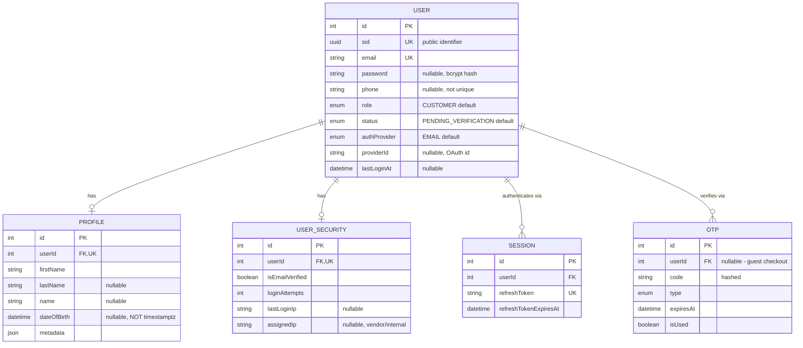

# User Module

Covers authentication, profile, security, sessions, and OTP — the identity domain every other module stamps as `createdBy`/`updatedBy`/`deletedBy`/`authorId`/`recordedBy`/`changedBy`. `Profile` and `UserSecurity` are kept as separate 1:1 tables rather than columns on `User` because they group by concern (public-facing profile vs. internal security state) and because `UserSecurity` carries fields (`loginAttempts`, `assignedIp`, verification/reset tokens) that must never be selected onto a customer-facing response by accident — splitting the table makes that a `select` omission instead of a field-by-field one.

Schema source: `prisma/schema/user.prisma` (models `User`, `Profile`, `UserSecurity`, `Session`, `OTP`).

> **Scope note:** `Session` lives in its own `src/modules/session` module and is documented there — it appears here only as an owned child needed to understand the `User` relationship graph. Every other module that references `User` (`Product`, `ComboProduct`, `Order`, `Address`, `Cart`, etc.) is documented in its own reference — they appear here only as FK targets needed to understand cascading behavior.

---

### DB Schema

#### Entity-Relationship Diagram (ERD)



**Cardinality legend:** `||--o|` = one-to-one optional (enforced by `@unique` on the FK column). `||--o{` = one-to-many. Unlike `ComboProduct`, `User` has no join-entity relations — every owned child hangs directly off `userId`.

---

#### Enum Definitions

None of the four enums below carry inline doc comments in `user.prisma` — only the model-level header comment (`AUTHENTICATION, PROFILE, SECURITY, SESSIONS, OTP`) exists. The descriptions here are inferred from how each value is actually branched on in `AuthService`/`UserService`/`RolesGuard`, not from schema comments.

##### `UserRole`

| Value              | Meaning                                                                                          |
| :----------------- | :------------------------------------------------------------------------------------------------ |
| `ADMIN`             | Full back-office access. The only role checked by `@Roles(...)` anywhere in the User module today. |
| `SUPER_ADMIN`       | Declared, not referenced by any `@Roles()` decorator in the codebase yet.                          |
| `MANAGER`           | Declared, not referenced by any `@Roles()` decorator in the codebase yet.                          |
| `MARKETING`         | Declared, not referenced by any `@Roles()` decorator in the codebase yet.                          |
| `SUPPORT`           | Declared, not referenced by any `@Roles()` decorator in the codebase yet.                          |
| `EMPLOYEE`          | Declared, not referenced by any `@Roles()` decorator in the codebase yet.                          |
| `VENDOR`            | Declared, not referenced by any `@Roles()` decorator in the codebase yet.                          |
| `WAREHOUSE`         | Declared, not referenced by any `@Roles()` decorator in the codebase yet.                          |
| `DELIVERY_PARTNER`  | Declared, not referenced by any `@Roles()` decorator in the codebase yet.                          |
| `CUSTOMER`          | **Default for a new user.** Ordinary storefront account.                                           |
| `GUEST`             | Declared; guest checkout is actually modeled as `userId: null` on `Order`/`Cart`/`OTP`, not this role. |

> `role` is never client-settable at registration — `CreateUserDto` has no `role` field, so every account starts `CUSTOMER` regardless of registration path. Only `PATCH /update-user-role/:id` (ADMIN-only) can change it.

##### `AuthProvider`

| Value       | Meaning                                                          |
| :---------- | :----------------------------------------------------------------- |
| `EMAIL`     | **Default.** Password-based signup; `password` is required.       |
| `GOOGLE`    | OAuth signup; `password` must be absent, `providerId` required.    |
| `FACEBOOK`  | OAuth signup; same contract as `GOOGLE`.                            |
| `APPLE`     | OAuth signup; same contract as `GOOGLE`.                            |

> See [Known Gaps](#known-gaps--recommended-hardening) — no OAuth token is actually verified by this module for any of the three provider values.

##### `UserStatus`

| Value                    | Meaning                                                                                     |
| :------------------------ | :--------------------------------------------------------------------------------------------- |
| `PENDING_VERIFICATION`    | **Default for an `EMAIL`-provider signup.** Login is rejected (`401`) until the signup OTP is verified. |
| `ACTIVE`                  | Normal, usable account. Default (via `isEmailAuth ? PENDING_VERIFICATION : ACTIVE`) for OAuth signups. |
| `INACTIVE`                | Declared; no write path in this module sets it.                                                 |
| `SUSPENDED`                | Login rejected with `403 ForbiddenException` in `AuthService.validateUser`.                    |
| `BLOCKED`                  | Login rejected with `403 ForbiddenException`, same branch as `SUSPENDED`.                       |
| `DEACTIVATED`              | Declared; no write path in this module sets it.                                                 |
| `ARCHIVED`                 | Declared; no write path in this module sets it.                                                 |

##### `OTPType`

| Value            | Meaning                                                                                     |
| :---------------- | :----------------------------------------------------------------------------------------------- |
| `SIGNUP`          | **The only value this module actually branches on.** `OtpService.verifyOtp` calls `UserService.activateUser` only when `type === SIGNUP`. |
| `PASSWORD_RESET`  | Declared; `UserSecurity.resetToken`/`resetTokenExpires` exist but no code path reads or writes them. |
| `LOGIN_2FA`       | Declared; not wired to any login flow.                                                          |
| `PHONE_CHANGE`    | Declared; not wired to any phone-change flow.                                                   |

---

#### Data Dictionary — User

**Table purpose:** the account record every other module points at for authorship/ownership. Deliberately thin — profile and security concerns are split into their own 1:1 tables rather than columns here. Maps to table `users`.

| Field          | Type                | Constraints                                                             | Description                                                                                                    |
| :------------- | :------------------ | :------------------------------------------------------------------------ | :----------------------------------------------------------------------------------------------------------------- |
| `id`           | `INT`                | PK, AUTOINCREMENT                                                         | Internal numeric key; FK joins only.                                                                            |
| `sid`          | `UUID`               | UNIQUE, NOT NULL, DEFAULT `uuid()`, `@map("user_sid")`, `@db.Uuid`         | Public-facing identifier — native `UUID` column, not a string, "for performance" per the schema comment.        |
| `email`        | `VARCHAR`            | UNIQUE, NOT NULL                                                          | Login identity for `EMAIL` provider; also the identifier `OTP.identifier` matches against for signup.           |
| `password`     | `VARCHAR`            | NULLABLE                                                                  | Bcrypt hash. `NULL` for OAuth accounts ("Null for OAuth" schema comment). **Never selected into a response** — see [Password/Security Handling](#passwordsecurity-handling). |
| `phone`        | `VARCHAR(20)`        | NULLABLE                                                                  | **Not unique.** Was unique at `20260412062947_init...`, deliberately dropped by `20260419090755_init_user_phone_not_unique`. |
| `role`         | `ENUM(UserRole)`     | NOT NULL, DEFAULT `CUSTOMER`                                              | See [`UserRole`](#userrole).                                                                                    |
| `status`       | `ENUM(UserStatus)`   | NOT NULL, DEFAULT `PENDING_VERIFICATION`                                  | See [`UserStatus`](#userstatus).                                                                                |
| `authProvider` | `ENUM(AuthProvider)` | NOT NULL, DEFAULT `EMAIL`                                                 | See [`AuthProvider`](#authprovider).                                                                            |
| `providerId`   | `VARCHAR`            | NULLABLE                                                                  | OAuth account id. **No uniqueness constraint** — see [Known Gaps](#known-gaps--recommended-hardening).           |
| `createdAt`    | `TIMESTAMPTZ(3)`     | NOT NULL, DEFAULT `now()`, `@map("created_at")`                          | Row creation time.                                                                                               |
| `updatedAt`    | `TIMESTAMPTZ(3)`     | NOT NULL, auto-updated, `@map("updated_at")`                             | Last modification time.                                                                                          |
| `lastLoginAt`  | `TIMESTAMPTZ(3)`     | NULLABLE, `@map("last_login_at")`                                         | Stamped on every successful login by `AuthService.validateUser` via `UserService.updateLastLoginTime`.          |

> **No `deletedAt`/`deletedBy` on `User`.** Unlike `Product`/`ComboProduct`, this is a hard-delete-only model in the schema — and in practice there is no delete route at all (soft or hard) on `UserController`. See [Known Gaps](#known-gaps--recommended-hardening).

---

#### Data Dictionary — Profile

**Table purpose:** public-facing display identity, split from `User` so it can be selected/exposed without ever touching `password`/security fields. 1:1 via `userId @unique`. Maps to table `profiles`.

| Field         | Type              | Constraints                                                      | Description                                                                                                                                                                                                    |
| :------------ | :---------------- | :------------------------------------------------------------------ | :------------------------------------------------------------------------------------------------------------------------------------------------------------------------------------------------------------ |
| `id`          | `INT`             | PK, AUTOINCREMENT                                                  | Internal key.                                                                                                                                                                                                  |
| `firstName`   | `VARCHAR(100)`    | NOT NULL                                                            | Required at registration.                                                                                                                                                                                      |
| `lastName`    | `VARCHAR(100)`    | NULLABLE                                                            |                                                                                                                                                                                                                  |
| `name`        | `VARCHAR(200)`    | NULLABLE                                                            | Display name. If omitted at registration, the service backfills it as `` `${firstName} ${lastName ?? ''}`.trim() ``.                                                                                          |
| `avatarUrl`   | `VARCHAR`         | NULLABLE                                                            |                                                                                                                                                                                                                  |
| `bio`         | `TEXT`            | NULLABLE                                                            |                                                                                                                                                                                                                  |
| `dateOfBirth` | `TIMESTAMP`       | NULLABLE — **deliberately not `@db.Timestamptz(3)`**                | A birth date is a calendar date, not an instant — making it tz-aware would render it as a different day depending on the reader's zone. The single deliberate exception to the repo-wide Timestamptz convention (schema comment cites migration `20260802160000_timestamptz_repo_wide`); flagged as a future `@db.Date` migration. |
| `gender`      | `VARCHAR(20)`     | NULLABLE                                                            | Free-text, not an enum.                                                                                                                                                                                        |
| `metadata`    | `JSONB`           | NULLABLE, DEFAULT `{}`                                              | Open extension slot; no documented shape.                                                                                                                                                                      |
| `userId`      | `INT`             | FK → `users.id`, UNIQUE, NOT NULL, **ON DELETE CASCADE**, `@map("user_id")` | Owning user.                                                                                                                                                                                                    |

---

#### Data Dictionary — UserSecurity

**Table purpose:** internal security/auth state, isolated from `Profile` specifically so an admin-facing `select` can expose `loginAttempts`/`lastLoginIp`/`assignedIp` without those fields ever being reachable from a customer-facing one. 1:1 via `userId @unique`. Maps to table `user_security`.

| Field                       | Type             | Constraints                                                         | Description                                                                                                          |
| :-------------------------- | :--------------- | :---------------------------------------------------------------------- | :--------------------------------------------------------------------------------------------------------------------- |
| `id`                        | `INT`            | PK, AUTOINCREMENT                                                       | Internal key.                                                                                                        |
| `isEmailVerified`           | `BOOLEAN`        | NOT NULL, DEFAULT `false`                                               | Flipped to `true` by `activateUser` on signup-OTP success, or set `true` immediately for OAuth signups.               |
| `emailVerifiedAt`           | `TIMESTAMPTZ(3)` | NULLABLE                                                                | Paired with `isEmailVerified`; `NULL` exactly when unverified.                                                       |
| `verificationToken`         | `VARCHAR`        | NULLABLE                                                                | **Declared, unused.** No repository method reads or writes this column — see [Known Gaps](#known-gaps--recommended-hardening). |
| `verificationTokenExpires`  | `TIMESTAMPTZ(3)` | NULLABLE                                                                | Same — unused.                                                                                                       |
| `resetToken`                | `VARCHAR`        | NULLABLE                                                                | Same — unused; password reset is not implemented through this column (`PASSWORD_RESET` `OTPType` also isn't wired).  |
| `resetTokenExpires`         | `TIMESTAMPTZ(3)` | NULLABLE                                                                | Same — unused.                                                                                                       |
| `loginAttempts`             | `INT`            | NOT NULL, DEFAULT `0`                                                   | Incremented on every failed login (`AuthService.validateUser` → `updateLoginAttempts`); reset to `0` on success.       |
| `lastLoginIp`                | `VARCHAR`        | NULLABLE                                                                | Set from the request IP on successful login, and at registration.                                                    |
| `assignedIp`                | `VARCHAR`        | NULLABLE                                                                | "For internal/vendor restricted access" per schema comment — but reachable from the **public** registration endpoint with no role gate. See [Known Gaps](#known-gaps--recommended-hardening). |
| `userId`                    | `INT`            | FK → `users.id`, UNIQUE, NOT NULL, **ON DELETE CASCADE**, `@map("user_id")` | Owning user.                                                                                                          |

---

#### Data Dictionary — OTP

**Table purpose:** one-time codes for signup verification (and, per the enum, unimplemented password-reset/2FA/phone-change flows). `userId` is nullable to support guest flows. Maps to table `otps`.

| Field        | Type              | Constraints                                                          | Description                                                                                     |
| :----------- | :---------------- | :------------------------------------------------------------------------ | :------------------------------------------------------------------------------------------------- |
| `id`         | `INT`             | PK, AUTOINCREMENT                                                        | Internal key.                                                                                    |
| `code`       | `VARCHAR`         | NOT NULL                                                                  | Hashed code, not stored in plaintext.                                                            |
| `type`       | `ENUM(OTPType)`   | NOT NULL                                                                  | See [`OTPType`](#otptype) — only `SIGNUP` is actually consumed.                                   |
| `expiresAt`  | `TIMESTAMPTZ(3)`  | NOT NULL, `@map("expires_at")`                                            |                                                                                                    |
| `isUsed`     | `BOOLEAN`         | NOT NULL, DEFAULT `false`, `@map("is_used")`                              |                                                                                                    |
| `identifier` | `VARCHAR`         | NOT NULL                                                                  | Email or phone number the OTP was issued for — matched independently of `userId`.                 |
| `userId`     | `INT`             | FK → `users.id`, NULLABLE, **ON DELETE CASCADE**, `@map("user_id")`       | `NULL` for guest checkouts — same optional-FK contract as `Order.userId`.                          |
| `createdAt`  | `TIMESTAMPTZ(3)`  | NOT NULL, DEFAULT `now()`, `@map("created_at")`                          |                                                                                                    |

---

#### Relationships and Cascading Rules

##### Owned children (documented above)

| Parent → Child           | FK Column           | On Delete   | Effect                                                              |
| :------------------------ | :------------------- | :----------- | :--------------------------------------------------------------------- |
| `User` → `Profile`         | `Profile.userId`     | **CASCADE**  | Deleting a user removes their profile.                                |
| `User` → `UserSecurity`    | `UserSecurity.userId`| **CASCADE**  | Deleting a user removes their security row.                           |
| `User` → `Session`         | `Session.userId`     | **CASCADE**  | Deleting a user invalidates every session.                            |
| `User` → `OTP`             | `OTP.userId`         | **CASCADE**  | Nullable — a guest OTP (`userId: null`) is unaffected by any user delete. |

##### Downstream references (other modules' FKs into `User`)

| Model                  | FK field(s)                     | On Delete   | Notes                                                                                                  |
| :---------------------- | :-------------------------------- | :----------- | :------------------------------------------------------------------------------------------------------- |
| `Category`               | `createdBy`, `updatedBy`          | **SET NULL** | Audit stamp, both nullable.                                                                             |
| `Product`                | `createdBy`, `updatedBy`, `deletedBy` | **SET NULL** | Audit stamp, all nullable.                                                                              |
| `ComboProduct`           | `createdBy`, `updatedBy`, `deletedBy` | **SET NULL** | Audit stamp, all nullable.                                                                              |
| `Inventory`              | `recordedBy`                      | **SET NULL** | Originally `CASCADE` at `20260509110031`, corrected to `SET NULL` by two later migrations.               |
| `Blog`                   | `authorId`                        | **SET NULL** | Nullable.                                                                                                |
| `Home`                   | `createdBy`, `updatedBy`          | **SET NULL** | Audit stamp, both nullable.                                                                              |
| `Support`                | `createdBy`, `updatedBy`          | **SET NULL** | Audit stamp, both nullable.                                                                              |
| `Cart`                   | `userId`                          | **CASCADE**  | Nullable — `null` for guest carts, identified by `sessionToken` instead.                                 |
| `Address`                | `userId`                          | **CASCADE**  | Required, not nullable.                                                                                  |
| `Order`                  | `userId`                          | **SET NULL** | Nullable — `null` for guest checkouts; customer fields are snapshotted rather than joined live, so an order survives later profile edits. |
| `OrderStatusHistory`     | `changedBy`                       | **SET NULL** | Nullable — `null` means a system/automated transition (e.g. a payment webhook), not a missing actor.     |
| `PromoCodeRedemption`    | `userId`                          | **SET NULL** | Nullable — guest redemptions enforce `usageLimitPerUser` at the app layer only, by email.                 |

**Pattern:** every audit-stamp FK (`createdBy`/`updatedBy`/`deletedBy`/`changedBy`/`authorId`/`recordedBy`) is `SET NULL` — deleting a staff account never blocks or cascades into content they touched. Every ownership FK to a genuine end-user record is `CASCADE` (`Profile`, `UserSecurity`, `Session`, `Cart`, `Address`, `OTP`) **except** `Order` and `PromoCodeRedemption`, which are `SET NULL` — deliberately, since both are historical financial records that must survive account deletion and both already support a guest `userId: null` as a first-class state.

---

#### Indexes & Constraints

##### Indexes

| Index                             | Table           | Type                 | Purpose                                                                                                      |
| :---------------------------------- | :--------------- | :--------------------- | :---------------------------------------------------------------------------------------------------------------- |
| `users_pkey`                       | `users`         | PK                     | `id`.                                                                                                          |
| `users_user_sid_key`               | `users`         | B-Tree (unique)        | `user_sid` — public-identifier lookups.                                                                        |
| `users_email_key`                  | `users`         | B-Tree (unique)        | `email` — login identity.                                                                                      |
| `users_email_phone_idx`            | `users`         | B-Tree (composite)     | `(email, phone)`, matching `@@index([email, phone])`.                                                          |
| `profiles_pkey`                    | `profiles`      | PK                     | `id`.                                                                                                          |
| `profiles_user_id_key`             | `profiles`      | B-Tree (unique)        | Enforces the 1:1 with `users`.                                                                                 |
| `profiles_firstName_lastName_idx`  | `profiles`      | B-Tree (composite)     | `(firstName, lastName)`.                                                                                       |
| `user_security_pkey`               | `user_security` | PK                     | `id`.                                                                                                          |
| `user_security_user_id_key`        | `user_security` | B-Tree (unique)        | Enforces the 1:1 with `users`.                                                                                 |
| `sessions_pkey`                    | `sessions`      | PK                     | `id`.                                                                                                          |
| `sessions_refreshToken_key`        | `sessions`      | B-Tree (unique)        | `refreshToken`.                                                                                                |
| `otps_pkey`                        | `otps`          | PK                     | `id`.                                                                                                          |
| `otps_identifier_idx`              | `otps`          | B-Tree                 | `identifier` — OTP lookup by email/phone, independent of `userId`.                                             |

> **`phone` was unique, then deliberately made non-unique.** `users_phone_key` was created by `20260412062947_init_authentication_and_profile_schema`, then dropped by `20260419090755_init_user_phone_not_unique`. The current schema has no `@unique` on `phone` — do not re-add one without checking why it was removed.

##### Check constraints

**None.** Unlike `combo_products`, the `users`, `profiles`, `user_security`, `sessions`, and `otps` tables have no `CHECK` constraints and no triggers/derived columns at all — every validation rule (password requirements, status transitions, login-attempt counting) lives entirely in `UserService`/`AuthService`, not the database.

---

#### Conventions

- **All `DateTime` columns are `@db.Timestamptz(3)`, with one deliberate exception:** `Profile.dateOfBirth` — see the [Profile data dictionary](#data-dictionary--profile) entry for why. Any new `DateTime` field on this domain must carry `@db.Timestamptz(3)` unless it represents a calendar date rather than an instant.
- **All columns are `snake_case`** via `@map()`, same as every other module — Prisma field names stay camelCase.
- **`User` has no soft delete.** No `deletedAt`/`deletedBy`, and no delete route (soft or hard) exists on `UserController` at all.
- **`password` is never returned from a query unless explicitly opted in.** `findUserByEmailWithPassword`/`findUserByIdWithPassword` take an `includePassword` flag that defaults to `false`; every other repository method's `select` omits the column outright. See [Password/Security Handling](#passwordsecurity-handling).
- **`sid` (not `id`) is the public-facing identifier**, same convention as `ComboProduct.sid` — a native `@db.Uuid` column rather than a string, for index/comparison performance.
- **`role` is never client-settable at signup.** Every new account is `CUSTOMER` regardless of registration path; only an `ADMIN` can promote via `PATCH /update-user-role/:id`.

---

#### Example Data

**User**

| email                       | role       | status                  | authProvider | phone            | lastLoginAt              |
| :--------------------------- | :--------- | :------------------------ | :------------ | :---------------- | :-------------------------- |
| `quazisamiha@gmail.com`      | `CUSTOMER` | `ACTIVE`                  | `EMAIL`       | `+66812345678`     | `2026-08-08T14:22:00Z`      |
| `john.doe@example.com`       | `ADMIN`    | `ACTIVE`                  | `EMAIL`       | `null`             | `2026-08-09T09:01:00Z`      |
| `newsignup@example.com`      | `CUSTOMER` | `PENDING_VERIFICATION`    | `EMAIL`       | `null`             | `null`                       |

> `password` is never listed here — it is a bcrypt hash and is never selected into a response regardless. See [Password/Security Handling](#passwordsecurity-handling).

**Profile** (for `quazisamiha@gmail.com`)

| firstName        | lastName | name                     | dateOfBirth   | gender  |
| :----------------- | :--------- | :-------------------------- | :-------------- | :-------- |
| `Quazi Samiha`     | `Tasnim`   | `Quazi Samiha Tasnim`       | `1990-01-01`     | `Male`    |

**UserSecurity** (for `quazisamiha@gmail.com`)

| isEmailVerified | emailVerifiedAt          | loginAttempts | lastLoginIp     | assignedIp |
| :---------------- | :-------------------------- | :--------------- | :----------------- | :----------- |
| `true`             | `2026-07-15T10:03:00Z`       | `0`               | `203.0.113.44`      | `null`       |

---

#### Known Gaps / Recommended Hardening

- **No OAuth token verification exists.** `POST /create-user` is public. Setting `authProvider: GOOGLE` (or `FACEBOOK`/`APPLE`) with any string `providerId` skips the password requirement and immediately sets `status: ACTIVE` and `isEmailVerified: true` — with no proof the caller actually owns that OAuth account. `providerId` also has no uniqueness constraint, so multiple accounts could claim the same OAuth id. This is the module's most significant gap and should be treated as a priority before OAuth is trusted in production.
- **`CreateUserSecurityDto.assignedIp` is reachable from the public registration endpoint** with no role gate, despite the schema describing `assignedIp` as "for internal/vendor restricted access."
- **`GET /all-user` has no filters and no sortable-field whitelist.** It binds the bare `PaginationQueryDto` — no `status`/`role` filter, and `sortBy` isn't even a declared field, so `defaultSortField: 'createdAt'` is the only ordering available. Every other admin list module in this codebase (e.g. `combo-product`'s `AllCombosQueryDto`) layers filter/sort DTOs on top of the shared pagination base; `user` does not yet follow that pattern.
- **`UserSecurityAdminResponseDto` is fully implemented but never used.** The admin queries (`FULL_USER_SELECT_ADMIN`) do fetch `loginAttempts`/`lastLoginIp`/`assignedIp` from the DB, but both `GET /all-user` and `PATCH /update-user-role/:id` wrap the result in `UserResponseDtoWithDetails`, whose `security` field is hardcoded to `new UserSecurityMeResponseDto(...)` — the customer-tier shape. The admin UI never actually receives the extra fields it's paying to query.
- **`UserService.getUserById` is dead code** — not called by `UserController` or any other module (`getUserByEmail` and `findForAuth` are the methods actually consumed externally, by `OtpService`/`AuthService`). Looks like a leftover duplicate of `getMyProfile`'s lookup.
- **`UserSecurityRepository` declares a dead local `SECURITY_SELECT_ADMIN` constant** that duplicates `UserRepository`'s field of the same name and is never referenced in the file.
- **`UserRepository.findByEmailWithAuth` is fully commented out**, superseded by `findUserByEmailWithPassword`. Worth deleting rather than leaving dead in the file.
- **`UserSecurity.verificationToken`/`verificationTokenExpires`/`resetToken`/`resetTokenExpires` are declared but unused.** No repository method reads or writes them; password reset/email-verification-by-token appears to have been abandoned in favor of the OTP flow, but the columns were never removed.
- **OTP is generated on every registration, including OAuth signups that are already verified.** `registerUser` calls `otpService.generateAndSendOtp` unconditionally, even when `isEmailAuth` is `false` and the account is already `ACTIVE`/`isEmailVerified: true` — a functionally pointless OTP row (and, if mail sending is ever re-enabled, a pointless email).
- **Password `@MinLength` message says 8, enforces 6.** Both `CreateUserDto.password` and `UpdatePasswordDto.newPassword` use `@MinLength(6, { message: 'Password must be at least 8 characters long' })` — the validator and its own error message disagree.
- **No self-service profile update endpoint.** A customer can change their password (`PATCH /update-password/:id`) but cannot edit their own `Profile` (name, avatar, bio, DOB, gender) through any route in this module.
- **No delete route of any kind** — soft or hard — exists on `UserController`, and the schema doesn't declare `deletedAt`/`deletedBy` on `User` to support one yet.

---

### API End Point & Business Logic

Every endpoint below is served by `UserController` → `UserService` → `UserRepository`/`ProfileRepository`/`UserSecurityRepository`. All routes are prefixed `/api/v1/user`. For the DTO/Swagger contract see `src/modules/user/dto/`; select projections are private constants on the repositories themselves (`src/modules/user/repositories/`) — there is no dedicated `user.select.ts`.

> **Scope note:** `AuthModule` (login, refresh tokens, JWT issuance) and `OtpModule` (OTP generation/verification) are separate modules that call into `UserService`'s public methods — see [Auth & OTP Coupling](#auth--otp-coupling) for the relevant call points. They are not otherwise documented here.

#### Endpoint Overview

| Method  | Path                        | Access                          | Purpose                                                                 |
| :------ | :---------------------------- | :--------------------------------- | :--------------------------------------------------------------------------- |
| `POST`  | `/create-user`               | Public                             | [Register a new user (email or OAuth)](#register-a-user)                    |
| `GET`   | `/all-user`                  | `ADMIN`                            | [Paginated admin user list](#get-all-users-admin)                           |
| `GET`   | `/my-profile`                | Authenticated (self)               | [Get the caller's own account + profile + security summary](#get-my-profile) |
| `PATCH` | `/update-user-role/:id`      | `ADMIN`                            | [Change a user's role](#update-a-users-role)                                |
| `PATCH` | `/update-password/:id`       | Authenticated (self **or** `ADMIN`) | [Change a user's password](#update-a-password)                             |

`GET /all-user` and `PATCH /update-user-role/:id` use `JwtAuthGuard` + `RolesGuard` + `@Roles(UserRole.ADMIN)`. `GET /my-profile` and `PATCH /update-password/:id` use `JwtAuthGuard` only — `update-password`'s self-or-admin check is a manual `if` in the controller, not `RolesGuard`, since any authenticated caller may hit the route but only self or `ADMIN` passes.

---

#### Response Shapes & Select Projections

| Select / DTO                    | Fed to                                    | Contains                                                                                                                              |
| :--------------------------------- | :------------------------------------------- | :------------------------------------------------------------------------------------------------------------------------------------------- |
| `USER_SELECT`                     | `UserResponseDto`                            | Bare scalar columns (`id, sid, email, phone, role, status, authProvider, providerId, createdAt, updatedAt, lastLoginAt`) — no nested `profile`/`security`, no `password`. |
| `FULL_USER_SELECT_CUSTOMER`       | `UserResponseDtoWithDetails`                 | `USER_SELECT` fields plus nested `profile: PROFILE_SELECT` and `security: SECURITY_SELECT_CUSTOMER`. Used by `registerUser`, `getMyProfile`, `updatePassword`. |
| `FULL_USER_SELECT_ADMIN`          | `UserResponseDtoWithDetails` (admin routes)  | Same as above, but nests `security: SECURITY_SELECT_ADMIN` — **the extra fields never actually surface**, see [Known Gaps](#known-gaps--recommended-hardening). |
| `SECURITY_SELECT_CUSTOMER`        | `UserSecurityMeResponseDto`                  | `isEmailVerified`, `emailVerifiedAt` only.                                                                                            |
| `SECURITY_SELECT_ADMIN`           | *(query-level only — see gap above)*         | Adds `loginAttempts`, `lastLoginIp`, `assignedIp`.                                                                                    |
| `UserResponseDto`                  | `getUserByEmail`, `getUserById` (unused), `updateLastLoginTime` | Flat scalar shape; no `password` property exists on the class at all. |
| `UserResponseDtoWithDetails`       | Every route in this module that returns a body | `UserResponseDto` fields plus nested `profile` and `security` (always via `UserSecurityMeResponseDto`, regardless of which select fetched the row). |
| `UserMinifiedResponseDto`          | *(not used by any User-module route)*        | `{ id, name, email, role, status }` — reused by other modules (`Category`, `Product`, `Blog`, `Home`, `Support`, `ComboProduct`) for their `createdByUser`/`updatedByUser`/`author` audit fields. |

**No `password` field exists on any response DTO class** — even the two internal call sites that fetch the hash (`findForAuth` for login, `updatePassword`'s current-password check) never pass it through to a returned object. See [Password/Security Handling](#passwordsecurity-handling) for the full trace.

---

#### Register a User

**`POST /api/v1/user/create-user`**

**Purpose**: Create a new account — either `EMAIL` (password-based) or OAuth (`GOOGLE`/`FACEBOOK`/`APPLE`) — with its `Profile` and `UserSecurity` rows, and kick off signup-OTP verification.

**Access**: None — public route.

| Layer      | What happens                                                                                                          |
| :--------- | :-------------------------------------------------------------------------------------------------------------------- |
| Controller | `createUser(dto, @Ip())` — no other logic.                                                                            |
| Service    | `registerUser(dto, ipAddress)` — provider-consistency validation, uniqueness check, password hashing, one transaction spanning `User`/`Profile`/`UserSecurity`/OTP dispatch. |
| Repository | `findUserByEmail` (uniqueness) → (inside `withTransaction`) `createUser` → `ProfileRepository.createUserProfile` → `UserSecurityRepository.createUserSecurity` → `OtpService.generateAndSendOtp` → `findUserByEmailWithDetails`. |

**Business logic — in order:**

1. Destructure `{ profile, security, ...userData }` from the DTO; compute `isEmailAuth = !authProvider || authProvider === EMAIL`.
2. **Provider/password consistency**: `isEmailAuth && providerId` → `400` ("Provider ID is not allowed for Email registration"). `isEmailAuth && !password` → `400` ("Password is required for Email registration"). Note the inverse is **not** enforced — an OAuth-provider signup is not required to supply a `providerId`, and no uniqueness check exists on `providerId` at all. See [Known Gaps](#known-gaps--recommended-hardening).
3. **Email uniqueness** — `findUserByEmail(email)` → `409` if already registered.
4. **Password hashing** — `hashService.hash(password)` (bcrypt) if a password was supplied; `undefined` for OAuth signups (the column stays `NULL`).
5. **Everything below runs inside one transaction**:
   - `createUser({ ...userData, password: hashed, status: isEmailAuth ? PENDING_VERIFICATION : ACTIVE })` — `role` is never taken from the DTO, so it's always the schema default `CUSTOMER`.
   - `createUserProfile({ ...profile, userId, name: profile.name || \`${firstName} ${lastName ?? ''}\`.trim() })`.
   - `createUserSecurity({ userId, isEmailVerified: !isEmailAuth, emailVerifiedAt: !isEmailAuth ? now() : null, lastLoginIp: ipAddress, assignedIp: security?.assignedIp })` — an OAuth signup is marked verified immediately; an `EMAIL` signup is not.
   - `otpService.generateAndSendOtp(email, OTPType.SIGNUP, userId, tx)` — called **unconditionally**, even for an OAuth signup that is already verified. See [Known Gaps](#known-gaps--recommended-hardening).
   - Re-fetch the full row via `findUserByEmailWithDetails` — `409` ("Failed to retrieve user after registration") on the practically-impossible miss.
6. **Response mapping** — `new UserResponseDtoWithDetails(user, baseUrl)`.

**Response shape**: `UserResponseDtoWithDetails` (account + nested `profile` + `security` summary; no `password`).

| Status | Cause                                                                                                     |
| :----- | :------------------------------------------------------------------------------------------------------------ |
| `201`  | User created successfully.                                                                                |
| `400`  | DTO validation failed; **or** `providerId` supplied for an `EMAIL` registration; **or** `password` missing for an `EMAIL` registration. |
| `409`  | Email already registered.                                                                                  |

---

#### Get All Users (Admin)

**`GET /api/v1/user/all-user`**

**Purpose**: Management-dashboard user table — paginated, but currently unfiltered and unsortable beyond `createdAt`.

**Access**: `JwtAuthGuard` + `RolesGuard` + `@Roles(UserRole.ADMIN)`.

| Layer      | What happens                                                                                        |
| :--------- | :--------------------------------------------------------------------------------------------------- |
| Controller | `getAllUsers(query)` — binds the shared `PaginationQueryDto`; no other logic.                        |
| Service    | `getAllUsers(params)` — calls the repository, wraps every row in `UserResponseDtoWithDetails`.       |
| Repository | `findAllUsers(params)` — `PaginationService.paginate(user, params, { select: FULL_USER_SELECT_ADMIN, searchableFields: ['email', 'profile.name'], defaultSortField: 'createdAt' })`. |

**Business logic:**

1. **No status/role filter and no `sortBy` whitelist** — see [Known Gaps](#known-gaps--recommended-hardening). `PaginationQueryDto` only offers `page`, `limit`, `sortOrder`, `search`, `cursor`; a `sortBy` query param would be stripped by the global `ValidationPipe({ whitelist: true })` since it isn't declared.
2. **Search** — matches `email` and `profile.name`.
3. **Query fetches the admin security tier** (`FULL_USER_SELECT_ADMIN` → `SECURITY_SELECT_ADMIN`), but the response mapping still wraps `security` in `UserSecurityMeResponseDto` — so `loginAttempts`/`lastLoginIp`/`assignedIp` are fetched from the DB but never actually reach the response body.
4. **Response mapping** — every row wrapped in `new UserResponseDtoWithDetails(user, baseUrl)`.

**Response shape**: `{ data: UserResponseDtoWithDetails[], meta: IPaginationMeta }`.

| Status | Cause                                                             |
| :----- | :------------------------------------------------------------------ |
| `200`  | Always — an empty `data` array is a valid response, not a `404`. |
| `400`  | Invalid pagination value.                                         |
| `401`  | Missing/invalid JWT.                                              |
| `403`  | Authenticated but not `ADMIN`.                                    |

---

#### Get My Profile

**`GET /api/v1/user/my-profile`**

**Purpose**: The caller's own account, profile, and security summary — the endpoint the frontend hits after login to hydrate the session.

**Access**: `JwtAuthGuard`.

| Layer      | What happens                                                                                                                       |
| :--------- | :------------------------------------------------------------------------------------------------------------------------------- |
| Controller | `getMyProfile(req)` — `NotFoundException('User identity missing from request')` if `req.user?.id` is missing, else calls the service. |
| Service    | `getMyProfile(id)` — existence check, wraps in `UserResponseDtoWithDetails`.                                                       |
| Repository | `findUserById(id)` — `findUnique` with `FULL_USER_SELECT_CUSTOMER`.                                                                |

**Business logic:**

1. Controller reads `req.user.id` off the JWT payload (set by `JwtAuthGuard`) — a missing id is treated as a request-shape error (`404`), not an auth failure, since a valid JWT always carries one.
2. `findUserById(id)` → `404 NotFoundException` if the account no longer exists.
3. **Always uses the customer-tier select** (`FULL_USER_SELECT_CUSTOMER`) — unlike the admin list, there's no reason for a user's own profile fetch to touch `SECURITY_SELECT_ADMIN` at all.
4. Response mapping — `new UserResponseDtoWithDetails(user, baseUrl)`.

**Response shape**: `UserResponseDtoWithDetails`.

| Status | Cause                                    |
| :----- | :------------------------------------------ |
| `200`  | Profile returned.                          |
| `401`  | Missing/invalid JWT.                       |
| `404`  | `req.user.id` missing, or the account no longer exists. |

---

#### Update a User's Role

**`PATCH /api/v1/user/update-user-role/:id`**

**Purpose**: Promote/demote a user's `role` — the only field-level admin write this module exposes for another user's account.

**Access**: `JwtAuthGuard` + `RolesGuard` + `@Roles(UserRole.ADMIN)`.

| Layer      | What happens                                                                                     |
| :--------- | :--------------------------------------------------------------------------------------------------- |
| Controller | `updateUserRole(id, dto, req)` — `ParseIntPipe` on `id`; no other logic.                             |
| Service    | `updateUserRole(id, role)` — existence check, update, wraps in `UserResponseDtoWithDetails`.          |
| Repository | `findUserById(id)` → `updateUserRole(id, role)` — `update` with `select: FULL_USER_SELECT_ADMIN`.     |

**Business logic:**

1. **Existence check** — `findUserById(id)` → `404` if missing.
2. **`updateUserRole(id, role)`** — single-column update, no restriction on which role can be assigned to which (an `ADMIN` can demote another `ADMIN`, or promote anyone straight to `SUPER_ADMIN`).
3. **`UpdateUserRoleDto`** validates only that `role` is a non-empty member of `UserRole` — no business rule (e.g. "can't demote yourself," "can't have zero admins") is enforced.
4. Response mapping — `new UserResponseDtoWithDetails(updatedUser, baseUrl)` (again via the admin select that doesn't actually surface the extra security fields — see [Known Gaps](#known-gaps--recommended-hardening)).

**Response shape**: `UserResponseDtoWithDetails`.

| Status | Cause                                    |
| :----- | :------------------------------------------ |
| `200`  | Role updated successfully.                 |
| `400`  | `role` missing or not a valid `UserRole` value. |
| `401`  | Missing/invalid JWT.                       |
| `403`  | Authenticated but not `ADMIN`.             |
| `404`  | Target user doesn't exist.                 |

---

#### Update a Password

**`PATCH /api/v1/user/update-password/:id`**

**Purpose**: Change a user's password — self-service, or an admin acting on someone else's account.

**Access**: `JwtAuthGuard`; self-or-`ADMIN` enforced manually in the controller (not `RolesGuard`).

| Layer      | What happens                                                                                                                                                          |
| :--------- | :---------------------------------------------------------------------------------------------------------------------------------------------------------------------- |
| Controller | `updatePassword(id, dto, req)` — `ParseIntPipe` on `id`; ownership check (below); calls the service.                                                                    |
| Service    | `updatePassword(id, dto)` — fetch-with-password, OAuth check, current-password compare, hash, update.                                                                   |
| Repository | `findUserByIdWithPassword(id, true)` → `updatePassword(id, hashedNewPassword)` — `update` with `select: FULL_USER_SELECT_CUSTOMER`.                                     |

**Business logic — in order:**

1. **Controller-level ownership check** (not a guard):
   ```ts
   if (!req.user?.id) throw new NotFoundException('User identity missing from request');
   if (req.user.id !== id && req.user.role !== UserRole.ADMIN) {
     throw new ForbiddenException('You can only update your own password');
   }
   ```
   Any authenticated caller can reach the route; only the account owner or an `ADMIN` passes.
2. **Fetch with password** — `findUserByIdWithPassword(id, true)` (the `includePassword` flag defaults `false`; this is one of only two call sites in the codebase that pass `true`) → `404` if the account doesn't exist.
3. **OAuth guard** — if `!user.password` → `400` ("User does not have a password set. You may have registered using a social login.").
4. **Current-password check** — `hashService.compare(dto.currentPassword, user.password)` → `400` ("Current password does not match.") on mismatch.
5. **Hash and write** — `hashService.hash(dto.newPassword)` → `updatePassword(id, hashed)`.
6. Response mapping — `new UserResponseDtoWithDetails(updatedUser, baseUrl)`. The raw password hash fetched in step 2 is never copied onto any response object — see [Password/Security Handling](#passwordsecurity-handling).

**Response shape**: `UserResponseDtoWithDetails`.

| Status | Cause                                                                                          |
| :----- | :------------------------------------------------------------------------------------------------- |
| `200`  | Password updated successfully.                                                                    |
| `400`  | DTO validation failed; **or** the account has no password (OAuth-only); **or** `currentPassword` doesn't match. |
| `401`  | Missing/invalid JWT.                                                                               |
| `403`  | Authenticated, not the account owner, and not `ADMIN`.                                             |
| `404`  | `req.user.id` missing from the token; **or** target user doesn't exist.                            |

---

#### Password/Security Handling

- **Hashing**: bcrypt, via `HashService.hash`/`HashService.compare` (`bcrypt.hash`/`bcrypt.compare`, salt rounds from `app.saltRounds` config, default `10`).
- **Hashing sites**: `registerUser` (new account) and `updatePassword` (password change).
- **Comparison sites**: `updatePassword` (current-password check) and `AuthService.validateUser` (login).
- **No live code path returns the password hash to an API caller**, verified end to end:
  - Every repository `select` (`USER_SELECT`, `FULL_USER_SELECT_CUSTOMER`, `FULL_USER_SELECT_ADMIN`) omits `password`.
  - The only two call sites that pass `includePassword: true` are `UserService.findForAuth` (login — `AuthService.validateUser` manually reconstructs a `UserResponseDto` field-by-field, never returning the raw fetched object) and `UserService.updatePassword` (change-password — the hash is used only for `hashService.compare`, and the method returns a freshly re-fetched row via a password-omitting `select`).
  - `UserResponseDto`, `UserResponseDtoWithDetails`, and `UserMinifiedResponseDto` declare **no `password` property at all** — even a raw object with `password` set would never be copied onto `this` by these classes.
  - `UserRepository.updateLastLoginTime` is the one write that runs with no explicit `select` (so its raw Prisma result technically carries `password`) — but that result only ever flows into `new UserResponseDto(user)`, and that class doesn't have a `password` field to copy it into. Filtered at the DTO boundary, not the query boundary.

---

#### Auth & OTP Coupling

`AuthModule` and `OtpModule` are separate modules, but both depend on `UserService` (not the repositories directly — `UserModule` exports only `UserService`). The call points relevant to understanding this module's behavior:

| Caller                              | Method                                  | Why                                                                                                                                 |
| :------------------------------------- | :----------------------------------------- | :---------------------------------------------------------------------------------------------------------------------------------- |
| `AuthService.validateUser` (login)      | `findForAuth(email)`                       | Fetch the password hash for comparison. Branches on `status`: `BLOCKED`/`SUSPENDED` → `403`; `PENDING_VERIFICATION` → `401` ("verify your email before logging in"); no `password` set → `401` ("use third-party login"). |
| `AuthService.validateUser`              | `updateLoginAttempts(userId)`              | Called on a password mismatch, before the `401` is thrown.                                                                          |
| `AuthService.validateUser`              | `updateLoginSuccess(userId, ip)` then `updateLastLoginTime(userId)` | Called on a successful match — resets `loginAttempts` to `0`, stamps `lastLoginIp` and `lastLoginAt`.                               |
| `AuthService.refreshToken`              | `getUserById(payload.sub)`                 | Re-checks `status !== ACTIVE` on token refresh. **Note**: this is the one external caller of the otherwise-dead `getUserById` — see [Known Gaps](#known-gaps--recommended-hardening) for why it's still flagged as underused rather than fully dead. |
| `OtpService.verifyOtp`                  | `getUserByEmail(identifier)`               | Resolve the account an OTP was issued to.                                                                                            |
| `OtpService.verifyOtp`                  | `activateUser(userId, tx)`                 | Called only when `type === OTPType.SIGNUP` — flips `status` to `ACTIVE` and `isEmailVerified` to `true` inside the OTP's own transaction. |

`UserModule` and `OtpModule` import each other via `forwardRef()` — circular by necessity, since registration creates an OTP and OTP verification activates a user.
