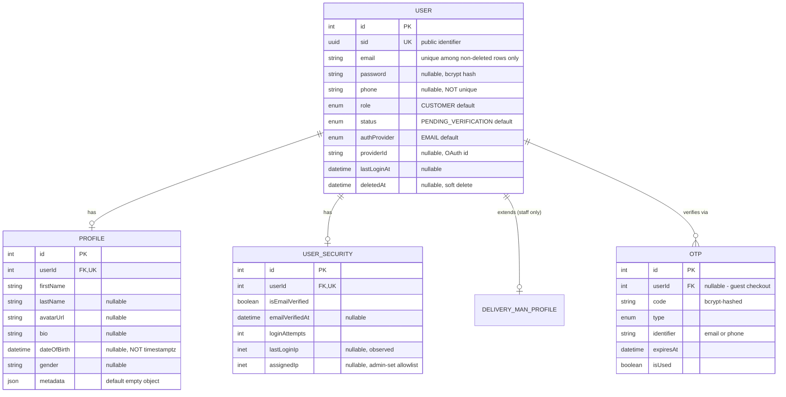
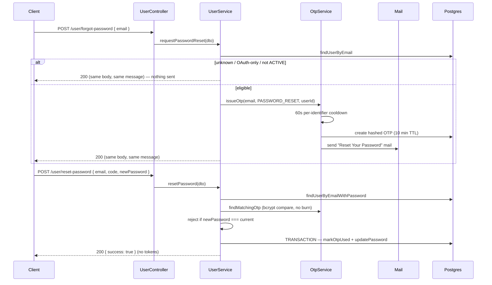

# User Module

Covers authentication identity, profile, and security state — the domain every other module stamps as `createdBy`/`updatedBy`/`deletedBy`/`authorId`/`recordedBy`/`changedBy`/`actorId`. `Profile` and `UserSecurity` are kept as separate 1:1 tables rather than columns on `User` because they group by concern (public-facing profile vs. internal security state) and because `UserSecurity` carries fields (`loginAttempts`, `lastLoginIp`, `assignedIp`) that must never be selected onto a customer-facing response by accident — splitting the table makes that a `select` omission instead of a field-by-field one.

**Schema source:** `prisma/schema/user.prisma` (models `User`, `Profile`, `UserSecurity`, `OTP`; enums `UserRole`, `AuthProvider`, `UserStatus`, `OTPType`).
**Module source:** `src/modules/user/` (`user.controller.ts`, `user.service.ts`, `repositories/{user,profile,user-security}.repository.ts`, `dto/`).

> **Scope note:** Every module that references `User` (`Product`, `ComboProduct`, `Order`, `Address`, `Cart`, `DeliveryManProfile`, `AuditLog`, …) is documented in its own reference — they appear here only as FK targets needed to understand cascading behavior. The `OTP` model lives in `user.prisma`, but its lifecycle is documented in [`otp.md`](./otp.md); login/refresh/JWT issuance in [`auth.md`](./auth.md). There is **no** `Session` model — refresh tokens are stateless JWTs with no DB-backed session store (the `sessions` table was dropped in migration `20260817100000_drop_unused_sessions_table`); see `auth.md`'s Known Gaps for the tradeoff.

---

## Topics Covered

- [DB Schema](#db-schema)
  - [Entity-Relationship Diagram (ERD)](#entity-relationship-diagram-erd)
  - [Enum Definitions](#enum-definitions) — [`UserRole`](#userrole) · [`AuthProvider`](#authprovider) · [`UserStatus`](#userstatus) · [`OTPType`](#otptype)
  - [Data Dictionary — User](#data-dictionary--user)
  - [Data Dictionary — Profile](#data-dictionary--profile)
  - [Data Dictionary — UserSecurity](#data-dictionary--usersecurity)
  - [Data Dictionary — OTP](#data-dictionary--otp)
  - [Relationships and Cascading Rules](#relationships-and-cascading-rules)
  - [Indexes & Constraints](#indexes--constraints)
  - [Conventions](#conventions)
  - [Example Data](#example-data)
  - [Known Gaps / Recommended Hardening](#known-gaps--recommended-hardening)
- [API End Point & Business Logic](#api-end-point--business-logic)
  - [Endpoint Overview](#endpoint-overview)
  - [Response Shapes & Select Projections](#response-shapes--select-projections)
  - [Register a User — `POST /user/create-user`](#register-a-user)
  - [Password Reset Flow](#password-reset-flow)
  - [Forgot Password — `POST /user/forgot-password`](#forgot-password)
  - [Reset a Password — `POST /user/reset-password`](#reset-a-password)
  - [Get All Users (Admin) — `GET /user/all-user`](#get-all-users-admin)
  - [Get My Profile — `GET /user/my-profile`](#get-my-profile)
  - [Update a Profile — `PATCH /user/update-profile/:id`](#update-a-profile)
  - [Update a User's Role — `PATCH /user/update-user-role/:id`](#update-a-users-role)
  - [Update a User's Assigned IP — `PATCH /user/update-user-security/:id`](#update-a-users-assigned-ip)
  - [Deactivate a User — `DELETE /user/deactivate-user/:id`](#deactivate-a-user)
  - [Update a Password — `PATCH /user/update-password/:id`](#update-a-password)
  - [Password/Security Handling](#passwordsecurity-handling)
  - [Rate Limiting](#rate-limiting)
  - [Internal Service API (Not HTTP-Exposed)](#internal-service-api-not-http-exposed)
  - [Auth & OTP Coupling](#auth--otp-coupling)

---

### DB Schema

#### Entity-Relationship Diagram (ERD)



**Cardinality legend:** `||--o|` = one-to-one optional (enforced by `@unique` on the FK column). `||--o{` = one-to-many. Unlike `ComboProduct`, `User` has no join-entity relations — every owned child hangs directly off `userId`. There is **no `name` node on `PROFILE`**: the display name is derived at read time, never stored (see the [Profile dictionary](#data-dictionary--profile)).

---

#### Enum Definitions

None of the four enums carries an inline doc comment in `user.prisma` — only the model-level header (`COVERS: AUTHENTICATION, PROFILE, SECURITY, OTP`). The descriptions below are inferred from how each value is actually branched on in `UserService`/`AuthService`/`RolesGuard`/`assertAccountCanAuthenticate`, not from schema comments.

##### `UserRole`

| Value | Meaning |
| :--- | :--- |
| `ADMIN` | Full back-office access. The only role checked by `@Roles(...)` anywhere in this module. |
| `SUPER_ADMIN` | Declared, not referenced by any `@Roles()` decorator yet. |
| `MANAGER` | Declared, not referenced by any `@Roles()` decorator yet. |
| `MARKETING` | Declared, not referenced by any `@Roles()` decorator yet. |
| `SUPPORT` | Declared, not referenced by any `@Roles()` decorator yet. |
| `EMPLOYEE` | Declared, not referenced by any `@Roles()` decorator yet. |
| `VENDOR` | Declared. The role `UserSecurity.assignedIp` exists for — though nothing reads that column yet. |
| `DELIVERY_PARTNER` | Assigned by `DeliveryManService` through [`createManagedUser`](#internal-service-api-not-http-exposed) — see [`delivery-man.md`](./delivery-man.md). |
| `WAREHOUSE` | Declared, not referenced by any `@Roles()` decorator yet. |
| `CUSTOMER` | **Default for a new user.** Ordinary storefront account. |
| `GUEST` | Declared; guest checkout is actually modeled as `userId: null` on `Order`/`Cart`/`OTP`, not as this role. |

> `role` is never client-settable at registration — `CreateUserDto` has no `role` field, so every self-registered account starts `CUSTOMER`. Only `PATCH /update-user-role/:id` (ADMIN-only) or an internal `createManagedUser` call can set anything else.

##### `AuthProvider`

| Value | Meaning |
| :--- | :--- |
| `EMAIL` | **Default.** Password-based account; `User.password` holds a bcrypt hash. The only provider `POST /create-user` can produce. |
| `GOOGLE` | Created exclusively by `POST /auth/social-auth` after a server-side ID-token verification. `password` is `NULL`. |
| `FACEBOOK` | Declared; explicitly rejected by `AuthService.socialAuth` — no provider is wired. |
| `APPLE` | Declared; explicitly rejected by `AuthService.socialAuth` — no provider is wired. |

##### `UserStatus`

| Value | Meaning |
| :--- | :--- |
| `PENDING_VERIFICATION` | **Default at registration.** Cannot log in — `assertAccountCanAuthenticate` throws `401` asking for email verification. Flipped to `ACTIVE` by `activateUser` on SIGNUP-OTP success, or by a Google sign-in that proves the same address. |
| `ACTIVE` | The only status that may hold a session, and the only one eligible for a password reset. |
| `INACTIVE` | Declared; nothing writes it. Treated as retired by the auth allowlist (`403`). |
| `SUSPENDED` | Declared; nothing writes it. `403` on every auth path. |
| `BLOCKED` | Declared; nothing writes it. `403` on every auth path. |
| `DEACTIVATED` | **The admin soft-delete state** — written by `deactivateUser` ([`DELETE /deactivate-user/:id`](#deactivate-a-user)). `403` on every auth path, enforced on the *next request* by `JwtStrategy`, not just at login. |
| `ARCHIVED` | Declared; nothing writes it. `403` on every auth path. |

> `assertAccountCanAuthenticate` (`src/common/utils/account-status.util.ts`) is an **allowlist** — only `ACTIVE` returns. A denylist ("is it blocked or suspended?") silently let `DEACTIVATED` back in, and would do the same for any status added to the schema later. The three retired states (`DEACTIVATED`/`INACTIVE`/`ARCHIVED`) deliberately share one vague message, since which one it is is an internal admin concern and leaking it only helps someone probing another person's account.

##### `OTPType`

| Value | Reachable today? | Meaning |
| :--- | :--- | :--- |
| `SIGNUP` | **Yes** | Issued by `registerUser`; verified by `POST /otp/verify-otp`, which activates the account **and mints a session**. |
| `PASSWORD_RESET` | **Yes** | Issued by `POST /user/forgot-password`; spent by `POST /user/reset-password`. Deliberately does **not** route through `verify-otp` — see [Password Reset Flow](#password-reset-flow). |
| `LOGIN_2FA` | No | Declared; no issuance path exists. |
| `PHONE_CHANGE` | No | Declared; no issuance path exists. |

---

#### Data Dictionary — User

**Table purpose:** the account record every other module points at for authorship/ownership. Deliberately thin — profile and security concerns live in their own 1:1 tables. Maps to table `users`.

| Field | Type | Constraints | Description |
| :--- | :--- | :--- | :--- |
| `id` | `INT` | PK, AUTOINCREMENT | Internal numeric key; FK joins and route params only. |
| `sid` | `UUID` | UNIQUE, NOT NULL, DEFAULT `uuid()`, `@map("user_sid")`, `@db.Uuid` | Public-facing identifier — a native `UUID` column rather than a string, "for performance" per the schema comment. |
| `email` | `VARCHAR` | NOT NULL. **No `@unique` in the Prisma schema** — uniqueness is a DB-only *partial* index (see below). | Login identity for `EMAIL` accounts; also the value `OTP.identifier` matches on. **Always stored lowercase.** |
| `password` | `VARCHAR` | NULLABLE | Bcrypt hash. `NULL` for OAuth accounts and for admin-onboarded staff created via `createManagedUser`. **Never selected into a response** — see [Password/Security Handling](#passwordsecurity-handling). |
| `phone` | `VARCHAR(20)` | NULLABLE | **Not unique.** Was unique at `20260412062947_init…`, deliberately dropped by `20260419090755_init_user_phone_not_unique`. Validated as a Thai mobile/landline format by `@IsThaiPhone` and normalized by `@TransformThaiPhone`. |
| `role` | `UserRole` | NOT NULL, DEFAULT `CUSTOMER` | See [`UserRole`](#userrole). Never client-settable at signup. |
| `status` | `UserStatus` | NOT NULL, DEFAULT `PENDING_VERIFICATION` | See [`UserStatus`](#userstatus). The single gate every auth path consults. |
| `authProvider` | `AuthProvider` | NOT NULL, DEFAULT `EMAIL` | Not accepted from any public payload — `CreateUserDto` has no such field. |
| `providerId` | `VARCHAR` | NULLABLE, part of `@@unique([authProvider, providerId])` | The provider's own subject id. `NULL` for every email account; Postgres does not distinct-check `NULL`s, so the constraint only binds rows that actually have one. |
| `createdAt` | `TIMESTAMPTZ(3)` | NOT NULL, DEFAULT `now()`, `@map("created_at")` | |
| `updatedAt` | `TIMESTAMPTZ(3)` | NOT NULL, `@updatedAt`, `@map("updated_at")` | |
| `lastLoginAt` | `TIMESTAMPTZ(3)` | NULLABLE, `@map("last_login_at")` | Stamped by `updateLastLoginTime` on every successful password or social login. |
| `deletedAt` | `TIMESTAMPTZ(3)` | NULLABLE, `@map("deleted_at")` | Soft-delete marker added by `20260813082256_soft_delete_user_email_unique`. **Read everywhere, written nowhere** — see [Known Gaps](#known-gaps--recommended-hardening). |

> **Email uniqueness is scoped to live rows.** `users_email_key` was replaced by `CREATE UNIQUE INDEX users_email_active_key ON users(email) WHERE deleted_at IS NULL`, so an archived account's address can be reused by a new signup. Prisma's DSL cannot express a partial unique index, which is why `User.email` carries no `@unique` — **the constraint exists only in SQL**, and every lookup must therefore be `findFirst({ where: { email, deletedAt: null } })`, never `findUnique`. `UserRepository` follows this without exception; a `findUnique` here could match an archived row non-deterministically.
>
> **Email is case-normalized in the app layer, not the DB.** No `citext`, no functional index: `CreateUserDto`/`LoginDto`/`ForgotPasswordDto`/`ResetPasswordDto` lowercase on write via `@Transform`, and every `UserRepository` lookup re-applies `.toLowerCase().trim()` as a defensive choke point for callers that bypass a DTO. Existing rows were backfilled by `20260817150000_normalize_email_case`.

---

#### Data Dictionary — Profile

**Table purpose:** everything a user shows to the world. 1:1 with `User`, cascade-deleted. Maps to table `profiles`.

| Field | Type | Constraints | Description |
| :--- | :--- | :--- | :--- |
| `id` | `INT` | PK, AUTOINCREMENT | |
| `userId` | `INT` | FK → `users.id`, UNIQUE, `@map("user_id")`, `ON DELETE CASCADE` | The `@unique` is what makes this 1:1 rather than 1:N. |
| `firstName` | `VARCHAR(100)` | NOT NULL | The only required profile field. |
| `lastName` | `VARCHAR(100)` | NULLABLE | |
| `avatarUrl` | `VARCHAR` | NULLABLE | "One source of truth for the image" per the schema comment. Holds either a storage-relative path (uploaded via `update-profile`) or an absolute URL (set at signup, or supplied by an OAuth provider); `ProfileResponseDto` prefixes `app.baseUrl` only when the value does **not** start with `http`. |
| `bio` | `TEXT` | NULLABLE | Settable at registration, **not editable afterwards** — see [Known Gaps](#known-gaps--recommended-hardening). |
| `dateOfBirth` | `TIMESTAMP` | NULLABLE | **The one `DateTime` in this domain that is not `@db.Timestamptz(3)`** — it is a calendar date, not an instant, so a timezone offset would be noise. Written from `new Date('1990-01-01')`, i.e. UTC midnight. |
| `gender` | `VARCHAR(20)` | NULLABLE | Free text, not an enum. |
| `metadata` | `JSONB` | NULLABLE, DEFAULT `'{}'` | Open bag accepted at registration (`@IsObject`). Nothing in the codebase reads it yet. |

> **There is no `name` column.** It was dropped by `20260817120000_drop_profile_name_column`: `CreateProfileDto` let a caller set an independent value at signup, but every later profile update silently overwrote it with a `firstName + lastName` concatenation, so the stored value was a cache with no sync strategy. Every consumer now derives it at read time through `formatDisplayName` (`src/common/utils/display-name.util.ts`), which is what `ProfileResponseDto.name` and `UserMinifiedResponseDto.name` return. **Nothing can drift, because nothing is stored.**

---

#### Data Dictionary — UserSecurity

**Table purpose:** internal security state that must never leak onto a customer-facing response by accident. 1:1 with `User`, cascade-deleted. Maps to table `user_security`.

| Field | Type | Constraints | Description |
| :--- | :--- | :--- | :--- |
| `id` | `INT` | PK, AUTOINCREMENT | |
| `userId` | `INT` | FK → `users.id`, UNIQUE, `@map("user_id")`, `ON DELETE CASCADE` | |
| `isEmailVerified` | `BOOLEAN` | NOT NULL, DEFAULT `false` | `false` at email registration; `true` immediately for OAuth accounts and for admin-onboarded staff. Flipped by `activateUser` on SIGNUP-OTP success. |
| `emailVerifiedAt` | `TIMESTAMPTZ(3)` | NULLABLE | Set alongside the flag; nulled again if verification is ever revoked (`updateEmailVerification(userId, false)`). |
| `loginAttempts` | `INT` | NOT NULL, DEFAULT `0` | Incremented by `updateLoginAttempts` on every failed password compare, reset to `0` by `updateLoginMetadata` on success. **Written but never read** — there is no account lockout, see [Known Gaps](#known-gaps--recommended-hardening). |
| `lastLoginIp` | `INET` | NULLABLE | The **observed socket IP** (`@Ip()`), never caller input. Seeded at registration, refreshed on every successful login. |
| `assignedIp` | `INET` | NULLABLE | Static IP-allowlist value for internal/vendor restricted access. **Admin-set only** — the sole write path is [`PATCH /user/update-user-security/:id`](#update-a-users-assigned-ip). Nothing reads it yet. |

> **Both IP columns are native `inet`, not `text`** (migration `20260817140000_ip_fields_to_inet`) — Postgres validates the format on write and keeps CIDR/range queries available for future fraud/geo rules without app-layer parsing.
>
> **There is no token column here.** A prior `verificationToken`/`verificationTokenExpires`/`resetToken`/`resetTokenExpires` set was removed by `20260813085902_drop_unused_user_security_tokens`: no repository ever read or wrote them, and — unlike the `OTP` model — a single column pair can only hold one live token at a time, with no history of prior requests. Every verification flow (`SIGNUP`, `PASSWORD_RESET`, and any future `LOGIN_2FA`/`PHONE_CHANGE`) runs through `OTP` and nothing else.

---

#### Data Dictionary — OTP

**Table purpose:** every one-time code the system issues, for users and guests alike. Maps to table `otps`. Full lifecycle in [`otp.md`](./otp.md) — summarized here because two User-module routes issue and spend these rows.

| Field | Type | Constraints | Description |
| :--- | :--- | :--- | :--- |
| `id` | `INT` | PK, AUTOINCREMENT | |
| `code` | `VARCHAR` | NOT NULL | **Bcrypt-hashed**, never the plaintext. Verification is a `bcrypt.compare` against the newest unused, unexpired row. |
| `type` | `OTPType` | NOT NULL | See [`OTPType`](#otptype). Part of the match key, so a SIGNUP code cannot be spent on a password reset. |
| `identifier` | `VARCHAR` | NOT NULL, INDEXED | Email (today) or phone. Indexed because lookup is by identifier + type, not by `userId` — which may be `NULL`. |
| `userId` | `INT` | NULLABLE, FK → `users.id`, `ON DELETE CASCADE`, `@map("user_id")` | `NULL` for guest-checkout codes, which is why the identifier carries the lookup. |
| `expiresAt` | `TIMESTAMPTZ(3)` | NOT NULL, `@map("expires_at")` | 10 minutes after issuance. |
| `isUsed` | `BOOLEAN` | NOT NULL, DEFAULT `false`, `@map("is_used")` | Burned in the same transaction as the password write on the reset path. |
| `createdAt` | `TIMESTAMPTZ(3)` | NOT NULL, DEFAULT `now()`, `@map("created_at")` | Also what the 60-second per-identifier resend cooldown measures from. |

---

#### Relationships and Cascading Rules

##### Owned children

| Parent → Child | FK Column | On Delete | Effect |
| :--- | :--- | :--- | :--- |
| `User` → `Profile` | `Profile.userId` | **CASCADE** | Deleting a user removes their profile. |
| `User` → `UserSecurity` | `UserSecurity.userId` | **CASCADE** | Deleting a user removes their security row. |
| `User` → `DeliveryManProfile` | `DeliveryManProfile.userId` | **CASCADE** | Staff-only extension row; see [`delivery-man.md`](./delivery-man.md). |
| `User` → `OTP` | `OTP.userId` | **CASCADE** | Nullable — a guest OTP (`userId: null`) is unaffected by any user delete. |

##### Downstream references (other modules' FKs into `User`)

| Model | FK field(s) | On Delete | Notes |
| :--- | :--- | :--- | :--- |
| `Category` | `createdBy`, `updatedBy` | **SET NULL** | Audit stamp, both nullable. |
| `Product` | `createdBy`, `updatedBy`, `deletedBy` | **SET NULL** | Audit stamp, all nullable. |
| `ComboProduct` | `createdBy`, `updatedBy`, `deletedBy` | **SET NULL** | Audit stamp, all nullable. |
| `Inventory` | `recordedBy` | **SET NULL** | Originally `CASCADE` at `20260509110031`, corrected to `SET NULL` by two later migrations. |
| `Blog` | `authorId` | **SET NULL** | Nullable. |
| `Home` | `createdBy`, `updatedBy` | **SET NULL** | Audit stamp, both nullable. |
| `Support` | `createdBy`, `updatedBy` | **SET NULL** | Audit stamp, both nullable. |
| `Cart` | `userId` | **CASCADE** | Nullable — `null` for guest carts, identified by `sessionToken` instead. |
| `Address` | `userId` | **CASCADE** | Required, not nullable. |
| `Order` | `userId` | **SET NULL** | Nullable — `null` for guest checkouts; customer fields are snapshotted rather than joined live, so an order survives later profile edits. |
| `OrderStatusHistory` | `changedBy` | **SET NULL** | Nullable — `null` means a system/automated transition (e.g. a payment webhook), not a missing actor. |
| `PromoCodeRedemption` | `userId` | **SET NULL** | Nullable — guest redemptions enforce `usageLimitPerUser` at the app layer only, by email. |
| `DeliveryProvider` | `createdBy`, `updatedBy` | **SET NULL** | Audit stamp, both nullable. |
| `DeliveryShipment` | `createdBy` | **SET NULL** | The staff member who booked the shipment. |
| `DeliveryStatusHistory` | `changedBy` | **SET NULL** | Nullable — `null` for courier-webhook transitions. |
| `DeliveryManProfile` | `nidVerifiedBy` | **SET NULL** | The admin who verified the NID — distinct from the profile's own `userId`, which is the delivery man. |
| `AuditLog` | `actorId` | **SET NULL** | The single generic audit-trail FK — see [`audit-log.md`](./audit-log.md). `NULL` means the mutation ran with no authenticated request context. Deliberately **not** one more `createdBy`/`updatedBy` pair — this is the one relation field meant to cover every current and future tracked model. |

**Pattern:** every audit-stamp FK (`createdBy`/`updatedBy`/`deletedBy`/`changedBy`/`authorId`/`recordedBy`/`actorId`/`nidVerifiedBy`) is `SET NULL` — deleting a staff account never blocks, and never cascades into, content they touched. Every ownership FK to a genuine end-user record is `CASCADE` (`Profile`, `UserSecurity`, `DeliveryManProfile`, `Cart`, `Address`, `OTP`) **except** `Order` and `PromoCodeRedemption`, which are `SET NULL` — deliberately, since both are historical financial records that must survive account deletion and both already support a guest `userId: null` as a first-class state.

> None of this fires today: **nothing in the codebase hard-deletes a `User`.** The only removal path is the status-based soft delete at [`DELETE /deactivate-user/:id`](#deactivate-a-user).

---

#### Indexes & Constraints

##### Indexes

| Index | Table | Type | Purpose |
| :--- | :--- | :--- | :--- |
| `users_pkey` | `users` | PK | `id`. |
| `users_user_sid_key` | `users` | B-Tree (unique) | `user_sid` — public-identifier lookups. |
| `users_email_active_key` | `users` | B-Tree (**partial** unique) | `email WHERE deleted_at IS NULL`. DB-only — no `@unique` counterpart in the schema, because Prisma's DSL cannot express a filtered unique index. |
| `users_auth_provider_provider_id_key` | `users` | B-Tree (unique, composite) | `(authProvider, providerId)` — stops two rows claiming the same OAuth identity. Only binds rows with a non-`NULL` `providerId`. |
| `profiles_pkey` | `profiles` | PK | `id`. |
| `profiles_user_id_key` | `profiles` | B-Tree (unique) | Enforces the 1:1 with `users`. |
| `profiles_first_name_trgm_idx` | `profiles` | **GIN (`gin_trgm_ops`)** | Substring/ILIKE search on `firstName`. |
| `profiles_last_name_trgm_idx` | `profiles` | **GIN (`gin_trgm_ops`)** | Substring/ILIKE search on `lastName`. |
| `user_security_pkey` | `user_security` | PK | `id`. |
| `user_security_user_id_key` | `user_security` | B-Tree (unique) | Enforces the 1:1 with `users`. |
| `otps_pkey` | `otps` | PK | `id`. |
| `otps_identifier_idx` | `otps` | B-Tree | `identifier` — OTP lookup by email/phone, independent of `userId`. |

**Three indexes were deliberately removed. Don't re-add them without reading why:**

- `users_phone_key` — created by `20260412062947`, dropped by `20260419090755_init_user_phone_not_unique`. Phone is intentionally shareable (family accounts, shared landlines).
- `users_email_phone_idx` — dropped by `20260817110000_drop_dead_email_phone_index`. `email` is already covered by `users_email_active_key`, and a btree leading with `email` cannot serve a phone-only lookup (leftmost-prefix rule), so the composite never helped either column.
- `profiles_firstName_lastName_idx` — a plain btree, replaced by the two trigram GIN indexes in `20260817130000_trigram_indexes_for_name_search` (which also enables `pg_trgm`). The admin user-search endpoints (`UserRepository.findAllUsers`, `DeliveryManRepository.findAllDeliveryMen`) run a `contains`/ILIKE substring search, which a btree cannot serve at all.

##### Check constraints

**None.** Unlike `combo_products`, the `users`, `profiles`, `user_security`, and `otps` tables have no `CHECK` constraints and no triggers or derived columns. Every validation rule (password length, status transitions, login-attempt counting, IP format at the API edge) lives in DTOs and services — the one exception being the native `inet` columns, where Postgres itself rejects a malformed address.

---

#### Conventions

- **All `DateTime` columns are `@db.Timestamptz(3)`, with one deliberate exception:** `Profile.dateOfBirth` — see the [Profile dictionary](#data-dictionary--profile). Any new `DateTime` field in this domain must carry `@db.Timestamptz(3)` unless it represents a calendar date rather than an instant.
- **Columns are `snake_case` via `@map()`**, same as every other module — Prisma field names stay camelCase. (`Profile`/`UserSecurity` are only partly converted: `firstName`, `avatarUrl`, `lastLoginIp`, `assignedIp` and friends are still camelCase in SQL. New columns should be mapped.)
- **`sid`, not `id`, is the public-facing identifier** — same convention as `ComboProduct.sid`, and a native `@db.Uuid` column rather than a string for index/comparison performance. Route params still take `id`.
- **Soft delete is status-based today.** `deletedAt` exists and every email lookup filters on it, but the only removal route writes `status = DEACTIVATED` and leaves `deletedAt` `NULL`. Both mechanisms are honoured on read (`JwtStrategy` rejects on either), so nothing is unsafe — but the email-reuse behaviour the partial index was built for is not reachable yet.
- **`password` is never returned from a query unless explicitly opted in.** `findUserByEmailWithPassword`/`findUserByIdWithPassword` take an `includePassword` flag defaulting to `false`; every other repository `select` omits the column outright. See [Password/Security Handling](#passwordsecurity-handling).
- **Security-semantic fields stay off public payloads.** `role`, `authProvider`/`providerId`, and `assignedIp` are all absent from `CreateUserDto` by design — a self-asserted value on a public, unauthenticated endpoint defeats the control it exists to enforce. Each has exactly one privileged write path instead.
- **Display names are derived, never stored** — `formatDisplayName(profile)`. Any new response DTO that needs a full name must call it rather than adding a column.
- **Emails are lowercased on write *and* on read.** Two layers on purpose: the DTO `@Transform` for HTTP callers, the repository `.toLowerCase().trim()` for internal service calls that bypass DTOs.
- **Repositories take an optional `tx` as their last argument.** Every method in all three repositories resolves `const client = tx || this.prisma`, which is what lets `UserService` compose a `User` + `Profile` + `UserSecurity` + `OTP` write — or a caller's own extension row — into a single transaction.

---

#### Example Data

**User**

| email | role | status | authProvider | phone | lastLoginAt | deletedAt |
| :--- | :--- | :--- | :--- | :--- | :--- | :--- |
| `quazisamiha@gmail.com` | `CUSTOMER` | `ACTIVE` | `EMAIL` | `+66812345678` | `2026-08-08T14:22:00Z` | `null` |
| `john.doe@example.com` | `ADMIN` | `ACTIVE` | `EMAIL` | `null` | `2026-08-09T09:01:00Z` | `null` |
| `newsignup@example.com` | `CUSTOMER` | `PENDING_VERIFICATION` | `EMAIL` | `null` | `null` | `null` |
| `rider01@example.com` | `DELIVERY_PARTNER` | `ACTIVE` | `EMAIL` | `0812345678` | `null` | `null` |
| `old.account@example.com` | `CUSTOMER` | `DEACTIVATED` | `GOOGLE` | `null` | `2026-05-02T11:40:00Z` | `null` |

> `password` is never listed — it is a bcrypt hash and is never selected into a response regardless. The `DELIVERY_PARTNER` and `GOOGLE` rows both have `password: NULL`, which is exactly why they cannot use `update-password` or the reset flow.

**Profile** (for `quazisamiha@gmail.com`) — there is no `name` column; `"Quazi Samiha Tasnim"` is computed at read time.

| firstName | lastName | avatarUrl | dateOfBirth | gender |
| :--- | :--- | :--- | :--- | :--- |
| `Quazi Samiha` | `Tasnim` | `/uploads/profiles/9f3c…webp` | `1990-01-01` | `Male` |

**UserSecurity** (for `quazisamiha@gmail.com`)

| isEmailVerified | emailVerifiedAt | loginAttempts | lastLoginIp | assignedIp |
| :--- | :--- | :--- | :--- | :--- |
| `true` | `2026-07-15T10:03:00Z` | `0` | `203.0.113.44` | `null` |

---

#### Known Gaps / Recommended Hardening

**Open — data integrity**

- **`UserService.createManagedUser` and `updateManagedUser` still write `Profile.name`.** `createManagedUser` passes a `name` built from `firstName + lastName` to `ProfileRepository.createUserProfile`, and `updateManagedUser` maps `data.name` onto `Prisma.ProfileUpdateInput`. That column was dropped by `20260817120000_drop_profile_name_column`. It still typechecks only because the checked-in Prisma client under `src/generated/prisma` predates the migration; regenerating the client turns both into compile errors, and against a migrated database the write fails outright. **This is the delivery-man onboarding path** (`DeliveryManService.createDeliveryMan`/`updateDeliveryMan` are the only callers), so it is not hypothetical. Fix: drop both `name` assignments and let `formatDisplayName` derive it, then `yarn prisma generate`.
- **`deletedAt` is read but never written.** Every email lookup filters `deletedAt: null` and `JwtStrategy` rejects a row that has it set, but no code path assigns it — `deactivateUser` only moves `status`. The consequence is that `users_email_active_key` can never actually release an address: a deactivated user still holds their email forever. Either have `deactivateUser` stamp `deletedAt` (and accept that the address becomes reusable), or document that the partial index is forward-looking scaffolding.
- **No reactivation route.** `activateUser` exists on the service but is reachable only from `OtpService.verifyOtp` for a `SIGNUP` code. Once an admin deactivates someone there is no HTTP path back — the account has to be flipped in the database by hand.

**Open — access control & abuse**

- **Nothing reads `assignedIp`.** It is stored, validated, and admin-editable, but no guard, interceptor, or strategy consults it, so the IP allowlist is not enforced anywhere. The column is a placeholder for a control that has not been built.
- **No per-account lockout.** `UserSecurity.loginAttempts` is incremented on every failed login and never read. Rate limiting is per IP, so an attacker distributing guesses against one account across many IPs defeats it entirely. This is the Phase 2 business layer in [`docs/issues/rate-limiting.md`](./issues/rate-limiting.md) §4.7, and it is the control that actually stops credential stuffing — per-IP limiting cannot substitute for it.
- **No per-OTP attempt cap.** Same shape: `POST /otp/verify-otp` and `POST /user/reset-password` are capped per IP, but nothing caps guesses against a *specific* issued code (§4.8).
- **Rate-limiter storage is in-process.** Correct while single-instance; going multi-instance makes the effective limit `limit × instance count` and needs Redis. See the operational notes under [Rate Limiting](#rate-limiting).
- **No 429 observability.** Nothing logs or counts throttle events, so there is no signal to alert on and no data to tune the limits with (§4.9). The current numbers are §5's proposals, not measurements.
- **A password reset does not invalidate existing sessions.** Refresh tokens are stateless JWTs with no server-side store, and a reset does not change `status`, so `JwtStrategy`'s per-request check still passes. An attacker holding a stolen refresh token keeps it until expiry even after the victim resets. That is a property of the token design (see `auth.md`), not of this module — but it is the gap a reset is supposed to close. (Deactivation *is* effective immediately, because `JwtStrategy` re-reads `status` on every request.)

**Open — API surface**

- **`PATCH /update-profile/:id` covers only four fields.** `firstName`, `lastName`, `phone`, and the avatar. `bio`, `dateOfBirth`, `gender`, and `metadata` can be set at registration and then never changed through any route — `UpdateProfileDto` simply doesn't declare them, and with the global `ValidationPipe({ forbidNonWhitelisted: true })` sending them returns `400`.
- **`GET /all-user` has no filters and no sortable-field whitelist.** It binds the bare `PaginationQueryDto` — no `status`/`role` filter, and `sortBy` isn't a declared field, so `defaultSortField: 'createdAt'` is the only ordering available. Every other admin list module (e.g. `combo-product`'s `AllCombosQueryDto`) layers filter/sort DTOs on the shared pagination base; `user` does not yet follow that pattern.
- **The admin security tier is fetched and then discarded.** `FULL_USER_SELECT_ADMIN` pulls `loginAttempts`/`lastLoginIp`/`assignedIp` from the database for `GET /all-user` and `PATCH /update-user-role/:id`, but both wrap the row in `UserResponseDtoWithDetails`, whose `security` field is hardcoded to `new UserSecurityMeResponseDto(...)` — the customer tier. The admin UI never receives the extra fields those queries pay for. `UserSecurityAdminResponseDto` is returned by exactly one route (`update-user-security`).
- **`updateUserRole` enforces no business rules.** An `ADMIN` can demote another `ADMIN`, demote themselves, promote anyone straight to `SUPER_ADMIN`, or leave the system with zero admins. `UpdateUserRoleDto` validates only that the value is a member of the enum.
- **Password policy is length-only.** `MinLength(6)` on all three write paths (`CreateUserDto`, `UpdatePasswordDto`, `ResetPasswordDto`) and no complexity, breach-list, or reuse check. The three are deliberately kept in step — a reset path that accepts a weaker password than registration is just a way around the registration rule — so raising the floor means raising all three together.

**Open — dead code**

- **`UserService.getUserById` and `getUserByEmail` are thin existence-checked wrappers** over lookups the repository already exposes (`getUserById` from `AuthService.refreshToken` and `issueTokensForVerifiedUser`, `getUserByEmail` from `OtpService`). Neither is used by any route in this module.
- **`UserSecurityRepository.SECURITY_SELECT_ADMIN` duplicates `UserRepository`'s constant of the same name.** Both are live, and the two copies must be kept in sync by hand.
- **`UserRepository.findByEmailWithAuth` is fully commented out** at the bottom of the file, superseded by `findUserByEmailWithPassword`. Worth deleting rather than leaving dead.

**Closed — kept for the reasoning**

- ~~No OAuth token verification exists.~~ **Fixed for Google.** `POST /create-user` no longer accepts `authProvider`/`providerId` at all — it is email/password registration only. OAuth accounts are created exclusively via `POST /auth/social-auth` ([Social Login](./auth.md#social-login-google)), which verifies a real Google ID token server-side with `google-auth-library` before trusting any identity claim; `FACEBOOK`/`APPLE` are explicitly rejected rather than silently accepted. `(authProvider, providerId)` is also DB-uniqueness-constrained (`20260816120000_add_user_oauth_identity_unique`), so even a bug in the verified path cannot produce two rows claiming one identity.
- ~~`assignedIp` is reachable from the public registration endpoint with no role gate.~~ **Fixed.** `CreateUserSecurityDto` is gone and `CreateUserDto` has no `security` sub-object, so `registerUser` cannot write the column. It is writable only through the ADMIN-guarded `PATCH /update-user-security/:id`. Same reasoning as the `authProvider` split: a self-chosen value sitting in the row from day one defeats any IP restriction later built on it — e.g. after the account is promoted into a restricted role.
- ~~No rate limiting on `POST /create-user`.~~ **Fixed**, and more to the point the limiter now *exists*: `@nestjs/throttler` was configured but no `ThrottlerGuard` was ever registered, so `ThrottlerModule.forRoot()` was inert and every route in the app was unlimited — and its `ttl: 60` was being read as 60 **milliseconds** (v5 moved the unit to ms; this app is on v6). Both fixed by `src/common/throttler/`; see [Rate Limiting](#rate-limiting).
- ~~`UserSecurity` carries four unused token columns.~~ **Fixed** — dropped by `20260813085902_drop_unused_user_security_tokens`. Every verification flow runs through `OTP`.
- ~~`Profile.name` drifts out of sync with `firstName`/`lastName`.~~ **Fixed** — column dropped, name derived at read time. (Two service methods still reference it; see the first open item.)
- ~~No self-service profile update endpoint.~~ **Fixed** — [`PATCH /update-profile/:id`](#update-a-profile), self-or-`ADMIN`, with avatar upload/replace/remove.
- ~~No delete route of any kind.~~ **Fixed** — [`DELETE /deactivate-user/:id`](#deactivate-a-user), a reversible status-based soft delete.
- ~~Password `@MinLength` message says 8, enforces 6.~~ **Fixed** — the message now matches the rule actually enforced. The 6-character floor was kept deliberately; raising it is a separate decision (see above).

---

### API End Point & Business Logic

Every endpoint below is served by `UserController` → `UserService` → `UserRepository`/`ProfileRepository`/`UserSecurityRepository`. All routes are prefixed `/api/v1/user`. For the DTO/Swagger contract see `src/modules/user/dto/`; select projections are private constants on the repositories themselves (`src/modules/user/repositories/`) — there is no dedicated `user.select.ts`.

> **Scope note:** `AuthModule` (login, refresh, JWT issuance) and `OtpModule` (OTP generation/verification) are separate modules that call into `UserService`'s public methods — see [Auth & OTP Coupling](#auth--otp-coupling). Methods `UserService` exposes for other modules but no route reaches are in [Internal Service API](#internal-service-api-not-http-exposed).

#### Endpoint Overview

| Method | Path | Access | Purpose |
| :--- | :--- | :--- | :--- |
| `POST` | `/create-user` | Public, **rate limited 3/hour/IP** | [Register a new user](#register-a-user) |
| `POST` | `/forgot-password` | Public, **rate limited 3/hour/IP** | [Request a password reset code](#forgot-password) |
| `POST` | `/reset-password` | Public, **rate limited 5/5min/IP** | [Set a new password with that code](#reset-a-password) |
| `GET` | `/all-user` | `ADMIN` | [Paginated admin user list](#get-all-users-admin) |
| `GET` | `/my-profile` | Authenticated (self) | [The caller's own account + profile + security summary](#get-my-profile) |
| `PATCH` | `/update-profile/:id` | Authenticated (self **or** `ADMIN`) | [Update name, phone, avatar](#update-a-profile) |
| `PATCH` | `/update-user-role/:id` | `ADMIN` | [Change a user's role](#update-a-users-role) |
| `PATCH` | `/update-user-security/:id` | `ADMIN` | [Set/clear a user's assigned IP](#update-a-users-assigned-ip) |
| `DELETE` | `/deactivate-user/:id` | `ADMIN` | [Soft-delete a user](#deactivate-a-user) |
| `PATCH` | `/update-password/:id` | Authenticated (self **or** `ADMIN`) | [Change a user's password](#update-a-password) |

**Guard composition.** `GET /all-user`, `PATCH /update-user-role/:id`, `PATCH /update-user-security/:id`, and `DELETE /deactivate-user/:id` use `JwtAuthGuard` + `RolesGuard` + `@Roles(UserRole.ADMIN)`. `GET /my-profile`, `PATCH /update-profile/:id`, and `PATCH /update-password/:id` use `JwtAuthGuard` only — the self-or-admin rule on the latter two is a manual `if` in the controller, not `RolesGuard`, because any authenticated caller may reach the route but only the owner or an `ADMIN` passes:

```ts
if (!req.user?.id) throw new NotFoundException('User identity missing from request');
if (req.user.id !== id && req.user.role !== UserRole.ADMIN) {
  throw new ForbiddenException('You can only update your own profile');
}
```

`POST /forgot-password` and `POST /reset-password` are public and unauthenticated by necessity — the caller has, by definition, lost the ability to authenticate. Everything that would normally be a guard is therefore a rule inside the service; see [Password Reset Flow](#password-reset-flow).

**Every route above also passes through the global rate limiter** (`AppThrottlerGuard`, registered as an `APP_GUARD` by `src/common/throttler/`). It runs *before* `JwtAuthGuard`, so it buckets by IP on every route including the authenticated ones. All routes get the global `short` (30 per 10 s) and `long` (200 per 60 s) tiers; three routes narrow `short` further. Exceeding a limit returns `429` with `errorCode: 'RATE_LIMIT_EXCEEDED'` — see [Rate Limiting](#rate-limiting).

---

#### Response Shapes & Select Projections

| Select / DTO | Fed to / used by | Contains |
| :--- | :--- | :--- |
| `USER_SELECT` | `UserResponseDto` | Bare scalars (`id, sid, email, phone, role, status, authProvider, providerId, createdAt, updatedAt, lastLoginAt`) — no nested `profile`/`security`, no `password`. |
| `PROFILE_SELECT` | `ProfileResponseDto` | `firstName, lastName, avatarUrl, bio, dateOfBirth, gender, metadata`. |
| `SECURITY_SELECT_CUSTOMER` | `UserSecurityMeResponseDto` | `isEmailVerified`, `emailVerifiedAt` only. |
| `SECURITY_SELECT_ADMIN` | `UserSecurityAdminResponseDto` | Adds `loginAttempts`, `lastLoginIp`, `assignedIp`. |
| `FULL_USER_SELECT_CUSTOMER` | `UserResponseDtoWithDetails` | `USER_SELECT` + nested `profile: PROFILE_SELECT` + `security: SECURITY_SELECT_CUSTOMER`. Used by `registerUser`, `getMyProfile`, `updateProfile`, `updatePassword`, `deactivateUser`. |
| `FULL_USER_SELECT_ADMIN` | `UserResponseDtoWithDetails` (admin routes) | Same, but nests `security: SECURITY_SELECT_ADMIN` — **the extra fields never actually surface**, see [Known Gaps](#known-gaps--recommended-hardening). Used by `findAllUsers` and `updateUserRole`. |
| `findAuthStateById`'s inline select | *(raw row, no DTO)* | `id, email, role, status, deletedAt` — the narrowest select in the module, run by `JwtStrategy` on **every** authenticated request. |
| `UserResponseDto` | `getUserByEmail`, `getUserById`, `updateLastLoginTime`, `findOrCreateSocialUser` | Flat scalar shape; no `password` property exists on the class at all. |
| `UserResponseDtoWithDetails` | Every route in this module that returns a user | `UserResponseDto` fields plus nested `profile` and `security` (always via `UserSecurityMeResponseDto`, regardless of which select fetched the row). |
| `ProfileResponseDto` | Nested inside the above | `firstName, lastName, name (derived), avatarUrl (baseUrl-prefixed), bio, dateOfBirth, gender`. |
| `UserSecurityAdminResponseDto` | `PATCH /update-user-security/:id` only | The one place the admin security tier reaches a client. |
| `PasswordResetResponseDto` | `forgot-password`, `reset-password` | `{ success: true }` and nothing else — deliberately, see [Forgot Password](#forgot-password). |
| `UserMinifiedResponseDto` | *(no User-module route)* | `{ id, name, email, role, status }` — reused by `Category`, `Product`, `Blog`, `Home`, `Support`, `ComboProduct` for their `createdByUser`/`updatedByUser`/`author` audit fields. |

**Two derived fields to know about:**

- **`profile.name`** is computed by `formatDisplayName(profile)` — `[firstName, lastName]` filtered and joined — at response time. It is not a column and cannot be set.
- **`profile.avatarUrl`** is rewritten by `ProfileResponseDto`: a value already starting with `http` is passed through untouched (OAuth avatars, URLs supplied at signup), anything else is prefixed with `app.baseUrl`. That is why every service method that returns a user threads `this.configService.get('app.baseUrl')` into the DTO constructor.

**No `password` field exists on any response DTO class** — even the call sites that fetch the hash never pass it through to a returned object. See [Password/Security Handling](#passwordsecurity-handling) for the full trace.

---

#### Register a User

**`POST /api/v1/user/create-user`**

**Purpose**: Create a new `EMAIL` (password-based) account with its `Profile` and `UserSecurity` rows, and kick off signup-OTP verification.

**Access**: None — public route. **Rate limited to 3 per hour per IP** (`@Throttle({ short: SIGNUP_THROTTLE })`), the tightest budget in the app — see [Rate Limiting](#rate-limiting) for why this route in particular.

> **This endpoint cannot create OAuth accounts.** `CreateUserDto` has no `authProvider`/`providerId` fields, so every row it creates is `authProvider: EMAIL` (the schema default). OAuth accounts are created exclusively by `POST /auth/social-auth` after verifying a real provider token server-side — see [Social Login](./auth.md#social-login-google). The split exists so a public, unauthenticated endpoint can never let a caller self-assert an identity they don't own.
>
> **Nor can it set `assignedIp`.** `CreateUserDto` has no `security` sub-object (`CreateUserSecurityDto` was deleted), so every new row gets `assignedIp: NULL`. Because the global `ValidationPipe` runs with `forbidNonWhitelisted: true`, a stale client still posting `security` gets a loud `400` rather than a silent strip. See [Update a User's Assigned IP](#update-a-users-assigned-ip).

| Layer | What happens |
| :--- | :--- |
| Guard | `AppThrottlerGuard` (global `APP_GUARD`) — 3 per hour per IP, before anything else runs. |
| Controller | `register(dto, @Ip())` — no other logic. |
| Service | `registerUser(dto, ipAddress)` — uniqueness check, password hashing, one transaction spanning `User`/`Profile`/`UserSecurity`/`OTP`, then a post-commit email. |
| Repository | `findUserByEmail` (uniqueness) → inside `withTransaction`: `createUserWithDetails` → `OtpService.createOtp`. After commit: `OtpService.sendOtp`. |

**Business logic — in order:**

1. **Destructure** `{ profile, ...userData }`. `password` is required on the DTO (`@IsString`/`@IsNotEmpty`, no `@IsOptional`), so validation rejects a missing password before the service runs. `profile.firstName` is likewise required; `lastName`, `avatarUrl`, `bio`, `dateOfBirth`, `gender`, and `metadata` are optional and *are* persisted here — several of them can never be changed again through any route, see [Known Gaps](#known-gaps--recommended-hardening).
2. **Email uniqueness** — `findUserByEmail(email)` (lowercased by the DTO, lowercased again by the repository) → `409` if already registered.
3. **Password hashing** — `hashService.hash(password)` (bcrypt). Always runs; there is no OAuth branch to skip it.
4. **DB writes run inside one transaction** — two queries, not five:
   - `createUserWithDetails(...)` — a **single nested Prisma `create`** writing `User` + `Profile` + `UserSecurity` at once and selecting back `FULL_USER_SELECT_CUSTOMER`. `role`, `authProvider`, and `providerId` are never taken from the DTO, so they fall to the schema defaults (`CUSTOMER`/`EMAIL`/`NULL`); `status` is set explicitly to `PENDING_VERIFICATION`. The nested `security.create` sets `isEmailVerified: false`, `emailVerifiedAt: null`, and `lastLoginIp: ipAddress` — the **observed socket IP from `@Ip()`**, not caller input. `assignedIp` is not written.
   - `otpService.createOtp(email, OTPType.SIGNUP, userId, tx)` — persists the OTP **row only**. No network I/O inside the transaction.
   > Was: three separate repository calls (`createUser` → `createUserProfile` → `createUserSecurity`) followed by a fourth query re-fetching the row with `findUserByEmailWithDetails`, plus a `409` guard for the practically-impossible miss. The nested write collapses all four into one round-trip and returns exactly the shape `UserResponseDtoWithDetails` needs. Registration is a spiky endpoint (marketing campaigns), which is why the round-trips were worth removing — the atomicity guarantee is unchanged, it was already one transaction.
5. **The OTP email is sent *after* the transaction commits.** `otpService.sendOtp` runs outside `withTransaction`, and a send failure is caught and logged (`Registered <email> but OTP email failed to send`) rather than thrown. Holding Prisma's interactive transaction open across an SMTP round-trip risks the default 5 s timeout and would roll back an otherwise-valid registration over mail-provider latency. The account already exists at that point; the user recovers via `POST /otp/resend-otp`.
6. **Response mapping** — `new UserResponseDtoWithDetails(fullUser, baseUrl)`.

**Response shape**: `UserResponseDtoWithDetails` (account + nested `profile` + `security` summary; no `password`).

| Status | Cause |
| :--- | :--- |
| `201` | User created successfully. **A `201` does not mean the OTP email was delivered** — see step 5. |
| `400` | DTO validation failed (missing/short password, invalid email, invalid Thai phone, unknown property). |
| `409` | Email already registered. |
| `429` | More than 3 signup attempts from this IP within the hour. Body carries `errorCode: 'RATE_LIMIT_EXCEEDED'`. |

> **The `429` is charged before validation.** Guards run ahead of the `ValidationPipe`, so a request that would have failed with a `400` still consumes one of the three. That is deliberate — an attacker spraying malformed payloads costs the server the same connection and parse work as a well-formed one.

---

#### Password Reset Flow

Two public endpoints and one `OTP` row. There is no third step, no reset link, and no intermediate token.



**The three design decisions worth knowing before touching this:**

1. **The OTP is the only credential, and it is spent in the request that changes the password.** The obvious alternative — verify the code, hand back a short-lived reset token, accept that token on a third endpoint — was not built. It would need either a DB column (removed on purpose; see the [UserSecurity dictionary](#data-dictionary--usersecurity)) or a second JWT flavour, and either way it leaves a password-changing capability sitting in the browser for a few minutes. Here nothing outlives the single request.
2. **`POST /forgot-password` cannot fail in a way the caller can observe.** See [Forgot Password](#forgot-password).
3. **A reset mints no session.** `OtpService.verifyOtp` does mint one for `SIGNUP` (via `AuthService.issueTokensForVerifiedUser`), which is exactly why `PASSWORD_RESET` deliberately does not route through `verify-otp` at all — a code entered on a password-reset screen must not become a logged-in session as a side effect.

---

#### Forgot Password

**`POST /api/v1/user/forgot-password`**

**Purpose**: Email a 6-digit `PASSWORD_RESET` code to an account.

**Access**: None — public route. **Rate limited to 3 per hour per IP** (`FORGOT_PASSWORD_THROTTLE`) — same budget as signup, because it has the same cost profile with a worse twist: the mail lands in an address the *caller* chose, so an uncapped version is a mail-bombing tool aimed at a victim, not just a cost sink.

| Layer | What happens |
| :--- | :--- |
| Guard | `AppThrottlerGuard` (global `APP_GUARD`) — 3 per hour per IP. |
| Controller | `forgotPassword(dto)` — no logic; `@HttpCode(200)` and a fixed `@ResponseMessage`. |
| Service | `requestPasswordReset(dto)` — three eligibility checks, then delegate. **Never throws.** |
| Repository | `findUserByEmail` → `OtpService.issueOtp(email, PASSWORD_RESET, userId)`. |

**Business logic — in order:**

1. **`findUserByEmail(dto.email)`** — the DTO lowercases and trims first, same as `CreateUserDto`.
2. **Eligibility — three checks, all silent, each logged server-side:**
   - No such account → nothing sent.
   - `authProvider !== EMAIL` → nothing sent. A Google account has `password: NULL`; a code would only lead to a dead end at `reset-password`.
   - `status !== ACTIVE` → nothing sent. `PENDING_VERIFICATION` must finish signup verification instead; `BLOCKED`/`SUSPENDED`/`DEACTIVATED` must not be handed a way back in. Same allowlist as `assertAccountCanAuthenticate`, but *checked* rather than thrown, because the answer here is always the same.
3. **`OtpService.issueOtp`** — the cooldown-aware issuance path (60 s per `identifier` + `type`), which creates the hashed OTP row (10-minute TTL) and sends the mail.
4. **Any error from step 3 is caught and logged, not thrown** — including the cooldown rejection. Only a real account can be on cooldown, so surfacing it would answer "does this address exist?". The client mirrors the cooldown as a countdown, so a human never reaches this branch by accident.
5. **Response** — `new PasswordResetResponseDto({ success: true })`, always.

**Response shape**: `PasswordResetResponseDto` — `{ success: true }`, with the envelope message `"If an account exists for that email, a reset code has been sent."`

| Status | Cause |
| :--- | :--- |
| `200` | Request accepted. **Says nothing about whether an account exists or mail was sent.** |
| `400` | `email` missing or not a valid address — the only observable failure. |
| `429` | More than 3 requests from this IP within the hour. |

> **Why no 404 for an unknown address.** A route that answers differently for a registered and an unregistered email is a free account-enumeration oracle: it turns any leaked address list into a list of *this site's* users, which is the input to credential stuffing and to convincing targeted phishing alike. The real outcome is logged server-side so support can still answer "did we send it?" without the endpoint answering it for everyone.

---

#### Reset a Password

**`POST /api/v1/user/reset-password`**

**Purpose**: Verify the emailed code and write the new password, in one transaction.

**Access**: None — public route. **Rate limited to 5 per 5 minutes per IP, then a 15-minute block** (`RESET_PASSWORD_THROTTLE`) — the same budget as `POST /otp/verify-otp`, because it is the same threat: guessing a 6-digit code. Note this is a different *shape* of limit from `forgot-password`'s: that one is mail-cost-shaped, this one is guessing-shaped.

| Layer | What happens |
| :--- | :--- |
| Controller | `resetPassword(dto)` — no logic; `@HttpCode(200)`. |
| Service | `resetPassword(dto)` — eligibility, code match, same-password check, then one transaction. |
| Repository | `findUserByEmailWithPassword(email, true)` → `OtpService.findMatchingOtp` → **tx**: `markOtpUsed` + `updatePassword`. |

**Business logic — in order:**

1. **Fetch with password** — `findUserByEmailWithPassword(dto.email, true)`; one of only three call sites in the codebase that opt into the hash.
2. **Eligibility** — a missing account, `password: NULL`, `authProvider !== EMAIL`, or `status !== ACTIVE` all throw the **same** `400`: `"This reset code is invalid or has expired. Please request a new one."` One message for four causes, so this route cannot be used to probe for accounts either. It is also the same shape of answer `findMatchingOtp` gives for a wrong code.
3. **`OtpService.findMatchingOtp(email, code, PASSWORD_RESET)`** — newest unused, unexpired row for that identifier + type, then `bcrypt.compare`. Throws `400` for missing/expired or mismatch. **Deliberately does not burn the code** — that happens in step 5.
4. **Same-password check** — `hashService.compare(newPassword, user.password)` → `400` if unchanged. Same rule as [`update-password`](#update-a-password): someone who "forgot" their password and types the one they already have is better told so than silently no-opped.
5. **One transaction: burn, then write.** `markOtpUsed(otpId, tx)` + `updatePassword(userId, hash, tx)`. They must commit together — a burn without the write strands the user (valid code gone, password unchanged); a write without the burn leaves a replayable code that could set the password again later. Both bcrypt operations (steps 3–4) happen *outside* the transaction, matching how `OtpService.verifyOtp` keeps its own compare out of its transaction.
6. **Response** — `{ success: true }`, and a `Password reset completed for user <id>` log line. **No token pair**, unlike signup-OTP verification.

**Response shape**: `PasswordResetResponseDto`.

| Status | Cause |
| :--- | :--- |
| `200` | Password updated. The user now signs in normally. |
| `400` | DTO validation failed; **or** the code is wrong/expired/already used; **or** the account is unknown, OAuth-only, or not `ACTIVE`; **or** the new password matches the current one. |
| `429` | More than 5 attempts from this IP in 5 minutes — then blocked for 15. |

> **Existing sessions survive a reset.** Refresh tokens are stateless JWTs with no DB-backed store, and a reset does not change `status`, so `JwtStrategy`'s per-request check still passes for anyone already holding a token. That is a property of the token design (see `auth.md`), not of this endpoint — but it is listed in [Known Gaps](#known-gaps--recommended-hardening) because closing it is the point of a reset.

---

#### Get All Users (Admin)

**`GET /api/v1/user/all-user`**

**Purpose**: Management-dashboard user table — paginated and searchable, but currently unfiltered and unsortable beyond `createdAt`.

**Access**: `JwtAuthGuard` + `RolesGuard` + `@Roles(UserRole.ADMIN)`.

| Layer | What happens |
| :--- | :--- |
| Controller | `getAllUsers(query)` — binds the shared `PaginationQueryDto`; no other logic. |
| Service | `getAllUsers(params)` — calls the repository, wraps every row in `UserResponseDtoWithDetails`. |
| Repository | `findAllUsers(params)` — `PaginationService.paginate(user, params, { select: FULL_USER_SELECT_ADMIN, searchableFields: ['email', 'profile.firstName', 'profile.lastName'], defaultSortField: 'createdAt' })`. |

**Business logic:**

1. **Search matches `email`, `profile.firstName`, and `profile.lastName`** via a `contains`/ILIKE substring match — which is precisely what the two `gin_trgm_ops` indexes on `profiles` exist to serve. It cannot match on a full name, because there is no `name` column to search.
2. **No status/role filter and no `sortBy` whitelist** — see [Known Gaps](#known-gaps--recommended-hardening). `PaginationQueryDto` offers only `page`, `limit`, `sortOrder`, `search`, `cursor`; a `sortBy` query param would be rejected by the global `ValidationPipe` since it isn't declared.
3. **The query fetches the admin security tier** (`FULL_USER_SELECT_ADMIN` → `SECURITY_SELECT_ADMIN`), but the response mapping wraps `security` in `UserSecurityMeResponseDto` — so `loginAttempts`/`lastLoginIp`/`assignedIp` are read from the database and then dropped on the floor.
4. **Deactivated users are included.** There is no `where` clause at all, so `DEACTIVATED` rows appear in the list like any other — which is what makes the soft delete reviewable, but also means the dashboard has no way to filter them out.
5. **Response mapping** — every row wrapped in `new UserResponseDtoWithDetails(user, baseUrl)`.

**Response shape**: `{ data: UserResponseDtoWithDetails[], meta: IPaginationMeta }` (via `@ApiPaginatedResponse`).

| Status | Cause |
| :--- | :--- |
| `200` | Always — an empty `data` array is a valid response, not a `404`. |
| `400` | Invalid pagination value. |
| `401` | Missing/invalid JWT. |
| `403` | Authenticated but not `ADMIN`. |

---

#### Get My Profile

**`GET /api/v1/user/my-profile`**

**Purpose**: The caller's own account, profile, and security summary — the endpoint the frontend hits after login to hydrate the session.

**Access**: `JwtAuthGuard`.

| Layer | What happens |
| :--- | :--- |
| Controller | `getMyProfile(req)` — `NotFoundException('User identity missing from request')` if `req.user?.id` is absent, else calls the service. |
| Service | `getMyProfile(id)` — existence check, wraps in `UserResponseDtoWithDetails`. |
| Repository | `findUserById(id)` — `findUnique` with `FULL_USER_SELECT_CUSTOMER`. |

**Business logic:**

1. Controller reads `req.user.id`, which `JwtStrategy.validate` put there from the **database row**, not from the token claims — so a role change or a deactivation takes effect on this request, not when the access token happens to expire.
2. `findUserById(id)` → `404` if the account no longer exists.
3. **Always the customer-tier select** (`FULL_USER_SELECT_CUSTOMER`) — a user's own profile fetch has no reason to touch `SECURITY_SELECT_ADMIN`, so `loginAttempts`/`lastLoginIp`/`assignedIp` are never even read here.
4. Response mapping — `new UserResponseDtoWithDetails(user, baseUrl)`, which is where the avatar path becomes an absolute URL.

**Response shape**: `UserResponseDtoWithDetails`.

| Status | Cause |
| :--- | :--- |
| `200` | Profile returned. |
| `401` | Missing/invalid JWT — or a valid JWT for an account that is no longer `ACTIVE` (thrown by `JwtStrategy`, `403` for the retired/blocked statuses). |
| `404` | `req.user.id` missing, or the account no longer exists. |

---

#### Update a Profile

**`PATCH /api/v1/user/update-profile/:id`** · `multipart/form-data`

**Purpose**: Partially update the caller's own profile — first name, last name, phone, and the avatar image. An `ADMIN` may update anyone's.

**Access**: `JwtAuthGuard`; self-or-`ADMIN` enforced manually in the controller (not `RolesGuard`), same shape as [`update-password`](#update-a-password).

| Layer | What happens |
| :--- | :--- |
| Controller | `updateProfile(id, dto, avatar, req)` — `ParseIntPipe` on `id`, `FileInterceptor('avatar')` for the upload, ownership check, then the service. |
| Service | `updateProfile(userId, dto, avatarFile?)` — existence check, storage write, one transaction across `Profile` + `User`, old-file cleanup, re-fetch. |
| Repository | `findUserById` → `ProfileRepository.updateProfile` and/or `UserRepository.updateUserPhone` (both in one `withTransaction`) → `findUserById` again. |

**Business logic — in order:**

1. **Ownership check** in the controller — `403 "You can only update your own profile"` unless `req.user.id === id` or the caller is `ADMIN`.
2. **Existence check** — `findUserById(userId)` → `404`.
3. **Build the profile patch** — only `firstName` and `lastName` are copied, and only when `!== undefined`, so an omitted field is left alone rather than nulled. `phone` lives on `User`, not `Profile`, so it is applied separately in step 5.
4. **Avatar handling — upload first, delete last:**
   - If a file was uploaded: `storageService.saveFile(avatar, 'profiles')` runs **before** the DB write, and its returned path becomes `profileUpdateData.avatarUrl`. Doing it in this order means a failed upload can never leave a dangling `avatarUrl` pointing at a file that was never written.
   - Else if `dto.removeAvatar` is true and an avatar exists: `avatarUrl` is set to `null`. **`removeAvatar` is ignored when a file is also present** — it is the `else` branch — which is why the DTO documents it as such.
   - Either way the previous filename is remembered for step 6; the old file is only deleted **after** the new value is committed.
   - `removeAvatar` carries a string→boolean `@Transform` because multipart form fields arrive as strings, so `"false"` becomes `false` rather than a truthy string.
5. **One transaction** — `ProfileRepository.updateProfile` (only if the patch has any keys) and `UserRepository.updateUserPhone` (only if `phone !== undefined`). Two tables, one commit.
6. **Old-file cleanup after commit** — `storageService.deleteFile(oldFilename, 'profiles')`, with failures caught and logged (`Could not delete old avatar file`). A leftover orphan file is not worth failing a successful profile update over.
7. **Re-fetch and map** — `findUserById` again → `new UserResponseDtoWithDetails(updatedUser, baseUrl)`, so the response carries the fully-resolved avatar URL.

**Response shape**: `UserResponseDtoWithDetails`.

| Status | Cause |
| :--- | :--- |
| `200` | Profile updated successfully. |
| `400` | DTO validation failed (name too long, invalid Thai phone, `removeAvatar` not boolean, or an undeclared field such as `bio`). |
| `401` | Missing/invalid JWT. |
| `403` | Authenticated, not the account owner, and not `ADMIN`. |
| `404` | `req.user.id` missing from the token; **or** target user doesn't exist. |

> **Only four fields are editable here.** `bio`, `dateOfBirth`, `gender`, and `metadata` are accepted at registration and then frozen — `UpdateProfileDto` doesn't declare them. See [Known Gaps](#known-gaps--recommended-hardening).

---

#### Update a User's Role

**`PATCH /api/v1/user/update-user-role/:id`**

**Purpose**: Promote or demote a user's `role`.

**Access**: `JwtAuthGuard` + `RolesGuard` + `@Roles(UserRole.ADMIN)`.

| Layer | What happens |
| :--- | :--- |
| Controller | `updateUserRole(id, dto)` — `ParseIntPipe` on `id`; no other logic. |
| Service | `updateUserRole(id, role)` — existence check, update, wrap. |
| Repository | `findUserById(id)` → `updateUserRole(id, role)` — `update` with `select: FULL_USER_SELECT_ADMIN`. |

**Business logic:**

1. **Existence check** — `findUserById(id)` → `404` if missing.
2. **Single-column update** — no restriction on which role may be assigned to whom. An `ADMIN` can demote another `ADMIN`, demote themselves, or promote anyone straight to `SUPER_ADMIN`.
3. **`UpdateUserRoleDto`** validates only that `role` is a non-empty member of `UserRole`. No business rule ("can't demote yourself", "can't leave zero admins") is enforced — see [Known Gaps](#known-gaps--recommended-hardening).
4. **The change takes effect on the target's very next request**, not when their token expires: `JwtStrategy` reads `role` from the database on every authenticated request and puts *that* on `req.user`.
5. Response mapping — `new UserResponseDtoWithDetails(updatedUser, baseUrl)` (again via the admin select whose extra security fields don't actually surface).

**Response shape**: `UserResponseDtoWithDetails`.

| Status | Cause |
| :--- | :--- |
| `200` | Role updated successfully. |
| `400` | `role` missing or not a valid `UserRole` value. |
| `401` | Missing/invalid JWT. |
| `403` | Authenticated but not `ADMIN`. |
| `404` | Target user doesn't exist. |

---

#### Update a User's Assigned IP

**`PATCH /api/v1/user/update-user-security/:id`**

**Purpose**: Set or clear `UserSecurity.assignedIp` — the static IP-allowlist value reserved for internal/vendor restricted access. This is the **only** write path for that column.

**Access**: `JwtAuthGuard` + `RolesGuard` + `@Roles(UserRole.ADMIN)`.

> **Why admin-only.** `assignedIp` exists to *restrict* access, so a value the account holder chose for themselves is worthless as a control — and worse than useless if the account is later promoted into a restricted role with a self-seeded value already sitting in the row. It used to be reachable from the public `POST /create-user` payload; see the closed entry in [Known Gaps](#known-gaps--recommended-hardening).

| Layer | What happens |
| :--- | :--- |
| Controller | `updateUserSecurity(id, dto)` — `ParseIntPipe` on `id`; the guards do the access work. |
| Service | `updateUserSecurity(id, dto)` — existence check, delegate, wrap in `UserSecurityAdminResponseDto`. |
| Repository | `findUserById(id)` → `UserSecurityRepository.updateAssignedIp(id, dto.assignedIp)` — `upsert` on `userId` with `select: SECURITY_SELECT_ADMIN`. |

**Business logic:**

1. **Existence check** — `findUserById(id)` → `404` if missing.
2. **`updateAssignedIp` is an `upsert`, not an `update`.** Every user this app creates gets a `UserSecurity` row alongside it, but the upsert keeps an admin from hitting a `P2025` on any imported or legacy row that predates that invariant.
3. **`UpdateUserSecurityDto`** requires `assignedIp` to be a valid IPv4 (`@IsIP(4)`) **or** explicitly `null` to clear it. `@IsOptional` is deliberately *not* used: it would also skip `undefined` and turn an empty body into a silent no-op instead of a `400`. The column is native `INET`, so Postgres rejects a malformed value even if validation were somehow bypassed.
4. **Response mapping** — `new UserSecurityAdminResponseDto(updated)`: `isEmailVerified`, `emailVerifiedAt`, `assignedIp`, `lastLoginIp`, `loginAttempts`. Returning the admin tier is safe here precisely because only an `ADMIN` can reach the route — and this is the **only** route that returns it.

**Response shape**: `UserSecurityAdminResponseDto`.

| Status | Cause |
| :--- | :--- |
| `200` | Assigned IP updated successfully. |
| `400` | `assignedIp` missing, or neither a valid IPv4 nor `null`. |
| `401` | Missing/invalid JWT. |
| `403` | Authenticated but not `ADMIN`. |
| `404` | Target user doesn't exist. |

> **Setting this changes nothing today.** No guard, interceptor, or strategy reads the column — see [Known Gaps](#known-gaps--recommended-hardening).

---

#### Deactivate a User

**`DELETE /api/v1/user/deactivate-user/:id`**

**Purpose**: Soft-delete a user by moving `status` to `DEACTIVATED`. Reversible — the row, its orders, and every audit reference (`createdBy`/`updatedBy`) stay intact.

**Access**: `JwtAuthGuard` + `RolesGuard` + `@Roles(UserRole.ADMIN)`.

| Layer | What happens |
| :--- | :--- |
| Controller | `deactivateUser(id)` — `ParseIntPipe` on `id`; no other logic. |
| Service | `deactivateUser(userId)` — existence check, already-deactivated check, status write, re-fetch. |
| Repository | `findUserById` → `updateUserStatusById(userId, DEACTIVATED)` → `findUserById`. |

**Business logic:**

1. **Existence check** — `404` if the user doesn't exist.
2. **Idempotence guard** — `409 "User is already deactivated."` if `status` is already `DEACTIVATED`. A repeat call is treated as a conflict rather than a silent success, so a double-click in the admin UI is visible.
3. **Status write only.** `deletedAt` is **not** stamped and no child rows are touched: `Profile`, `UserSecurity`, `Address`, `Cart`, `Order`, and every audit FK survive untouched. Nothing cascades, because nothing is deleted.
4. **Enforcement is immediate.** `assertAccountCanAuthenticate` treats `DEACTIVATED` as a hard `403`, and `JwtStrategy` re-reads `status` from the database on **every** authenticated request — so an already-issued access token stops working on the next call rather than at expiry. Social sign-in is gated by the same check, so a deactivated Google user cannot walk back in through `POST /auth/social-auth` either.
5. **Response mapping** — the re-fetched row as `UserResponseDtoWithDetails`, so the caller sees the new `status`.

**Response shape**: `UserResponseDtoWithDetails`.

| Status | Cause |
| :--- | :--- |
| `200` | User deactivated successfully. |
| `401` | Missing/invalid JWT. |
| `403` | Authenticated but not `ADMIN`. |
| `404` | Target user doesn't exist. |
| `409` | User is already deactivated. |

> **Two things this route does not do:** it does not release the email address (that needs `deletedAt`, which nothing writes), and there is no HTTP path to reverse it — `activateUser` is reachable only from SIGNUP-OTP verification. Both are in [Known Gaps](#known-gaps--recommended-hardening).

---

#### Update a Password

**`PATCH /api/v1/user/update-password/:id`**

**Purpose**: Change a user's password — self-service, or an admin acting on someone else's account.

**Access**: `JwtAuthGuard`; self-or-`ADMIN` enforced manually in the controller (not `RolesGuard`).

| Layer | What happens |
| :--- | :--- |
| Controller | `updatePassword(id, dto, req)` — `ParseIntPipe` on `id`; ownership check; calls the service. |
| Service | `updatePassword(id, dto)` — fetch-with-password, OAuth check, current-password compare, same-password check, hash, update. |
| Repository | `findUserByIdWithPassword(id, true)` → `updatePassword(id, hashedNewPassword)` — `update` with `select: FULL_USER_SELECT_CUSTOMER`. |

**Business logic — in order:**

1. **Controller-level ownership check** (not a guard) — `404` if `req.user.id` is missing, `403 "You can only update your own password"` if the caller is neither the owner nor an `ADMIN`. Any authenticated caller can reach the route; only those two pass.
2. **Fetch with password** — `findUserByIdWithPassword(id, true)` → `404` if the account doesn't exist.
3. **OAuth guard** — `!user.password` → `400 "User does not have a password set. You may have registered using a social login."` This also covers admin-onboarded staff, who are created with `password: null`.
4. **Current-password check** — `hashService.compare(dto.currentPassword, user.password)` → `400 "Current password does not match."` **An `ADMIN` acting on someone else must still supply that user's current password** — the role check governs *reaching* the route, not bypassing the credential. There is no admin password-reset path.
5. **Same-password check** — `hashService.compare(dto.newPassword, user.password)` → `400 "New password must be different from the current password."` Same rule as the reset flow.
6. **Hash and write** — `hashService.hash(dto.newPassword)` → `updatePassword(id, hashed)`.
7. Response mapping — `new UserResponseDtoWithDetails(updatedUser, baseUrl)`. The hash fetched in step 2 is never copied onto any response object — see [Password/Security Handling](#passwordsecurity-handling).

**Response shape**: `UserResponseDtoWithDetails`.

| Status | Cause |
| :--- | :--- |
| `200` | Password updated successfully. |
| `400` | DTO validation failed; **or** the account has no password (OAuth-only / managed staff); **or** `currentPassword` doesn't match; **or** the new password equals the current one. |
| `401` | Missing/invalid JWT. |
| `403` | Authenticated, not the account owner, and not `ADMIN`. |
| `404` | `req.user.id` missing from the token; **or** target user doesn't exist. |

---

#### Password/Security Handling

- **Hashing**: bcrypt, via `HashService.hash`/`HashService.compare` (salt rounds from `app.saltRounds`, default `10`).
- **Hashing sites**: `registerUser` (new account), `updatePassword` (change), `resetPassword` (reset).
- **Comparison sites**: `updatePassword` (current-password + same-password), `resetPassword` (same-password), `AuthService.validateUser` (login), `OtpService` (code verification).
- **Exactly three call sites opt into reading the hash**, all by passing `includePassword: true`:
  - `UserService.findForAuth` → `findUserByEmailWithPassword` — login. `AuthService.validateUser` reconstructs a `UserResponseDto` field by field and never returns the raw fetched object.
  - `UserService.updatePassword` → `findUserByIdWithPassword` — the hash is used only for two `compare` calls; the method returns a freshly re-fetched row through a password-omitting `select`.
  - `UserService.resetPassword` → `findUserByEmailWithPassword` — same pattern; the method returns `{ success: true }` and nothing else.
- **No live code path returns the hash to an API caller**, verified end to end:
  - Every repository `select` constant (`USER_SELECT`, `FULL_USER_SELECT_CUSTOMER`, `FULL_USER_SELECT_ADMIN`) omits `password`.
  - `UserResponseDto`, `UserResponseDtoWithDetails`, and `UserMinifiedResponseDto` declare **no `password` property at all** — a raw object carrying one would never have it copied onto `this`.
  - `UserRepository.updateLastLoginTime` is the one write that runs with no explicit `select`, so its raw Prisma result technically carries `password` — but that result only ever flows into `new UserResponseDto(user)`, which has no field to copy it into. Filtered at the DTO boundary rather than the query boundary; worth knowing if that method's result is ever returned directly.
- **The OTP codes are hashed too** — `OTP.code` stores a bcrypt hash, so a database read never yields a usable code.
- **IPs are observed, never asserted.** `lastLoginIp` comes from `@Ip()` (the socket, subject to the proxy-hop setting); `assignedIp` is admin-set. Neither is ever taken from a public request body.

---

#### Rate Limiting

Enforced app-wide by `AppThrottlerGuard`, registered as an `APP_GUARD` in `src/common/throttler/throttler.module.ts`. Owned by that module, not this one — documented here because three of this module's routes carry per-route overrides, including the tightest limit in the codebase.

**Why registration is the tight one.** It is public, unauthenticated, and every accepted call costs a real outbound email (the signup OTP) plus a bcrypt hash. Left open it is two things at once: a mail-cost and sender-reputation sink (each distinct address is one more real send, and bounce/complaint rates on spray traffic are what get a sending domain blocklisted), and a cheap way to burn CPU — a spray of *fresh* addresses pays for a bcrypt hash and a transaction each.

| Scope | Tier | Limit | Window | Block | Constant |
| :--- | :--- | :--- | :--- | :--- | :--- |
| Every route (default) | `short` | 30 | 10 s | — | `THROTTLE_SHORT_*` |
| Every route (default) | `long` | 200 | 60 s | — | `THROTTLE_LONG_*` |
| `POST /user/create-user` | `short` (overridden) | **3** | **1 hour** | — | `SIGNUP_THROTTLE` |
| `POST /user/forgot-password` | `short` (overridden) | **3** | **1 hour** | — | `FORGOT_PASSWORD_THROTTLE` |
| `POST /user/reset-password` | `short` (overridden) | **5** | **5 min** | **15 min** | `RESET_PASSWORD_THROTTLE` |
| `POST /auth/login` | `short` (overridden) | 5 | 1 min | 15 min | `LOGIN_THROTTLE` |
| `POST /auth/refresh` | `short` (overridden) | 20 | 1 min | — | `REFRESH_THROTTLE` |
| `POST /otp/verify-otp` | `short` (overridden) | 5 | 5 min | 15 min | `OTP_VERIFY_THROTTLE` |
| `POST /otp/resend-otp` | `short` (overridden) | 3 | 1 hour | — | `OTP_RESEND_THROTTLE` |
| `/health/*` | — | exempt | — | — | `@SkipThrottle(SKIP_ALL_THROTTLERS)` |

**Two limit shapes, deliberately.** Mail-sending routes (`create-user`, `forgot-password`, `resend-otp`) get a small hourly budget with **no** block duration — a legitimate user who genuinely fat-fingers three signups should be able to retry after the hour, not serve an extra penalty. Code-guessing routes (`reset-password`, `verify-otp`, `login`) get a short window **plus** a 15-minute block, because without one an attacker over the limit simply waits out a single `ttl` and resumes at full rate.

**How the tiers compose.** `@nestjs/throttler` v6 evaluates every configured throttler on every request and requires *all* of them to pass. A per-route `@Throttle({ short: ... })` overrides only the `short` tier for that handler; `long` stays at its global 200-per-minute setting and can never bind first, because every override above is strictly tighter.

**Why the per-route values are code constants, not env vars.** `@Throttle()` is a decorator, evaluated when the controller file is first imported — during module resolution, before `ConfigModule` has loaded any `.env` file. An env-driven value would read `undefined` at decoration time and silently fall back to the global tier: the limit would *look* configured and actually be 30-per-10s. The operational escape hatch is `THROTTLE_ENABLED`, which kills the whole limiter; retuning one route is a code change on purpose.

**Behavior on breach.** `429`, with the standard error envelope and a stable `errorCode: 'RATE_LIMIT_EXCEEDED'` the client can branch on (`GlobalExceptionFilter`). That branch sits ahead of the generic `HttpException` one — `ThrottlerException` extends it, so placed after, it would be unreachable and the client would get the library's raw `"ThrottlerException: Too Many Requests"` default, a leaked internal class name in a user-facing string.

**Response headers are tier-suffixed.** With named tiers the guard emits `Retry-After-short` / `X-RateLimit-*-short`, **not** a plain `Retry-After`. A client written against the bare header name will not find it.

**Tracking is per IP, not per user.** `AppThrottlerGuard.getTracker` prefers `user:<id>` and falls back to `ip:<addr>`, but the user branch never fires today: `APP_GUARD`s run before controller-scoped `@UseGuards(JwtAuthGuard)`, so `req.user` is still undefined. That ordering is the deliberate choice — throttling before auth is what protects the JWT-verification and bcrypt paths themselves, and it is the only order under which public routes like `create-user` and `login` get any protection at all.

**Operational notes.**

- `THROTTLE_ENABLED=false` kills the limiter app-wide without a code change (wired through `skipIf`, so the DI graph is identical either way). The module logs a warning at boot when it is off.
- `THROTTLE_TRUST_PROXY_HOPS` must be set to the real hop count in any environment behind a load balancer, or every caller presents as the proxy's IP and the entire internet shares one bucket. Setting it *higher* than reality is worse: it lets a client spoof `X-Forwarded-For` and mint a fresh bucket per request. Cannot be validated locally.
- Storage is the in-process default (a `Map` in the Node heap). Counters are per-process and reset on restart, so this is only correct while the app is single-instance — going multi-instance makes the effective limit `limit × instance count` and requires Redis. `THROTTLE_REDIS_URL` is accepted but not yet consumed; the module logs a loud warning if it is set, so it can never silently look like distributed limiting is on.

Full design, rejected alternatives, and the Phase 2/3 backlog: [`docs/issues/rate-limiting.md`](./issues/rate-limiting.md).

---

#### Internal Service API (Not HTTP-Exposed)

`UserModule` exports **only** `UserService` — no repository leaves the module. These methods exist for other modules to compose user writes into their own transactions without importing `UserRepository`/`ProfileRepository`/`UserSecurityRepository` directly. See [`delivery-man.md`](./delivery-man.md#reuse-dont-duplicate) for the pattern this was built for.

| Method | Called by | What it does |
| :--- | :--- | :--- |
| `createManagedUser(dto, onCreated?)` | `DeliveryManService.createDeliveryMan` | Creates an admin-onboarded `User` + `Profile` + `UserSecurity` in one transaction: `status: ACTIVE`, `password: null`, `isEmailVerified: true` — no OTP, because an admin vouched for the address. The **`onCreated(userId, tx)` callback runs inside that same transaction**, so a caller can atomically create its own role-specific extension row (e.g. `DeliveryManProfile`). Throws `409` on a duplicate email. Returns the new `id`. |
| `updateManagedUser(userId, data, onUpdated?)` | `DeliveryManService.updateDeliveryMan` | The mirror image: patches `Profile` fields and/or `User.phone`, with an `onUpdated(tx)` callback for the caller's own extension write. Only defined keys are applied. |
| `emailExists(email)` | `DeliveryManService` | Cheap pre-check before an onboarding form is processed. |
| `activateUser(userId, tx?)` | `OtpService.verifyOtp` (SIGNUP only) | Flips `status → ACTIVE` **and** `isEmailVerified → true`, then returns the full user. Accepts a `tx` so it commits with the OTP burn. Also called internally by `findOrCreateSocialUser` when a Google sign-in proves an address that was still `PENDING_VERIFICATION`. |
| `findOrCreateSocialUser(dto, ip?)` | `AuthService.socialAuth` | Given an already-verified provider profile: creates `User` + `Profile` + `UserSecurity` in one transaction (`ACTIVE`, `isEmailVerified: true`, no OTP) for a new address, or logs an existing one in. An existing non-`PENDING_VERIFICATION` account is run through `assertAccountCanAuthenticate` first — a valid Google token proves who you are, not that the account is still allowed in, so a deactivated user cannot walk back in this way. |
| `getAuthStateById(userId)` | `JwtStrategy.validate` | The per-request token check. Returns the **raw row** (`id, email, role, status, deletedAt`), not a DTO, because it runs on every guarded request and the caller needs nothing else. Returns `null` for a missing user instead of throwing — an unknown `sub` in a token is an auth failure, not a `404`. |
| `findForAuth(email)` | `AuthService.validateUser` | Email lookup **with** the password hash, for the login compare. |
| `updateLoginAttempts(userId, tx?)` | `AuthService.validateUser` | Increments `loginAttempts` on a failed compare, before the `401`. |
| `updateLoginSuccess(userId, ip?, tx?)` | `AuthService`, `findOrCreateSocialUser` | Resets `loginAttempts` to `0` and stamps `lastLoginIp`. |
| `updateLastLoginTime(userId, tx?)` | `AuthService`, `findOrCreateSocialUser` | Stamps `User.lastLoginAt`. |
| `getUserByEmail(email)` / `getUserById(id)` | `OtpService` / `AuthService.refreshToken` + `issueTokensForVerifiedUser` | Existence-checked lookups returning `UserResponseDto`; both throw `404` when missing, which `refreshToken` catches and converts into an auth failure. |

> **Why the callback pattern.** Without `onCreated`/`onUpdated`, a caller wanting a user and its own extension row in one transaction would have to import the three repositories itself and re-implement the create ordering — which is exactly the duplication `UserModule`'s narrow export list exists to prevent. The callback keeps the transaction boundary owned by `UserService` while letting the caller contribute writes to it.

---

#### Auth & OTP Coupling

`AuthModule` and `OtpModule` are separate modules, but both depend on `UserService` (never on the repositories — `UserModule` exports only the service). `UserModule` and `OtpModule` import each other via `forwardRef()`, circular by necessity: registration creates an OTP, and OTP verification activates a user. `UserModule` also imports `PaginationModule`, `HashModule`, and `StorageModule` (the last one for avatar uploads).

| Caller | Method | Why |
| :--- | :--- | :--- |
| `JwtStrategy.validate` (**every** guarded request) | `getAuthStateById(payload.sub)` | Re-checks the account behind the token: rejects a missing row or one with `deletedAt`, then runs `assertAccountCanAuthenticate(status)`. `role` and `email` on `req.user` come from this row, not from the token claims — so a role change, a deactivation, or a deletion takes effect on the very next request instead of at token expiry. One indexed PK read buys immediate revocation. |
| `AuthService.validateUser` (login) | `findForAuth(email)` | Fetch the password hash for comparison, then branch on `status` via the shared allowlist. |
| `AuthService.validateUser` | `updateLoginAttempts(userId)` | Called on a password mismatch, before the `401` is thrown. |
| `AuthService.validateUser` | `updateLoginSuccess(userId, ip)` then `updateLastLoginTime(userId)` | On a successful match — resets `loginAttempts`, stamps `lastLoginIp` and `lastLoginAt`. |
| `AuthService.socialAuth` | `findOrCreateSocialUser(profile, ip)` | The whole Google sign-in/sign-up path — see [Internal Service API](#internal-service-api-not-http-exposed). |
| `AuthService.refreshToken` | `getUserById(payload.sub)` | Re-checks the account on token refresh. |
| `OtpService.verifyOtp` | `getUserByEmail(identifier)` | Resolve the account an OTP was issued to. |
| `OtpService.verifyOtp` | `activateUser(userId, tx)` | Only when `type === SIGNUP` — flips `status` and `isEmailVerified` inside the OTP's own transaction. |
| `UserService.registerUser` | `OtpService.createOtp` / `sendOtp` | Row inside the transaction, mail after commit. |
| `UserService.requestPasswordReset` | `OtpService.issueOtp` | Cooldown-aware issuance, errors swallowed. |
| `UserService.resetPassword` | `OtpService.findMatchingOtp` / `markOtpUsed` | Match outside the transaction, burn inside it. |
| `DeliveryManService` | `emailExists`, `createManagedUser`, `updateManagedUser` | Admin-onboarded staff accounts — see [`delivery-man.md`](./delivery-man.md). |

**The one rule that ties all of this together:** every path that mints or honours a session goes through `assertAccountCanAuthenticate` (`src/common/utils/account-status.util.ts`) — password login, social login, the OTP-verified hand-off, refresh, and the per-request JWT check. Adding a new authentication path means calling it there too; adding a new `UserStatus` means deciding its case in that switch, not in a caller.
